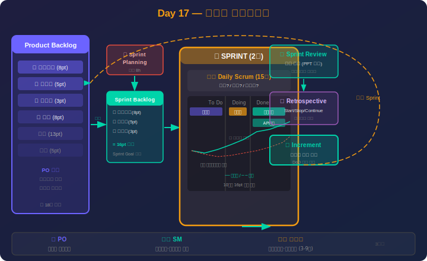

# Day 17: 애자일/스크럼 & PM 도구 실습 — 상세 강의안

> 📖 **강의 시작 전 필독:** PM 약어 사전에서 **Agile, Scrum, Kanban, PO, SM, DoD, WIP, EVM** 항목을 미리 확인하세요.  
> 👉 [PM 약어 & 용어 사전](pm-glossary.md)

---

## ✅ 오늘 배우고 나면 할 수 있어요

- [ ] 애자일 선언문 4가지 가치와 12가지 원칙을 맥락과 함께 설명할 수 있다
- [ ] 스크럼 3역할·5이벤트·3산출물을 구분하고 실전 대화로 진행할 수 있다
- [ ] 사용자 스토리를 INVEST 기준으로 작성하고 플래닝 포커를 진행할 수 있다
- [ ] 칸반 보드를 설계하고 WIP 제한으로 흐름을 최적화할 수 있다
- [ ] Jira에서 스크럼 보드와 번다운 차트를 생성할 수 있다
- [ ] MS Project에서 간트차트, 크리티컬 패스, EVM 보고서를 작성할 수 있다
- [ ] 프로젝트 특성에 맞는 방법론과 도구를 스스로 선택할 수 있다

> 수업 후 이 체크리스트를 다시 보며 스스로 확인해보세요.

---

## 1교시: 애자일 개요 & 선언문 (1시간) <!-- 슬라이드 #1~#7 -->

### 이론 (40분)

#### 1. 애자일이 왜 등장했나?

**전통적 워터폴의 문제점 — 실제 사례**

> 📌 **사례: 모바일 뱅킹 앱 재구축 프로젝트**  
> 2018년, 한 은행이 12개월 워터폴 방식으로 모바일 뱅킹 앱을 재구축.  
> 결과: 런칭 당일 "이게 아닌데요…"를 들었고, 1,500개 버그 + 6개월 지연 + 예산 50% 초과.  
> **원인**: 고객에게 완성본을 처음 보여준 것이 10개월째였기 때문.

```
워터폴 12개월 프로젝트 타임라인:
Month 1-3   요구사항 분석·문서화 (200페이지)
Month 4-9   개발 (고객 참여 없음)
Month 10    테스트 → "이게 아닌데요!" 발견
Month 11-12 긴급 재작업
→ 결과: 14개월 + 예산 150% 사용
```

**애자일의 해답:**

```
애자일 2주 스프린트 반복:
Sprint 1 (2주)  로그인 기능 → 고객 시연 → 피드백 즉시 반영
Sprint 2 (2주)  계좌 조회 → 고객 시연 → "이게 맞아요!"
Sprint 3 (2주)  이체 기능 → 고객 시연 …
→ 매 2주마다 작동하는 소프트웨어를 고객이 확인
```

---

#### 2. 애자일 선언문 (Agile Manifesto, 2001)

2001년 2월, 17명의 소프트웨어 개발자가 스노버드 스키 리조트에서 모여 작성.

**4가지 핵심 가치:**

| 우선 | vs | 낮은 순위 |
|------|----|----------|
| **개인과 상호작용** | > | 프로세스와 도구 |
| **작동하는 소프트웨어** | > | 포괄적인 문서 |
| **고객과의 협력** | > | 계약 협상 |
| **변화에 대응** | > | 계획을 따르기 |

> ⚠️ **오해 주의**: 오른쪽 항목(문서, 계획, 계약)을 무시하는 게 아닙니다.  
> **왼쪽을 더 가치 있게 여긴다**는 것입니다.

**12가지 원칙 (핵심 6개 요약):**

1. **조기·지속적 인도**: 가치 있는 소프트웨어를 일찍, 지속적으로
2. **변경 환영**: 프로젝트 후반이라도 요구사항 변경을 환영
3. **짧은 주기 인도**: 2주~2개월 단위로 작동하는 소프트웨어 인도
4. **비즈니스·개발 협업**: 매일 함께 일한다
5. **자기조직화 팀**: 최고의 아키텍처·요구사항·설계는 자기조직화 팀에서
6. **정기적 성찰**: 팀이 효과적으로 일하는 방법을 정기적으로 조율·조정

---

#### 3. 애자일 방법론 종류

```
애자일 우산 아래:
┌──────────────────────────────────────────┐
│               Agile                       │
│  ┌────────┐ ┌──────┐ ┌────┐ ┌─────────┐ │
│  │ Scrum  │ │Kanban│ │ XP │ │  SAFe   │ │
│  └────────┘ └──────┘ └────┘ └─────────┘ │
│  ┌──────┐ ┌──────────┐ ┌───────────────┐ │
│  │ Lean │ │ Crystal  │ │  LeSS / DAD  │ │
│  └──────┘ └──────────┘ └───────────────┘ │
└──────────────────────────────────────────┘

실무 사용 비율 (State of Agile 2024):
Scrum      66%  ████████████████
Hybrid     32%  ████████
Kanban     56%  ██████████████
SAFe       38%  █████████
XP          9%  ██
```

---

#### 4. 워터폴 vs 애자일

| 구분 | 워터폴 | 애자일 |
|------|--------|--------|
| 접근 방식 | 예측적(Predictive) | 적응적(Adaptive) |
| 요구사항 | 초기에 확정 | 점진적 발견 |
| 변경 | 통제 대상 (비용↑) | 환영 대상 |
| 인도 | 프로젝트 종료 시 | 2주마다 반복 인도 |
| 고객 참여 | 초기·종료 시 | 매 스프린트 시연 |
| 문서화 | 상세 (선행) | 필요한 만큼 (적시) |
| 리스크 발견 | 후반 (비용 큰 수정) | 초기 (저비용 수정) |
| 적합 상황 | 요건 명확·규제 산업 | 불확실·혁신 프로젝트 |

> 💡 **40대 PM 인사이트**  
> "우리 회사는 결재 문화가 있어서 애자일이 안 돼요"라고 하는 분들이 많습니다.  
> 완전한 워터폴 → 완전한 애자일은 갑작스러워요.  
> **팀 내부**: 스크럼으로 개발하고, **경영진 보고**: 워터폴 마일스톤 형식으로.  
> 이것이 현실적인 **하이브리드 접근**입니다.

---

### 실습 (15분) — 워터폴 vs 애자일 판단 게임

**다음 프로젝트에 어떤 방법론이 적합한지 그룹별로 판단하고 이유를 설명하세요:**

| 프로젝트 | 요건 명확도 | 고객 참여 | 추천 방법론 |
|---------|-----------|----------|------------|
| 원자력 발전소 제어 시스템 구축 | ✅ 매우 명확 | 제한적 | ? |
| 스타트업 신규 앱 개발 | ❌ 탐색 중 | 지속적 | ? |
| 정부 ERP 교체 | ✅ 규제 요건 확정 | 부서별 다름 | ? |
| 내부 업무 자동화 챗봇 | 🔶 부분 명확 | 가능 | ? |

**모범 답안:** 원자력=워터폴, 스타트업=스크럼, 정부ERP=하이브리드, 챗봇=칸반·스크럼

---

### 퀴즈 (5분)

1. 애자일 선언문의 4가지 가치 중 "작동하는 소프트웨어"와 대비되는 항목은?
2. 워터폴에서 고객이 완성품을 처음 보는 시점과 애자일에서 처음 보는 시점의 차이는?
3. 조직 내 결재 문화가 강할 때 현실적인 접근 방법은?

---

## 2교시: 스크럼 프레임워크 (1.5시간) <!-- 슬라이드 #8~#18 -->

### 이론 (60분)

<div align="center">



*▲ 스크럼 프레임워크 — 3역할(PO/SM/Dev) · 5이벤트 · 3산출물(PBL/SBL/Increment)*

</div>

#### 1. 스크럼 개요

```
스크럼 프레임워크 구조:
┌─────────────────────────────────────────────────────┐
│                  SCRUM                               │
│  ┌───────────┐   ┌───────────────────────────────┐  │
│  │  Product  │   │    S P R I N T  (2주)          │  │
│  │  Backlog  │──▶│ ┌─────┐  ┌──────────────────┐ │  │
│  │(우선순위화)│   │ │Sprint│  │   Daily Scrum    │ │  │
│  └───────────┘   │ │Backlog  │   (매일 15분)    │ │  │
│                  │ └─────┘  └──────────────────┘ │  │
│  ┌──────────┐    │ ┌──────────────────────────┐   │  │
│  │  Review  │◀───│ │    Increment (증분)       │   │  │
│  │ Retro    │    │ │    (잠재적 출시 가능)     │   │  │
│  └──────────┘    └───────────────────────────────┘  │
└─────────────────────────────────────────────────────┘
```

---

#### 2. 3가지 역할

**Product Owner (PO) — "무엇을 만들까?"**

| 책임 | 구체 활동 |
|------|----------|
| 제품 비전 제시 | 로드맵 작성, 비즈니스 가치 정의 |
| 백로그 관리 | 사용자 스토리 작성, 우선순위 결정 |
| 승인 판단 | Sprint Review에서 완료 기준 검수 |
| ROI 최대화 | 비즈니스 가치 높은 항목 먼저 개발 |

> ⚠️ **PO ≠ PM**: PO는 제품 방향을 결정, PM은 일정·자원·리스크를 관리.  
> 전통적 PM이 PO를 겸하는 경우가 많지만 역할 충돌 주의.

**Scrum Master (SM) — "어떻게 일하나?"**

- 스크럼 프로세스 코치 (팀의 애자일 퍼실리테이터)
- **장애물(Impediment) 제거**: 팀 외부의 걸림돌 처리
- 팀 보호: 스프린트 중 외부 방해 차단
- **서번트 리더십**: 명령이 아닌 섬김·지원

**개발 팀 — "어떻게 만드나?"**

- 교차기능(Cross-functional): 설계·개발·테스트 모두 팀 내 자체 해결
- 자기조직화(Self-organizing): 누가 무엇을 할지 팀이 결정
- 규모: 3–9명 (10명 이상 → 팀 분리 고려)

---

#### 3. 5가지 이벤트

**① 스프린트 (Sprint)**

```
스프린트 길이 선택 기준:
1주  매우 불확실, 시장 변화 빠름, 소규모 팀
2주  가장 일반적 권장 (균형점)
3주  중간 복잡도, 인프라 산업
4주  요구사항 상대적 안정, 하드웨어 연동
```

> 💡 **실무 팁**: 스프린트 길이는 정하면 바꾸기 어렵습니다. 처음에는 2주로 시작.

**② 스프린트 계획 (Sprint Planning)**

실전 대본:

```
[Sprint Planning – 오전 9시, 4시간]

SM: "제품 백로그에서 이번 스프린트 목표를 정하겠습니다."
PO: "이번 스프린트 목표는 '결제 기능 완성'입니다.
     백로그 1순위: 신용카드 결제 (13pt)
     2순위: 간편결제 (8pt)
     3순위: 주문 내역 (5pt)"

SM: "팀 벨로시티는?"
팀: "지난 3 스프린트 평균 26pt입니다."
SM: "그럼 26pt를 목표로 [1,2,3번] 선택하겠습니다."

[작업 분해 – 2시간]
신용카드 결제 스토리 분해:
  - UI 카드 입력 폼       (4h, Frontend A)
  - PG사 API 연동          (8h, Backend B)
  - 결제 결과 처리 로직    (6h, Backend C)
  - 통합 테스트            (4h, QA)
  - 코드 리뷰              (2h, 전체)
합계: 24h (3 영업일)
```

**③ 일일 스크럼 (Daily Scrum) — 매일 15분**

3가지 질문:
1. **어제** 뭘 完了했나?
2. **오늘** 뭘 할 건가?
3. **블로커**가 있나?

```
[Day 3 아침 9:00 – 스탠딩]
개발자 A: "어제 카드 입력 폼 완성. 오늘 유효성 검증.
           블로커 없음."
개발자 B: "어제 API 문서 검토. 오늘 연동 시작.
           블로커: PG 샌드박스 계정 필요."
SM: "제가 바로 연락처리 하겠습니다! → 11시까지 해결."
```

> ⚠️ **함정**: 일일 스크럼은 **상태 보고 회의가 아닙니다**.  
> SM에게 보고하는 자리가 아니라 팀이 서로 조율하는 자리입니다.

**④ 스프린트 리뷰 (Sprint Review) — 스프린트 마지막 날**

- 참석: PO, 팀, 이해관계자, 고객
- 완성된 증분 **직접 시연** (PPT 금지)
- 이해관계자 피드백 → 백로그 업데이트

```
[Sprint Review – Day 10, 2시간]
PM: "이번 스프린트 완성 기능을 시연하겠습니다."

👉 신용카드 결제 시연 (실제 테스트 카드):
고객: "와, 결제 속도가 빠르네요! 영수증 이메일 발송 기능도 있으면 좋겠어요."
PO: "다음 스프린트 백로그에 추가하겠습니다."

완료: 26 / 26 포인트 (100% 달성)
```

**⑤ 스프린트 회고 (Sprint Retrospective) — 프로세스 개선**

Start–Stop–Continue 형식:

```
[Sprint Retrospective – Day 11, 1.5시간]

✅ CONTINUE (계속할 것):
  - Daily Standup (간결·효율적)
  - DoD 준수 (품질 향상)

❌ STOP (중단할 것):
  - 코드 리뷰 다음 날로 미루기 (당일 완료 규칙)
  - 회의 중 노트북 딴짓

🚀 START (시작할 것):
  - 금요일 오후 1시간 기술 부채 해소 시간
  - Pair Programming (복잡한 기능)

Action Items:
→ 코드 리뷰 당일 완료 규칙 → SM 모니터링
→ 금요일 기술 부채 시간 → 다음 스프린트부터
```

---

#### 4. 3가지 산출물

**제품 백로그 (Product Backlog)**

```
제품 백로그 예시 (e커머스 앱):
우선 │ 스토리                            │ 포인트 │ 담당
──── │ ──────────────────────────────────│────────│──────
  1  │ 사용자는 신용카드로 결제할 수 있다  │  13    │ Backend
  2  │ 사용자는 간편결제를 사용할 수 있다  │   8    │ Backend
  3  │ 사용자는 주문 내역을 조회할 수 있다 │   5    │ Full
  4  │ 사용자는 쿠폰 코드를 적용할 수 있다 │   5    │ Frontend
  5  │ 사용자는 배송 상태를 추적할 수 있다 │   8    │ Full
 ...  ...                                  ...      ...
총 200+ 스토리 포인트
```

**스프린트 백로그 (Sprint Backlog)**: 이번 스프린트에 선정된 항목 + 작업 분해

**증분 (Increment)**: DoD(완료 정의)를 충족한 잠재적 출시 가능 결과물

---

#### 5. 사용자 스토리 & INVEST

**사용자 스토리 형식:**

```
As a [사용자 유형],
I want [기능],
So that [가치/이유].

예시:
"결제 고객으로서,
 저는 신용카드로 간편하게 결제하고 싶습니다.
 번거로운 은행 결제 없이 쇼핑을 완료하기 위해."
```

**INVEST 기준:**

| 기준 | 의미 | 나쁜 예 → 좋은 예 |
|------|------|------------------|
| **I**ndependent | 다른 스토리에 독립적 | "결제 → 배송 의존" → 분리 |
| **N**egotiable | 방법은 협상 가능 | 구현 방법 열어둠 |
| **V**aluable | 사용자/비즈니스에 가치 | 기술 작업만 있으면 NG |
| **E**stimable | 추정 가능한 크기 | "AI 전체 개발" → 세분화 |
| **S**mall | 스프린트 내 완료 가능 | 13pt 이상이면 분해 |
| **T**estable | 인수 기준 명확 | "빠르게" → "1초 이내" |

---

#### 6. 스토리 포인트 & 플래닝 포커

**스토리 포인트 기준 (피보나치: 1, 2, 3, 5, 8, 13, 21):**

```
기준 스토리 (3pt): "로그인 기능 구현"
1pt  : 단순 버그 수정, 텍스트 변경
2pt  : 간단한 UI 변경
3pt  : 일반적인 기능 (기준)
5pt  : 복잡한 비즈니스 로직
8pt  : 외부 API 연동 포함
13pt : 복잡한 기능, 상세 분해 필요
21pt : 에픽 수준, 반드시 분해
```

**플래닝 포커 진행:**
1. PO가 스토리 설명
2. 팀원 모두 카드 선택 (동시에 공개)
3. 최고·최저 추정 제시자 근거 설명
4. 재추정 → 합의될 때까지 반복

---

#### 7. 벨로시티와 번다운 차트

```
벨로시티 추이 (3개월 팀 성숙도):
스프린트 1:  13pt ████
스프린트 2:  18pt ████████
스프린트 3:  22pt ████████████
스프린트 4:  25pt ████████████████ (안정화)
스프린트 5:  26pt ████████████████▌

→ 안정화 후 향후 스프린트 계획에 평균값(25pt) 사용

번다운 차트:
스토리 포인트
 ↑
26│\  ← 이상선 (직선 감소)
22│ \ ─ ─ ─ ─ ─ ─
18│  \·····
14│   ·  ← 실제선
10│    ·
 6│     ·
 2│      ·
 └─────────────→ 일
   1  3  5  7  9  (Sprint Day)
```

---

### 실습 (25분) — 스프린트 계획 수립

**가상 프로젝트**: 사내 휴가 신청 시스템

1. 다음 사용자 스토리에 스토리 포인트를 부여하세요 (플래닝 포커):
   - "직원은 휴가 신청서를 작성하여 제출할 수 있다"
   - "팀장은 모바일로 휴가 승인/반려 알림을 받는다"
   - "HR 담당자는 전체 휴가 현황을 엑셀로 다운로드할 수 있다"
2. 벨로시티 20pt로 2주 스프린트 계획을 수립하세요
3. 스프린트 목표 한 문장을 작성하세요

---

### 퀴즈 (5분)

1. 스크럼의 3가지 역할을 나열하고 각각의 핵심 책임을 한 문장으로 표현하라
2. 일일 스크럼의 3가지 질문은?
3. INVEST에서 E(Estimable)가 없는 스토리의 문제점은?

---

<div align="center">


*▲ 스크럼 Sprint 반복 사이클 — 계획→개발→검토→회고 루프로 지속적 개선*

</div>

## 3교시: 칸반 & 하이브리드 방법론 (1시간) <!-- 슬라이드 #19~#26 -->

### 이론 (40분)

#### 1. 칸반 (Kanban)

**칸반 보드 기본 구조:**

```
┌──────────┬──────────┬──────────┬──────────┬──────────┐
│ Backlog  │  To Do   │  In Prog │  Review  │  Done    │
│          │          │  (WIP 3) │  (WIP 2) │          │
├──────────┼──────────┼──────────┼──────────┼──────────┤
│ [고객관리]│ [결제#1] │ [검색#3] │ [로그인#1│ [회원#2] │
│ [리포트] │ [배송#2] │ [알림#4] │ [장바구니│ [상품#5] │
│ [통계]   │ [리뷰]   │ ~~WIP꽉~~ │          │ ...15개  │
│ ...30개  │          │          │          │          │
└──────────┴──────────┴──────────┴──────────┴──────────┘

WIP 제한:
- In Progress: 3 → 4번째 넣으려면 기존 것 완료 먼저
- Review: 2 → 코드 리뷰 병목 방지
```

**WIP(Work In Progress) 제한의 원리:**

```
WIP 제한 없을 때 (멀티태스킹 지옥):
개발자 A: 10개 작업 병렬 진행
→ 전환 비용(컨텍스트 스위칭) 누적
→ 작업 A: 5일째 진행 중, B: 3일째, C: 1일째…
→ 완료되는 것이 없고 고객은 아무것도 못 받음

WIP 제한 있을 때 (흐름 최적화):
개발자 A: 최대 2개만 병렬
→ 1개 완료 → Review → Done → 다음 작업 시작
→ 리드타임 단축, 예측 가능성 향상
```

**핵심 지표:**

| 지표 | 정의 | 목표 |
|------|------|------|
| **리드타임(Lead Time)** | Backlog 진입 → Done까지 | 단축 |
| **사이클타임(Cycle Time)** | In Progress → Done까지 | 단축 |
| **처리량(Throughput)** | 단위 기간당 완료 항목 수 | 증가 |
| **WIP** | 현재 진행 중인 작업 수 | 제한 준수 |

```
실제 칸반 개선 사례 (DevOps 팀 3개월):
Before: 리드타임 평균 7.5일, WIP 무제한
After:  리드타임 평균 5.2일 (30% 단축)
방법: In Progress WIP=3, Review WIP=2 설정
      → 리뷰 병목 발견 → 리뷰어 1명 추가
```

---

#### 2. 칸반 vs 스크럼

| 구분 | 스크럼 | 칸반 |
|------|--------|------|
| 역할 | PO/SM/팀 정의 | 기존 역할 유지 |
| 이터레이션 | 스프린트 고정 | 없음 (연속적) |
| 변경 허용 | 스프린트 중 제한 | 언제든 가능 |
| 계획 단위 | 스프린트 | 작업 단위 |
| 성과 지표 | 벨로시티 | 리드타임, 사이클타임 |
| **적합 상황** | 반복적 신기능 개발 | 운영·유지보수·지원 |

---

#### 3. 하이브리드 방법론

**Water-Scrum-Fall 패턴 (현실에서 가장 많음):**

```
전체 프로젝트 구조:
Phase 1 (워터폴 방식)
  └─ 계획·설계·승인 (4주, 경영진 결재)

Phase 2 (스크럼 방식)
  └─ Sprint 1~8 (16주, 2주 단위 개발)

Phase 3 (워터폴 방식)
  └─ 인수 테스트·오픈·안정화 (4주, 성과 보고)
```

**하이브리드를 선택하는 이유:**
- 경영진 승인 프로세스가 워터폴 요구
- 규제·감사 대응은 문서 기반 필요
- 개발 팀은 빠른 피드백 필요
- PMO 리포트 양식은 마일스톤 기반

---

#### 4. SAFe 소개 (대규모 조직)

```
SAFe (Scaled Agile Framework) 계층:
포트폴리오 레벨  에픽(대형 이니셔티브) 관리
    ↓
프로그램 레벨   PI(Program Increment) = 5 스프린트 묶음
    ↓
팀 레벨         각 스크럼 팀 (2주 스프린트)

200명 이상 조직, 여러 팀이 하나의 제품 빌드할 때 적용
한국: 삼성, SK, 카카오 일부 부서 도입
```

---

### 실습 (15분) — 칸반 보드 설계

**팀별 과제**: 자신의 팀 업무를 칸반 보드로 설계하세요
1. 컬럼 5개 정의 (작업 흐름에 맞게)
2. WIP 제한 설정 (각 컬럼에)
3. 현재 진행 중인 업무 카드 3개 배치
4. 예상 리드타임 추정

---

### 퀴즈 (5분)

1. WIP 제한이 없을 때 발생하는 가장 큰 문제는?
2. 운영·유지보수 팀이 스크럼보다 칸반이 적합한 이유는?
3. 아래 상황에서 적합한 방법론은?
   - "분기마다 경영진에게 마일스톤 보고를 해야 하지만, 개발 팀은 빠르게 요구사항이 변하는 환경"

---

## 4교시 오전: 모의 스프린트 (30분) <!-- 슬라이드 #27~#30 -->

### 팀별 모의 스프린트 시뮬레이션

**팀 구성**: 4–5명 / 팀 (PO 1명, SM 1명, 개발 팀 2–3명)

**가상 프로젝트**: 사내 온보딩 포털 개발

1. **Sprint Planning (10분)**
   - 제품 백로그에서 20pt 분량 선택
   - 스프린트 목표 한 문장
   - 스토리별 작업 분해

2. **Daily Standup 롤플레이 (5분)**
   - 3명 → 각자 어제/오늘/블로커 1분 발화
   - SM 역할자: 장애물 처리 시뮬레이션

3. **Sprint Review 발표 (10분)**
   - 완료 항목 발표 (작동하는 SW 시연 흉내)
   - 이해관계자 질문 1–2개 받기

4. **Retrospective (5분)**
   - Start / Stop / Continue 각 1개

---

<div align="center">


*▲ 스크럼 프로세스를 Jira로 디지털 관리 — 백로그, 스프린트 보드, 번다운 차트 활용*

</div>

## 5교시: Jira 실습 (1.5시간) <!-- 슬라이드 #31~#38 -->

### 이론+실습 병행 (90분)

#### 1. Jira 핵심 개념

```
Jira 용어 매핑:
스크럼 용어    →  Jira 용어
────────────       ─────────
제품 백로그   →  Product Backlog (백로그 화면)
스프린트      →  Sprint (2주 타임박스)
사용자 스토리 →  Story (이슈 유형)
작업          →  Task / Sub-task
버그          →  Bug
에픽          →  Epic (큰 기능 묶음)
```

**이슈 유형 계층:**

```
Epic (에픽)
  └─ Story (사용자 스토리)
       └─ Sub-task (작업 단위)
  └─ Bug (버그)
  └─ Task (기타 작업)
```

---

#### 2. 스크럼 보드 설정 실습

**단계별 실습:**

```
Step 1: 프로젝트 생성
[프로젝트 만들기] → [소프트웨어 개발] → [스크럼]
→ 프로젝트명: "사내온보딩포털"

Step 2: 제품 백로그 입력
[백로그] → [스토리 만들기]
  Story 1: "사원은 자신의 온보딩 체크리스트를 조회할 수 있다" (5pt)
  Story 2: "사원은 필수 교육 영상을 시청하고 완료 처리할 수 있다" (8pt)
  Story 3: "HR은 전체 사원의 온보딩 진행률을 대시보드로 본다" (13pt)
  Story 4: "사원은 팀장에게 질문을 보낼 수 있다" (3pt)

Step 3: 스프린트 생성
[스프린트 만들기] → 기간: 2026.03.02 ~ 03.13 → [시작]

Step 4: 백로그 → 스프린트 이동
Story 1,2,4를 스프린트로 드래그 (총 16pt)

Step 5: 스크럼 보드 확인
[보드 보기] → To Do / In Progress / Done 컬럼 확인
```

---

#### 3. 번다운 차트 자동화

```
번다운 자동 생성:
[보고서] → [번다운 차트]
→ 스프린트 선택 → 자동 생성

차트 해석:
회색선(이상선): 완벽히 선형 감소했을 때
파란선(실제선): 실제 남은 스토리 포인트
→ 실제선이 이상선 위: 진행 지연
→ 실제선이 이상선 아래: 목표 초과 달성
```

---

#### 4. JQL (Jira Query Language) 기초

```
자주 쓰는 JQL:

# 현재 스프린트 내 내 작업
assignee = currentUser() AND sprint in openSprints()

# 블로킹된 이슈 찾기
status = "In Progress" AND updated < -3d

# 이번 주 완료된 이슈
status = Done AND resolved >= startOfWeek()

# 특정 에픽의 모든 스토리
"Epic Link" = "온보딩체크리스트" AND issuetype = Story
```

---

#### 5. 보고서 종류

| 보고서 | 목적 | PM 활용 |
|--------|------|---------|
| 번다운 차트 | 스프린트 진행률 | 지연 조기 발견 |
| 번업 차트 | 누적 완료량 vs 범위 | 범위 크리프 감지 |
| 속도(Velocity) | 스프린트별 완료 pt | 향후 계획 기준 |
| 스프린트 보고서 | 완료/미완료 항목 | 스폰서 보고 |
| 에픽 번다운 | 에픽 수준 진척 | 분기 리뷰 |

---

### 퀴즈 (5분)

1. Jira에서 에픽(Epic)과 스토리(Story)의 관계는?
2. 번다운 차트에서 실제선이 이상선보다 높으면 무엇을 의미하나?
3. JQL로 "In Progress 상태에서 3일 이상 멈춰있는 이슈"를 찾는 쿼리를 작성하라

---

## 6교시: MS Project & Trello 실습 (1.5시간) <!-- 슬라이드 #39~#47 -->

### 이론+실습 병행 (90분)

#### 1. MS Project 핵심 기능

**간트차트 작성 실습:**

```
Step 1: 작업 목록 입력
  작업명                구분  기간  선행작업
  1. 요구사항 분석      Summary  2w   -
  2. UI/UX 설계             2w   1
  3. 백엔드 개발            4w   2
  4. 프론트엔드 개발        3w   2
  5. 통합 테스트             2w   3,4
  6. 사용자 테스트           1w   5
  7. 배포                    1w   6

Step 2: 의존성 설정
  3번 작업 → 선행: 2번 [FS, Finish-to-Start]
  4번 작업 → 선행: 2번 [FS]
  5번 작업 → 선행: 3,4번 [FS]

Step 3: 크리티컬 패스 표시
  [형식] → [간트 차트 스타일] → [크리티컬 작업] 활성화
  → 빨간색: 1→2→3→5→6→7 (총 12주)
  → 파란색: 4번 (여유 1주)
```

**자원 배정:**

```
Step 4: 자원 시트
  이름    유형   비용 단가
  김개발  작업   5,000원/h
  이기획  작업   6,000원/h
  박QA    작업   4,500원/h

Step 5: 과부하(Overallocation) 확인
  [자원 시트] → 빨간 텍스트 = 과부하
  → [자원 평준화] 자동 or 수동 조정
```

**기준선 & EVM:**

```
Step 6: 기준선 저장
  [프로젝트] → [기준선 설정] → 기준선 0 저장

Step 7: 진척도 입력 (2개월 후)
  작업별 % 완료 입력

Step 8: EVM 보고서
  [보고서] → [비용] → [획득 가치]
  → PV(계획 가치) vs EV(획득 가치) vs AC(실제 비용) 자동 계산
  → CPI = EV/AC, SPI = EV/PV
```

---

#### 2. Trello 핵심 기능

**언제 Trello를 쓰나:**
- 5명 이하 소규모 팀
- 개인 업무/할 일 관리
- 비 IT 부서의 프로젝트 (마케팅, 기획)
- Jira 너무 무겁다고 느낄 때

**핵심 기능:**

```
보드 구조:
Board (프로젝트)
  └─ List (컬럼: To Do / In Progress / Done)
       └─ Card (개별 작업)
            ├─ 체크리스트
            ├─ 마감일
            ├─ 담당자
            ├─ 첨부파일
            └─ 댓글

Power-Up (플러그인):
  - 캘린더: 마감일 달력 뷰
  - Jira 연동: 카드와 이슈 동기화
  - 자동화(Butler): 규칙 기반 자동 이동
    예: "체크리스트 100% 완료 시 Done으로 이동"
```

---

#### 3. 도구 선택 가이드

```
의사결정 트리:
Q1. 팀 규모가 5명 이하인가?
  → YES: Trello (단순, 무료)
  → NO: 다음 질문

Q2. 애자일(스크럼) 방법론인가?
  → YES: Jira Software (백로그, 번다운 포함)
  → NO: 다음 질문

Q3. 워터폴(간트차트, EVM) 필요한가?
  → YES: MS Project / ProjectLibre
  → NO: Jira Business / Asana

Q4. 문서(위키)도 같이 관리하나?
  → YES: Jira + Confluence 통합
  → NO: Jira 단독
```

| 도구 | 비용 | 방법론 | 규모 | 특징 |
|------|------|--------|------|------|
| Jira (Cloud) | $8/인/월 | 애자일 중심 | 중~대 | 번다운, 속도 차트 |
| MS Project | 별도 구매 | 워터폴 중심 | 중~대 | EVM, 간트 강력 |
| Trello | 무료~$5/월 | 칸반 | 소 | 직관적, 간단 |
| Asana | $10/인/월 | 공통 | 소~중 | 타임라인, UI 우수 |
| Notion PM | $8/인/월 | 유연 | 소~중 | 문서+DB 통합 |

---

### 퀴즈 (5분)

1. MS Project에서 크리티컬 패스의 의미와 찾는 방법은?
2. 기준선(Baseline)을 저장하는 이유는?
3. EVM에서 CPI=0.8이면 무슨 상태인가?

---

## 7교시: 종합 실습 (1시간) <!-- 슬라이드 #48~#52 -->

### 팀별 Jira 프로젝트 구성 실습

**과제**: 아래 프로젝트 중 하나를 선택하고 Jira에 완전히 구성하세요

**선택 프로젝트:**
- A: 사내 복리후생 포털 개발
- B: 고객 CS 자동화 챗봇 구축
- C: 판매 데이터 분석 대시보드 구축

**필수 구성 항목:**
1. ✅ 에픽(Epic) 3개 이상 정의
2. ✅ 사용자 스토리 10개 이상 (INVEST 기준)
3. ✅ 스토리 포인트 배분 (플래닝 포커 수행)
4. ✅ 2주 스프린트 1회 계획 (총 20pt 목표)
5. ✅ 번다운 차트 URL 캡처

**평가 기준:**

| 항목 | 배점 |
|------|------|
| 스토리 형식 (As a / I want / So that) | 20점 |
| INVEST 기준 충족 | 20점 |
| 스프린트 목표 명확성 | 20점 |
| 총 스토리 포인트 합리성 | 20점 |
| 발표 연습(5분): 스프린트 리뷰 시뮬레이션 | 20점 |

---

## 17일 종합 정리

### 교육과정 전체 요약

```
프로젝트 관리 (Day 1–11) × 기술 이해 (Day 12–16) × 방법론·도구 (Day 17)
     ↓                           ↓                         ↓
  PMBOK 기반                  기술 소통                 현장 적용
  - 통합~이해관계자            - SDLC·애자일             - 스크럼/칸반
  - Triple Constraint          - 네트워크·보안           - Jira·MS Project
  - EVM·CPM·RACI               - DB·신기술               - 하이브리드

통합 PM 역량:
PMBOK 지식 + 기술 이해 + 애자일 방법론 + 도구 숙련
= 현장에서 바로 투입 가능한 PM
```

---

### 40대 PM 강점 & 주의점

| 강점 | 주의점 |
|------|--------|
| 비즈니스 맥락 이해가 깊음 | "원래 이렇게 했어요"에 갇히지 말기 |
| 이해관계자 관계 관리 노하우 | 애자일 도입 시 권한 위임 연습 |
| 리스크 감각이 경험으로 날카로움 | WIP 제한 등 새 지표도 수용하기 |
| 조직 내 정치적 인식 탁월 | 데이터 기반 의사결정도 동시에 |

---

### 앞으로의 여정

```
📌 단기 (1–3개월):
  ✅ 현재 프로젝트에 Jira 도입 시도 (소규모 파일럿)
  ✅ 팀 내 Daily Standup 15분 도입
  ✅ 기존 워터폴 프로젝트 하이브리드로 전환 검토

📌 중기 (3–12개월):
  ✅ PMP 자격증 도전 (경험 3년+, 36학점)
  ✅ PSM I (Professional Scrum Master I) 온라인 응시
  ✅ PM CoP(커뮤니티) 참여 → 사례 공유

📌 장기:
  ✅ SAFe 인증 (대규모 조직 이슈)
  ✅ 팀 내 PM 역할 확장 (Program/Portfolio Manager)
  ✅ 사내 PM 교육 강사로 후배 양성
```

---

## ✅ 최종 점검 체크리스트 (Day 17)

- [ ] 애자일 선언문 4가지 가치를 워터폴과 비교하여 설명할 수 있다
- [ ] 스크럼의 3역할·5이벤트·3산출물을 실전 대화로 시뮬레이션할 수 있다
- [ ] 사용자 스토리를 INVEST 기준으로 작성하고 스토리 포인트를 부여할 수 있다
- [ ] 칸반 WIP 제한이 리드타임에 미치는 영향을 설명할 수 있다
- [ ] Jira에서 프로젝트 생성 → 백로그 → 스프린트 → 번다운 차트를 생성할 수 있다
- [ ] MS Project에서 간트차트, 크리티컬 패스, 기준선, EVM 보고서를 작성할 수 있다
- [ ] 프로젝트 상황별 적합한 방법론+도구 조합을 판단할 수 있다
- [ ] 17일 전체 교육 내용을 자신의 업무에 연결하여 설명할 수 있다

---

## 📖 참고 자료

- [스크럼 가이드 2020 공식 한국어판](https://scrumguides.org/docs/scrumguide/v2020/2020-Scrum-Guide-Korean.pdf)
- [Jira Scrum Tutorial (Atlassian)](https://university.atlassian.com)
- PMI Agile Practice Guide (2017) — 무료 다운로드 \[PMI 회원\]
- 도서: "스크럼: 절반의 시간에 두 배의 결과를" — Jeff Sutherland
- 도서: "사용자 스토리" — Mike Cohn
- 도서: "칸반: 새로운 소프트웨어 개발 거버넌스" — David J. Anderson
