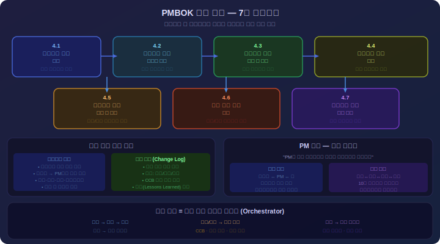
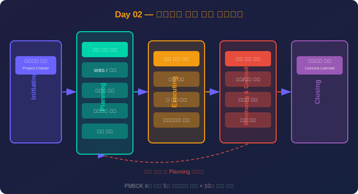
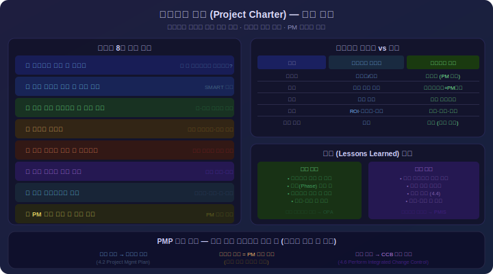
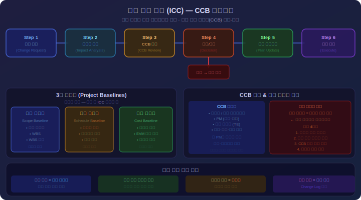

# Day 2: 프로젝트 통합 관리 - 상세 강의안

---

## 🔁 지난 시간 복습 (5분)

> **Day 1 핵심 요점**
> 1. **프로젝트의 3대 특성**: 일시성(시작·끝 명확) / 고유성(동일 작업 없음) / 점진적 구체화(초기엔 큰 그림, 진행하며 상세화)
> 2. **Triple Constraint**: 범위·일정·원가 세 요소는 서로 연결되어 있어 하나를 바꾸면 나머지에 영향
> 3. **5개 프로세스 그룹**: 착수 → 기획 → 실행 → 감시/통제 → 종료
> 4. **10개 지식 영역**: 통합·범위·일정·원가·품질·자원·의사소통·리스크·조달·이해관계자

**오늘과의 연결:**  
"어제는 PM 전체 프레임워크를 조감도로 봤습니다. 오늘은 그 중 **통합 관리**를 배웁니다. 통합 관리는 나머지 9개 지식 영역 전체를 조율하는 'PM의 핵심 영역'입니다."

> 💡 **강사 안내:** 5분 동안 수강생 2~3명에게 "Triple Constraint가 무엇인가요?" "5개 프로세스 그룹을 순서대로 말해보세요"를 물어보며 복습 진행

---

## ✅ 오늘 배우고 나면 할 수 있어요

- [ ] 프로젝트 헌장(Project Charter)의 목적과 핵심 구성 요소를 설명할 수 있다
- [ ] 프로젝트 관리 계획서의 3대 기준선(범위·일정·원가)을 말할 수 있다
- [ ] 변경 통제 위원회(CCB)의 역할과 변경 통제 절차를 설명할 수 있다
- [ ] 통합 관리 7개 프로세스를 순서대로 나열할 수 있다
- [ ] 교훈(Lessons Learned)을 기록하는 목적을 설명할 수 있다

> 수업 후 이 체크리스트를 다시 보며 스스로 확인해보세요.

---

## 1교시: 통합 관리 개요 (1.5시간) <!-- 슬라이드 #1~#3 -->

<div align="center">



*▲ PMBOK 통합 관리 7대 프로세스 + 핵심 문서 + PM 역할*

</div>

### 이론 (50분)

#### 1. 통합 관리(Integration Management)란?

**정의:**
프로젝트 통합 관리는 프로젝트의 다양한 요소들을 **식별, 정의, 결합, 통합, 조정**하여 프로젝트를 성공적으로 완료하는 프로세스입니다.

**핵심 개념:**
- "통합"의 의미: 서로 다른 지식영역과 프로세스를 하나로 엮어 일관성 유지
- 예: 범위가 늘어나면(범위 관리) → 일정이 늘어나고(일정 관리) → 비용이 증가(원가 관리)
- PM은 이러한 상호 의존성을 파악하고 균형을 맞춰야 함

#### 2. 통합 관리가 중요한 이유

**이유 1: 모든 지식영역의 허브 역할**
- 프로젝트는 10개 지식영역이 유기적으로 연결됨
- 통합 관리는 이들을 조율하는 중심축
- 비유: 오케스트라의 지휘자

**이유 2: PM만이 수행 가능한 고유 역할**
- 범위 관리: 범위 전문가가 담당 가능
- 일정 관리: 일정 전문가가 담당 가능
- **통합 관리: PM만이 전체를 보고 조율**
- PM의 핵심 역량이자 존재 이유

**이유 3: 프로젝트 전 생애주기 포괄**
- 착수(프로젝트 헌장)
- 기획(관리 계획서)
- 실행(작업 지시)
- 감시/통제(통합 변경 통제)
- 종료(프로젝트 종료)
- 시작부터 끝까지 PM이 주도

#### 3. 통합 관리의 7개 프로세스

PMBOK 6판 기준, 통합 관리는 **7개 프로세스**로 구성됩니다:

**착수 프로세스 그룹:**
1. **프로젝트 헌장 개발 (Develop Project Charter)**
   - 프로젝트를 공식적으로 승인하는 문서 작성
   - 스폰서가 발행, PM 임명
   - 산출물: 프로젝트 헌장

**기획 프로세스 그룹:**
2. **프로젝트 관리 계획서 개발 (Develop Project Management Plan)**
   - 프로젝트 실행, 감시, 통제, 종료 방법 정의
   - 모든 보조 계획서 통합
   - 산출물: 프로젝트 관리 계획서

**실행 프로세스 그룹:**
3. **프로젝트 작업 지시 및 관리 (Direct and Manage Project Work)**
   - 계획서에 따라 작업 수행, 인도물 생성
   - 변경 요청 발생 시 처리
   - 산출물: 인도물, 작업 성과 데이터

4. **프로젝트 지식 관리 (Manage Project Knowledge)**
   - 기존 지식 활용, 새로운 지식 창출
   - 교훈 학습 및 공유
   - 산출물: 교훈 등록부

**감시/통제 프로세스 그룹:**
5. **프로젝트 작업 감시 및 통제 (Monitor and Control Project Work)**
   - 프로젝트 성과 추적, 분석, 보고
   - 계획 대비 편차 파악
   - 산출물: 작업 성과 보고서

6. **통합 변경 통제 수행 (Perform Integrated Change Control)**
   - 모든 변경 요청을 검토, 승인 또는 반려
   - 변경의 영향 분석
   - 산출물: 승인된 변경 요청

**종료 프로세스 그룹:**
7. **프로젝트/단계 종료 (Close Project or Phase)**
   - 프로젝트/단계 공식 종료
   - 최종 인도물 인수, 계약 종료
   - 산출물: 최종 보고서, 교훈 문서

<div align="center">



*▲ PMBOK 5개 프로세스 그룹 — 촩수→기획→실행→감시통제→종료. 감시통제에서 변경 요청 발생 시 기획 단계로 피드백*

</div>

#### 4. 통합 관리의 핵심 개념

**A. 기준선(Baseline)**
- **정의:** 승인된 계획의 특정 시점 버전으로, 성과 비교 기준
- **3대 기준선:**
  - 범위 기준선: 승인된 WBS, WBS 사전
  - 일정 기준선: 승인된 일정표
  - 원가 기준선: 승인된 시간별 예산
- **변경:** 공식 변경 통제 절차를 통해서만 수정 가능

**B. 변경 통제**
- **목적:** 무분별한 변경 방지, 프로젝트 안정성 유지
- **프로세스:**
  1. 변경 요청 접수
  2. 영향 분석 (범위, 일정, 원가, 품질, 리스크)
  3. CCB(Change Control Board) 검토
  4. 승인 또는 반려
  5. 승인 시 기준선 업데이트

**C. 트레이드오프 관리**
- 한 영역의 변경이 다른 영역에 미치는 영향 분석
- 예: 일정 단축 요구 → 인력 추가 → 원가 증가
- PM은 이해관계자와 협의하여 최적 균형점 찾기

#### 5. PM의 통합 관리 역할

**의사결정 허브:**
- 모든 주요 의사결정은 PM을 거침
- 예: "이 기능 추가 요청을 승인할까?" → 범위/일정/원가/품질 영향 종합 판단

**이해관계자 조율:**
- 고객, 스폰서, 팀, 공급업체 등의 요구 조율
- 상충되는 이해관계를 중재

**프로젝트 전체 조망:**
- "나무"(세부 작업)와 "숲"(프로젝트 목표) 동시에 파악
- 부분 최적화가 아닌 전체 최적화 추구

### 예시 (25분)

#### 예시 1: 통합 관리 부재로 인한 실패

**프로젝트:** 온라인 교육 플랫폼 개발
**문제 상황:**

**Week 8:**
- 개발팀: "동영상 스트리밍 기능을 추가하겠습니다."
- PM (통합 관리 미흡): "좋습니다, 진행하세요."
- **문제:** 변경의 영향 분석 없이 승인

**Week 12:**
- 일정팀: "동영상 기능 때문에 일정이 3주 지연됩니다."
- 원가팀: "CDN 비용으로 월 500만원 추가 필요합니다."
- 품질팀: "서버 부하 테스트를 다시 해야 합니다."
- 고객: "왜 초기 견적보다 20% 증가했나요?"

**결과:**
- 일정 지연: 3주
- 예산 초과: 6천만원
- 고객 신뢰 하락

**원인 분석:**
- PM이 통합 관리를 하지 않음
- 변경 요청에 대한 영향 분석 없이 승인
- 범위/일정/원가의 연쇄 효과를 파악하지 못함

#### 예시 2: 효과적인 통합 관리 사례

**프로젝트:** ERP 시스템 구축
**상황:**

**Week 10:**
- 고객: "재고 관리 모듈에 바코드 스캔 기능을 추가해주세요."
- PM: "변경 요청으로 접수하겠습니다. 영향 분석 후 회신드리겠습니다."

**영향 분석 (PM 주도):**
- **범위:** 바코드 스캔 UI, 스캔 장비 연동 API 추가
- **일정:** 개발 2주, 테스트 1주 = 총 3주 추가
- **원가:** 개발 인력 1,500만원, 바코드 스캐너 구매 500만원 = 총 2,000만원
- **품질:** 하드웨어 통합 테스트 추가 필요
- **리스크:** 바코드 스캐너 호환성 문제 가능성

**CCB 회의 (PM 주관):**
- PM: "바코드 기능 추가 시 일정 3주, 비용 2,000만원 증가합니다."
- 스폰서: "ROI는 어떻습니까?"
- PM: "재고 조사 시간이 하루 8시간에서 2시간으로 단축됩니다. 연간 인건비 절감 1억원입니다."
- 스폰서: "승인합니다. 일정과 예산을 조정하세요."

**결과:**
- 변경 통제를 통한 체계적 관리
- 기준선 업데이트 (일정 +3주, 예산 +2,000만원)
- 이해관계자 모두 변경 내용과 영향 인지
- 프로젝트 성공적 완료

#### 예시 3: 프로젝트 생애주기별 통합 관리

**프로젝트:** 모바일 뱅킹 앱 리뉴얼 (6개월)

**1단계: 착수 (Week 1-2)**
- **프로세스:** 프로젝트 헌장 개발
- **PM 활동:**
  - 스폰서와 프로젝트 목적 합의
  - 헌장 작성 (목표: MAU 30% 증가, 예산 5억원, 기간 6개월)
  - 스폰서의 헌장 승인 → 프로젝트 공식 시작

**2단계: 기획 (Week 3-4)**
- **프로세스:** 프로젝트 관리 계획서 개발
- **PM 활동:**
  - 10개 보조 계획서 수립 (범위, 일정, 원가, 품질 등)
  - 3대 기준선 확정
  - 전체 계획서 통합 및 승인

**3단계: 실행 (Week 5-20)**
- **프로세스:** 프로젝트 작업 지시 및 관리
- **PM 활동:**
  - 팀에게 작업 지시
  - 주간 진척 회의 주관
  - Week 12: 고객이 "생체 인증 추가" 요청 → 변경 요청 접수

**4단계: 감시/통제 (Week 5-20, 실행과 병행)**
- **프로세스:** 작업 감시/통제, 통합 변경 통제
- **PM 활동:**
  - Week 10: SPI 0.9 (일정 지연) 파악 → Fast Tracking 결정
  - Week 12: 생체 인증 변경 요청 분석 → 일정 +2주, 비용 +5천만원
  - CCB 회의 소집 → 승인 → 기준선 업데이트

**5단계: 종료 (Week 21-22)**
- **프로세스:** 프로젝트 종료
- **PM 활동:**
  - 고객 인수 완료
  - 최종 보고서 작성 (목표 달성: MAU 35% 증가)
  - 교훈 정리: "생체 인증은 초기 요구사항에 포함했어야 함"
  - 팀 해산, 축하 행사

**교훈:**
- PM은 생애주기 전 단계에서 통합 관리 수행
- 각 프로세스는 독립적이지 않고 연결됨

---

### 심화: Phase Gate (단계 관문) — 예측형 프로젝트 단계 관리

> **Phase Gate(단계 관문)란?** 각 프로젝트 단계가 끝날 때 다음 단계 진행 여부를 공식적으로 결정하는 검토 지점. **Kill Point** 또는 **Stage Gate**라고도 합니다.

**왜 필요한가:**
- 대규모 프로젝트에서 이후 단계 비용이 기하급수적으로 증가
- 초기에 문제를 발견·중단하는 것이 후기 발견보다 10~100배 비용 절감
- 이해관계자(경영진·이사회)에게 공식 승인 기회 제공

**Phase Gate 기본 구조:**

```
[요구분석] → 🔴 Gate 1 → [설계] → 🔴 Gate 2 → [구현] → 🔴 Gate 3 → [테스트] → 🔴 Gate 4 → [배포]
                ↓                  ↓                  ↓                  ↓
            Go / Kill         Go / Kill         Go / Kill         Go / Kill
```

**Gate 심사 항목 (체크리스트 형식):**

| 항목 | 설명 | Go 조건 |
|------|------|--------|
| **인도물 완성도** | 해당 단계 산출물이 완성됐는가 | 핵심 인도물 100% 완료 |
| **품질 기준 충족** | 정의된 품질 기준을 통과했는가 | QC 결함 수 기준 이하 |
| **리스크 수용 가능** | 다음 단계 진입 시 리스크가 통제 범위인가 | 높음 리스크 0건 |
| **예산 편차** | 현재 CPI가 허용 범위인가 | CPI ≥ 0.9 |
| **이해관계자 승인** | 후원자·고객의 공식 서명 여부 | 서명 완료 |

**Gate 결정 3가지 옵션:**

| 결정 | 의미 | 조건 |
|------|------|------|
| **Go** | 다음 단계 진행 | 모든 Gate 기준 충족 |
| **Conditional Go** | 조건부 진행 | 일부 미충족, 시정 조치 후 재검토 없이 진행 |
| **Kill (Hold)** | 중단 또는 보류 | 심각한 결함·리스크, 투자 대비 가치 부족 |

**PM 실무 적용:**
- Gate 심사 자료는 **별도 관문 검토 패키지(Gate Review Package)**로 준비
- 심사자는 보통 프로젝트 스폰서 + PMO + 핵심 이해관계자
- Gate 이전에 「리스크 등록부」와 「EVM 현황」 업데이트 필수

> 💡 **PM 핵심:** Phase Gate는 "중단의 도구"가 아니라 "투명성의 도구"입니다. 각 단계 진입 전 경영진이 실질적 의사결정을 하도록 하여, PM이 나쁜 소식을 숨기지 않아도 되는 문화를 만듭니다.

---

### 실습 (35분, 3단계 난이도)

**🟢 실습 A — 입문 (10분): 7개 프로세스 빈칸 채우기**

아래 표의 빈칸(**굵게** 표시된 부분)을 채우세요.

| 프로세스 | 프로세스 그룹 | 주요 산출물 |
|---------|-------------|------------|
| 프로젝트 헌장 개발 | 착수 | 프로젝트 헌장 |
| 관리 계획서 개발 | **______** | 프로젝트 관리 계획서 |
| 작업 지시 및 관리 | 실행 | **______** |
| 지식 관리 | **______** | 교훈 등록부 |
| 작업 감시 및 통제 | 감시/통제 | **______** |
| 통합 변경 통제 | **______** | 승인/반려된 변경 요청 |
| 프로젝트 종료 | 종료 | **______** |

> **정답 (강사용):** 기획 / 인도물·작업성과데이터 / 실행 / 작업성과보고서 / 감시/통제 / 최종 제품·최종 보고서

---

**🟡 실습 B — 적용 (15분): 통합 관리 상황 분석**

**시나리오: 사내 인사 관리 시스템 업그레이드**
- 기간: 4개월 / 예산: 2억원 / 목표: 직원 만족도 20% 향상

다음 상황에서 영향받는 지식영역과 PM 대응을 작성하세요:

**상황 1:** Week 8에 "모바일 앱 추가" 요청이 들어왔습니다.

| 항목 | 작성 |
|------|------|
| 영향받는 지식영역 3가지 | |
| PM이 먼저 해야 할 행동 (1순위) | |
| 고객에게 할 말 한 문장 | |

**상황 2:** 핵심 개발자 1명이 퇴사했습니다.

| 항목 | 작성 |
|------|------|
| 영향받는 지식영역 3가지 | |
| PM의 즉각 대응 (24시간 내) | |
| 스폰서 보고 핵심 내용 | |

---

**🔴 실습 C — 심화 (선택, 20분): 통합 관리 실패 사례 분석**

> 이 실습은 **선택사항**입니다.

본인이 경험했거나 알고 있는 프로젝트 실패 사례를 분석하세요.

| 항목 | 내용 |
|------|------|
| 프로젝트 개요 (2~3줄) | |
| 어떤 통합 관리가 부족했나? (2가지) | |
| 통합 관리를 했다면 어떻게 달랐을까? | |

*(사례가 없으면 강의 중 소개된 사례나 공개된 IT 프로젝트 실패 사례를 활용해도 됩니다.)*

**[참고] 7개 프로세스 전체 매칭 (실습 A 심화 버전)**

다음 표를 완성하세요: *(실습 A 정답 확인 후 PM 핵심 역할도 추가로 채우기)*

**과제 3: 통합 관리 실패 사례 분석**

본인이 경험했거나 알고 있는 프로젝트 실패 사례를 떠올려보세요.
- 프로젝트 개요 작성 (3줄)
- 통합 관리가 제대로 되지 않은 부분 2가지 작성
- 만약 통합 관리를 했다면 어떻게 방지할 수 있었는지 작성

### 퀴즈 (10분)

**Q1. 통합 관리가 PM의 고유 역할로 간주되는 이유를 2가지 쓰시오.**

모범답안:
1. **전체 조망 능력:** 통합 관리는 10개 지식영역 전체를 조율하는 역할로, 부분이 아닌 전체를 보는 PM만이 수행할 수 있습니다. 각 영역 전문가는 자기 영역에 집중하지만, PM은 이들을 통합합니다.

2. **의사결정 권한:** 통합 관리는 프로젝트의 주요 의사결정(변경 승인, 우선순위 조정, 트레이드오프 선택 등)을 포함하며, 이는 프로젝트 전체 책임자인 PM의 권한이자 책임입니다.

**Q2. 통합 관리의 7개 프로세스 중 감시/통제 프로세스 그룹에 속하는 것을 모두 쓰시오.**

모범답안:
1. 프로젝트 작업 감시 및 통제 (Monitor and Control Project Work)
2. 통합 변경 통제 수행 (Perform Integrated Change Control)

**Q3. 기준선(Baseline)의 목적과 3대 기준선을 쓰시오.**

모범답안:
- **목적:** 프로젝트 성과를 측정하기 위한 승인된 계획의 기준점으로, 계획 대비 실적을 비교하여 편차를 파악하고 시정 조치를 취하기 위함입니다.
- **3대 기준선:**
  1. 범위 기준선 (Scope Baseline)
  2. 일정 기준선 (Schedule Baseline)
  3. 원가 기준선 (Cost Baseline)

**Q4. 변경 통제가 중요한 이유를 설명하시오.**

모범답안:
변경 통제는 무분별한 변경으로 인한 범위 크리프(Scope Creep), 일정 지연, 예산 초과를 방지합니다. 모든 변경 요청을 체계적으로 검토하고 영향을 분석하여 승인/반려를 결정함으로써 프로젝트의 안정성과 통제력을 유지할 수 있습니다.

## 2교시: 프로젝트 헌장 개발 (1.5시간) <!-- 슬라이드 #4~#5 -->

<div align="center">



*▲ 프로젝트 헌장 8대 구성 + 비즈니스 케이스 vs 헌장 + 교훈 관리*

</div>

### 이론 (50분)

#### 0. 비즈니스 케이스와 이점 관리 계획서 — 프로젝트 시작 전에 먼저 답해야 할 질문

> 📌 **PMP 7판 / ECO 2023 핵심.** 프로젝트를 시작하기 전에 "왜 이 프로젝트를 해야 하는가?"와 "이 프로젝트가 끝난 후 어떤 가치가 남는가?"를 정의해야 합니다.

**A. 비즈니스 케이스 (Business Case)**

**정의:** 프로젝트를 수행할 **비즈니스적 정당성**을 분석한 문서. 스폰서가 프로젝트 승인 결정을 내리는 근거.

**비즈니스 케이스의 5대 구성 요소:**

| 구성 요소 | 내용 | 예시 |
|---------|------|------|
| **문제/기회 정의** | 현재 상태의 문제 또는 놓치고 있는 기회 | "현재 수작업 재고 관리로 월 40시간 낭비, 오류율 8%" |
| **선택 가능한 대안** | 여러 해결 방안 비교 | A안: ERP 도입, B안: 현행 개선, C안: 현상 유지 |
| **재무 분석** | NPV, IRR, ROI, 회수 기간 | NPV=$2M, ROI=150%, 2.3년 회수 |
| **리스크 요약** | 주요 위험과 완화 방안 | 데이터 마이그레이션 실패 위험 |
| **권고 사항** | 최선의 선택과 근거 | A안 선택 권고 |

**재무 분석 3대 지표 (PM이 반드시 알아야 할 수준):**

**① NPV (Net Present Value, 순현재가치)**
```
NPV = 미래 현금유입의 현재가치 합계 - 초기 투자액

NPV > 0 → 투자 가치 있음 ✅
NPV = 0 → 본전
NPV < 0 → 투자 손실 예상 ❌

예시: ERP 도입 프로젝트
- 초기 투자: 5억원
- 연간 절감 효과: 1.5억원 × 5년 = 7.5억원 (현재가치)
- NPV = 7.5억 - 5억 = 2.5억원 (투자 가치 있음)
```

**② ROI (Return on Investment, 투자 수익률)**
```
ROI = (편익 - 비용) / 비용 × 100%

예시:
편익 = 7.5억원 (5년 절감)
비용 = 5억원 (초기 투자)

ROI = (7.5억 - 5억) / 5억 × 100% = 50%

해석: 투자 대비 50% 추가 수익
```

**③ IRR (Internal Rate of Return, 내부수익률)**
```
IRR = NPV를 0으로 만드는 할인율

IRR > 기회비용(자본비용) → 투자 가치 있음
IRR = 15%, 자본비용 = 10% → 투자 권장

PM 활용: 여러 프로젝트 중 IRR 높은 순서로 우선순위 결정
```

**④ 회수 기간 (Payback Period)**
```
회수 기간 = 초기 투자액 / 연간 순이익

예시: 5억 투자 / 연 1.5억 절감 = 3.3년 후 회수

단순하여 C-레벨 커뮤니케이션에 자주 사용
```

**비즈니스 케이스 vs 프로젝트 헌장 차이:**

| 항목 | 비즈니스 케이스 | 프로젝트 헌장 |
|------|-------------|-------------|
| 목적 | 프로젝트 투자 타당성 검토 | 프로젝트 공식 승인 + PM 권한 부여 |
| 작성 시점 | 프로젝트 제안 단계 | 투자 승인 후 착수 단계 |
| 작성자 | 사업 부서 / 스폰서 | 스폰서 (PM 지원) |
| 주요 독자 | 경영진, 투자 결정권자 | PM, 주요 이해관계자 |

---

**B. 이점 관리 계획서 (Benefits Management Plan)**

> 📌 **PMBOK 6판 추가 문서.** 프로젝트가 끝난 후에도 편익(Benefit)이 실제로 실현되는지를 추적하는 계획서.

**정의:** 프로젝트 결과물이 제공하는 **편익을 언제, 어떻게 측정하고 실현할 것인가**를 정의한 문서.

**핵심 개념:**
```
프로젝트 산출물(Output) ≠ 프로젝트 성공

예:
- Output: ERP 시스템 납품 ✅
- 편익(Benefit): 재고 비용 20% 절감 → 실현됐는가?

→ 이점 관리 계획서가 없으면, 시스템은 있지만 아무도 안 쓰는 상황 발생
```

**이점 관리 계획서 핵심 구성:**

| 항목 | 내용 | 예시 |
|------|------|------|
| **목표 편익** | 어떤 편익을 달성할 것인가 | 재고 회전율 30% 향상 |
| **편익 측정 지표** | 어떻게 측정할 것인가 | 월별 재고 보유일수(DoH) |
| **실현 시점** | 언제 편익이 나타나는가 | 도입 후 6개월 |
| **편익 오너** | 누가 책임지는가 | 물류팀장 |
| **전제 조건** | 편익 실현을 위한 조건 | 전 직원 교육 완료, 데이터 정확도 95%+ |

**편익 실현 생애주기:**
```
[프로젝트] 시스템 구축 완료
     ↓
[인도] 시스템 인계 및 운영 이관
     ↓
[편익 발현] 업무 효율 개선 시작 (2~3개월 후)
     ↓
[편익 확인] KPI 달성 측정 (6개월~1년 후)
     ↓
[지속 편익] 지속적인 ROI 실현 (1년 이상)
```

> 💡 **PM 핵심:** PM은 시스템을 '납품'하는 것이 아니라 '가치를 실현'하는 사람입니다. 이점 관리 계획서는 PM이 프로젝트 종료 후에도 성과에 관심을 갖고 있다는 신호입니다.

---

#### 1. 프로젝트 헌장(Project Charter)이란?

**정의:**
프로젝트 헌장은 프로젝트의 **존재를 공식적으로 승인**하고, **PM에게 권한을 부여**하는 문서입니다.

**핵심 개념:**
- 프로젝트의 "출생 증명서"
- 헌장 없이는 프로젝트가 공식적으로 존재하지 않음
- PM의 권한의 근원

#### 2. 프로젝트 헌장의 중요성

**중요성 1: 공식 승인**
- 조직이 프로젝트에 자원(인력, 예산)을 투입하겠다는 공식 약속
- 헌장 없이 진행하는 프로젝트는 "비공식 활동"

**중요성 2: PM 권한 부여**
- PM이 자원을 사용하고 의사결정을 내릴 수 있는 법적 근거
- 예: "이 프로젝트에 개발자 5명을 배정하라" → 헌장이 PM에게 이런 권한 부여

**중요성 3: 이해관계자 정렬**
- 프로젝트 목적, 목표, 범위에 대한 공통 이해
- 향후 분쟁 시 참조 문서

**중요성 4: 프로젝트 정당성 명시**
- "왜 이 프로젝트를 하는가?"에 대한 답
- 비즈니스 케이스와 연결

#### 3. 프로젝트 헌장의 발행 주체

**발행자: 프로젝트 스폰서 (Project Sponsor)**

**스폰서의 역할:**
- 프로젝트를 후원하고 자원을 제공하는 고위 경영진
- 헌장에 서명하여 프로젝트 승인
- PM의 상위 권한자, PM을 지원하고 보호

**왜 PM이 아닌 스폰서가 발행하나?**
- PM은 헌장으로부터 권한을 **부여받는** 사람
- PM 자신이 자신에게 권한을 줄 수 없음
- 조직의 고위층이 권한을 위임하는 구조

**실무에서:**
- PM이 헌장 초안 작성하는 경우 많음
- 하지만 최종 승인과 서명은 반드시 스폰서

#### 4. 프로젝트 헌장의 구성 요소

PMBOK 기준, 헌장에는 다음 내용이 포함되어야 합니다:

**A. 프로젝트 목적과 정당성**
- **목적:** 이 프로젝트로 달성하고자 하는 것
  - 예: "고객 서비스 품질 향상"
- **정당성:** 왜 이 프로젝트를 해야 하는가?
  - 예: "고객 불만이 전년 대비 30% 증가, 매출 감소 위험"

**B. 측정 가능한 프로젝트 목표와 성공 기준**
- **목표:** 구체적이고 측정 가능한 목표
  - 예: "고객 응대 시간을 평균 5분에서 2분으로 단축"
- **성공 기준:** 프로젝트가 성공했다고 판단하는 기준
  - 예: "시스템 가동률 99.9% 이상", "사용자 만족도 4.5/5.0 이상"

**C. 고수준 요구사항**
- 세부 요구사항이 아닌 개략적인 주요 요구사항
- 예:
  - "웹과 모바일 모두 지원"
  - "24/7 운영 가능한 시스템"
  - "기존 ERP와 연동"

**D. 고수준 프로젝트 설명과 경계**
- **프로젝트 범위:**
  - 포함: "신규 CRM 시스템 구축"
  - 제외: "기존 시스템 데이터 마이그레이션은 별도 프로젝트"

**E. 주요 리스크**
- 초기에 식별된 큰 리스크
- 예: "핵심 기술 인력 확보 어려움", "클라우드 이전 시 데이터 보안 위험"

**F. 요약 마일스톤 일정**
- 세부 일정이 아닌 주요 마일스톤
- 예:
  - 요구사항 확정: 3월 말
  - 개발 완료: 8월 말
  - 출시: 10월 1일

**G. 요약 예산**
- 세부 예산이 아닌 전체 예산 규모
- 예: "총 5억원 (개발 3억, 인프라 1억, 교육 1억)"

**H. 프로젝트 승인 요구사항**
- 누가 프로젝트 성공 여부를 최종 승인하는가
- 예: "CTO와 CFO의 공동 승인"

**I. 배정된 프로젝트 관리자와 권한 수준**
- PM 이름: "김철수"
- 권한: "500만원 이하 지출 승인 권한", "팀원 배정 권한"

**J. 프로젝트 스폰서**
- 스폰서 이름과 서명
- 예: "부사장 이영희"

#### 5. 프로젝트 헌장 작성 프로세스

**Step 1: 입력 정보 수집**
- 비즈니스 케이스: 프로젝트 필요성
- 계약서 (외부 프로젝트의 경우)
- 조직 전략: 회사의 중장기 계획과 정렬

**Step 2: 도구 및 기법 활용**
- 전문가 판단: 스폰서, 고위 경영진, 기술 전문가 의견
- 데이터 수집: 브레인스토밍, 인터뷰
- 회의: 킥오프 미팅 전 준비 회의

**Step 3: 헌장 작성 (PM 주도)**
- 초안 작성
- 주요 이해관계자 검토
- 피드백 반영

**Step 4: 스폰서 승인**
- 스폰서에게 최종 검토 요청
- 스폰서 서명
- 헌장 배포 → 프로젝트 공식 시작

#### 6. 프로젝트 헌장 vs 유사 문서

| 구분 | 프로젝트 헌장 | 제안서 (Proposal) | SOW (Statement of Work) |
|------|-------------|------------------|------------------------|
| **작성 시점** | 프로젝트 착수 시 | 계약 전 (입찰) | 계약 후, 상세 범위 정의 시 |
| **작성자** | PM (스폰서 승인) | 공급업체 | 고객 또는 공급업체 |
| **목적** | 프로젝트 공식 승인 | 계약 수주 | 작업 범위 명확화 |
| **상세도** | 고수준 (개략) | 상세 (기술/비용) | 매우 상세 |
| **법적 효력** | 내부 문서 | 계약의 일부 | 계약의 일부 |

### 예시 (25분)

#### 예시 1: 실제 프로젝트 헌장 사례

**프로젝트:** 온라인 도서 판매 플랫폼 구축

---

**프로젝트 헌장 (Project Charter)**

**1. 프로젝트 명:**  
ABC 서점 온라인 플랫폼 구축 프로젝트

**2. 프로젝트 목적:**  
오프라인 매장 중심의 사업 모델을 온·오프라인 통합(O2O) 모델로 전환하여 시장 경쟁력을 강화한다.

**3. 프로젝트 정당성:**
- 온라인 도서 시장 연평균 15% 성장
- 당사 매출은 최근 3년간 정체 (연 500억원)
- 고객 설문 결과 "온라인 구매 불가"가 1위 불만 (68%)

**4. 측정 가능한 목표:**
- 온라인 매출 비중 0% → 20% (연 100억원)
- 신규 고객 10만 명 확보
- 모바일 앱 다운로드 5만 건

**5. 성공 기준:**
- 플랫폼 출시 후 3개월 내 월 매출 5억원 달성
- 시스템 가동률 99.5% 이상
- 고객 만족도 4.2/5.0 이상

**6. 고수준 요구사항:**
- 웹사이트 및 모바일 앱 (iOS/Android)
- 도서 검색, 장바구니, 결제, 배송 추적 기능
- 기존 재고 관리 시스템과 실시간 연동
- 온라인 결제 (신용카드, 간편결제)

**7. 프로젝트 범위:**
- **포함:** 온라인 플랫폼 개발, 결제 시스템 구축, 직원 교육
- **제외:** 물류 센터 확장, 마케팅 캠페인 (별도 프로젝트)

**8. 주요 리스크:**
- 개인정보보호법 준수 (개인정보 유출 리스크)
- 결제 시스템 장애 가능성
- 출시 시즌이 성수기(11월)와 겹침 → 일정 지연 시 매출 손실

**9. 마일스톤 일정:**
- 요구사항 확정: 2023년 3월 31일
- 개발 완료: 2023년 8월 31일
- 베타 테스트: 2023년 9월 30일
- 정식 출시: 2023년 10월 15일

**10. 요약 예산:**
총 8억원
- 개발 비용: 5억원
- 인프라 (클라우드): 1억원
- 라이선스 (결제 PG): 5천만원
- 교육 및 홍보: 1.5억원

**11. 배정된 PM:**
- 이름: 김철수
- 권한: 
  - 1,000만원 이하 지출 승인
  - 프로젝트 팀원 배정 및 업무 지시
  - 주간 회의 주관

**12. 프로젝트 스폰서:**
- 이름: 박영희 (부사장, IT 및 전략 담당)
- 서명: _______________
- 승인일: 2023년 2월 1일

---

**이 헌장의 효과:**
- PM 김철수는 이 헌장에 근거하여 프로젝트 진행
- 예산 8억원, 인력 배정 권한 확보
- 목표와 성공 기준 명확 → 향후 평가 기준

#### 예시 2: 헌장 부재로 인한 문제

**상황:** 중소기업 A사의 내부 시스템 개발

**문제 발생:**
- 개발팀장이 "사장님께서 새 시스템 만들라고 하셨다"며 프로젝트 시작
- 공식 헌장 없이 진행

**Week 8:**
- 개발팀장: "디자이너 1명 더 필요합니다."
- HR팀: "누가 승인했나요? 예산은?"
- 개발팀장: "프로젝트 진행 중인데요?"
- HR팀: "공식 프로젝트 문서가 없어 배정 불가합니다."

**Week 12:**
- 영업팀: "이 시스템에 영업 관리 기능도 넣어주세요."
- 개발팀장: "초기에 얘기 없었는데요?"
- 영업팀: "문서화된 범위가 어디 있나요? 사장님이 전사 시스템이라고 하셨어요."

**결과:**
- 범위 분쟁 ("무엇이 포함되는가?")
- 자원 확보 어려움 ("권한이 누구에게 있나?")
- 프로젝트 표류

**교훈:**
- 헌장 없이 시작하면 권한, 범위, 예산 모두 불명확
- 작은 프로젝트라도 간단한 헌장이라도 작성 필요

#### 예시 3: 헌장의 PM 권한 부여 사례

**프로젝트:** 글로벌 ERP 구축 (3개국)

**헌장 내용 (권한 부분):**
- PM: 정민수
- 권한:
  - 프로젝트 예산 50억원 중 5,000만원 이하 지출은 PM 단독 승인
  - 각국 지사의 인력 4명씩 프로젝트에 배정 요청 가능
  - 주간 경영진 보고 시 직접 보고 (중간 관리자 거치지 않음)
  - 변경 요청 승인 권한 (CCB 의장)

**실무 효과:**

**상황 1:** 서버 증설 필요 (3,000만원)
- PM이 헌장 권한 근거로 즉시 승인 → 구매 진행
- 만약 권한 없었다면: 승인 요청 → 결재 라인 → 2주 지연

**상황 2:** 일본 지사 직원의 비협조
- PM: "헌장에 따라 귀하는 이 프로젝트에 주 40시간 투입하기로 승인되었습니다."
- 일본 지사장도 헌장 확인 → 협조

**교훈:**
- 헌장은 단순한 문서가 아니라 PM의 "칼"
- 명확한 권한 명시가 프로젝트 수행의 핵심

### 실습 (20분)

**시나리오: 여러분이 PM으로 배정되었습니다.**

**프로젝트:** K대학교 온라인 강의 시스템 구축
- 배경: 코로나 이후 온라인 교육 확대, 기존 시스템 노후화
- 기대 효과: 강의 품질 향상, 학생 만족도 개선
- 기간: 6개월
- 예산: 10억원

**과제 1: 프로젝트 헌장 작성**

다음 템플릿을 채우세요:

```
프로젝트 헌장

1. 프로젝트 명:
   K대학교 온라인 강의 시스템 구축

2. 프로젝트 목적:
   (작성: 왜 이 프로젝트를 하는가? 1-2문장)

3. 프로젝트 정당성:
   (작성: 정량적 근거 3가지)
   - 예: 기존 시스템 장애율 5%, 학생 불만 건수 월 50건

4. 측정 가능한 목표 (3가지):
   - 
   - 
   - 

5. 성공 기준 (2가지):
   - 
   - 

6. 고수준 요구사항 (5가지):
   - 
   - 
   - 
   - 
   - 

7. 프로젝트 범위:
   - 포함: 
   - 제외: 

8. 주요 리스크 (3가지):
   - 
   - 
   - 

9. 마일스톤 일정 (4개):
   - 
   - 
   - 
   - 

10. 요약 예산:
    총 10억원
    - (항목별로 배분하세요)

11. 배정된 PM:
    - 이름: (본인 이름)
    - 권한: (3가지 작성)

12. 프로젝트 스폰서:
    - K대학교 U 부총장 (IT 담당)
```

**과제 2: 성공 기준을 정량 지표로 정의**

"좋은 온라인 강의 시스템"이라는 모호한 목표를 측정 가능한 지표로 변환하세요:

| 정성적 목표 | 정량적 지표 (SMART) |
|------------|--------------------|
| 시스템이 안정적이다 | (예: 시스템 가동률 99.9% 이상) |
| 학생이 만족한다 | (작성) |
| 교수가 사용하기 쉽다 | (작성) |
| 성능이 좋다 | (작성) |

**과제 3: 헌장의 PM 권한 정의**

이 프로젝트에서 PM(본인)에게 필요한 권한 5가지를 구체적으로 작성하세요:
- 예: "5,000만원 이하 지출은 PM 단독 승인"
-
-
-
-

### 퀴즈 (10분)

**Q1. 프로젝트 헌장의 발행 주체는 누구이며, 그 이유는 무엇인가?**

모범답안:
- **발행 주체:** 프로젝트 스폰서 (Project Sponsor)
- **이유:** PM은 헌장으로부터 권한을 **부여받는** 사람이므로, 자신이 자신에게 권한을 줄 수 없습니다. 조직의 고위 경영진인 스폰서가 PM에게 권한을 위임하는 구조입니다. 스폰서의 서명으로 프로젝트가 공식적으로 승인되고 자원 배정이 정당화됩니다.

**Q2. 프로젝트 헌장에 포함되어야 할 핵심 항목 5가지를 쓰시오.**

모범답안: (다음 중 5개)
1. 프로젝트 목적과 정당성
2. 측정 가능한 목표와 성공 기준
3. 고수준 요구사항
4. 요약 마일스톤 일정
5. 요약 예산
6. 주요 리스크
7. 배정된 PM과 권한 수준
8. 프로젝트 스폰서

**Q3. 프로젝트 헌장과 제안서(Proposal)의 차이를 2가지 쓰시오.**

모범답안:
1. **작성 시점:** 헌장은 프로젝트 착수 시(계약 후), 제안서는 계약 전 입찰 단계에 작성됩니다.
2. **목적:** 헌장은 프로젝트 공식 승인과 PM 권한 부여가 목적, 제안서는 계약 수주가 목적입니다.
3. **작성자:** 헌장은 PM이 작성하고 스폰서가 승인, 제안서는 공급업체가 작성하여 고객에게 제출합니다.

**Q4. 헌장 없이 프로젝트를 시작할 경우 발생할 수 있는 문제 2가지를 쓰시오.**

모범답안:
1. **권한 불명확:** PM이 자원(인력, 예산)을 요청할 법적 근거가 없어 필요한 자원 확보가 어렵고, 의사결정 권한이 불분명합니다.
2. **범위 분쟁:** 문서화된 프로젝트 범위와 목표가 없어 이해관계자 간 "무엇이 포함되는가"에 대한 해석이 다르고, 무분별한 범위 확대(Scope Creep)가 발생할 수 있습니다.

## 3교시: 프로젝트 관리 계획서 수립 (1.5시간) <!-- 슬라이드 #6 -->

<div align="center">



*▲ 통합 변경 통제(ICC) 6단계 + CCB 구성 + 3대 기준선 + 범위 크리프 예방*

</div>

### 이론 (50분)

#### 1. 프로젝트 관리 계획서(Project Management Plan)란?

**정의:**
프로젝트를 **어떻게 실행, 감시 및 통제, 종료**할 것인지를 정의하는 통합 문서입니다.

**핵심 개념:**
- 프로젝트의 "실행 청사진"
- 헌장(Charter)이 "무엇을"이라면, 관리 계획서는 "어떻게"
- 프로젝트 전체 기간 동안 참조할 마스터 문서

#### 2. 프로젝트 관리 계획서의 중요성

**중요성 1: 실행 가이드**
- 팀원들이 "무엇을 해야 하는지" 알 수 있는 지침서
- 예: 변경 요청을 누구에게 제출하나? → 의사소통 관리 계획서 참조

**중요성 2: 통제 기준**
- 프로젝트 진행 중 "계획대로 되고 있는가?" 판단 기준
- 기준선(Baseline)과 실적을 비교

**중요성 3: 변경 통제 기준**
- 변경 요청 시 "계획에서 얼마나 벗어나는가?" 판단
- 계획서가 없으면 변경 영향 분석 불가

**중요성 4: 이해관계자 소통**
- 프로젝트 진행 방식에 대한 공통 이해
- 오해와 분쟁 방지

#### 3. 프로젝트 관리 계획서의 구성

프로젝트 관리 계획서는 **보조 관리 계획서**와 **기준선**으로 구성됩니다.

**A. 보조 관리 계획서 (Subsidiary Plans)**

10개 지식영역 각각의 관리 방법을 정의:

1. **범위 관리 계획서 (Scope Management Plan)**
   - 범위를 정의, 검증, 통제하는 방법
   - WBS 작성 방법, 범위 변경 절차

2. **일정 관리 계획서 (Schedule Management Plan)**
   - 일정을 개발, 관리, 통제하는 방법
   - 일정 추적 주기, 지연 시 대응 방안

3. **원가 관리 계획서 (Cost Management Plan)**
   - 원가를 추정, 예산 수립, 통제하는 방법
   - 예산 단위 (인건비, 장비비, 라이선스 등)

4. **품질 관리 계획서 (Quality Management Plan)**
   - 품질 기준, 품질 보증 및 통제 방법
   - 품질 지표 (예: 결함률 1% 이하)

5. **자원 관리 계획서 (Resource Management Plan)**
   - 인적/물적 자원 확보, 관리, 배분 방법
   - 팀 구성, 역할/책임 (RACI 차트)

6. **의사소통 관리 계획서 (Communications Management Plan)**
   - 누가, 언제, 무엇을, 어떻게 소통하는가
   - 예: 주간 회의 매주 월요일 10시, 월간 보고서 매월 5일

7. **리스크 관리 계획서 (Risk Management Plan)**
   - 리스크 식별, 분석, 대응 방법
   - 리스크 카테고리, 확률/영향 매트릭스

8. **조달 관리 계획서 (Procurement Management Plan)**
   - 외부 조달 방법 (입찰, 계약, 공급업체 관리)
   - 계약 유형 (고정가, 실비정산 등)

9. **이해관계자 참여 계획서 (Stakeholder Engagement Plan)**
   - 이해관계자별 참여 전략
   - 현재 참여 수준 → 목표 참여 수준

10. **변경 관리 계획서 (Change Management Plan)**
    - 변경 요청 프로세스
    - CCB(Change Control Board) 구성 및 운영

**B. 기준선 (Baselines)**

성과 측정의 기준이 되는 3대 기준선:

1. **범위 기준선 (Scope Baseline)**
   - 구성: 승인된 WBS + WBS 사전 + 프로젝트 범위 기술서
   - 역할: 범위 변경 시 비교 대상

2. **일정 기준선 (Schedule Baseline)**
   - 구성: 승인된 프로젝트 일정표
   - 역할: 진척률 측정 (예: Week 10에 60% 완료 예정 vs 실제 50%)

3. **원가 기준선 (Cost Baseline)**
   - 구성: 승인된 시간별 예산 (S-Curve)
   - 역할: EVM(Earned Value Management) 계산

**성과 측정 기준선 (Performance Measurement Baseline, PMB):**
- 3대 기준선 (범위 + 일정 + 원가)의 통합
- EVM 분석의 근간

#### 4. 프로젝트 관리 계획서 개발 프로세스

**Step 1: 입력 정보 수집**
- 프로젝트 헌장
- 다른 프로세스의 산출물 (예: WBS, 일정표)
- 조직 프로세스 자산 (회사의 표준 템플릿)

**Step 2: 보조 계획서 작성**
- 각 지식영역 담당자와 협력
- 예: 품질 관리 계획서는 품질 팀과 협의

**Step 3: 기준선 확정**
- WBS, 일정표, 예산을 확정하여 기준선으로 설정
- 이해관계자 승인

**Step 4: 통합 및 승인**
- PM이 모든 보조 계획서와 기준선을 하나의 문서로 통합
- 스폰서 및 주요 이해관계자 승인

**Step 5: 계획서 배포**
- 팀원 및 이해관계자에게 배포
- 킥오프 미팅에서 설명

#### 5. 프로젝트 관리 계획서의 특징

**특징 1: 진화적 정교화 (Progressive Elaboration)**
- 초기에는 개략적, 진행하면서 점점 상세해짐
- 예: 착수 시 "개발 3개월" → 기획 후 "개발 12주, 주별 작업 정의"

**특징 2: 기준 문서 (Baseline Document)**
- 한번 승인되면 함부로 변경 불가
- 변경 시 반드시 공식 변경 통제 프로세스 거쳐야 함

**특징 3: 생명 문서 (Living Document)**
- 프로젝트 진행 중 지속적으로 참조
- "한번 작성하고 서랍에 넣는" 문서가 아님

#### 6. 관리 계획서 vs 기준선

| 구분 | 관리 계획서 | 기준선 |
|------|-----------|-------|
| **목적** | "어떻게" 할 것인가 방법론 | "무엇을" 할 것인가 목표 |
| **내용** | 프로세스, 절차, 기법 | 범위, 일정, 원가의 구체적 값 |
| **변경** | 상대적으로 유연 | 엄격한 변경 통제 |
| **예시** | "일정은 MS Project로 관리, 주간 업데이트" | "5월 31일까지 개발 완료" |

### 예시 (25분)

#### 예시 1: 프로젝트 관리 계획서의 실제 활용

**프로젝트:** 병원 전자의무기록(EMR) 시스템 구축

**상황 1: 의사소통 관리 계획서 활용**

**문제:**
- Week 5: 개발팀과 의료진 간 소통 단절
- 개발팀: "의료진이 요구사항을 자주 바꿔요"
- 의료진: "개발 진행 상황을 모르겠어요"

**의사소통 관리 계획서 내용:**
| 이해관계자 | 정보 | 빈도 | 방법 | 책임자 |
|-----------|------|------|------|-------|
| 의료진 | 주간 진척 보고 | 매주 금요일 | 이메일 | PM |
| 개발팀 | 의료진 피드백 | 매주 회의 | 대면 회의 | PM |
| 스폰서 | 월간 요약 | 매월 5일 | PPT | PM |

**결과:**
- 계획서에 따라 매주 금요일 진척 이메일 발송 → 의료진 가시성 확보
- 매주 수요일 30분 대면 회의 → 요구사항 변경 즉시 논의
- 소통 문제 해결

**상황 2: 변경 관리 계획서 활용**

**문제:**
- Week 10: 의료진이 "처방전 자동 발행 기능" 추가 요청

**변경 관리 계획서 내용:**
- 모든 변경은 변경 요청서 작성
- PM이 영향 분석 (3일 이내)
- CCB 회의에서 검토 (매주 목요일)
- 승인/반려 결정

**프로세스 진행:**
- Day 1: 의료진이 변경 요청서 제출
- Day 2-3: PM이 영향 분석
  - 범위: 처방 모듈 추가 개발
  - 일정: +2주
  - 원가: +2,000만원
  - 리스크: 약국 시스템과의 인터페이스 복잡성
- Day 4: CCB 회의
  - PM 영향 분석 발표
  - 논의: ROI는? → 의료진 업무 시간 20% 절감
  - 결정: 승인
- Day 5: 기준선 업데이트, 개발 착수

**결과:**
- 체계적인 변경 관리
- 무분별한 범위 확대 방지

#### 예시 2: 기준선의 역할

**프로젝트:** 물류 관리 시스템 개발

**일정 기준선 (승인됨):**
| 단계 | 시작 | 종료 | 기간 |
|------|------|------|------|
| 요구분석 | 1주차 | 4주차 | 4주 |
| 설계 | 5주차 | 8주차 | 4주 |
| 개발 | 9주차 | 20주차 | 12주 |
| 테스트 | 21주차 | 24주차 | 4주 |

**Week 10 (개발 단계 2주차) 상태 회의:**
- PM: "개발이 계획보다 1주 지연되고 있습니다."
- 스폰서: "어떻게 알았나요?"
- PM: "일정 기준선에서 이번 주는 개발 30% 완료 예정인데, 실제로는 20%입니다."
- 스폰서: "대응 방안은?"
- PM: "야근을 하거나, 인력 1명 추가하면 만회 가능합니다."

**Week 15:**
- 고객: "배송 추적 기능을 추가하고 싶습니다."
- PM: "영향 분석 결과, 기준선 대비 일정 +3주, 원가 +1억원입니다."
- 고객: "그 정도면 다음 단계로 미루죠."

**교훈:**
- 기준선이 없으면 "지연"을 측정할 수 없음
- 기준선이 있어야 변경 영향을 정량화 가능

#### 예시 3: 계획서 부재의 결과

**프로젝트:** 스타트업 A사의 모바일 앱 개발

**상황:**
- CEO: "일단 빨리 만들어! 계획은 나중에!"
- 개발팀: 프로젝트 관리 계획서 없이 바로 개발 시작

**Week 4:**
- QA팀: "테스트 언제 하나요? 테스트 서버는?"
- 개발팀: "아직 계획 없어요"

**Week 8:**
- 디자이너: "화면 디자인 피드백을 누구에게 받나요?"
- 개발팀: "모르겠어요, 아무한테나 물어보세요"

**Week 12:**
- CEO: "왜 이렇게 느려요? 진척이 얼마나 됐죠?"
- 개발팀: "글쎄요... 70%? 90%? 정확히는 모르겠어요."

**Week 16:**
- 앱 출시 시도 → 버그 천지 → 출시 연기
- CEO: "처음부터 제대로 계획했어야 했다..."

**결과:**
- 계획서 부재 → 혼란, 중복 작업, 품질 저하
- 결국 프로젝트 실패

**교훈:**
- "계획이 시간 낭비"라는 생각은 착각
- 계획 1시간이 실행 10시간을 절약

### 실습 (20분)

**시나리오: 전자상거래 플랫폼 리뉴얼**
- 기간: 8개월
- 예산: 10억원
- 팀: 개발 15명, 디자인 3명, QA 3명

**과제 1: 보조 계획서 우선순위 선정**

10개 보조 계획서 중 이 프로젝트에서 가장 중요한 3개를 선정하고 이유를 작성하세요:

| 순위 | 보조 계획서 | 선정 이유 |
|------|-----------|----------|
| 1 | (예: 범위 관리 계획서) | (예: 전자상거래는 요구사항 변동이 심해 범위 관리가 핵심) |
| 2 | | |
| 3 | | |

**과제 2: 3대 기준선 차이 정리**

다음 표를 완성하세요:

| 기준선 | 측정 대상 | 구성 요소 | 변경 시 영향 |
|-------|---------|----------|-------------|
| 범위 기준선 | 무엇을 만들 것인가 | WBS, WBS 사전, 범위 기술서 | (예: 기능 추가 시 개발 범위 증가) |
| 일정 기준선 | (작성) | (작성) | (작성) |
| 원가 기준선 | (작성) | (작성) | (작성) |

**과제 3: 간단한 보조 계획서 작성**

**의사소통 관리 계획서** 일부를 작성하세요:

| 이해관계자 | 필요 정보 | 빈도 | 방법 | 책임자 |
|-----------|---------|------|------|-------|
| 고객 (마케팅팀) | 개발 진척률, 출시 일정 | (작성) | (작성) | PM |
| 개발팀 | 일일 작업 지시, 이슈 | (작성) | (작성) | PM |
| 스폰서 (CTO) | 월간 요약, 예산 사용 현황 | (작성) | (작성) | PM |
| QA팀 | (작성) | (작성) | (작성) | PM |

**과제 4: 기준선 활용 시나리오**

**상황:** Week 16에 실제 진척률이 계획보다 10% 낮습니다.
- 일정 기준선: Week 16까지 60% 완료 예정
- 실제: 50% 완료

질문:
1. 이 상황을 어떻게 파악했는가? (기준선의 역할)
2. PM이 취할 수 있는 3가지 대응 방안은?
3. 이 지연이 원가 기준선에 미치는 영향은?

### 퀴즈 (10분)

**Q1. 기준선(Baseline)의 목적은 무엇인가?**

모범답안:
기준선은 프로젝트 성과를 측정하기 위한 **승인된 계획의 기준점**입니다. 계획 대비 실제 성과를 비교하여 편차(Variance)를 파악하고, 편차가 허용 범위를 초과하면 시정 조치를 취하기 위한 목적으로 사용됩니다. 기준선이 없으면 "잘 되고 있는지"를 객관적으로 판단할 수 없습니다.

**Q2. 보조 관리 계획서를 5가지 쓰시오.**

모범답안: (다음 중 5개)
1. 범위 관리 계획서
2. 일정 관리 계획서
3. 원가 관리 계획서
4. 품질 관리 계획서
5. 자원 관리 계획서
6. 의사소통 관리 계획서
7. 리스크 관리 계획서
8. 조달 관리 계획서
9. 이해관계자 참여 계획서
10. 변경 관리 계획서

**Q3. 프로젝트 관리 계획서와 기준선의 차이를 설명하시오.**

모범답안:
- **관리 계획서:** 프로젝트를 "어떻게" 실행할 것인지에 대한 방법론, 프로세스, 절차를 정의합니다. 예: "일정은 MS Project로 관리하고 주간 업데이트한다."
- **기준선:** 프로젝트에서 "무엇을" 달성할 것인지에 대한 구체적 목표값입니다. 예: "5월 31일까지 개발 완료", "예산 5억원"
- 관리 계획서는 상대적으로 유연하게 변경 가능하지만, 기준선은 엄격한 변경 통제가 필요합니다.

**Q4. 프로젝트 관리 계획서가 없을 때 발생할 수 있는 문제 2가지를 쓰시오.**

모범답안:
1. **혼란과 비효율:** 팀원들이 "어떻게 일해야 하는지" 모르고, 의사소통 방법, 변경 절차 등이 불명확하여 혼란과 중복 작업이 발생합니다.
2. **통제 불가능:** 계획과 기준선이 없으면 진척을 측정할 수 없고, "지연"이나 "예산 초과"를 객관적으로 판단할 수 없어 프로젝트가 통제 불가능 상태가 됩니다.

## 4교시: 프로젝트 작업 지시 및 지식 관리 (1.5시간) <!-- 슬라이드 #7~#8 -->

### 이론 (50분)

#### 1. 프로젝트 작업 지시 및 관리

**정의:** 승인된 프로젝트 관리 계획서에 따라 작업을 수행하여 인도물을 생성하는 프로세스

**주요 활동:**
- 팀원들에게 작업 지시
- 인도물 생성 감독
- 변경 요청 접수 및 처리
- 작업 성과 데이터 수집

#### 2. 작업 성과 데이터의 흐름

```
작업 수행 → 작업 성과 데이터 (Work Performance Data)
  ↓
감시/통제에서 분석 → 작업 성과 정보 (Work Performance Information)
  ↓
종합 보고 → 작업 성과 보고서 (Work Performance Reports)
```

**예시:**
- **데이터:** "Week 10에 개발 작업 50시간 완료"
- **정보:** "계획 60시간 대비 83% 진척"
- **보고서:** "일정이 17% 지연되어 시정 조치 필요"

#### 3. 프로젝트 지식 관리

**정의:** 기존 지식을 활용하고 새로운 지식을 창출하여 프로젝트 목표를 달성하는 프로세스

**두 가지 흐름:**

A. **기존 지식 활용 (Explicit Knowledge)**
- 명시적 지식: 문서화된 지식
- 출처: 과거 교훈, 조직 프로세스 자산, 외부 모범 사례

B. **새로운 지식 창출 (Tacit Knowledge)**
- 암묵적 지식: 개인의 경험과 노하우
- 방법: 팀 회고, 교훈 학습 세션, 전문가 인터뷰

#### 4. 교훈 등록부

**구성 요소:**
- 상황: 어떤 상황이었는가?
- 문제/기회: 무엇이 발생했는가?
- 원인: 왜 발생했는가?
- 대응: 어떻게 해결했는가?
- 교훈: 다음에는 무엇을 다르게 해야 하는가?

**작성 시점:** 프로젝트 전 기간에 걸쳐 지속적으로 작성 (종료 시에만 작성 X)

### 예시 (25분)

#### 예시 1: 작업 지시 실제 사례

**프로젝트:** 클라우드 마이그레이션

**주간 회의 - 작업 배정:**
- 개발팀: "DB 마이그레이션 스크립트 작성" (마감: 금요일, 40시간)
- 인프라팀: "AWS 환경 구성" (마감: 수요일, 500만원)
- QA팀: "테스트 계획 수립" (마감: 목요일)

**주간 종료 - 성과 보고:**
- 개발팀: 45시간 소요 (5시간 초과), 성능 이슈 발견
- 인프라팀: 480만원 소요 (20만원 절감)
- QA팀: 계획서 완료

#### 예시 2: 교훈 등록부 사례

**긍정적 사례:**
- 상황: 성능 테스트 단계
- 문제: 계획 2주였으나 3일 만에 완료
- 원인: 개발 단계부터 성능 모니터링 도구 사용
- 교훈: 성능 모니터링은 개발 단계부터 시작해야 함

**부정적 사례:**
- 상황: 최종 통합 테스트
- 문제: iOS 14에서 앱 크래시
- 원인: iOS 15만 테스트, 14 사용자 30% 존재
- 교훈: 테스트 환경은 실제 사용자 OS 분포 반영 필수

#### 예시 3: 암묵적 지식의 형식지화

**상황:** 신입 PM이 변경 요청 50건 중 40건 승인 → 범위 크리프

**시니어 PM 노하우:**
- "변경 요청의 20%만 정말 중요"
- "80%는 'Nice to Have'로 다음 단계로 미룸"
- "승인 기준: ROI > 3 또는 리스크 완화"

**형식지화:** "변경 요청 평가 가이드라인" 문서 작성 → 조직 자산 등록

### 실습 (20분)

**시나리오: e-러닝 플랫폼 구축 (Week 12)**

**과제 1: 데이터/정보/보고서 분류**

다음을 분류하세요:
- "동영상 업로드 기능 개발에 60시간 소요" → ?
- "계획 50시간 대비 20% 초과" → ?
- "일정 지연으로 Fast Tracking 권고" → ?

**과제 2: 교훈 등록부 작성**

상황: Week 8에 "실시간 채팅 기능" 추가 요청
- PM이 영향 분석 없이 즉시 승인
- 결과: 일정 3주 지연, 예산 5천만원 추가

교훈 등록부를 작성하세요.

**과제 3: 주간 작업 지시 작성**

Week 13 목표: 동영상 스트리밍 기능 완성
- 서버 개발자 3명, 프론트엔드 2명, QA 2명

작업 지시서를 작성하세요.

### 퀴즈 (10분)

**Q1. 작업 성과 데이터(Work Performance Data)의 정의와 예시 2가지를 쓰시오.**

모범답안:
- 정의: 프로젝트 작업 수행 중 수집되는 원시 데이터로, 계획 대비 실제 성과를 나타내는 객관적 수치
- 예시: "작업 A에 50시간 소요", "결함 10건 발견"

**Q2. 프로젝트 지식 관리의 목적을 설명하시오.**

모범답안:
기존 지식을 활용하여 같은 실수를 반복하지 않고, 새로운 지식을 창출하여 조직의 프로젝트 관리 역량을 지속적으로 향상시키는 것입니다.

**Q3. 교훈 등록부는 언제 작성하는가?**

모범답안:
프로젝트 종료 시에만 작성하는 것이 아니라, 프로젝트 전 기간에 걸쳐 주요 마일스톤 완료 시마다 지속적으로 작성해야 합니다.

**Q4. 명시적 지식과 암묵적 지식의 차이를 예시와 함께 설명하시오.**

모범답안:
- 명시적 지식: 문서로 형식화되어 전달 가능 (예: 프로젝트 계획서, 교훈 등록부)
- 암묵적 지식: 개인의 경험으로 전달 어려움 (예: PM의 이해관계자 관리 감각)
- 지식 관리의 목표는 암묵적 지식을 명시적 지식으로 변환하여 조직이 공유하는 것

## 5교시: 감시/통제 및 통합 변경 통제 (1.5시간) <!-- 슬라이드 #9 -->

<div align="center">


*▲ 프로세스 그룹과 통합 관리 관계 — 감시/통제 단계에서 변경 요청 승인 후 기획으로 피드백됩니다*

</div>

### 이론 (50분)

#### 1. 프로젝트 작업 감시 및 통제

**정의:** 프로젝트 성과를 추적, 검토, 보고하여 관리 계획서에 정의된 성과 목표를 달성하기 위한 프로세스

**주요 활동:**
- 계획 대비 실적 비교
- 편차(Variance) 분석
- 시정 조치 권고
- 작업 성과 보고서 작성

**성과 측정 방법:**
- SPI (Schedule Performance Index): 일정 성과 지수
- CPI (Cost Performance Index): 원가 성과 지수
- 진척률 vs 계획 비교

#### 2. 통합 변경 통제 (Perform Integrated Change Control)

**정의:** 모든 변경 요청을 검토하고, 변경을 승인하며, 인도물/프로세스 자산/프로젝트 문서의 변경을 관리하는 프로세스

**핵심 원칙:**
- **모든** 변경은 공식 절차를 거쳐야 함
- 승인 없는 변경은 금지 (Scope Creep 방지)
- 기준선 변경은 특히 엄격하게 통제

#### 3. 변경 통제 프로세스

**Step 1: 변경 요청 접수**
- 누구나 변경 요청 가능 (고객, 팀원, PM, 스폰서)
- 변경 요청서 양식 작성
- 변경 이유 명확히 기술

**Step 2: 영향 분석 (PM 주도)**
- 범위: 추가/삭제되는 작업은?
- 일정: 얼마나 지연/단축되는가?
- 원가: 비용 증가/감소?
- 품질: 품질 기준 영향?
- 리스크: 새로운 리스크 발생?
- 기타: 자원, 의사소통 등

**Step 3: CCB 검토 및 결정**
- CCB (Change Control Board): 변경 승인 위원회
- 구성: PM, 스폰서, 핵심 이해관계자, 기술 전문가
- 회의: 정기적 (예: 매주 목요일)
- 결정: 승인 / 반려 / 보류(추가 정보 필요)

**Step 4: 승인된 변경 실행**
- 기준선 업데이트
- 관련 문서 수정
- 팀에게 변경 사항 전달
- 변경 로그 기록

**Step 5: 변경 검증**
- 변경이 의도대로 구현되었는지 확인
- 부작용 모니터링

#### 4. CCB (Change Control Board)

**역할:**
- 변경 요청의 우선순위 결정
- 변경 승인/반려 결정
- 변경의 영향 평가
- 프로젝트 목표와의 정렬성 확인

**구성원:**
- PM (의장)
- 프로젝트 스폰서
- 주요 이해관계자 (고객 대표)
- 기술 리드
- 품질 담당자

**의사결정 기준:**
- 변경이 프로젝트 목표에 기여하는가?
- ROI가 충분한가?
- 일정/예산 영향이 수용 가능한가?
- 리스크가 관리 가능한가?

#### 5. 변경 요청의 유형

**A. 시정 조치 (Corrective Action)**
- 목적: 성과를 계획에 맞추기
- 예: "일정이 2주 지연 → 야근으로 만회"

**B. 예방 조치 (Preventive Action)**
- 목적: 문제 발생 예방
- 예: "리스크 발생 전에 대응책 실행"

**C. 결함 수정 (Defect Repair)**
- 목적: 인도물의 결함 수정
- 예: "버그 10건 발견 → 수정 요청"

**D. 업데이트 (Updates)**
- 목적: 문서나 계획 갱신
- 예: "연락처 변경, WBS 수정"

#### 6. Gold Plating의 위험

**Gold Plating이란?**
승인되지 않은 추가 기능을 선의로 제공하는 것

**예시:**
- 고객: "로그인 기능만 필요"
- 개발자: "소셜 로그인도 추가해드릴게요!" (승인 없이)

**위험:**
- 일정 지연
- 예산 초과
- 범위 통제 불가
- 고객이 원하지 않는 기능 → 불만족
- 테스트/유지보수 부담 증가

**올바른 방법:**
- 아이디어를 변경 요청으로 제출
- CCB에서 검토 후 승인받고 진행

### 예시 (25분)

#### 예시 1: 변경 통제 프로세스 실제 적용

**프로젝트:** 병원 EMR 시스템 구축

**Week 12 월요일:**
의료진: "처방전 자동 발행 기능을 추가하고 싶습니다."

**Step 1: 변경 요청 접수**
```
변경 요청서 CR-023
- 요청자: 김 과장 (의료진 대표)
- 날짜: 2023년 6월 5일
- 설명: 처방 입력 시 자동으로 처방전 PDF 생성
- 이유: 수기 작성 시간 1건당 5분 → 자동화 시 30초
```

**Step 2: 영향 분석 (PM 수행, 2일 소요)**
| 영역 | 영향 |
|------|------|
| 범위 | 처방전 템플릿 설계 + PDF 생성 모듈 개발 + 프린터 연동 |
| 일정 | 개발 2주, 테스트 1주 = 총 3주 추가 |
| 원가 | 개발 인력 1,500만원, PDF 라이브러리 라이선스 200만원 = 1,700만원 |
| 품질 | 인쇄 품질 테스트 필요, 의료 기기 인증 추가 |
| 리스크 | 프린터 호환성 이슈 가능성 중간 |
| ROI | 의사 10명 × 하루 20건 × 4.5분 절감 = 연간 1.5억원 절감 |

**Step 3: CCB 회의 (목요일)**
- PM: 영향 분석 결과 발표
- 스폰서: "ROI가 매우 좋네요. 다만 일정 3주 지연은 수용 가능한가?"
- PM: "현재 여유 시간(Float) 2주 있어 총 1주만 지연됩니다."
- 의료진: "이 기능이 핵심입니다. 꼭 필요합니다."
- 기술 리드: "기술적 위험 낮습니다."
- **결정: 승인**

**Step 4: 실행**
- 일정 기준선 업데이트 (출시일: 10월 1일 → 10월 8일)
- 원가 기준선 업데이트 (예산: 5억 → 5.17억)
- WBS에 처방전 모듈 추가
- 팀에게 공지

**Step 5: 검증 (3주 후)**
- 처방전 자동 발행 기능 정상 작동
- 10개 병원 프린터 모두 호환 확인
- 변경 성공

#### 예시 2: Gold Plating의 실패 사례

**프로젝트:** 온라인 쇼핑몰 구축

**고객 요구사항:** "상품 검색 기능"

**개발자 A의 Gold Plating:**
- "AI 추천 알고리즘도 추가하면 멋질 것 같아!"
- 승인 없이 1주일 동안 개발

**Week 8 - 문제 발생:**
- PM: "왜 일정이 1주 지연되었나요?"
- 개발자 A: "AI 추천 기능을 추가했어요. 고객이 좋아할 거예요!"
- PM: "그건 요청하지 않았습니다. 일정이 지연되었어요."

**고객 반응:**
- 고객: "AI 추천이 정확하지 않네요. 오히려 불편해요. 제거해주세요."
- 결과: 1주 개발 + 0.5주 제거 = 1.5주 낭비

**교훈:**
- 좋은 의도라도 승인 없는 추가는 금물
- 변경 요청 제출 → CCB 승인 → 진행

#### 예시 3: 변경 반려 사례

**프로젝트:** 모바일 게임 개발

**Week 16 - 변경 요청:**
마케팅팀: "멀티플레이 기능을 추가하고 싶습니다."

**영향 분석:**
- 일정: +8주
- 원가: +2억원
- 리스크: 서버 인프라 대폭 확장 필요, 기술적 복잡도 높음

**CCB 결정:**
- 스폰서: "출시일(3개월 후)을 지키는 것이 최우선입니다."
- PM: "멀티플레이를 추가하면 출시가 5개월 지연됩니다."
- **결정: 반려, 단 차기 버전 (Ver 2.0)에 포함 계획**

**근거:**
- 시장 출시 타이밍이 프로젝트 성공의 핵심
- 지금 추가하는 것보다 Ver 1.0 출시 후 사용자 피드백 받고 Ver 2.0에서 추가하는 것이 합리적

### 실습 (20분)

**시나리오: 전자정부 시스템 구축 프로젝트**
- 진행: Week 20 / 총 40주
- 예산: 사용 15억 / 총 30억

**Week 20 - 변경 요청 발생:**
고객: "전자서명 기능을 추가하고 싶습니다. 최근 전자서명 의무화 법안이 통과되었습니다."

**과제 1: 영향 분석 작성**

다음 표를 채우세요:

| 영역 | 영향 분석 |
|------|----------|
| 범위 | (예: 전자서명 모듈 개발, 인증서 연동 API) |
| 일정 | |
| 원가 | |
| 품질 | |
| 리스크 | |
| ROI/정당성 | |

**과제 2: CCB 의사결정**

여러분이 CCB 위원이라면 이 변경을 승인/반려/보류 중 어떻게 결정하겠습니까?
- 결정: 
- 근거 3가지:
  1.
  2.
  3.

**과제 3: 변경 요청서 작성**

본인의 프로젝트 경험에서 발생한 (또는 발생할 수 있는) 변경 요청 1건을 작성하세요:

```
변경 요청서 CR-___
- 요청자: 
- 날짜: 
- 변경 설명: 
- 변경 이유: 
- 예상 영향:
  - 범위: 
  - 일정: 
  - 원가: 
```

**과제 4: Gold Plating 방지**

다음 상황에서 올바른 대응을 작성하세요:

**상황:** 개발자가 "고객이 요청하지 않았지만, 다크 모드 기능을 추가하면 좋을 것 같아요"라고 제안

올바른 PM의 대응은?

### 퀴즈 (10분)

**Q1. CCB (Change Control Board)의 역할을 3가지 쓰시오.**

모범답안:
1. 변경 요청의 우선순위 결정
2. 변경 승인/반려 결정
3. 변경의 영향 평가 및 프로젝트 목표와의 정렬성 확인

**Q2. Gold Plating이 위험한 이유를 3가지 설명하시오.**

모범답안:
1. **일정 지연:** 승인되지 않은 작업에 시간을 소비하여 계획된 일정이 지연됩니다.
2. **예산 초과:** 추가 기능 개발에 자원이 소모되어 예산 통제가 어렵습니다.
3. **불필요한 복잡성:** 고객이 원하지 않는 기능이 추가되어 시스템이 복잡해지고, 테스트와 유지보수 부담이 증가합니다.

**Q3. 변경 통제 프로세스의 5단계를 순서대로 쓰시오.**

모범답안:
1. 변경 요청 접수
2. 영향 분석 (PM 주도)
3. CCB 검토 및 결정
4. 승인된 변경 실행
5. 변경 검증

**Q4. 다음 중 변경 요청의 유형이 아닌 것은?**

a) 시정 조치 (Corrective Action)  
b) 예방 조치 (Preventive Action)  
c) 결함 수정 (Defect Repair)  
d) 범위 확장 (Scope Expansion)

모범답안: d) 범위 확장 (Scope Expansion)은 변경 요청의 **결과**일 수 있지만, 공식적인 변경 요청 유형은 아닙니다. 정식 유형은 시정 조치, 예방 조치, 결함 수정, 업데이트입니다.

## 6교시: 프로젝트 종료 및 Day 2 종합 실습 (1.5시간) <!-- 슬라이드 #10~#12 -->

### 이론 (30분)

#### 1. 프로젝트/단계 종료 (Close Project or Phase)

**정의:** 모든 프로젝트/단계 활동을 완료하여 프로젝트/단계를 공식적으로 종료하는 프로세스

**종료의 의미:**
- 프로젝트의 "마침표"
- 법적/계약적 완료
- 팀 해산
- 지식 이전

#### 2. 종료 프로세스의 주요 활동

**A. 인도물 인수 (Acceptance)**
- 고객/스폰서의 공식 인수
- 인수 기준 충족 확인
- 인수 서명 획득

**B. 계약 종료 (Contract Closure)**
- 공급업체와의 계약 정리
- 최종 지급
- 보증/유지보수 조항 확인

**C. 최종 보고서 작성**
- 프로젝트 성과 요약
- 목표 달성 여부
- 예산/일정 준수 여부

**D. 교훈 정리**
- 최종 회고 세션
- 교훈 등록부 완성
- 조직 프로세스 자산 업데이트

**E. 자원 해제**
- 팀원 재배치
- 장비/설비 반환
- 사무 공간 정리

**F. 축하 및 인정**
- 팀 축하 행사
- 개인별 기여 인정
- 감사 표시

#### 3. 프로젝트 종료 유형

**A. 정상 종료 (Completion)**
- 목표 달성하여 종료
- 가장 이상적인 종료

**B. 조기 종료 (Early Termination)**

**조기 종료 이유:**
1. **전랼 변경:** 회사 경영 방향 변경
2. **자금 부족:** 예산 고갈, 투자 중단
3. **기술적 불가능:** 기술적 한계 발견
4. **시장 변화:** 제품 수요 소멸
5. **프로젝트 성공 불가 판단:** 지속해도 목표 달성 불가

**조기 종료도 공식 종료 절차 필요:**
- 이유 문서화
- 이해관계자 통보
- 진행 중인 작업 정리
- 교훈 기록

#### 4. 프로젝트 종료 체크리스트

**인도 및 인수:**
- [ ] 모든 인도물 완성 확인
- [ ] 고객 인수 테스트 완료
- [ ] 인수 서명 획득
- [ ] 인도물 이관 (문서, 코드, 운영 매뉴얼)

**재무 정리:**
- [ ] 모든 청구서 발행/지급
- [ ] 예산 정산
- [ ] 최종 재무 보고서

**계약 및 조달:**
- [ ] 모든 공급업체 계약 종료
- [ ] 보증/유지보수 계약 이관
- [ ] 미지급금 확인

**문서 정리:**
- [ ] 최종 프로젝트 보고서 작성
- [ ] 교훈 등록부 완성
- [ ] 프로젝트 문서 아카이브
- [ ] 조직 프로세스 자산 업데이트

**팀 관리:**
- [ ] 팀원 성과 평가
- [ ] 다음 배치 확정
- [ ] 감사 및 축하
- [ ] 팀 해산

**기타:**
- [ ] 사무 공간/장비 반환
- [ ] 액세스 권한 회수
- [ ] 최종 이해관계자 통보

#### 5. 종료 후 활동

**사후 검토 (Post-Implementation Review):**
- 시기: 프로젝트 종료 후 3-6개월
- 목적: "프로젝트가 실제 비즈니스 가치를 창출했는가?"
- 예: "고객 만족도가 실제로 20% 향상되었는가?"

**유지보수/운영 이관:**
- 프로젝트 팀 → 운영 팀
- 운영 매뉴얼, 기술 문서 이관
- 초기 지원 기간 설정 (예: 1개월)

### 예시 (20분)

#### 예시 1: 정상 종료 사례

**프로젝트:** 은행 모바일 앱 리뉴얼

**Week 40 - 종료 준비:**

**Day 1-2: 인수 테스트**
- 고객(은행 IT팀)이 최종 테스트
- 발견된 경미한 버그 3건 즉시 수정
- 고객: "모든 요구사항 충족, 인수 승인합니다"
- 인수 서명 획득

**Day 3: 재무 정산**
- 최종 청구서 제출: 4.8억원
- 예산: 5억원 (2천만원 절감)

**Day 4: 최종 보고서**
```
프로젝트 최종 보고서
- 목표: MAU(월간 활성 사용자) 30% 증가
- 결과: MAU 35% 증가 (목표 초과 달성)
- 일정: 계획 40주, 실제 40주 (준수)
- 예산: 계획 5억, 실제 4.8억 (4% 절감)
- 품질: 출시 후 버그율 0.5% (목표 1% 이하)
- 고객 만족도: 4.7/5.0
```

**Day 5: 교훈 회고**
- 팀 전체 회고 세션 (3시간)
- 5개 긍정 교훈, 3개 개선점 도출
- 교훈 등록부에 기록

**Week 41: 축하 및 해산**
- 팀 회식 및 시상식
- 팀원들 다음 프로젝트로 재배치

**결과:** 성공적 종료, 고객 재계약 의향

#### 예시 2: 조기 종료 사례

**프로젝트:** 스타트업의 소셜 커머스 플랫폼

**Week 20 (총 30주 계획):**

**CEO 긴급 소집:**
"투자자가 철수했습니다. 자금이 2주 후 고갈됩니다. 프로젝트를 중단해야 합니다."

**PM의 조기 종료 프로세스:**

**Day 1: 현황 파악**
- 완료: 60% (인증, 상품 관리 완료)
- 미완료: 40% (결제, 추천 알고리즘)
- 팀원: 개발 10명, 디자인 2명

**Day 2-3: 정리 계획**
- 진행 중 작업 중단
- 완료된 코드 정리 및 문서화
- 팀원 재배치 계획

**Day 4-7: 실행**
- 공급업체 계약 종료 (위약금 500만원)
- 작성된 코드를 오픈소스로 공개 결정
- 팀원 면담: 다음 일자리 지원

**Day 8: 최종 보고서**
```
조기 종료 보고서
- 종료 이유: 자금 부족 (투자 철수)
- 달성률: 60%
- 사용 예산: 2억 / 계획 3억
- 재사용 가능 자산: 인증 모듈, 상품 관리 모듈
- 교훈: 자금 조달 리스크를 프로젝트 초기에 충분히 고려하지 못함
```

**교훈:**
- 조기 종료도 체계적으로 관리 필요
- 미완성이라도 재사용 가능한 자산 정리
- 팀원 재배치 지원

#### 예시 3: 종료 실패 사례 (anti-pattern)

**프로젝트:** 정부 행정 시스템 구축

**잘못된 종료:**

**Week 50 - "종료" 선언:**
- PM: "프로젝트 끝났습니다. 수고하셨습니다!"
- 팀 즉시 해산
- **문제:**
  - 고객 인수 없이 종료
  - 문서 정리 없음
  - 교훈 기록 없음

**Week 51 - 문제 발생:**
- 고객: "시스템에 버그가 있는데, 담당자가 누구죠?"
- 회사: "프로젝트 팀이 이미 해산되었습니다..."
- 고객: "인수 테스트도 안 했는데 종료라니요? 대금 지급 불가!"

**결과:**
- 분쟁 발생
- 새로운 팀 구성하여 사후 처리 (2개월 추가)
- 회사 평판 손상

**교훈:**
- 공식 종료 절차 생략 → 후폭풍
- 고객 인수는 필수
- 문서화 필수

### 실습 (30분)

**Day 2 종합 실습: 프로젝트 헌장 작성**

오늘 Day 2에서 배운 통합 관리의 7개 프로세스를 종합하여 실습합니다.

**시나리오: 여러분이 신규 프로젝트의 PM으로 임명되었습니다.**

**프로젝트:** 대학교 온라인 수강신청 시스템 대체
- 배경: 기존 시스템 20년 전 개발, 매 수강신청 때마다 서버 다운
- 목표: 안정적이고 사용자 친화적인 시스템 구축
- 예산: 15억원
- 기간: 10개월
- 팀: 개발 12명, 디자인 2명, QA 3명

**과제: 프로젝트 헌장 작성**

다음 템플릿을 완성하세요 (팀별로 작성, 30분):

```markdown
# 프로젝트 헌장

1. 프로젝트 명:
   

2. 프로젝트 목적:
   (왜 이 프로젝트를 하는가?)

3. 프로젝트 정당성:
   (정량적 근거 3가지)
   - 
   - 
   -

4. 측정 가능한 목표 (3가지):
   - 
   - 
   -

5. 성공 기준 (2가지):
   - 
   -

6. 고수준 요구사항 (5가지):
   - 
   - 
   - 
   - 
   -

7. 프로젝트 범위:
   - 포함: 
   - 제외: 

8. 주요 리스크 (3가지):
   - 
   - 
   -

9. 마일스톤 일정:
   - M1: 
   - M2: 
   - M3: 
   - M4: 

10. 예산 배분:
    - 개발: 
    - 인프라: 
    - 테스트: 
    - 교육: 
    - 예비비: 

11. 배정된 PM:
    - 이름: 
    - 권한: (3가지)

12. 프로젝트 스폰서:
    - 이름: (대학교 ___)
```

**발표 및 피드백:**
- 각 팀 5분 발표
- 다른 팀 피드백
- 강사 총평

### 퀴즈 (10분)

**Q1. 프로젝트 종료 단계의 핵심 활동 3가지를 쓰시오.**

모범답안:
1. 인도물 인수: 고객/스폰서의 공식 인수 및 서명 획득
2. 최종 보고서 작성: 프로젝트 성과, 목표 달성 여부, 예산/일정 준수 여부 요약
3. 교훈 정리: 최종 회고 세션 및 교훈 등록부 완성

**Q2. 프로젝트 조기 종료가 발생하는 이유를 3가지 쓰시오.**

모범답안:
1. 전략 변경: 회사 경영 방향이 바뀌어 프로젝트가 더 이상 필요하지 않음
2. 자금 부족: 예산 고갈 또는 투자 중단으로 프로젝트 지속 불가능
3. 기술적 불가능: 프로젝트 진행 중 기술적 한계를 발견하여 목표 달성 불가 판단

**Q3. 프로젝트 종료 체크리스트에 포함되어야 할 항목을 5가지 쓰시오.**

모범답안:
1. 모든 인도물 완성 및 고객 인수 서명 획득
2. 최종 재무 정산 및 보고서 작성
3. 모든 공급업체 계약 종료
4. 교훈 등록부 완성 및 조직 프로세스 자산 업데이트
5. 팀원 성과 평가 및 다음 배치 확정

**Q4. Day 2에서 배운 통합 관리의 7개 프로세스를 프로세스 그룹별로 분류하시오.**

모범답안:
- **착수:** 프로젝트 헌장 개발
- **기획:** 프로젝트 관리 계획서 개발
- **실행:** 프로젝트 작업 지시 및 관리, 프로젝트 지식 관리
- **감시/통제:** 프로젝트 작업 감시 및 통제, 통합 변경 통제 수행
- **종료:** 프로젝트/단계 종료

---

**Day 2 통합 관리를 마치며:**

<div align="center">


*▲ 통합 관리 7개 프로세스 연결 구조 — 헌장→계획서→지시관리→지식관리→감시통제→변경통제→종료*

</div>

오늘 Day 2에서는 프로젝트 통합 관리의 7개 프로세스를 학습했습니다:
1. 프로젝트 헌장 개발 - 프로젝트의 공식 시작
2. 프로젝트 관리 계획서 개발 - 실행 청사진
3. 프로젝트 작업 지시 및 관리 - 인도물 생성
4. 프로젝트 지식 관리 - 교훈 학습
5. 프로젝트 작업 감시 및 통제 - 성과 추적
6. 통합 변경 통제 - 변경 관리
7. 프로젝트 종료 - 공식 완료

통합 관리는 PM의 핵심 역할이며, 모든 지식영역의 허브입니다. 내일 Day 3부터는 범위 관리를 시작으로 각 지식영역을 깊이 있게 학습하게 됩니다.

**내일 Day 3에서 만나요!**

---

## 📎 부록: PMBOK 6판 vs 7판 상세 비교 (Day 1 4교시 이동)

> 이 섹션은 원래 Day 1 4교시 내용입니다. Day 1에서는 요약만 다루고, 여기서 깊이 있게 학습합니다.

### 이론 (70분)

#### 1. PMBOK 진화 배경

**PMBOK 발행 역사:**
- 1판 (1996): 130페이지, 기본 프레임워크 제시
- 2판 (2000): 지식영역 체계 확립
- 3판 (2004): 44개 프로세스
- 4판 (2008): 42개 프로세스 (9개 지식 영역 유지)
- 5판 (2013): **이해관계자 관리 영역 추가 (9개 → 10개)**, 47개 프로세스
- **6판 (2017): 49개 프로세스, 애자일 내용 추가**
- **7판 (2021): 원칙 기반 접근으로 전환**

**변화의 배경:**
- 프로젝트 환경의 급격한 변화 (디지털 트랜스포메이션)
- 예측형(Waterfall)과 적응형(Agile) 모두 수용 필요
- 복잡성, 불확실성, 변동성이 증가한 프로젝트 환경
- 프로젝트 관리의 보편적 원칙 강조 필요성

#### 2. PMBOK 6판의 특징

**구조:**
- **프로세스 기반 접근(Process-Based Approach)**
- 5개 프로세스 그룹 × 10개 지식 영역 = 49개 프로세스
- ITTO 구조: Input - Tools & Techniques - Output

**장점:**
- 체계적이고 명확한 가이드 제공
- PMP 시험 준비에 적합 (명확한 학습 범위)
- 표준화된 방법론으로 팀 간 의사소통 용이

**한계:**
- 경직된 프로세스 중심으로 유연성 부족
- 애자일 환경에서 적용 어려움
- 변화하는 비즈니스 환경 대응 부족

#### 3. PMBOK 7판의 특징 — 12가지 원칙

> 📌 **PMBOK 7판의 핵심.** 7판은 "어떻게 하라"는 프로세스 대신 "왜, 무엇을 지향하라"는 원칙을 제시합니다. 모든 프로젝트 방법론(Waterfall, Agile, 하이브리드)에 공통 적용됩니다.

**12가지 원칙 상세:**

| # | 원칙 | 핵심 의미 | PM 실천 예시 |
|---|------|----------|------------|
| 1 | **스튜어드십** | 윤리적·책임감 있는 행동, 조직과 사회에 대한 책임 | 이해충돌 시 즉시 공개, 부패 요청 거절 |
| 2 | **팀** | 협력적 팀 환경 조성, 팀원 성장 지원 | 심리적 안전감 조성, 역량 개발 기회 제공 |
| 3 | **이해관계자** | 관심사·기대·영향력 고려, 적극적 참여 유도 | 이해관계자 참여 계획, 정기 소통 |
| 4 | **가치** | 비즈니스 가치 창출에 집중, 결과물 중심 | "이 기능이 정말 고객 가치를 만드는가?" 질문 |
| 5 | **시스템 사고** | 전체론적 관점, 상호작용·의존성 이해 | 변경 영향 분석, 하류 효과 고려 |
| 6 | **리더십** | 영향력 발휘, 동기부여, 리더십 다양화 | 상황별 리더십(지시/코칭/위임) 유연 적용 |
| 7 | **테일러링** | 프로젝트 특성에 맞게 방법론·프로세스 조정 | 규제 준수 파트는 Waterfall + 신기능은 Agile |
| 8 | **품질** | 품질을 프로세스와 인도물에 내장 | 처음부터 DoD(완료 기준) 명확화 |
| 9 | **복잡성** | 복잡성을 인식하고 능동적으로 다루기 | Cynefin 프레임워크로 문제 성격 분류 |
| 10 | **리스크** | 위협과 기회 모두 적극 관리 | 기회 리스크 식별 (리스크 = 위협만 아님) |
| 11 | **적응성과 회복력** | 변화에 빠르게 적응하고 역경에서 회복 | 스프린트 회고, 실패 장려 문화 |
| 12 | **변화 수용** | 변화를 인정하고 의도한 미래 상태 달성 | 변화 저항 → OCM/ADKAR로 관리 |

**7판에서 새롭게 추가된 핵심 개념:**

**① Value Delivery System (가치 인도 시스템)**

```
포트폴리오 → 프로그램 → 프로젝트 → 운영
       └─────────────────────────────────┘
              "조직 전략을 가치로 전환하는 시스템"

7판의 핵심 관점:
- 프로젝트는 고립된 활동이 아니라 가치 창출 시스템의 일부
- PM은 결과물(Output) 뿐 아니라 성과(Outcome)와 편익(Benefit)까지 책임
```

**② 테일러링 (Tailoring) 심화**

"하나의 방법이 모든 프로젝트에 맞지 않는다" — 7판 핵심 메시지

```
테일러링 의사결정 기준:

조직 요인          프로젝트 요인        팀 요인
- 조직 문화      - 복잡성·규모        - 팀 경험
- 거버넌스       - 리스크 수준        - 분산 여부
- 감사/규제      - 고객 요구사항      - 역량 수준
- OPA 적용범위   - 혁신성            - 기술 성숙도

→ 이 요인들 종합 → 방법론·프로세스·도구 선택
```

**테일러링 예시:**

| 프로젝트 유형 | 테일러링 접근 |
|------------|------------|
| 금융 규제 준수 시스템 | SDLC 예측형 + 상세 문서화 (감사 대비) |
| 스타트업 MVP 앱 | Scrum, 스프린트 2주, 최소 문서 |
| 의료기기 소프트웨어 | IEC 62304 기반 V-모델 + 강화된 검증 |
| 기업 내 혁신 R&D | 탐색적 접근, Design Thinking + Agile |
| 글로벌 ERP 구축 | 하이브리드 (설계는 예측형, 구현은 Agile) |

**③ 복잡성과 Cynefin 프레임워크**

7판에서는 프로젝트 문제를 4가지 영역으로 분류:

| 영역 | 특성 | 접근 방법 |
|------|------|---------|
| **Simple (단순)** | 원인-결과 명확, 베스트 프랙티스 존재 | 표준 프로세스 적용 |
| **Complicated (복잡)** | 분석 가능, 전문가 필요 | 전문가 판단·분석 |
| **Complex (복합)** | 원인-결과 불분명, 창발적 패턴 | 탐색→감지→반응 (Probe-Sense-Respond) |
| **Chaotic (혼돈)** | 인과관계 없음, 즉각 행동 필요 | 행동→감지→반응 (Act-Sense-Respond) |

```
PM 적용:
- 표준 시스템 유지보수 → Simple → 체크리스트 프로세스
- 레거시 시스템 마이그레이션 → Complicated → 아키텍트 투입
- AI 기반 신규 서비스 개발 → Complex → MVP 빠른 실험
- 사이버 공격 대응 → Chaotic → 즉각 대응팀 구성
```

---

#### 심화: 시스템 사고 (Systems Thinking) 실용 적용

> **원칙 #5 시스템 사고:** 프로젝트는 고립된 활동이 아니라 서로 연결된 시스템의 일부다. 하나의 변경은 반드시 다른 부분에 영향을 미친다.

**시스템 사고가 필요한 PM 시나리오:**

| 상황 | 표면적 문제 | 시스템 사고 관점 |
|------|-----------|----------------|
| 개발팀에 인력 추가했지만 속도가 느려짐 | 인력 부족 | 신규 인력 온보딩 비용 + 기존 팀 mentor 부담이 생산성 감소 초래 |
| 범위를 줄였는데 일정이 더 지연됨 | 범위 감소 = 일정 단축 | 재작업·설계 변경·테스트 케이스 수정 비용이 절약분 초과 |
| 품질 통제를 강화했더니 팀 사기 저하 | QC 문제 | 잦은 리젝션이 팀에 "실패 문화" 인식 → 자발적 노력 감소 |

**PM의 시스템 사고 3단계 프로세스:**

```
1 영향 매핑 (Impact Mapping)
  변경 요인 → 직접 영향 → 간접 영향 → 2차 영향
  예: "일정 2주 단축" → 야근 → 피로도 증가 → 결함율 상승
                                                      → 재작업 → 또 지연

2 선행 지표 vs 후행 지표 분리
  후행: 범위 편차(SV), 원가 편차(CV) — 이미 발생한 결과
  선행: 팀 사기, 결함 발생 속도, 블로커 체류 시간 — 미래를 예측

3 하류 효과(Downstream Effect) 점검
  한 지식영역 변경 시 → 다른 지식영역에 미치는 영향 명시
  예: 범위 추가 → 일정 연장 → 원가 증가 → 리스크 상승 → 이해관계자 재협의
```

**인과 루프 다이어그램 (Causal Loop Diagram) 기초:**

```
                    (+)
개발 속도 빠름 ──────────→ 버그 수 감소
     ↑                         |
     |  (-)                    | (+)
     └── 재작업 감소 ←──────────┘
              QA 강화 (+)
```
- `(+)` 화살표: 같은 방향 변화 (원인↑ → 결과↑)
- `(-)` 화살표: 반대 방향 변화 (원인↑ → 결과↓)
- **PM 활용:** 「이 결정이 어떤 피드백 루프를 만드는가?」를 팀과 함께 그려보는 것만으로 시스템 사고가 시작됩니다.

> 💡 **PM 핵심:** 시스템 사고의 핵심은 "모든 문제에는 해결책이 있고, 그 해결책은 항상 다른 문제를 만든다"는 것입니다. 이것을 인식하는 PM이 단기 최적화 대신 전체 최적화를 선택합니다.

---

#### 4. 7판 — 8개 성과 도메인

| # | 도메인 | 주요 활동 | 기대 성과 |
|---|--------|----------|---------|
| 1 | **이해관계자** | 식별, 분석, 참여, 감시 | 적극적 참여, 충족된 기대 |
| 2 | **팀** | 팀 문화 구축, 리더십, 동기부여 | 고성과 팀, 심리적 안전감 |
| 3 | **개발 접근법 및 생애주기** | 예측형/적응형/하이브리드 선택·테일러링 | 상황에 맞는 최적 접근 |
| 4 | **기획** | 초기 계획, 진화적 정교화 | 적절한 계획 수준 유지 |
| 5 | **프로젝트 작업** | 작업 실행, 프로세스 관리, 팀 역량 확보 | 효율적인 작업 흐름 |
| 6 | **인도** | 인도물 범위, 품질, 요구사항 충족 | 가치 창출, 편익 실현 |
| 7 | **측정** | 성과 측정, 데이터 분석, 미래 예측 | 시기적절한 의사결정 |
| 8 | **불확실성** | 리스크와 불확실성 관리, 기회 극대화 | 위협 최소화·기회 실현 |

> 💡 **6판 vs 7판 관계:** 8개 성과 도메인은 6판의 5개 프로세스 그룹을 대체하지 않습니다. 6판 프로세스로 "어떻게 하는지"를 배우고, 7판 원칙으로 "왜, 무엇을 지향하는지"를 이해하는 것이 균형 있는 접근입니다.

#### 5. 6판 vs 7판 언제 쓸까?

| 상황 | 적합한 판 | 이유 |
|------|----------|------|
| 요구사항 명확, 규제 준수 필수 | 6판 | 표준 프로세스, 상세 문서화 |
| 요구사항 불명확, 빠른 시장 대응 | 7판 (Agile) | 반복 개발, 적응성 강조 |
| PMP 취득 준비 | 6판 | 명확한 ITTO 학습 범위 |
| 하이브리드 프로젝트 | 6판 + 7판 병행 | 각 단계별 테일러링 |

### 실습 (20분)

**시나리오: 금융 모바일 앱 리뉴얼 프로젝트 (규제 준수 + 신기능 필요)**

**과제 1: 6판 vs 7판 접근법 선택**
- 이 프로젝트에 어느 접근이 적합한가? 근거 3가지 작성
- 하이브리드라면 단계별로 어떻게 나눌지 제안

**과제 2: 12가지 원칙 중 이 프로젝트에서 가장 중요한 3가지 선택 및 이유**

**과제 3: 테일러링 계획 수립**
- 요구분석 / 설계 / 개발 / 테스트 단계별 적합한 접근법 선택 및 근거

### 퀴즈 (10분)

**Q1. 6판과 7판의 핵심 차이 2가지를 쓰시오.**
> 모범답안: ① 프로세스 기반(6판) vs 원칙 기반(7판) ② Waterfall 중심(6판) vs 예측형+적응형 모두 포괄(7판)

**Q2. 테일러링이란 무엇인가?**
> 모범답안: 프로젝트 고유 특성에 맞게 PM 접근법, 프로세스, 도구를 조정하는 것. 7판의 12가지 원칙 중 하나

**Q3. 7판 성과 도메인 중 3개를 쓰시오.**
> 모범답안: 이해관계자 / 팀 / 기획 / 인도 / 측정 / 불확실성 등 중 3개

**Q4. 6판이 적합한 프로젝트 vs 7판이 적합한 프로젝트를 예시로 드시오.**
> 모범답안: 6판 - 규제 준수 시스템 구축 / 7판 - 스타트업 신규 서비스 개발

---

## 📎 부록: 8대 성과 도메인 심화 (PMBOK 7판)

> 📌 **PMP 시험 + 현장 적용 핵심.** 7판은 "무엇을 해야 하는가(프로세스)"에서 **"어떤 성과를 내야 하는가"**로 초점을 이동했습니다.

### 8대 성과 도메인 (Performance Domains) 개요

```
[PMBOK 7판 구조]

12가지 원칙 (원칙/윤리 관점)
         ↕
8대 성과 도메인 (수행 영역)
         ↕
테일러링 + 프로젝트 작업 모델
```

### 각 도메인 상세

#### 1. 이해관계자 (Stakeholders)

**목표:** 이해관계자의 참여를 생산적으로 이끌어 프로젝트를 지원

| 핵심 성과 | 측정 방법 |
|---------|----------|
| 이해관계자 참여도 높음 | 설문, 피드백 빈도 |
| 기대 이해 및 관리 | 변경 요청 수, 클레임 수 |
| 갈등 최소화 | 에스컬레이션 건수 |

**PM 액션:** 이해관계자 매핑 → 맞춤형 커뮤니케이션 계획 → 지속적 참여 점검

#### 2. 팀 (Team)

**목표:** 고성과 프로젝트 팀 문화와 역량 구축

| 핵심 성과 | 측정 방법 |
|---------|----------|
| 공유 오너십 | 팀원 자발적 이슈 해결율 |
| 고성과 팀 | 속도 안정성, 결함 수 |
| 적절한 리더십 | 팀 만족도 설문 |

**PM 액션:** 심리적 안전감 조성 → 갈등 건설적 활용 → 전문성 개발 지원

#### 3. 개발 접근법 & 생애주기 (Development Approach & Life Cycle)

**목표:** 프로젝트에 적합한 개발 접근법 선택 및 조정

| 접근법 | 적합 조건 |
|--------|----------|
| 예측형 (Waterfall) | 요구사항 확정, 규제 필수, 저변경 |
| 적응형 (Agile) | 요구사항 불확실, 빠른 학습 필요 |
| 하이브리드 | 일부는 고정, 일부는 반복 개발 |

**테일러링 가이드:** 단순히 "우리 회사는 무조건 Agile"이 아니라, 각 프로젝트의 복잡성·리스크·규제를 분석 후 선택

#### 4. 기획 (Planning)

**목표:** 프로젝트 전달을 위한 충분하고 적응 가능한 계획 수립

| 핵심 성과 | 설명 |
|---------|------|
| 조직화된 기획 | WBS, 마일스톤, 예산 수립 |
| 적응적 기획 | 변경 발생 시 계획 업데이트 |
| 정보 기반 결정 | 데이터·분석으로 의사결정 |

**주의:** 7판은 "Rolling Wave Planning"을 강조 — 먼 미래보다 가까운 미래를 더 상세히 계획

#### 5. 프로젝트 작업 (Project Work)

**목표:** 인도물 생산을 위한 프로세스와 물리적 작업 효율화

| 핵심 성과 | 측정 방법 |
|---------|----------|
| 효율적 실행 | 스케줄 SPI, 비용 CPI |
| 조달 관리 | 계약 이행율 |
| 공급망 안정성 | 자재 조달 리드타임 준수율 |

#### 6. 인도 (Delivery)

**목표:** 범위, 품질, 요구사항을 충족하는 인도물 제공

| 핵심 성과 | 설명 |
|---------|------|
| 가치 실현 | 이해관계자가 인정하는 가치 |
| 인도물 충족 | 수락 기준(AC) 통과율 |
| 아웃컴 달성 | 비즈니스 목표 기여 |

**핵심 개념:** 산출물(Output) ≠ 성과(Outcome) ≠ 가치(Value)

- Output: 소프트웨어 시스템 납품
- Outcome: 재고 처리 속도 30% 향상
- Value: 연간 물류비용 5억 절감 + 고객 만족도 향상

#### 7. 측정 (Measurement)

**목표:** 프로젝트 성과를 평가하고 최적의 결과를 위해 대응

| 측정 유형 | 예시 |
|---------|------|
| 투입물 | 팀 규모, 예산 지출 |
| 프로세스 | 사이클 타임, 스프린트 속도 |
| 산출물 | 결함 수, 테스트 통과율 |
| 성과 | 사용자 만족도, ROI |

**OKR과 7판 연계:**

- Objective: 고객이 시스템을 사랑하게 만든다
- KR1 (측정): NPS 점수 30점 → 50점
- KR2 (측정): 응답 시간 500ms 이하 달성
- KR3 (측정): 월 활성 사용자 10만 명 돌파

→ 8대 성과 도메인 #7 "측정"에서 OKR을 PM 도구로 활용

#### 8. 불확실성 (Uncertainty)

**목표:** 위협을 줄이고 기회를 최대화하여 불확실성 탐색

| 핵심 성과 | 설명 |
|---------|------|
| 위협 인식 | 리스크 조기 식별 |
| 기회 활용 | 유리한 불확실성도 관리 |
| 회복 탄력성 | 예상치 못한 사건에서 빠른 회복 |
| 불확실성 수용 | Cynefin 복잡 영역 대응 |

**불확실성 대응 전략 3가지:**

① 다중 옵션 유지: 중요 결정은 마지막 책임 순간까지 미루기 (Agile: Last Responsible Moment)

② 반복 학습: 스프린트마다 배운 것을 다음 계획에 반영

③ 완충 준비: 일정 및 예산 예비(Reserve) 확보
   - 우발 사태 예비 (Contingency Reserve): 식별된 리스크
   - 관리 예비 (Management Reserve): 알 수 없는 리스크

### 8대 성과 도메인 상호 연계

```
[이해관계자] ↔ [팀] ↔ [인도]
       ↓              ↓            ↓
    [기획]     [프로젝트 작업]   [측정]
       ↓              ↓            ↓
[개발접근법] ↔ [불확실성] ↔ [모든 도메인]
```

> 💡 **PM 핵심:** 8대 성과 도메인은 "연속적 프로세스"가 아닌 **"동시에 작동하는 상호 연결 영역"**입니다. 하나가 무너지면 전체가 영향을 받습니다.
