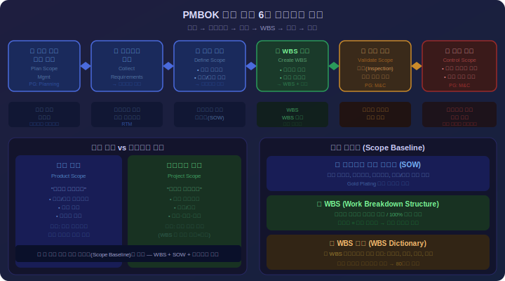
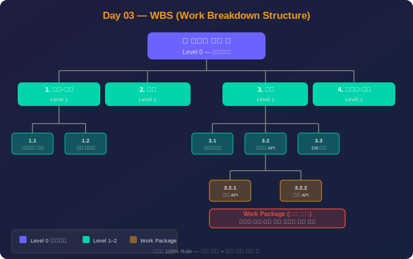
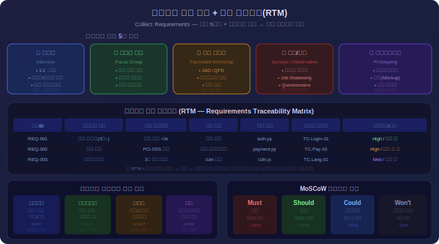
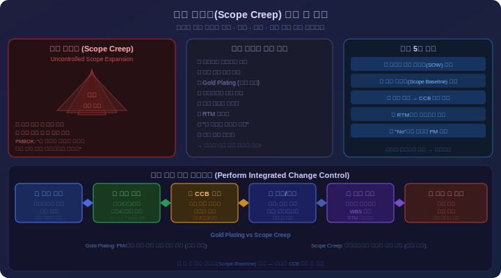

# Day 3: 프로젝트 범위 관리 - 상세 강의안

---

## 🔁 지난 시간 복습 (5분)

> **Day 2 핵심 요점**
> 1. **통합 관리 7개 프로세스**: 프로젝트 헌장 개발 → 프로젝트 관리 계획서 개발 → 작업 지시·관리 → 지식 관리 → 작업 감시·통제 → 통합 변경 통제 → 프로젝트 종료
> 2. **프로젝트 헌장**: PM의 권한을 공식적으로 부여하는 문서. 헌장 없이는 PM에게 아무 권한 없음
> 3. **통합 변경 통제**: 모든 변경 요청은 반드시 CCB(변경통제위원회)를 거쳐야 함. 비공식 변경 = Scope Creep의 시작

**오늘과의 연결:**  
"어제 통합 관리에서 '범위 기준선'이라는 단어가 나왔습니다. 오늘은 그 범위 기준선을 어떻게 만드는지, **WBS**가 무엇인지 배웁니다."

> 💡 **강사 안내:** 수강생에게 "프로젝트 헌장이 왜 중요한가요?" "CCB는 무엇을 하는 곳인가요?"를 질문하며 확인

---

## ✅ 오늘 배우고 나면 할 수 있어요

- [ ] 제품 범위와 프로젝트 범위의 차이를 설명할 수 있다
- [ ] WBS를 작성하고 100% 규칙을 적용할 수 있다
- [ ] 범위 크리프(Scope Creep)를 정의하고 예방 방법을 말할 수 있다
- [ ] RTM(요구사항 추적 매트릭스)의 목적을 설명할 수 있다
- [ ] 범위 확인(Validate Scope)과 품질 통제(Control Quality)의 차이를 설명할 수 있다

> 수업 후 이 체크리스트를 다시 보며 스스로 확인해보세요.

---

## 1교시: 범위 관리 개요 (이론 + 예시 + 실습 + 퀴즈) <!-- 슬라이드 #1~#3 -->

<div align="center">



*▲ PMBOK 범위 관리 6대 프로세스 — 계획×4 + M&C×2*

</div>

### 이론 (50분)

#### 1. 제품 범위 vs 프로젝트 범위

**제품 범위 (Product Scope)**
- 최종 인도물의 특성과 기능
- "무엇을 만들 것인가" (What)
- 고객/사용자 관점의 결과물
- 요구사항 명세서, 설계 문서로 표현
- 예: 로그인 기능, 결제 모듈, 보고서 출력 기능

**프로젝트 범위 (Project Scope)**
- 제품을 인도하기 위해 수행해야 할 작업
- "어떻게 만들 것인가" (How)
- 프로젝트 팀 관점의 활동
- WBS, 작업 계획서로 표현
- 예: 요구사항 분석, 코딩, 테스트, 배포

**상호 관계**
- 제품 범위가 명확해야 프로젝트 범위 정의 가능
- 제품 범위 완성 = 프로젝트 범위 완료
- 제품 범위 변경 → 프로젝트 범위 변경 필수

#### 2. 범위 관리의 6개 프로세스

**5.1 범위 관리 계획 수립 (Plan Scope Management)**
- 입력물: 프로젝트 헌장, PMPP, EEF, OPA
- 도구: 전문가 판단, 데이터 분석, 회의
- 출력물: 범위 관리 계획서, 요구사항 관리 계획서
- 핵심: 범위를 어떻게 정의, 검증, 통제할지 계획

**5.2 요구사항 수집 (Collect Requirements)**
- 입력물: 프로젝트 헌장, 이해관계자 등록부
- 도구: 인터뷰, 설문조사, 브레인스토밍, 프로토타입
- 출력물: 요구사항 문서, RTM (Requirements Traceability Matrix)
- 핵심: 이해관계자의 니즈를 구체적 요구사항으로 변환

**5.3 범위 정의 (Define Scope)**
- 입력물: 프로젝트 헌장, 요구사항 문서
- 도구: 전문가 판단, 제품 분석, 대안 생성
- 출력물: 프로젝트 범위 기술서, 프로젝트 문서 업데이트
- 핵심: 프로젝트와 제품을 상세히 기술, 제외사항 명시

**5.4 WBS 작성 (Create WBS)**
- 입력물: 범위 기술서, 요구사항 문서
- 도구: 분해(Decomposition), 전문가 판단
- 출력물: WBS, WBS 사전, 범위 기준선
- 핵심: 인도물을 관리 가능한 작업 패키지로 분해

<div align="center">



*▲ WBS 계층 분해 구조 — Level 0(프로젝트) → Level 1(주요 인도물) → Level 2(모듈) → Level 3(Work Package). 100% Rule: 상위 = 하위 전체 합*

</div>

**5.5 범위 확인 (Validate Scope)**
- 입력물: 검증된 인도물, 작업 성과 데이터
- 도구: 검사, 의사결정
- 출력물: 인수된 인도물, 변경 요청
- 핵심: 완료된 인도물에 대한 고객의 공식 인수

**5.6 범위 통제 (Control Scope)**
- 입력물: PMPP, 요구사항 문서, RTM, 작업 성과 데이터
- 도구: 데이터 분석, 차이 분석
- 출력물: 작업 성과 정보, 변경 요청
- 핵심: 범위 기준선 대비 변경을 모니터링하고 통제

#### 3. 범위 관리 계획서 (Scope Management Plan)

**필수 구성 요소**
1. **범위 정의 방법:** 요구사항으로부터 범위 기술서를 만드는 절차
2. **WBS 작성 방법:** 분해 수준, 코딩 체계, WBS 사전 형식
3. **인도물 인수 방법:** 검증 절차, 승인 권한, 인수 기준
4. **범위 기준선 유지 방법:** 기준선 승인 절차
5. **범위 변경 통제 방법:** 변경 요청 처리 절차, CCB 역할

**요구사항 관리 계획서 (Requirements Management Plan)**
- 요구사항 수집 방법
- 요구사항 우선순위 결정 방법
- 요구사항 추적 방법 (RTM 활용)
- 요구사항 변경 승인 절차
- 요구사항 검증 방법

#### 4. 범위 기준선 (Scope Baseline)

**구성 요소**
- 프로젝트 범위 기술서
- WBS (Work Breakdown Structure)
- WBS 사전 (WBS Dictionary)

**역할**
- 프로젝트 범위의 승인된 기준
- 성과 측정의 기준점
- 변경 통제의 대상
- Triple Constraint 중 범위 제약 관리

**기준선 변경**
- 공식적인 변경 통제 프로세스 필요
- CCB 승인 필수
- 변경 이력 관리

#### 5. 범위 크리프 (Scope Creep)

**정의**
- 승인되지 않은 범위 확대 현상
- "기왕이면 이것도..." 요구로 인한 범위 증가
- Gold Plating (불필요한 기능 추가)도 포함

**원인**
- 불명확한 초기 요구사항
- 요구사항 변경 통제 부재
- 고객의 추가 요구에 대한 무분별한 수용
- PM의 거절 능력 부족

**예방 방법**
1. 명확한 범위 기술서 작성
2. 제외사항 명시
3. 변경 통제 프로세스 확립
4. RTM을 통한 요구사항 추적
5. 이해관계자와의 지속적 소통

### 예시 (25분)

**예시 1: 전자상거래 플랫폼 구축 프로젝트**

제품 범위:
- 회원 관리 (회원가입, 로그인, 프로필 관리)
- 상품 관리 (상품 등록, 카테고리, 재고 관리)
- 주문/결제 (장바구니, 결제 게이트웨이 연동)
- 고객 지원 (1:1 문의, FAQ, 공지사항)
- 관리자 대시보드 (매출 현황, 회원 통계)

프로젝트 범위:
- 요구사항 분석 (2주)
- UI/UX 설계 (2주)
- 백엔드 개발 (6주)
- 프론트엔드 개발 (4주)
- 통합 테스트 (2주)
- 배포 및 이관 (1주)

제외사항:
- 다국어 지원 (2차 개발에서 진행)
- 모바일 앱 (웹 우선 개발)
- 오프라인 매장 연동 (향후 확장)

결과:
- 프로젝트 기간: 17주
- 총 예산: 5억원
- 제품 범위 명확화로 범위 크리프 방지
- 제외사항 명시로 고객 기대치 관리

**예시 2: ERP 시스템 고도화 프로젝트 - 범위 크리프 사례**

초기 범위 (계약서):
- 재무 모듈 업그레이드
- 인사 모듈 개선
- 예산: 3억원, 기간: 6개월

중간 추가 요청 (비공식):
- "기왕 하는 거 경영 대시보드도 만들어주세요"
- "모바일 접근도 되면 좋겠어요"
- "타 시스템과 API 연동도 필요해요"

PM의 대응 실패:
- 변경 요청서 작성 없이 구두 승인
- 추가 비용/기간 협의 없음
- CCB 검토 생략

결과:
- 프로젝트 기간 11개월로 연장 (+83%)
- 예산 4.5억원 소진 (+50%)
- 팀 번아웃, 품질 저하
- 고객 만족도 하락

교훈:
- 모든 변경은 공식 프로세스 필요
- 범위 변경 = 비용/일정 변경
- "No"라고 말할 수 있는 PM의 역량

**예시 3: 성공적인 범위 관리 - 병원 정보 시스템 구축**

프로젝트 특성:
- 8억원 규모, 10개월 기간
- 의료진, 행정부서 등 이해관계자 30명+

범위 관리 전략:
1. **요구사항 수집 단계 (1개월)**
   - 부서별 워크숍 12회 진행
   - 200개 요구사항 수집
   - MoSCoW 기법으로 우선순위 결정
   - Must: 120개, Should: 50개, Could: 30개

2. **범위 기준선 확정**
   - Must 요구사항만 1차 범위에 포함
   - Should/Could는 2차 개발 명시
   - 제외사항 20개 문서화
   - 전 이해관계자 서명 획득

3. **변경 통제 프로세스**
   - CCB 구성: 병원장, CIO, PM, 주요 부서장
   - 월 1회 정기 회의
   - 변경 요청 32건 중 승인 8건, 거절 24건
   - 승인된 변경의 일정/비용 영향 모두 반영

4. **결과**
   - 일정: 계획 대비 +2주 (승인된 변경 반영)
   - 예산: 계획 대비 +5% (승인된 변경 반영)
   - 범위 크리프 0건
   - 인수 테스트 1회 통과
   - 고객 만족도 4.8/5.0

성공 요인:
- 철저한 초기 요구사항 분석
- 명확한 제외사항 명시
- 엄격한 변경 통제
- 이해관계자와의 지속적 소통

### 실습 (20분)

**시나리오:**
귀사는 중견 제조업체로부터 "생산 관리 시스템" 구축을 수주했습니다.
- 고객사: 직원 500명, 공장 3개 운영
- 예산: 4억원
- 기간: 8개월
- 고객 요구: "생산 현황을 실시간으로 보고 싶고, 재고도 관리하고 싶어요"

**과제 1: 제품 범위 vs 프로젝트 범위 구분**
- 제품 범위 5개 이상 나열
- 프로젝트 범위 7개 이상 나열
- 제외사항 3개 이상 명시

**과제 2: 범위 관리 프로세스 적용**
- 6개 프로세스를 시간순으로 배치
- 각 프로세스에서 생성될 문서 명시
- 각 프로세스 담당자 지정 (PM, 분석가, 개발자 등)

**과제 3: 범위 크리프 예방 계획**
- 발생 가능한 범위 크리프 시나리오 3개 작성
- 각 시나리오에 대한 예방 방법 제시
- 변경 요청이 들어왔을 때의 처리 절차 작성

**과제 4: 범위 기준선 구성 요소 초안**
- 프로젝트 범위 기술서의 목차 작성 (10개 이상 항목)
- WBS 1단계 분해 (5개 이상 주요 인도물)
- RTM 양식 설계 (필수 컬럼 7개 이상)

**예상 산출물:**
- 제품/프로젝트 범위 목록 (1페이지)
- 범위 관리 프로세스 흐름도 (1페이지)
- 범위 크리프 예방 계획서 (2페이지)
- 범위 기준선 구성 요소 초안 (2페이지)

### 퀴즈 (10분)

**문제 1:**
제품 범위와 프로젝트 범위의 차이를 설명하고, 각각의 예시를 3개씩 드시오.

**모범답안:**
제품 범위는 최종 인도물의 특성과 기능으로 "무엇을 만들 것인가"를 정의합니다. 반면 프로젝트 범위는 제품을 인도하기 위해 수행할 작업으로 "어떻게 만들 것인가"를 정의합니다.

제품 범위 예시:
- 사용자 로그인 기능
- 실시간 알림 시스템
- 보고서 출력 기능

프로젝트 범위 예시:
- 요구사항 분석 활동
- 데이터베이스 설계 작업
- 통합 테스트 수행

핵심은 제품 범위가 명확해야 프로젝트 범위를 정의할 수 있으며, 제품 범위의 변경은 반드시 프로젝트 범위의 변경을 수반한다는 점입니다.

**문제 2:**
범위 관리의 6개 프로세스를 순서대로 나열하고, 각 프로세스의 핵심 출력물을 쓰시오.

**모범답안:**
1. 5.1 범위 관리 계획 수립 → 범위 관리 계획서, 요구사항 관리 계획서
2. 5.2 요구사항 수집 → 요구사항 문서, RTM
3. 5.3 범위 정의 → 프로젝트 범위 기술서
4. 5.4 WBS 작성 → WBS, WBS 사전, 범위 기준선
5. 5.5 범위 확인 → 인수된 인도물
6. 5.6 범위 통제 → 작업 성과 정보, 변경 요청

프로세스 1~4는 계획 프로세스 그룹, 5는 감시 및 통제 그룹, 6은 실행 및 감시/통제 그룹에 속합니다.

**문제 3:**
범위 크리프(Scope Creep)가 무엇인지 설명하고, 이를 예방하는 방법 5가지를 쓰시오.

**모범답안:**
범위 크리프는 승인되지 않은 범위 확대 현상으로, 프로젝트 중 "기왕이면 이것도..." 식의 요구가 무분별하게 수용되어 범위가 증가하는 현상입니다. 이는 일정 지연, 비용 초과, 팀 번아웃의 주요 원인입니다.

예방 방법:
1. 명확한 범위 기술서 작성 - 인도물과 인수 기준을 구체적으로 명시
2. 제외사항 명시 - "포함하지 않는 것"을 문서화하여 기대치 관리
3. 변경 통제 프로세스 확립 - 모든 변경은 공식 변경 요청서 작성
4. CCB 운영 - 변경의 영향(비용, 일정)을 평가하고 승인/거절 결정
5. RTM 활용 - 요구사항의 출처와 변경 이력을 추적

추가로, PM은 "No"라고 말할 수 있는 용기와 고객에게 변경의 영향을 설명하는 커뮤니케이션 능력이 필요합니다.

**문제 4:**
범위 기준선(Scope Baseline)의 3가지 구성 요소를 쓰고, 범위 기준선의 역할을 설명하시오.

**모범답안:**
구성 요소:
1. 프로젝트 범위 기술서
2. WBS (Work Breakdown Structure)
3. WBS 사전 (WBS Dictionary)

역할:
- 프로젝트 범위의 승인된 기준점(Baseline)으로 기능
- 성과 측정의 기준 (계획 대비 실제 진행 상황 비교)
- 변경 통제의 대상 (기준선 변경은 CCB 승인 필수)
- Triple Constraint 중 범위 제약을 관리하는 도구

기준선은 한번 승인되면 공식적인 변경 통제 프로세스를 통해서만 변경할 수 있으며, 모든 변경 이력을 관리해야 합니다. 이를 통해 프로젝트의 범위가 통제되고, 이해관계자들이 프로젝트의 현재 상태를 정확히 파악할 수 있습니다.

## 2교시: 요구사항 수집 (이론 + 예시 + 실습 + 퀴즈) <!-- 슬라이드 #4 -->

<div align="center">



*▲ 요구사항 수집 5대 기법 + 추적 매트릭스(RTM) + MoSCoW*

</div>

### 이론 (50분)

#### 1. 요구사항의 5가지 분류

**비즈니스 요구사항 (Business Requirements)**
- 조직의 상위 수준 니즈
- 비즈니스 목표와 연결
- 예: "고객 이탈률 20% 감소", "매출 30% 증대"
- 프로젝트 헌장에 명시
- C-레벨, 사업부장이 제시

**이해관계자 요구사항 (Stakeholder Requirements)**
- 특정 이해관계자 그룹의 니즈
- 사용자, 관리자, 운영팀 등 그룹별로 분류
- 예: "영업팀은 모바일에서도 거래처 정보 조회 원함"
- 인터뷰, 설문조사로 수집
- 상충되는 요구사항 조정 필요

**솔루션 요구사항 (Solution Requirements)**
- 제품/서비스의 기능과 비기능 요구사항

**기능 요구사항 (Functional Requirements):**
- 시스템이 수행해야 할 기능
- 예: "사용자는 비밀번호를 재설정할 수 있다"
- "시스템은 일일 매출 보고서를 자동 생성한다"
- User Story, Use Case로 표현

**비기능 요구사항 (Non-Functional Requirements):**
- 성능, 보안, 사용성, 신뢰성 등
- 예: "응답 시간 3초 이내", "99.9% 가용성", "동시 접속 1,000명"
- 인수 기준의 기반

**전환 요구사항 (Transition Requirements)**
- 현재 상태에서 미래 상태로 전환 시 필요한 것
- 임시 요구사항 (프로젝트 종료 후 불필요)
- 예: 데이터 마이그레이션, 병행 운영, 사용자 교육
- 간과하기 쉬우나 프로젝트 성공에 중요

**프로젝트 요구사항 (Project Requirements)**
- 프로젝트 수행 조건
- 예: "주 1회 진행 회의", "월말 진척 보고", "보안 서약서 제출"
- 계약서, SLA에 명시

#### 2. 요구사항 수집 기법

**인터뷰 (Interviews)**
- 1:1 또는 소그룹 대화
- 장점: 깊이 있는 정보, 신뢰 관계 구축
- 단점: 시간 소요, 인터뷰어 역량 의존
- 기법: 구조화(체크리스트), 비구조화(자유 대화), 혼합
- Tip: 5Why 기법으로 근본 원인 파악

**워크숍 / JAD (Joint Application Design)**
- 이해관계자 집단 세션
- 장점: 신속한 합의, 상충 요구사항 조정
- 단점: 일정 조율 어려움, 강한 의견 주도 위험
- 진행: 퍼실리테이터, 화이트보드, 포스트잇 활용
- 산출물: 요구사항 목록, 우선순위, 합의사항

**설문조사 (Questionnaires and Surveys)**
- 대규모 이해관계자 대상
- 장점: 짧은 시간에 광범위한 의견 수집
- 단점: 낮은 응답률, 피상적 답변
- 활용: 사용자 만족도, 우선순위 투표
- 도구: Google Forms, SurveyMonkey

**관찰 (Observation / Job Shadowing)**
- 실제 작업 환경에서 업무 관찰
- 장점: 말로 표현 못한 암묵적 요구사항 발견
- 단점: 시간 소요, 관찰 대상의 부자연스러움
- 예: 콜센터 업무 관찰, 물류 창고 작업 관찰
- "실제 업무 ≠ 인터뷰 내용" 발견 가능

**프로토타입 (Prototyping)**
- 모형 또는 목업 작성
- 종류: 페이퍼 프로토타입, 와이어프레임, 인터랙티브 프로토타입
- 장점: 조기 피드백, 오해 최소화
- 단점: "이게 완제품 아니냐" 오해 가능
- 도구: Figma, Sketch, Balsamiq

**브레인스토밍 (Brainstorming)**
- 자유로운 아이디어 도출
- 규칙: 비판 금지, 아이디어 결합 환영
- 시간: 30~60분
- 후속: 유사 아이디어 그룹핑, 실현 가능성 평가

**델파이 기법 (Delphi Technique)**
- 전문가들의 익명 의견 수렴 → 합의 도출
- 라운드 반복으로 의견 수렴
- 장점: 편향 최소화
- 단점: 시간 소요
- 활용: 리스크 식별, 추정

**벤치마킹 (Benchmarking)**
- 타 조직/제품의 모범 사례 연구
- 예: 경쟁사 앱 분석, 업계 표준 조사
- 장점: 검증된 요구사항
- 주의: "우리 상황"에 맞게 조정 필요

#### 3. RTM (Requirements Traceability Matrix)

**정의**
- 요구사항의 출처부터 최종 인도물까지 추적하는 표
- 요구사항 생명주기 관리

**필수 컬럼**
1. **요구사항 ID:** REQ-001, REQ-002 (고유 식별자)
2. **요구사항 설명:** 구체적 내용
3. **출처:** 요구한 이해관계자 (예: CFO, 영업팀장)
4. **비즈니스 목표 연결:** 어떤 비즈니스 목표에 기여하는가
5. **우선순위:** High / Medium / Low 또는 MoSCoW
6. **상태:** 제안됨 → 승인됨 → 설계됨 → 구현됨 → 테스트됨 → 인수됨
7. **WBS 연결:** 어느 작업 패키지에서 구현되는가
8. **테스트 케이스:** 어느 테스트로 검증되는가
9. **버전:** 요구사항 변경 이력 관리

**활용**
- 변경 영향 분석: 요구사항 변경 시 영향받는 WBS, 테스트 식별
- 누락 방지: 모든 요구사항이 WBS에 매핑되었는지 확인
- 추적성: 최종 인도물이 초기 요구사항을 충족하는지 검증
- 인수 근거: 고객이 요구한 사항이 모두 구현되었음을 증명

**관리 방법**
- Excel, JIRA, Azure DevOps 활용
- 주 1회 업데이트
- 형상 관리 도구에 버전 관리

#### 4. 요구사항 우선순위 결정

**MoSCoW 기법**
- **Must have:** 필수, 없으면 프로젝트 실패
- **Should have:** 중요하나 대안 가능
- **Could have:** 있으면 좋음, 시간 여유 시 구현
- **Won't have (this time):** 이번엔 제외, 차기 버전에서

**Kano 모델**
- **기본 요구사항:** 당연히 있어야 하는 것 (없으면 불만족)
- **성능 요구사항:** 많을수록 만족도 증가
- **매력 요구사항:** 예상치 못한 기능 (경쟁 우위)

**가치 vs 노력 매트릭스**
- X축: 구현 노력 (낮음~높음)
- Y축: 비즈니스 가치 (낮음~높음)
- 우선순위: 높은 가치 & 낮은 노력 → Quick Win

### 예시 (25분)

**예시 1: 대학 LMS(학습 관리 시스템) 구축**

**요구사항 수집 과정:**

1단계: 이해관계자 식별
- 교수진 200명
- 학생 5,000명
- 행정직원 50명
- 총장 (스폰서)

2단계: 수집 기법 선택
- 교수진: 워크숍 3회 (학과별)
- 학생: 설문조사 (응답률 42%)
- 행정직원: 인터뷰 (10명)
- 총장: 인터뷰 1회

3단계: 수집된 요구사항 (총 150개)

비즈니스 요구사항:
- "수업 운영 효율성 30% 향상"
- "종이 기반 과제 제출 완전 폐지"

이해관계자 요구사항:
- 교수진: "과제 채점을 모바일에서도 하고 싶다"
- 학생: "과제 마감 전 알림 받고 싶다"
- 행정직원: "성적 처리 자동화"

솔루션 요구사항 (기능):
- 강의 자료 업로드/다운로드
- 온라인 과제 제출 및 채점
- 출석 체크 (QR 코드)
- 토론 게시판
- 실시간 공지사항

솔루션 요구사항 (비기능):
- 동시 접속자 2,000명 지원
- 페이지 로딩 3초 이내
- 99.5% 가용성
- 모바일 반응형 디자인

전환 요구사항:
- 기존 LMS 데이터 마이그레이션 (5년치)
- 교수진 대상 교육 (2일 과정)
- 신구 시스템 병행 운영 (1학기)

4단계: RTM 작성 (일부)

| 요구사항 ID | 설명 | 출처 | 우선순위 | 상태 | WBS 연결 | 테스트 케이스 |
|------------|------|------|---------|------|---------|-------------|
| REQ-001 | 과제 제출 기능 | 교수진 | Must | 승인됨 | 3.2.1 | TC-045 |
| REQ-002 | 모바일 채점 | 교수진 | Should | 승인됨 | 3.3.2 | TC-078 |
| REQ-005 | QR 출석 체크 | 행정직원 | Could | 보류 | - | - |
| REQ-032 | 페이지 로딩 3초 | 비기능 | Must | 승인됨 | 5.1.3 | TC-120 |

결과:
- Must: 80개, Should: 40개, Could: 30개
- Could 요구사항은 2차 개발로 연기
- 프로젝트 기간: 10개월
- 예산: 8억원

**예시 2: 제조업 MES(제조실행시스템) 요구사항 수집 실패 사례**

프로젝트 배경:
- 자동차 부품 제조사
- 3개 공장, 12개 라인
- 예산 10억원, 기간 12개월

요구사항 수집의 문제:
1. **현장 관찰 생략**
   - 사무실에서 회의만 진행
   - 실제 현장 작업자 의견 미반영
   - 결과: 현장 작업 흐름과 맞지 않는 UI

2. **비기능 요구사항 간과**
   - 기능만 나열, 성능/가용성 논의 없음
   - 결과: 실시간 모니터링 지연 (10초), 현장 불만

3. **전환 요구사항 누락**
   - 데이터 마이그레이션 계획 없음
   - 사용자 교육 시간 미확보
   - 결과: 가동 후 1개월간 혼란, 생산 차질

4. **RTM 미작성**
   - 요구사항 엑셀에만 나열
   - 요구사항-설계-구현 연결 불명확
   - 결과: 최종 인수 시 "이거 요청 안 했는데?" "이건 왜 없어?" 논쟁

최종 결과:
- 프로젝트 기간 18개월로 연장 (+50%)
- 예산 13억원 소진 (+30%)
- 요구사항 재수집 및 재설계 3개월 소요
- 고객사 불만족으로 차기 프로젝트 수주 실패

교훈:
- 요구사항 수집은 프로젝트 성패의 80%
- 현장 관찰과 실사용자 인터뷰 필수
- 비기능/전환 요구사항도 초기에 명확히
- RTM으로 추적성 확보

**예시 3: 성공적인 RTM 활용 - 금융권 디지털 뱅킹 앱**

프로젝트 규모:
- 예산 15억원, 기간 10개월
- 요구사항 280개

RTM 운영 방식:
1. **도구 선택:** JIRA + Confluence 연동
2. **요구사항 ID 체계:** RQ-[분류]-[순번]
   - RQ-FN-001: 기능 요구사항
   - RQ-NF-001: 비기능 요구사항
   - RQ-TR-001: 전환 요구사항
3. **상태 전이 규칙:**
   - 제안 → (검토) → 승인 → (설계) → 구현 → (개발) → 테스트 → (QA) → 인수
4. **주간 리뷰:**
   - 매주 금요일 RTM 현황 리뷰
   - 상태 업데이트, 블로커 해결
5. **변경 통제 연계:**
   - 요구사항 변경 시 RTM 버전업
   - 영향받는 WBS, 테스트 자동 식별

성과:
- 요구사항 누락 0건
- 변경 요청 45건 중 영향 분석 100% 완료
- 인수 테스트 시 "요구사항 충족도" 객관적 증명
- 고객 만족도 4.9/5.0
- 유지보수 계약 3년 연장 수주

### 실습 (20분)

**시나리오:**
귀하는 "스마트 헬스케어 앱" 개발 프로젝트의 BA(Business Analyst)입니다.
- 목표: 만성질환자의 자가 건강 관리 지원
- 예산: 6억원, 기간: 8개월
- 이해관계자: 의료진, 환자, 보호자, 병원 행정팀, 보험사

**과제 1: 요구사항 수집 계획**
- 5개 이해관계자 그룹별로 적합한 수집 기법 선택
- 각 기법의 선택 이유 설명
- 수집 일정 (총 3주) 배분
- 예상 요구사항 개수 추정

**과제 2: 요구사항 분류 연습**
아래 요구사항을 5가지 분류(비즈니스/이해관계자/솔루션-기능/솔루션-비기능/전환/프로젝트)로 분류하세요.

1. "재입원율 15% 감소"
2. "환자는 혈압을 입력하고 그래프로 확인할 수 있다"
3. "의료진은 환자 데이터를 실시간으로 모니터링한다"
4. "페이지 로딩 시간 2초 이내"
5. "기존 EMR 시스템의 환자 데이터를 마이그레이션"
6. "주 1회 진행 회의 및 월말 보고"
7. "보호자는 푸시 알림으로 환자 이상 징후를 받는다"

**과제 3: RTM 설계**
- 요구사항 ID 체계 정의 (분류별 접두사)
- RTM의 필수 컬럼 10개 선정 및 설명
- 요구사항 상태 전이 다이어그램 작성 (6개 이상 상태)
- RTM 업데이트 주기 및 담당자 정의

**과제 4: 인터뷰 질문지 작성**
"환자" 그룹 대상 인터뷰를 위한 질문 10개 작성
- 구조화 질문 5개
- 비구조화(개방형) 질문 5개
- 각 질문의 의도 설명

**예상 산출물:**
- 요구사항 수집 계획서 (2페이지)
- 요구사항 분류표 (1페이지)
- RTM 양식 및 운영 계획 (2페이지)
- 인터뷰 질문지 (1페이지)

### 퀴즈 (10분)

**문제 1:**
요구사항의 5가지 분류를 쓰고, 각각의 예시를 드시오.

**모범답안:**
1. **비즈니스 요구사항:** 조직의 상위 수준 목표
   - 예: "고객 이탈률 20% 감소", "시장 점유율 15% 증대"

2. **이해관계자 요구사항:** 특정 그룹의 니즈
   - 예: "영업팀은 모바일에서 CRM 접근 필요"

3. **솔루션 요구사항 (기능):** 시스템이 수행할 기능
   - 예: "사용자는 비밀번호를 재설정할 수 있다"

4. **솔루션 요구사항 (비기능):** 품질 속성
   - 예: "응답 시간 3초 이내", "99.9% 가용성"

5. **전환 요구사항:** 현재→미래 상태 이행 시 필요
   - 예: "레거시 시스템 데이터 마이그레이션", "병행 운영 2개월"

**문제 2:**
요구사항 수집 기법 5가지를 쓰고, 각각의 장단점을 간략히 설명하시오.

**모범답안:**
1. **인터뷰**
   - 장점: 깊이 있는 정보 획득, 신뢰 구축
   - 단점: 시간 소요, 인터뷰어 역량 의존

2. **워크숍/JAD**
   - 장점: 신속한 합의, 상충 요구사항 조정
   - 단점: 일정 조율 어려움, 강한 의견 주도 위험

3. **설문조사**
   - 장점: 대규모 의견 신속 수집
   - 단점: 낮은 응답률, 피상적 답변

4. **프로토타입**
   - 장점: 조기 피드백, 오해 최소화
   - 단점: "완제품" 오해 가능, 프로토타입 제작 시간 필요

5. **관찰**
   - 장점: 암묵적 요구사항 발견, 실제 업무 파악
   - 단점: 시간 소요, 관찰 대상의 부자연스러움

**문제 3:**
RTM(Requirements Traceability Matrix)의 목적과 필수 컬럼 7개를 쓰시오.

**모범답안:**

목적:
- 요구사항의 출처부터 최종 인도물까지 전체 생명주기 추적
- 변경 영향 분석
- 요구사항 누락 방지
- 인수 근거 제공

필수 컬럼:
1. 요구사항 ID (고유 식별자)
2. 요구사항 설명 (구체적 내용)
3. 출처 (요구한 이해관계자)
4. 우선순위 (High/Medium/Low 또는 MoSCoW)
5. 상태 (제안→승인→설계→구현→테스트→인수)
6. WBS 연결 (구현 작업 패키지)
7. 테스트 케이스 (검증 방법)

추가 권장 컬럼: 비즈니스 목표 연결, 버전, 변경 이력

**문제 4:**
MoSCoW 기법을 설명하고, 다음 요구사항을 분류하시오.
- "시스템 로그인 기능"
- "다크 모드 지원"
- "실시간 데이터 동기화"
- "AR 기반 제품 미리보기"

**모범답안:**

MoSCoW 기법:
- **Must have:** 필수, 없으면 프로젝트 실패
- **Should have:** 중요하나 대안 가능
- **Could have:** 있으면 좋음, 시간 여유 시
- **Won't have (this time):** 이번엔 제외, 차기 버전

분류:
- "시스템 로그인 기능" → **Must have** (보안의 기본, 필수 기능)
- "다크 모드 지원" → **Could have** (UX 개선이나 핵심은 아님)
- "실시간 데이터 동기화" → **Should have** (비즈니스 가치 높으나 배치 처리로 대안 가능)
- "AR 기반 제품 미리보기" → **Won't have** (혁신적이나 기술 복잡도·비용 고려 시 차기 버전)

* 실제로는 프로젝트 목표와 제약 조건에 따라 분류가 달라질 수 있으므로, 이해관계자와 합의가 중요합니다.

## 3교시: 범위 정의 및 범위 기술서 (이론 + 예시 + 실습 + 퀴즈) <!-- 슬라이드 #4~#5 -->

<div align="center">



*▲ 범위 크리프 원인 · 예방 · 통합 변경 통제(CCB) 프로세스*

</div>

### 이론 (50분)

#### 1. 프로젝트 범위 기술서 (Project Scope Statement)

**정의**
- 프로젝트가 제공할 제품/서비스/결과를 상세히 기술한 문서
- 요구사항 문서보다 더 구체적
- 범위 기준선의 핵심 구성 요소

**필수 구성 요소**

**1) 제품 범위 기술 (Product Scope Description)**
- 프로젝트가 생성할 제품/서비스의 특성
- 예: "클라우드 기반 재고 관리 시스템으로, 실시간 재고 추적, 자동 발주, 모바일 앱 제공"

**2) 인도물 (Deliverables)**
- 고객에게 제공할 구체적 산출물
- 예: 
  - 요구사항 명세서
  - 설계 문서
  - 소스 코드
  - 테스트 보고서
  - 사용자 매뉴얼
  - 설치 완료된 시스템
  - 교육 이수 증명서

**3) 인수 기준 (Acceptance Criteria)**
- 인도물이 완료되었다고 판단하는 측정 가능한 기준
- SMART 원칙 적용 (Specific, Measurable, Achievable, Relevant, Time-bound)
- 예:
  - 기능 테스트: 모든 테스트 케이스 통과율 100%
  - 성능: 응답 시간 평균 2초 이하, 최대 3초
  - 가용성: 30일간 가동률 99.5% 이상
  - 사용성: 사용자 만족도 설문 4.0/5.9 이상
  - 보안: OWASP Top 10 취약점 0건

**4) 프로젝트 제외사항 (Project Exclusions)**
- 프로젝트에 포함되지 않는 것을 명시
- 이해관계자의 기대치 관리
- 범위 크리프 예방의 핵심
- 예:
  - "다국어 지원은 2차 개발에서 진행"
  - "iOS 앱은 이번 프로젝트에 포함되지 않음 (Android만)"
  - "기존 시스템의 데이터 정제는 고객사 책임"
  - "24/7 운영 지원은 별도 계약 (이행 후 6개월까지만 지원)"

**5) 제약 조건 (Constraints)**
- 프로젝트 수행에 제한을 가하는 요소
- 예:
  - 예산: 총 5억원을 초과할 수 없음
  - 일정: 12월 31일까지 완료 (회계연도 마감)
  - 자원: 투입 가능 개발자 8명
  - 기술: 고객사 표준 기술 스택(Java, Oracle) 사용 필수
  - 규제: 개인정보보호법, 의료법 준수

**6) 가정 사항 (Assumptions)**
- 프로젝트 계획 시 참(true)이라고 가정한 사항
- 가정이 깨지면 프로젝트 리스크 발생
- 예:
  - "고객사가 개발 서버를 프로젝트 시작 1주 내 제공"
  - "주요 이해관계자가 주 1회 리뷰 회의에 참석 가능"
  - "제3자 API가 프로젝트 기간 동안 안정적으로 제공됨"
  - "환율이 현 수준(1,300원/$) 유지"

#### 2. 제외사항 명시의 중요성

**이해관계자 기대치 관리**
- "당연히 포함될 줄 알았어요" 방지
- 계약서에도 명시하여 법적 보호

**범위 크리프 예방**
- "이 정도는 해주시죠" 요청에 대한 근거
- "제외사항에 명시되어 있으며, 변경 요청 시 추가 비용/일정 발생합니다" 대응

**차기 프로젝트 기회**
- 제외된 기능을 2차 개발로 제안
- 지속적인 비즈니스 관계 유지

**실전 Tip**
- 제외사항은 고객과 함께 리뷰하며 작성
- 구두 합의도 문서화
- "이번 프로젝트에는 포함하지 않지만, 향후 고려 가능" 표현

#### 3. 인수 기준 (Acceptance Criteria) 작성 방법

**SMART 원칙 적용**

**Specific (구체적)**
- ❌ "시스템이 빨라야 한다"
- ✅ "사용자 로그인 응답 시간이 2초 이내여야 한다"

**Measurable (측정 가능)**
- ❌ "대부분의 테스트를 통과해야 한다"
- ✅ "100개 테스트 케이스 중 100개 통과 (100%)"

**Achievable (달성 가능)**
- ❌ "시스템 장애가 절대 발생하지 않아야 한다" (불가능)
- ✅ "월간 가동률 99.5% 이상" (현실적)

**Relevant (관련성)**
- 비즈니스 목표와 연결
- 예: "고객 이탈률 20% 감소"가 목표라면 → "앱 크래시율 1% 이하"

**Time-bound (기한)**
- ❌ "언젠가는 안정화"
- ✅ "가동 후 30일 이내 가동률 99.5% 달성"

**카테고리별 인수 기준 예시**

**기능 (Functional):**
- 모든 필수(Must) 요구사항 100% 구현
- UAT 시나리오 50개 중 50개 통과

**성능 (Performance):**
- 페이지 로딩: 평균 2초, 95 percentile 3초
- 동시 접속자 500명 처리 가능
- DB 쿼리 응답 시간 100ms 이하

**보안 (Security):**
- 모의 해킹 테스트 통과 (High 취약점 0건)
- 개인정보보호법 준수 (법무팀 검토 완료)
- 데이터 암호화 (AES-256) 적용 확인

**사용성 (Usability):**
- 사용자 테스트: 업무별 태스크 완료율 90% 이상
- SUS (System Usability Scale) 점수 70점 이상
- 교육 후 독립 수행 가능 (1일 교육 후)

**신뢰성/가용성 (Reliability/Availability):**
- MTBF (평균 고장 간격) 720시간 이상
- MTTR (평균 복구 시간) 1시간 이내
- 월간 가동률 99.9%

#### 4. 범위 정의 프로세스 (Define Scope)

**입력물**
1. 프로젝트 헌장
2. 프로젝트 관리 계획서 (범위 관리 계획서, 요구사항 관리 계획서)
3. 요구사항 문서
4. EEF (기업 환경 요인): 조직 문화, 시장 조건, 규제
5. OPA (조직 프로세스 자산): 과거 프로젝트 범위 기술서, 템플릿

**도구 및 기법**
1. **전문가 판단:** SME, 업계 전문가 자문
2. **제품 분석:** 제품 분해, 시스템 분석, 요구사항 분석
3. **대안 생성:** 브레인스토밍으로 다양한 접근 방식 검토
4. **회의:** 이해관계자 워크숍

**출력물**
1. **프로젝트 범위 기술서** (본 교시의 핵심)
2. **프로젝트 문서 업데이트:** 가정 사항 로그, 요구사항 문서, RTM, 이해관계자 등록부

**범위 정의 vs 요구사항 수집 비교**

| 구분 | 요구사항 수집 (2교시) | 범위 정의 (3교시) |
|-----|---------------------|------------------|
| 초점 | "무엇"을 원하는가 (What) | "무엇"을 어떻게 제공할 것인가 (What + How) |
| 산출물 | 요구사항 문서, RTM | 프로젝트 범위 기술서 |
| 상세 수준 | 이해관계자 니즈 나열 | 프로젝트 경계, 인도물, 인수 기준 명확화 |
| 시점 | 프로젝트 초기 | 요구사항 수집 후 |

### 예시 (25분)

**예시 1: 프로젝트 범위 기술서 전체 사례 - "스마트 물류 관리 시스템"**

**프로젝트명:** 스마트 물류 관리 시스템 (SLMS) 구축

**프로젝트 목표:**
- 물류 센터 운영 효율성 30% 향상
- 배송 오류율 50% 감소
- 재고 정확도 95% → 99% 향상

**제품 범위 기술:**
RFID 기반 실시간 재고 추적 시스템으로, 입고-보관-출고-배송의 전 과정을 자동화하고, AI 기반 재고 최적화 및 경로 최적화를 제공하는 웹/모바일 통합 플랫폼

**주요 인도물:**

1. **소프트웨어 인도물**
   - 웹 관리자 대시보드 (React)
   - 모바일 작업자 앱 (Android, iOS)
   - RFID 리더기 연동 미들웨어
   - 백엔드 API 서버 (Node.js, PostgreSQL)
   - AI 추천 엔진 (Python)

2. **하드웨어 인도물**
   - RFID 리더기 50대 설치 (창고 3개소)
   - RFID 태그 10,000개 부착

3. **문서 인도물**
   - 요구사항 명세서
   - 시스템 설계서 (ERD, API 명세)
   - 테스트 계획서 및 결과 보고서
   - 운영 매뉴얼 (관리자용, 작업자용)
   - 소스 코드 (GitHub 리포지토리)

4. **교육 및 지원**
   - 관리자 교육 (2일, 10명)
   - 작업자 교육 (1일, 50명)
   - 이행 후 3개월 하자 보수 지원

**인수 기준:**

기능 (Functional):
- 필수 요구사항 120개 100% 구현
- UAT 시나리오 80개 100% 통과
- RFID 태그 인식률 99% 이상

성능 (Performance):
- 실시간 재고 조회 응답 시간 1초 이내
- 동시 접속자 200명 지원
- RFID 리더기 데이터 처리: 초당 100개 태그

신뢰성 (Reliability):
- 파일럿 운영 30일간 가동률 99% 이상
- 데이터 정합성: 물리 재고 vs 시스템 일치율 99% 이상

보안 (Security):
- 모의 해킹 테스트 통과 (치명적 취약점 0건)
- 역할 기반 접근 통제 (RBAC) 적용
- 데이터 백업 일 1회 자동 수행

사용성 (Usability):
- 작업자 앱: 1일 교육 후 독립 수행 가능
- 사용자 만족도 설문 4.0/5.0 이상

**프로젝트 제외사항 (매우 중요!):**

1. **기능 제외**
   - 고객사 전자상거래 쇼핑몰 연동 (3차 개발)
   - 배송 차량 GPS 추적 (2차 개발)
   - 다국어 지원 (한국어만)
   - 음성 인식 피킹 시스템 (차기 검토)

2. **하드웨어 제외**
   - 자동 분류 컨베이어 벨트 설치 (별도 구매)
   - 서버 및 네트워크 장비 (고객사 제공)

3. **데이터 제외**
   - 레거시 시스템 10년치 이력 데이터 마이그레이션 (최근 1년만)
   - 불량 데이터 정제는 고객사 책임

4. **운영 지원 제외**
   - 3개월 하자 보수 후 운영 지원은 별도 유지보수 계약
   - 24/7 콜센터 운영 (평일 09:00-18:00만)

**제약 조건:**

예산 제약:
- 총 프로젝트 비용: 8억원을 초과할 수 없음
- 하드웨어 예산: 1억원 (RFID 장비)
- 소프트웨어 개발: 5억원
- 교육 및 이행: 1억원
- 예비비: 1억원

일정 제약:
- 착수일: 2024년 3월 1일
- 완료일: 2024년 12월 31일 (10개월)
- Milestone 1: 요구사항 확정 (4월 30일)
- Milestone 2: 파일럿 시스템 가동 (9월 30일)
- Milestone 3: 본 시스템 가동 (12월 15일)

자원 제약:
- PM 1명, BA 1명, 개발자 6명, QA 2명, 인프라 1명
- RFID 전문가는 외부 용역 (월 500만원)
- 고객사 담당자(PO) 주 2회만 미팅 가능

기술 제약:
- 고객사 표준 기술 스택 준수: Java 불가, Node.js 사용
- 클라우드 사용 불가 (온프레미스)
- 고객사 방화벽 정책 엄격 (외부 API 호출 제한)

규제 제약:
- 개인정보보호법 준수 (작업자 동선 데이터 암호화)
- 산업 안전 규정 준수 (RFID 전자파 인체 영향 검증)

**가정 사항:**

1. 고객사가 개발/스테이징/운영 서버를 프로젝트 착수 2주 내 제공
2. 고객사 네트워크 팀이 RFID 리더기용 네트워크 구성 지원
3. PO(제품 책임자)가 주 2회 리뷰 회의에 필수 참석
4. RFID 태그 납기가 예정대로 진행 (6월 말)
5. 파일럿 기간 동안 창고 1개소 전용 사용 가능
6. 레거시 시스템이 프로젝트 기간 동안 정상 운영 (병행 운영)
7. 환율 안정 (RFID 장비 해외 구매)

**해설:**
위의 범위 기술서는 실전에서 사용 가능한 수준입니다. 특히 제외사항이 구체적으로 명시되어 있어, 고객이 "당연히 포함될 줄 알았다"는 주장을 원천 차단할 수 있습니다. 인수 기준도 측정 가능하게 작성되어 완료 여부를 객관적으로 판단할 수 있습니다.

**예시 2: 제외사항 명시 실패로 인한 분쟁 사례**

프로젝트: 대학 입학 관리 시스템

계약 당시 범위 기술서:
- "입학 원서 접수, 전형 관리, 합격자 발표 기능 제공"
- 제외사항: 명시되지 않음 ❌

중간 고객 요청:
- "기숙사 신청 기능도 당연히 포함이죠?"
- "장학금 관리도 해주셔야죠?"
- "학사 정보 시스템과 연동은 기본 아닌가요?"

PM 대응:
- 계약서에 제외사항 없음
- "입학 관리"의 범위가 모호함
- 추가 비용 요청 시 고객 반발: "원래 포함된 거 아니었나요?"

최종 결과:
- 법적 분쟁 → 중재 → PM사가 50% 비용 부담
- 프로젝트 기간 8개월 → 14개월 (+75%)
- 예산 3억원 → 4.5억원 (+50%)
- 고객사와의 관계 악화

교훈:
- 제외사항을 명시하지 않으면 "당연히 포함"으로 해석될 위험
- 모호한 용어("입학 관리")는 구체적으로 풀어쓰기
- 고객과 함께 제외사항 리뷰하며 서명 받기

**예시 3: 명확한 인수 기준으로 성공한 사례**

프로젝트: 보험사 모바일 앱

인수 기준 (계약서 명시):
1. **기능:** 필수 User Story 150개 100% 구현
2. **성능:** 
   - 앱 시작 시간 3초 이내 (iPhone 12, Galaxy S21 기준)
   - 보험 상품 조회 응답 시간 2초 이내
3. **보안:** 금융감독원 전자금융 감독 규정 준수 (외부 보안 컨설팅 검증)
4. **사용성:** 
   - 50세 이상 사용자 10명 테스트 → 주요 태스크 완료율 80% 이상
   - 앱스토어 리뷰 4.0/5.0 이상 (출시 후 3개월)
5. **안정성:** 
   - 앱 크래시율 1% 이하 (Firebase Crashlytics 기준)
   - 베타 테스트 30일간 Critical 버그 0건

프로젝트 진행:
- 매 스프린트 종료 시 인수 기준 대비 진척 확인
- 성능 테스트 자동화 (CI/CD 파이프라인)
- UAT 전 인수 기준 체크리스트 100% 달성 확인

UAT (사용자 인수 테스트):
- 인수 기준 5개 항목 모두 달성 확인
- 증거 자료: 테스트 결과서, 성능 측정 리포트, 외부 보안 검증서
- 고객사 1회 검토로 즉시 승인
- 추가 요청 사항 없음

결과:
- 계획 대비 일정/예산 ±3% 이내
- 고객 만족도 5.0/5.0
- 후속 유지보수 계약 5년 체결
- 레퍼런스로 타 보험사 2건 추가 수주

성공 요인:
- 측정 가능한 인수 기준
- 인수 기준을 계약서에 명시
- 프로젝트 내내 인수 기준 추적
- 증거 기반 인수 (객관적 데이터)

### 실습 (20분)

**시나리오:**
귀사는 "중소기업 ERP 패키지" 개발 프로젝트를 수주했습니다.
- 고객: 제조업 중소기업 (직원 150명, 매출 500억)
- 모듈: 회계, 인사, 생산, 영업
- 예산: 4억원, 기간: 10개월

**과제 1: 프로젝트 범위 기술서 작성**
아래 구조에 따라 범위 기술서를 작성하세요.

1. **제품 범위 기술** (2~3문장)
2. **주요 인도물** (10개 이상)
   - 소프트웨어, 문서, 교육 등 카테고리 구분
3. **인수 기준** (10개 이상)
   - 기능, 성능, 사용성, 신뢰성 카테고리별로 작성
   - 반드시 측정 가능하게 (숫자로 표현)
4. **제외사항** (5개 이상)
   - 고객이 기대할 수 있는 기능 중 제외할 것
   - 2차/3차 개발 또는 별도 계약으로 명시

**과제 2: 제약 조건 및 가정 사항 작성**

**제약 조건 (5개 이상):**
- 예산, 일정, 자원, 기술, 규제 측면에서 각각 작성

**가정 사항 (5개 이상):**
- 프로젝트 계획 시 "참"이라고 가정한 것
- 가정이 깨질 경우의 리스크도 함께 적기

**과제 3: 인수 기준 측정 방법 설계**
아래 모호한 인수 기준을 SMART하게 수정하세요.

| 모호한 기준 | SMART 기준 (수정) |
|-----------|------------------|
| "시스템이 빨라야 한다" | |
| "사용하기 쉬워야 한다" | |
| "안정적으로 운영되어야 한다" | |
| "보안이 강화되어야 한다" | |
| "대부분의 기능이 구현되어야 한다" | |

**과제 4: 제외사항 논리 개발**
고객이 다음과 같이 요청했을 때, 제외사항을 근거로 대응하는 답변을 작성하세요.

고객 요청:
"ERP에 당연히 모바일 앱도 포함되는 거죠? 요즘 모바일 없는 시스템이 어디 있어요?"

답변:
1. 제외사항 근거 제시
2. 모바일 앱의 추가 비용/일정 추정
3. 대안 제시 (반응형 웹 등)
4. 2차 개발 제안

**예상 산출물:**
- 프로젝트 범위 기술서 (3~4페이지)
- 제약 조건 및 가정 사항 목록 (1페이지)
- 인수 기준 측정 방법 표 (1페이지)
- 고객 대응 시나리오 (1페이지)

### 퀴즈 (10분)

**문제 1:**
프로젝트 범위 기술서의 필수 구성 요소 6가지를 쓰고, 각각을 간략히 설명하시오.

**모범답안:**
1. **제품 범위 기술:** 프로젝트가 생성할 제품/서비스의 특성을 2~3문장으로 요약
2. **인도물:** 고객에게 제공할 구체적 산출물 (소프트웨어, 문서, 교육 등)
3. **인수 기준:** 인도물이 완료되었다고 판단하는 측정 가능한 기준 (SMART)
4. **제외사항:** 프로젝트에 포함되지 않는 것을 명확히 명시하여 기대치 관리
5. **제약 조건:** 프로젝트 수행에 제한을 가하는 요소 (예산, 일정, 자원, 기술, 규제)
6. **가정 사항:** 프로젝트 계획 시 참이라고 가정한 사항 (깨질 경우 리스크)

**문제 2:**
제외사항(Project Exclusions)을 명시해야 하는 이유 3가지를 설명하시오.

**모범답안:**
1. **이해관계자 기대치 관리:** 고객이 "당연히 포함될 줄 알았어요"라는 주장을 원천 차단. 계약서에 명시하여 법적 보호 장치 마련.

2. **범위 크리프 예방:** 프로젝트 중 "기왕이면 이것도..." 식의 요구에 대해 "제외사항에 명시되어 있으며, 변경 요청 시 추가 비용/일정 발생합니다"라고 근거를 들어 대응 가능.

3. **차기 프로젝트 기회 창출:** 이번에 제외된 기능을 2차 개발로 제안하여 지속적인 비즈니스 관계 유지. "이번 프로젝트에는 포함하지 않지만, 향후 확장 시 추가 가능합니다"로 연결.

**문제 3:**
인수 기준을 SMART 원칙에 따라 작성하시오. 다음 모호한 기준을 측정 가능하게 수정하세요.
- "시스템이 안정적으로 운영되어야 한다"

**모범답안:**

모호한 기준: "시스템이 안정적으로 운영되어야 한다"

SMART 기준:
- **Specific (구체적):** 가동률로 안정성 측정
- **Measurable (측정 가능):** 월간 가동률 99.5% 이상
- **Achievable (달성 가능):** 업계 표준 (99%~99.9%) 고려
- **Relevant (관련성):** 비즈니스 연속성 목표와 연결
- **Time-bound (기한):** 본 가동 후 30일 평가

**수정된 인수 기준:**
"시스템은 본 가동 후 30일간 월간 가동률 99.5% 이상을 달성해야 한다. 가동률은 (총 시간 - 장애 시간) / 총 시간 × 100으로 계산하며, 계획된 유지보수 시간은 제외한다. 측정 도구는 서버 모니터링 시스템(Datadog)을 사용한다."

추가 관련 인수 기준:
- MTBF (평균 고장 간격): 720시간 이상
- MTTR (평균 복구 시간): 1시간 이내
- Critical 장애: 월 0건

**문제 4:**
제약 조건(Constraints)과 가정 사항(Assumptions)의 차이를 설명하고, 각각의 예시를 2개씩 드시오.

**모범답안:**

**차이점:**

| 구분 | 제약 조건 | 가정 사항 |
|-----|---------|----------|
| 정의 | 프로젝트 수행에 제한을 가하는 확정된 요소 | 프로젝트 계획 시 참이라고 가정한 불확실한 요소 |
| 성격 | 확정적, 변경 불가 또는 어려움 | 불확실, 깨질 가능성 있음 |
| 대응 | 제약 내에서 계획 수립 | 가정이 깨질 경우 리스크 관리 필요 |

**제약 조건 예시:**
1. 예산 제약: "총 프로젝트 비용은 5억원을 초과할 수 없음" (확정)
2. 일정 제약: "12월 31일까지 완료 필수 (회계연도 마감)" (변경 불가)

**가정 사항 예시:**
1. "고객사가 개발 서버를 프로젝트 착수 1주 내 제공할 것" (불확실 → 지연 리스크)
2. "주요 이해관계자가 주 1회 리뷰 회의에 참석 가능할 것" (불확실 → 의사결정 지연 리스크)

가정 사항은 반드시 가정 사항 로그(Assumptions Log)에 기록하고, 가정이 깨질 경우의 리스크를 식별하여 리스크 등록부에 등록해야 합니다.

## 4교시: WBS 작성 (이론 + 예시 + 실습 + 퀴즈) <!-- 슬라이드 #5 -->

### 이론
- WBS는 인도물 기반 계층 분해 구조다.
- 100% 규칙은 누락과 중복을 방지한다.
- 작업 패키지가 최하위 수준이며 WBS 사전이 필요하다.

<div align="center">


*▲ 모바일 백킹 앱 WBS 예시 — 그림의 각 Work Package는 1명이 담당 가능한 크기로 분해합니다*

</div>

### 예시
- 모바일 앱 개발: 기획-디자인-개발-테스트-배포.

### 실습 (35분, 3단계 난이도)

**🟢 실습 A — 입문 (10분): 절반 완성된 WBS 빈칸 채우기**

아래 WBS에서 빈칸 **①~⑦**을 채우세요.

**프로젝트:** 사내 인트라넷 구축

```
1.0 사내 인트라넷 구축
 │
 ├─ 1.1 프로젝트 관리
 │   ├─ 1.1.1 일정 관리
 │   ├─ 1.1.2 ① _____________
 │   └─ 1.1.3 리스크 관리
 │
 ├─ 1.2 요구사항 분석
 │   ├─ 1.2.1 ② _____________
 │   └─ 1.2.2 요구사항 문서 작성
 │
 ├─ 1.3 설계
 │   ├─ 1.3.1 ③ _____________
 │   └─ 1.3.2 DB 설계
 │
 ├─ 1.4 개발
 │   ├─ 1.4.1 게시판 모듈
 │   ├─ 1.4.2 ④ _____________
 │   └─ 1.4.3 ⑤ _____________
 │
 ├─ 1.5 테스트
 │   ├─ 1.5.1 ⑥ _____________
 │   └─ 1.5.2 사용자 수용 테스트(UAT)
 │
 └─ 1.6 ⑦ _____________
     ├─ 1.6.1 사용자 교육
     └─ 1.6.2 시스템 오픈
```

> **예시 정답 (강사용):** ① 예산 관리 / ② 이해관계자 인터뷰 / ③ UI/UX 설계 / ④ 로그인·권한 모듈 / ⑤ 직원 디렉토리 모듈 / ⑥ 기능 테스트 / ⑦ 이행(Deploy & Go-Live)

---

**🟡 실습 B — 적용 (15분): WBS 사전 작성**

실습 A의 **1.4.1 게시판 모듈**에 대해 WBS 사전을 작성하세요.

| 항목 | 내용 |
|------|------|
| WBS ID | 1.4.1 |
| 작업 패키지명 | 게시판 모듈 개발 |
| 범위 기술 (무엇을 하는가?) | |
| 포함 활동 (구체적 작업 3가지) | |
| 담당자 | |
| 기간 산정 | ___일 |
| 인수 기준 (완료 조건은?) | |
| 선행 작업 (먼저 완료되어야 할 것) | |

---

**🔴 실습 C — 심화 (선택, 20분): WBS 처음부터 작성**

> 이 실습은 **선택사항**입니다.

**시나리오:** 회사 창립기념 행사 기획 프로젝트 (OR 본인 업무의 실제 프로젝트)

3단계 이상의 WBS를 작성하세요. (최소 20개 작업 패키지)

| 작성 조건 |
|---------|
| ① 100% 규칙 준수 — 모든 범위/인도물 포함 |
| ② 각 작업 패키지는 1명이 담당 가능한 크기 |
| ③ 1.1 프로젝트 관리 항목도 반드시 포함 |
| ④ WBS 번호(1.1.1, 1.1.2...)를 붙일 것 |

### 퀴즈
1. 100% 규칙의 의미를 설명하시오.
2. 작업 패키지와 활동의 차이를 설명하시오.

## 5교시: 범위 확인 및 통제 (이론 + 예시 + 실습 + 퀴즈) <!-- 슬라이드 #6 -->

### 이론
- 범위 확인은 인도물의 공식 인수를 의미한다.
- 범위 통제는 기준선 대비 변경을 관리한다.
- 범위 확인과 품질 통제는 목적이 다르다.

### 예시
- 인수 테스트 통과 후 고객 승인 서명.

### 실습
1. 범위 변경 요청서의 필수 항목을 작성한다.
2. 범위 확인과 품질 통제의 차이를 표로 정리한다.

### 퀴즈
1. 범위 확인과 품질 통제의 차이를 설명하시오.
2. 범위 크리프를 예방하는 방법 2가지를 쓰시오.

## 6교시: 실습 - WBS 작성 (이론 + 예시 + 실습 + 퀴즈) <!-- 슬라이드 #7~#8 -->

<div align="center">


*▲ 실습 전 조미 — Level 3 Work Package까지 분해하고 각 Work Package에 담당자·기간·비용을 모두 배정하는 것이 목표입니다*

</div>

### 이론
- 실습 목표는 WBS 구조화와 WBS 사전 작성이다.
- RTM과 범위 기술서를 연계한다.

### 예시
- 인사관리 시스템 구축 프로젝트의 모듈별 WBS.

### 실습 (30분)

**🟢 실습 A — 입문 (10분): WBS 오류 찾기**

아래 WBS에서 **100% 규칙 위반** 또는 **잘못된 분해**를 3개 이상 찾아 지적하세요.

```
1.0 인사관리 시스템 구축
 ├─ 1.1 회의하기
 ├─ 1.2 개발
 │   ├─ 1.2.1 코딩
 │   └─ 1.2.2 열심히 작업
 ├─ 1.3 테스트
 └─ 1.4 오픈
```

> **문제점 (강사용):** ① "회의하기"는 인도물이 아닌 활동 / ② "코딩"과 "열심히 작업"은 측정·관리 불가 / ③ 요구사항 분석·설계·교육·PM 관리 항목이 누락 (100% 규칙 위반) / ④ WBS 번호 체계가 없음

---

**🟡 실습 B — 적용 (20분): WBS 완성 및 RTM 연결**

수강생 팀별로 아래 시나리오의 WBS를 완성하고, 요구사항 3개를 WBS 작업 패키지에 연결하세요.

**시나리오:** 인사관리 시스템 구축
- 주요 기능: 직원 정보 관리, 연차 신청, 급여 명세서 조회, 인사 평가

**Step 1:** 1단계(주요 인도물 5개 이상) → 2단계(모듈별 분해) → 3단계(작업 패키지) WBS 작성

**Step 2:** 아래 RTM 빈칸 채우기

| 요구사항 ID | 요구사항 | 연결된 WBS 항목 | 우선순위 |
|-----------|---------|---------------|--------|
| REQ-001 | 직원은 본인 연차 잔여일을 조회할 수 있다 | | HIGH |
| REQ-002 | 인사 담당자는 직원 정보를 수정할 수 있다 | | HIGH |
| REQ-003 | 시스템은 급여 명세서를 PDF로 출력할 수 있다 | | MEDIUM |

---

### 퀴즈
1. WBS 사전에는 어떤 정보가 포함되어야 하는가?
2. WBS 작성 시 흔히 발생하는 오류 2가지를 쓰시오.
