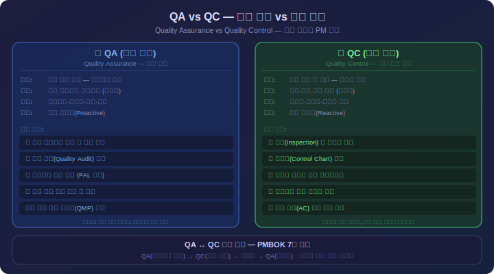
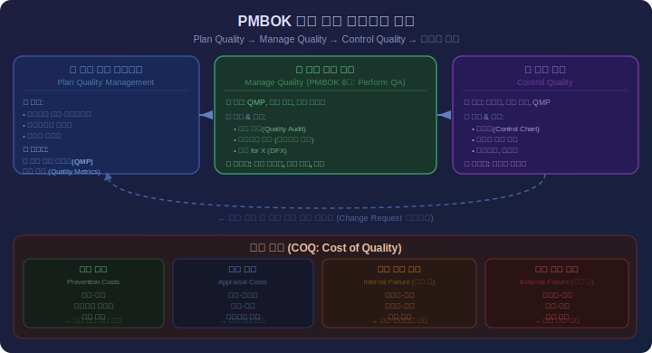
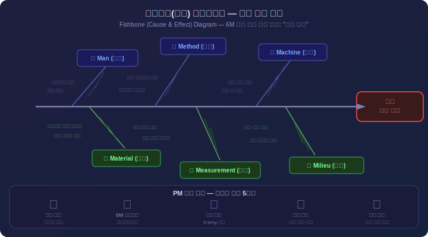

# Day 6: 프로젝트 품질 관리 - 상세 강의안

---

## 🔁 지난 시간 복습 (5분)

> **Day 5 핵심 요점**
> 1. **EVM 3대 핵심 변수**: PV(계획가치) / EV(획득가치) / AC(실제비용)
>    - PV = BAC × 계획 달성률, EV = BAC × 실제 달성률
> 2. **4가지 성과 지수**: SV = EV-PV / CV = EV-AC / SPI = EV÷PV / CPI = EV÷AC
>    - 양수/1.0 이상 = 좋음, 음수/1.0 미만 = 나쁨
> 3. **EAC(완료시 산정)**: 가장 많이 쓰는 공식 = AC + (BAC-EV) ÷ CPI
> 4. **매몰비용의 함정**: 이미 쓴 돈은 미래 의사결정 기준이 될 수 없음

**오늘과의 연결:**  
"지난 5일간 범위·일정·원가라는 3대 제약을 배웠습니다. 오늘은 그 균형점에서 결정되는 **품질 관리**를 배웁니다. QA와 QC의 차이가 오늘의 핵심입니다."

> 💡 **강사 안내:** "CPI가 0.8이면 무슨 의미인가요?" "SPI > 1.0이면 일정이 앞서나요 늦나요?"를 질문하며 EVM 감각 확인

---

## 강의 개요

**Day 6: 프로젝트 품질 관리 (Project Quality Management)**

- 교육 시간: 8시간 (1교시 90분 × 6교시)
- 학습 목표:
  1. 품질과 등급의 차이를 이해하고 설명할 수 있다
  2. 품질 비용(COQ)의 4가지 구성요소를 이해하고 최적화할 수 있다
  3. QA와 QC의 차이를 이해하고 적절히 적용할 수 있다
  4. 7가지 기본 품질 도구를 활용할 수 있다
  5. 지속적 개선 프레임워크(PDCA, 6시그마)를 이해하고 적용할 수 있다

---

## ✅ 오늘 배우고 나면 할 수 있어요

- [ ] 품질 비용(COQ)의 예방·평가·내부실패·외부실패 4가지를 설명할 수 있다
- [ ] QA(품질 보증)와 QC(품질 통제)의 차이를 명확히 구분할 수 있다
- [ ] 파레토 차트와 특성 요인도(피쉬본 다이어그램)를 읽고 활용할 수 있다
- [ ] PDCA 사이클을 설명하고 실제 업무에 적용할 수 있다
- [ ] 6-Sigma의 핵심 개념과 PM 프로젝트에서의 활용 방법을 말할 수 있다

> 수업 후 이 체크리스트를 다시 보며 스스로 확인해보세요.

---

## 1교시: 품질 관리 개요 (1.5시간) <!-- 슬라이드 #1~#2 -->

<div align="center">



*▲ QA(품질 보증) vs QC(품질 통제) 핵심 차이와 PM 역할*

</div>

### 이론 (50분)

#### 1. 품질(Quality)의 정의

**PMBOK® 정의:**  
"고유 특성들이 요구사항을 충족시키는 정도(The degree to which a set of inherent characteristics fulfills requirements)"

**핵심 개념:**
- 품질은 **요구사항 충족 정도**를 의미
- 고객이 원하는 것을 제공하는 능력
- "적합성(Fitness for use)"과 "적합도(Conformance to requirements)"
- 품질 관리는 예방적(Proactive) 접근이 핵심

**품질 관리의 목표:**
1. 고객/이해관계자 만족
2. 결함 예방 및 최소화
3. 지속적 개선(Continuous Improvement)
4. 비용 절감 (재작업 감소)

#### 2. 품질(Quality) vs 등급(Grade)

**품질(Quality):**
- 요구사항 충족 정도
- **낮은 품질은 항상 문제**
- 결함, 오류, 불량률과 관련
- 예: 버그가 많은 소프트웨어 = 낮은 품질 = **문제**

**등급(Grade):**
- 동일한 기능적 용도를 가진 제품의 **범주 또는 등급**
- 낮은 등급이 반드시 문제는 아님
- 기능, 특성의 수준 차이
- 예: 일반 승용차 vs 고급 승용차 = 서로 다른 등급 = **문제 아님**

**중요한 구분:**

| 구분 | 품질 | 등급 | 문제 여부 |
|------|------|------|-----------|
| 낮은품질, 낮은등급 | 불량 | 기본형 | **문제** (품질 불량) |
| 낮은품질, 높은등급 | 불량 | 고급형 | **문제** (품질 불량) |
| 높은품질, 낮은등급 | 우수 | 기본형 | **문제없음** (적절함) |
| 높은품질, 높은등급 | 우수 | 고급형 | **문제없음** (이상적) |

**실무 예시:**
```
예시 1: 모바일 앱
- 높은 품질, 낮은 등급: 기본 기능만 있지만 버그 없음 → OK
- 낮은 품질, 높은 등급: 많은 기능이지만 잦은 크래시 → 문제

예시 2: ERP 시스템
- 높은 품질, 낮은 등급: 중소기업용 ERP, 안정적 동작 → OK
- 낮은 품질, 높은 등급: 대기업용 ERP, 데이터 오류 빈번 → 문제
```

#### 3. 정확도(Accuracy) vs 정밀도(Precision)

**정확도(Accuracy):**
- 측정값이 **참값(True Value)에 가까운 정도**
- "맞는가?"의 문제
- 체계적 오차(Systematic Error)와 관련

**정밀도(Precision):**
- 반복 측정 시 **일관성(Consistency)**
- "재현 가능한가?"의 문제
- 무작위 오차(Random Error)와 관련

**4가지 조합:**

1.  **높은 정확도, 높은 정밀도** ⭐ - 참값에 가깝고 일관성 있음 (이상적)
2. **높은 정확도, 낮은 정밀도** - 평균적으로 참값에 가깝지만 변동 큼
3. **낮은 정확도, 높은 정밀도** - 일관성은 있지만 참값에서 벗어남
4. **낮은 정확도, 낮은 정밀도** ❌ - 참값에서 멀고 일관성도 없음 (최악)

**IT 프로젝트 예시:**
```
시나리오: 웹사이트 응답 시간 목표 = 2.0초

높은 정확도, 높은 정밀도:
측정값: 2.0, 2.1, 1.9, 2.0, 2.1초
평균 2.02초, 표준편차 0.08 → 목표 충족, 안정적

낮은 정확도, 높은 정밀도:
측정값: 3.0, 3.1, 2.9, 3.0, 3.1초
평균 3.02초, 표준편차 0.08 → 안정적이지만 목표 미달성
```

#### 4. 품질 관리의 3 대 프로세스

**A. 품질 관리 계획 수립 (Plan Quality Management)**
- 프로세스 그룹: 기획
- 품질 요구사항 및 기준 식별
- 프로젝트와 인도물이 이를 충족하는 방법 문서화
- 산출물: 품질 관리 계획서, 품질 측정 지표

**B. 품질 관리 (Manage Quality) = 품질 보증(QA)**
- 프로세스 그룹: 실행
- 품질 프로세스를 프로젝트에 적용
- **프로세스(Process) 중심, 예방적(Preventive)** 접근
- "올바른 프로세스를 따르고 있는가?"
- 산출물: 품질 보고서, 변경 요청

**C. 품질 통제 (Control Quality) = QC**
- 프로세스 그룹: 감시 및 통제
- 프로젝트 실행 결과 모니터링 및 기록
- **제품/인도물(Product/Deliverable) 중심, 탐지적(Detective)** 접근
- "인도물이 품질 기준을 충족하는가?"
- 산출물: 검증된 인도물, 결함 리스트

#### 5. QA vs QC 핵심 비교

| 구분 | QA (Manage Quality) | QC (Control Quality) |
|------|---------------------|---------------------|
| **초점** | 프로세스 | 제품/인도물 |
| **접근** | 예방적(Proactive) | 탐지적(Reactive) |
| **목적** | 결함 예방 | 결함 발견 |
| **질문** | 올바른 프로세스를 따르는가? | 인도물이 기준을 충족하는가? |
| **시기** | 프로젝트 전 기간 | 주로 인도물 완성 시 |
| **활동** | 감사, 프로세스 분석, 교육 | 검사, 테스팅, 측정 |

#### 6. 품질 관리 철학의 대가들

**A. W. Edwards Deming (데밍)**

<div align="center">


*▲ 데밍 사이클(PDCA) — 였냠 일본 제조업의 품질 혁명을 이끌었고 TQM(종합적 품질관리)의 기반이 됩니다*

</div>
- **PDCA 사이클 (Plan-Do-Check-Act)** 개발
- "품질은 검사가 아니라 프로세스에서 나온다"
- 14가지 원칙 중 핵심: 통계적 기법으로 프로세스 개선

**B. Joseph Juran (주란)**
- **품질 3부작(Quality Trilogy)**: 계획-통제-개선
- 80/20 법칙을 품질에 적용 (파레토 원칙)
- "품질은 사용 적합성(Fitness for Use)"

**C. Philip Crosby (크로스비)**
- **Zero Defects (무결점운동)**
- "품질은 무료다(Quality is Free)"
- 예방 비용 < 실패 비용

**D. Kaoru Ishikawa (이시카와)**
- **인과도(Cause-and-Effect Diagram)** 개발 (Fishbone)
- **7가지 기본 품질 도구** 보급
- 전사적 품질 관리(TQM)

### 예시 (25분)

#### 예시 1: 품질 vs 등급 - 실무 사례

**시나리오 1: 모바일 앱 개발**

**앱 A: "기본 메모장 앱"**
- 등급: 낮음 (기본 기능만: 텍스트 작성, 저장, 삭제)
- 품질: 높음 (버그 없음, 빠른 응답, 데이터 손실 없음)
- **판정: 문제 없음** ✓
- 평가: 기본형 제품이지만 안정적이고 신뢰할 수 있음

**앱 B: "고급 생산성 앱"**
- 등급: 높음 (메모, 일정, 태그, 검색, 동기화, 협업 등)
- 품질: 낮음 (잦은 크래시, 동기화 실패, 데이터 손실)
- **판정: 심각한 문제** ❌
- 평가: 많은 기능이 있지만 신뢰할 수 없어 사용 불가

#### 예시 2: 정확도 vs 정밀도 - IT 성능 테스트

**프로젝트: 전자상거래 사이트 성능 최적화**
**목표:** 평균 응답 시간 ≤ 1.5초

**서버 A 구성:**
```
10회 측정 결과 (초):
1.48, 1.52, 1.49, 1.51, 1.50, 1.49, 1.51, 1.48, 1.50, 1.52

평균: 1.50초 (목표 충족)
표준편차: 0.016초 (매우 낮음)

평가:
- 정확도: 높음 (평균이 목표 1.5초에 매우 근접)
- 정밀도: 높음 (일관성 있음, 변동 거의 없음)
- 판정: ⭐ 이상적 - 채택 권장
```

**서버 C 구성:**
```
10회 측정 결과 (초):
2.48, 2.52, 2.49, 2.51, 2.50, 2.49, 2.51, 2.48, 2.50, 2.52

평균: 2.50초 (목표 미달성, +1초 지연)
표준편차: 0.016초 (매우 낮음)

평가:
- 정확도: 낮음 (목표보다 1초 느림)
- 정밀도: 높음 (일관성 매우 높음)
- 판정: ⚠ 체계적 편향 - 설정 조정 필요
- 조치: 캐싱, DB 인덱스 최적화로 1초 단축 가능
```

#### 예시 3: QA vs QC - 소프트웨어 개발 프로젝트

**프로젝트:** 온라인 뱅킹 시스템 고도화 (6개월, 8억원)

**QA 활동 (프로세스 중심, 예방적):**

**1개월차: 프로세스 감사**
```
감사 목표: 개발 프로세스가 보안 표준을 준수하는지 확인

점검 항목:
✓ 코드 리뷰 프로세스 존재 여부
✓ 보안 코딩 가이드라인 준수
✓ 정적 코드 분석 도구 사용
✓ 단위 테스트 커버리지 80% 목표

발견 사항:
- 코드 리뷰가 비정기적으로만 수행됨
- 보안 가이드라인 미숙지

개선 조치:
- 모든 Pull Request에 필수 리뷰 정책 도입
- 개발팀 대상 보안 코딩 교육 실시 (2일)
- 자동화된 보안 스캔 도구 CI/CD에 통합

효과:
- 보안 취약점 사전 예방
- 후속 단계에서 재작업 50% 감소
```

**QC 활동 (제품 중심, 탐지적):**

**4개월차: 통합 테스트**
```
테스트 대상: 계좌 이체 기능 모듈

테스트 케이스 실행:
총 120개 테스트 케이스
- 통과: 102개
- 실패: 18개

발견 결함:
1. Critical (3건): 금액 오류, 이중 이체
2. High (7건): 예외 처리 미흡
3. Medium (5건): UI 오류
4. Low (3건): 메시지 오타

조치:
- Critical: 즉시 수정, 재테스트 완료
- High: 1주일 내 수정 계획
```

### 실습 (20분)

#### 실습 1: 품질 vs 등급 분류

**과제:** 다음 5가지 시나리오를 품질(높음/낮음)과 등급(높음/낮음)으로 분류하고, 문제 여부를 판단하세요.

**시나리오:**

1. **기업 내부용 게시판 시스템**
   - 기능: 글 작성, 조회만 가능 (댓글, 첨부파일 없음)
   - 상태: 3년간 장애 0건, 사용자 만족도 높음
   
2. **AI 기반 통합 포털**
   - 기능: 챗봇, 추천, 검색, 개인화, 협업 도구 등
   - 상태: 주 3회 오류, 데이터 불일치, 느린 응답

3. **기본 CRM 시스템**
   - 기능: 고객 정보 관리, 간단한 리포트
   - 상태: 데이터 입력 오류, 리포트 생성 실패

**해설 (강사용):**

| 시나리오 | 등급 | 품질 | 문제 여부 | 설명 |
|---------|------|------|-----------|------|
| 1 | 낮음 | 높음 | ✓ OK | 기본 기능이지만 안정적 |
| 2 | 높음 | 낮음 | ❌ 문제 | 많은 기능이지만 신뢰 불가 |
| 3 | 낮음 | 낮음 | ❌ 문제 | 기능도 적고 품질도 낮음 |

#### 실습 2: QA vs QC 활동 분류

**과제:** 다음 10개 활동을 QA와 QC로 분류하세요.

**활동 목록:**
1. 코드 리뷰 회의 진행
2. 단위 테스트 실행 및 결과 기록
3. 개발 프로세스 감사
4. 완성된 기능 테스팅
5. 코딩 표준 교육 실시
6. 버그 리포트 작성
7. 프로세스 개선 워크샵
8. 성능 부하 테스트

**해설 (강사용):**

**QA (프로세스, 예방):**
1, 3, 5, 7

**QC (제품, 탐지):**
2, 4, 6, 8

### 퀴즈 (15분)

#### 객관식 문제

**Q1. 품질(Quality)과 등급(Grade)에 대한 설명으로 올바른 것은?**

A) 낮은 등급은 항상 문제가 된다  
B) 높은 등급이면 품질도 항상 높다  
C) 낮은 품질은 항상 문제가 된다  
D) 등급과 품질은 항상 비례한다

**정답: C**

**해설:** 낮은 등급은 단순히 기능이 적거나 기본형이라는 의미로, 요구사항에 맞으면 문제가 아닙니다. 낮은 품질은 요구사항을 충족하지 못하므로 항상 문제입니다.

---

**Q2. 다음 중 QA(Manage Quality/품질 보증)의 특징으로 올바른 것은?**

A) 인도물 검사에 초점을 맞춘다  
B) 프로세스 감사를 수행한다  
C) 주로 감시 및 통제 프로세스 그룹에 속한다  
D) 결함을 발견하고 기록하는 것이 목적이다

**정답: B**

**해설:** QA는 프로세스 감사, 프로세스 개선 등 프로세스 중심입니다. 인도물 검사는 QC, QA는 실행 프로세스 그룹에 속합니다.

---

**Q3. 정확도(Accuracy)와 정밀도(Precision)에 대한 설명으로 올바른 것은?**

A) 정확도는 반복 측정의 일관성을 의미한다  
B) 정밀도는 측정값이 참값에 가까운 정도를 의미한다  
C) 높은 정밀도를 가지더라도 낮은 정확도를 가질 수 있다  
D) 정확도와 정밀도는 항상 함께 높거나 낮다

**정답: C**

**해설:** 일관성은 정밀도, 참값에 가까움은 정확도의 정의입니다. 일관성 있게 틀릴 수 있으므로 (체계적 편향) C가 정답입니다.

#### 주관식 문제

**Q4. 품질(Quality)과 등급(Grade)의 차이를 IT 프로젝트 예시를 들어 설명하시오. (10점)**

**모범답안:**
품질은 요구사항 충족 정도를 의미하며, 낮은 품질은 항상 문제가 됩니다. 반면 등급은 기능적 용도의 범주를 의미하며, 낮은 등급이 반드시 문제는 아닙니다.

예를 들어, 기본형 모바일 앱(낮은 등급)이더라도 버그가 없고 안정적이면 높은 품질이므로 문제없습니다. 반대로 많은 기능을 제공하는 고급 ERP 시스템(높은 등급)이라도 데이터 오류가 빈번하면 낮은 품질이므로 심각한 문제입니다.

---

**Q5. QA(품질 보증)와 QC(품질 통제)의 차이를 5가지 관점에서 비교하시오. (15점)**

**모범답안:**

| 관점 | QA | QC |
|------|----|----|
| 초점 | 프로세스 | 제품/인도물 |
| 접근 | 예방적 | 탐지적 |
| 목적 | 결함 예방 | 결함 발견 |
| 활동 | 감사, 교육, 개선 | 검사, 테스팅, 측정 |
| 프로세스 그룹 | 실행 | 감시 및 통제 |

---

## 2교시: 품질 관리 계획 수립 (1.5시간) <!-- 슬라이드 #3~#4 -->

<div align="center">



*▲ PMBOK 품질 관리 3단계 프로세스와 품질 비용(COQ) 구조*

</div>

### 이론 (50분)

#### 1. 품질 비용(COQ: Cost of Quality)

**정의:** 프로젝트 수명주기 동안 품질 관련 활동에 투입되는 모든 비용

**핵심 개념:**
- 품질은 "공짜(Free)"가 아닙니다
- 하지만 **예방 투자는 실패 비용보다 훨씬 저렴**
- COQ 최소화가 목표 (제로가 아님)

#### 2. COQ의 2대 범주

**A. 적합 비용(Cost of Conformance)**  
프로젝트가 요구사항을 충족하도록 만드는 데 드는 비용

**1) 예방 비용(Prevention Cost)**
- 결함이 발생하지 않도록 사전에 투자하는 비용
- **가장 효과적인 투자**
- 장기적으로 COQ를 크게 절감

**항목:**
- 품질 교육 및 훈련 (코딩 표준, 테스트 기법, 보안 개발)
- 프로세스 문서화 (개발 프로세스, 가이드라인, 체크리스트)
- 품질 도구 도입 (정적 분석, 자동화 테스트, CI/CD)
- 요구사항 분석 (명확한 정의, 프로토타이핑, 검증)
- 설계 리뷰 (아키텍처, 코드 리뷰, 보안 검토)

**2) 평가 비용(Appraisal Cost)**
- 제품이 요구사항을 충족하는지 평가하고 측정하는 비용
- 결함을 조기에 발견

**항목:**
- 테스팅 활동 (단위, 통합, 시스템, 인수)
- 검사 및 감사 (코드 인스펙션, 문서 검토, 프로세스 감사)
- 테스트 환경 (서버, 데이터, 도구)
- 품질 측정 (메트릭 수집, 대시보드, 결함 추적)

**B. 부적합 비용(Cost of Nonconformance)**  
요구사항을 충족하지 못해 발생하는 비용

**1) 내부 실패 비용(Internal Failure Cost)**
- 고객에게 인도하기 전에 발견된 결함 처리 비용
- 외부 실패보다는 저렴

**항목:**
- 재작업 (코드 수정, 테스트 재수행, 문서 수정)
- 결함 수정 (버그 분석, 디버깅, 패치)
- 일정 지연 (추가 개발, 테스트 연장, 출시 연기)
- 폐기 (사용 불가 코드, 잘못된 설계 재작업)

**2) 외부 실패 비용(External Failure Cost)**
- 고객에게 인도한 후에 발견된 결함 처리 비용
- **가장 비용이 높음**
- 고객 신뢰 손상, 브랜드 이미지 타격

**항목:**
- 보증 및 수리 (무상 수정, 패치 배포, 긴급 대응)
- 고객 불만 처리 (컴플레인, 보상, 환불)
- 신뢰 상실 (매출 감소, 고객 이탈)
- 법적 비용 (소송, 과징금, 배상)

#### 3. COQ 최적화 전략

**핵심 원리:** 예방 비용 ↑ → 실패 비용 ↓↓ → 총 COQ ↓

**비용 관계:**
```
예방 : 평가 : 내부실패 : 외부실패 = 1 : 3 : 10 : 100

예: 예방에 100만원 투자 → 실패 1억원 절감 가능
    외부 실패 1건 = 예방 100건 분량
```

**최적화 방법:**
1. 예방에 집중 투자 (교육, 도구, 프로세스)
2. 조기 평가 (Shift-Left Testing)
3. 근본 원인 제거 (반복 결함 분석)
4. 지속적 모니터링 (COQ 메트릭 추적)

#### 4. 품질 관리 계획서 구성요소

**A. 품질 기준 및 측정 지표**

**품질 측정 지표:**

1. **결함 관련**
   - 결함 밀도: 결함 수 / KLOC (목표: < 0.5)
   - 결함 탈출률: 고객 발견 / 전체 (목표: < 5%)

2. **테스트 관련**
   - 코드 커버리지: 목표 80% 이상
   - 테스트 통과율: 목표 95% 이상

3. **프로세스 관련**
   - 코드 리뷰 커버리지: 목표 100%
   - 재작업 비율: 목표 < 15%

4. **성능 관련**
   - 응답 시간: 평균 < 1초, 95th < 3초
   - 가용률: 99.9% (연간 다운타임 < 8.76시간)

5. **보안 관련**
   - 취약점: Critical 0, High 0
   - 수정 시간: Critical 즉시, High 3일 이내

**B. 품질 활동 및 역할**

| 역할 | 책임 |
|------|------|
| PM | 품질 계획 승인, 자원 배분 |
| 품질 매니저 | 품질 기준 정의, 감사 수행 |
| 개발 팀장 | 코드 품질 책임, 리뷰 감독 |
| 개발자 | 코딩 표준 준수, 단위 테스트 작성 |
| QA 엔지니어 | 테스트 설계 및 실행, 결함 추적 |

**C. 품질 도구 및 기법**

**도구:**
- 버전 관리: Git, GitHub/GitLab
- 정적 분석: SonarQube, ESLint
- 자동화 테스트: JUnit, Selenium, Jest
- 성능 테스트: JMeter, Gatling
- 보안 스캔: OWASP ZAP, Snyk
- CI/CD: Jenkins, GitLab CI, GitHub Actions
- 결함 추적: Jira, Bugzilla

### 예시 (25분)

#### 예시 1: COQ 분석 - 전자정부 프로젝트

**프로젝트:** 국민 서비스 포털 구축 (예산 30억, 12개월)

**시나리오 A: 예방 투자 부족**

```
적합 비용:
예방: 1,500만원 (0.5%)
평가: 1.66억원 (5.5%)
→ 적합 비용: 1.81억원 (6.0%)

부적합 비용:
내부 실패: 10.5억원 (35%) - 재작업, 설계 결함, 일정 지연
외부 실패: 20억원 (67%) - 긴급 패치, 서비스 중단, 보안 사고

총 COQ: 32.31억원 (107.7% - 예산 초과!)
```

**시나리오 B: 예방 중심 투자**

```
적합 비용:
예방: 2.5억원 (8.3%) - 교육, 도구, 프로세스
평가: 4.42억원 (14.7%) - QA팀, 테스트 환경, 감사
→ 적합 비용: 6.92억원 (23.1%)

부적합 비용:
내부 실패: 8,000만원 (2.7%) - 조기 발견으로 감소
외부 실패: 2,000만원 (0.7%) - 예방 성공

총 COQ: 7.92억원 (26.4%)
```

**비교:**

| 구분 | 시나리오 A | 시나리오 B | 차이 |
|------|----------|-----------|------|
| 예방 | 1,500만 | 2.5억 | +2.35억 |
| 평가 | 1.66억 | 4.42억 | +2.76억 |
| 내부 실패 | 10.5억 | 0.8억 | -9.7억 ✓ |
| 외부 실패 | 20억 | 0.2억 | -19.8억 ✓ |
| **총 COQ** | **32.31억** | **7.92억** | **-24.39억** |

**ROI:** (19.28 / 5.11) × 100% = 377%

### 실습 (20분)

#### 실습 1: COQ 계산 및 최적화

**과제:** 다음 프로젝트의 COQ를 분석하고 개선안을 제시하세요.

**프로젝트:** 전자상거래 플랫폼 고도화 (예산 5억, 6개월)

**현재 비용:**
- 예방: 700만원 (교육, 워크샵)
- 평가: 2,900만원 (QA 1명, 도구)
- 내부 실패: 1.5억원 (재작업, 통합 오류)
- 외부 실패: 1.5억원 (긴급 패치, 고객 보상)

**과제:**
1. 각 비용 범주의 비율 계산
2. 문제점 지적
3. 개선 계획 수립
4. 개선 후 예상 COQ 계산
5. ROI 계산

**해설:**

1. **현재 비율:** 예방 1.4% (너무 낮음), 실패 60% (너무 높음)

2. **문제점:** 예방 투자 부족, QA 인력 부족, 자동화 없음

3. **개선 계획:**
   - 예방 추가: 자동화 도구 3,000만, 교육 1,000만 등 → 7,700만 (15.4%)
   - 평가 강화: QA 1명 추가 등 → 6,300만 (12.6%)

4. **개선 후:**
   - 내부 실패: 6,000만 (60% 감소)
   - 외부 실패: 3,000만 (80% 감소)
   - 총 COQ: 2.3억 (46%)

5. **ROI:**
   - 추가 투자: 1.04억
   - 절감: 0.87억 + 외부 효과 1.2억 = 2.07억
   - ROI: 99% (단기), 장기 > 200%

### 퀴즈 (15분)

#### 객관식

**Q1. COQ의 4가지 구성 요소가 아닌 것은?**
A) 예방 비용 B) 평가 비용 C) 내부 실패 비용 D) 관리 비용

**정답: D**

**Q2. 다음 중 "예방 비용"에 해당하는 것은?**
A) 버그 수정 시간 B) 코딩 표준 교육 C) 통합 테스트 수행 D) 고객 불만 처리

**정답: B**

**Q3. "외부 실패 비용"의 특징은?**
A) 가장 저렴한 비용 B) 고객 인도 전 발생 C) 브랜드 이미지 손상 포함 D) 예방 비용보다 저렴

**정답: C**

#### 주관식

**Q4. COQ 최적화의 핵심 원리를 설명하고, 예방 비용 투자가 총 COQ를 줄이는 이유를 설명하시오. (10점)**

**모범답안:**
핵심 원리는 "예방 증가 → 실패 대폭 감소 → 총 COQ 감소"입니다. 예방:내부:외부 = 1:10:100의 관계로, 예방 100만원이 외부 실패 1억원을 절감합니다. 예방은 한 번 투자로 지속 효과를 발휘하지만 실패 비용은 매번 발생합니다.

---

## 3교시: 품질 통제 및 통계적 기법 (1.5시간) <!-- 슬라이드 #5~#6 -->

### 이론 (50분)

#### 1. 품질 통제 (Quality Control) vs 품질 보증 (Quality Assurance)

| 구분 | Quality Assurance (QA) | Quality Control (QC) |
|------|----------------------|---------------------|
| 목적 | 프로세스 적합성 검증 | 산출물 결함 발견/수정 |
| 시점 | 작업 중 (예방) | 작업 후 (검사) |
| 도구 | 감사, 프로세스 분석 | 검사, 테스트, 관리도 |
| PMI 분류 | 프로세스 지향 | 산출물 지향 |
| 책임 | PM + QA팀 | 개발팀 + 테스트팀 |

**핵심 원칙:**
- QA가 QC보다 비용 효율적 (예방 > 검사)
- QC로 발견된 교훈은 QA 프로세스 개선에 활용

#### 2. 검사 (Inspection)

**목적:** 작업 결과물이 기준을 충족하는지 확인

**검사 유형:**

**A. 공식 검사 (Formal Review)**

```
단계: 
1. 계획 → 2. 사전 검토 → 3. 검사 회의 → 4. 재작업 → 5. 확인

IT 적용 - 코드 인스펙션:
역할:
- 작성자(Author): 코드 작성자
- 검토자(Reviewer): 독립적 검토 2명
- 조정자(Moderator): 프로세스 관리

체크리스트:
□ 기능 요구사항 모두 구현됨
□ 에러 처리 로직 구현됨
□ SQL 인젝션, XSS 취약점 없음
□ 단위 테스트 커버리지 80% 이상
□ 코딩 컨벤션 준수
□ 주석 / 문서화 충분
```

**B. 비공식 검사 (Informal Review)**
- 동료 검토 (Peer Review)
- 짝 프로그래밍(Pair Programming)
- 빠른 피드백 사이클

**검사의 경제적 효과:**
```
결함 수정 비용:
- 요구사항 단계에서 발견: 1x
- 설계: 3-6x
- 개발: 10x
- 테스트: 15-20x
- 배포 후: 100x

→ 코드 리뷰 1시간 = 배포 후 결함 수정 수십 시간 절약
```

#### 3. 통계적 표본추출 (Statistical Sampling)

**목적:** 전수 검사가 불가능하거나 비효율적일 때 표본으로 전체 품질 추론

**IT 적용:**
- 수만 건의 테스트 케이스 중 표본 선정
- 로그 분석에서 샘플링
- 사용자 만족도 조사

**표본 유형:**

| 유형 | 설명 | IT 예시 |
|-----|------|--------|
| 단순 무작위 표본 | 모든 항목이 동일 확률 | 랜덤 로그 100건 추출 |
| 층화 표본 | 그룹별 비율 유지 | 기능별로 비율 테스트 |
| 체계적 표본 | 일정 간격 순서대로 | 100번째마다 검사 |

**표본 크기 원칙:**
- 크면 클수록 정확 (비용↑)
- 위험이 높으면 더 많이 (금융/의료)
- 균형: 비용 vs 정확성

#### 4. 허용 대비 실제 측정 (Attribute vs Variable Sampling)

**속성 표본추출 (Attribute):**
- 합격/불합격 기준
- "이 기능이 동작하는가?" (Yes/No)
- 더 단순, 비용 낮음

**변수 표본추출 (Variable):**
- 연속 측정값
- "응답 시간이 1.2초이다"
- 더 정교, 통계 분석 가능

#### 5. 검증된 인도물 (Verified Deliverables)

**프로세스 흐름:**
```
개발 완료
    ↓ 품질 통제 수행 (검사, 테스트)
검증된 인도물 생성
    ↓ 범위 확인 프로세스 수행 (고객 검수)
검수 완료된 인도물
    ↓
프로젝트 종료 및 인수
```

**IT 품질 게이트 체크리스트:**
```
기능 품질:
□ 모든 기능 요구사항 구현 (트레이서빌리티 매트릭스)
□ 예외/오류 케이스 처리
□ 통합 테스트 완료

비기능 품질:
□ 응답 시간: 평균 <2초, 최대 <5초
□ 가용성: 99.5% 이상
□ 보안: OWASP Top 10 취약점 없음

문서:
□ 사용자 매뉴얼 완성
□ API 명세서 완성
□ 운영 가이드 완성
```

#### 6. 정밀도 vs 정확도

| 구분 | 의미 | IT 비유 |
|------|------|--------|
| 정밀도 (Precision) | 반복 시 결과의 일관성 | 응답시간이 항상 1.8초 (변동 없음) |
| 정확도 (Accuracy) | 목표값에 얼마나 가까운가 | 응답시간 목표 2초 중 1.8초 = 정확 |

**예시:**
```
목표: 응답 시간 < 2초

A시스템: 1.2, 1.3, 1.2, 1.2, 1.3초 → 정밀+정확 ✓
B시스템: 0.5, 3.1, 1.8, 4.2, 0.9초 → 부정밀, 부정확 ✗
C시스템: 2.8, 2.9, 2.8, 2.8초 → 정밀하지만 기준 초과 ✗
```

### 예시 (25분)

#### 예시 1: 코드 인스펙션의 효과

**상황:** 팀이 코드 리뷰 없이 개발 후 QA에서 대량 버그 발견

```
Before (코드 리뷰 없음):
- 각 스프린트 마감 시 QA 전달
- 평균 결함 30건/스프린트
- QA에서 발견 비율: 90%
- QA 기간: 2주

After (코드 리뷰 도입):
- PR 단계에서 2명 리뷰 필수
- 리뷰 시간: 1인 1시간/PR
- 평균 결함 5건/스프린트 (QA 전달 시)
- QA 기간: 3일로 단축

비용 분석:
리뷰 비용: 10명 × 1시간 = 10인시/스프린트
QA 절감: (30-5) × 1.5시간 = 37.5인시 절감
ROI: 37.5 / 10 = 375% 수익
```

#### 예시 2: 표본 검사 설계

**상황:** 정부 발주 시스템, 1,200개 기능 중 표본 검사 설계

```
접근법: 위험 기반 표본 추출

기능 그룹:
- 고위험 (핵심 업무): 180개 → 전수 검사 (100%)
- 중위험 (일반 기능): 600개 → 30% 검사 = 180개
- 저위험 (화면 표시): 420개 → 10% 검사 = 42개

총 검사 대상: 180 + 180 + 42 = 402개 (34%)
대비 전수: 1,200개 검사 66% 절감

발견된 결함 비율로 전체 품질 추론
결함 5% 미만 → 합격 (최종 검수 기준)
```

### 실습 (20분)

#### 실습 1: 검사 체크리스트 작성

**과제:** 다음 시스템에 대한 인수 테스트 체크리스트를 작성하세요.

**시스템:** 온라인 채용 시스템 (기업 HR)

**포함 항목:**
1. 기능 요구사항 (5가지 이상)
2. 비기능 요구사항 (성능, 보안, UI)
3. 데이터 품질 기준
4. 합격/불합격 판정 기준

### 퀴즈 (15분)

**Q1. 검증된 인도물(Verified Deliverables)은 어느 프로세스의 결과물인가?**

A) 품질 보증 (QA)  
B) 품질 통제 (QC)  
C) 요구사항 수집  
D) 범위 확인

**정답: B** (QC 프로세스의 주요 출력 → 이후 범위 확인 프로세스에서 고객 검수)

---

**Q2. 정밀도(Precision)와 정확도(Accuracy)의 차이로 옳은 것은?**

A) 정밀도: 목표값에 가까운 정도 / 정확도: 반복 측정 시 일관성  
B) 정밀도: 반복 측정 시 일관성 / 정확도: 목표값에 가까운 정도  
C) 두 용어는 동일한 의미  
D) 정밀도는 QA, 정확도는 QC에서 사용

**정답: B**

---

## 4교시: 7가지 기본 품질 도구 (1.5시간) <!-- 슬라이드 #5 -->

<div align="center">



*▲ 이시카와(어골) 다이어그램 — 6M 범주 근본 원인 분석*

</div>

### 이론 (50분)

#### 1. 7가지 기본 품질 도구 개요

**배경:** 일본의 이시카와 가오루 박사가 현장 작업자도 사용할 수 있는 품질 도구를 체계화함

**7가지 도구 목록:**
1. 특성 요인도 (Fishbone / Ishikawa)
2. 흐름도 (Flowchart)
3. 체크시트 (Check Sheet)
4. 히스토그램 (Histogram)
5. 파레토 차트 (Pareto Chart)
6. 산포도 (Scatter Diagram)
7. 관리도 (Control Chart)

#### 2. 특성 요인도 (Fishbone Diagram)

**목적:** 문제(결과)의 근본 원인을 체계적으로 분석

**구조:**
- 오른쪽: 문제(효과)
- 왼쪽: 큰 뼈 = 원인 카테고리
- 작은 뼈 = 세부 원인

**IT 프로젝트 6M 카테고리:**

| 카테고리 | 한글 | IT 적용 예 |
|---------|------|----------|
| Man | 인력 | 개발자 실력 부족, 의사소통 오류 |
| Machine | 장비 | 서버 메모리 부족, 개발 환경 불안정 |
| Method | 방법 | 코드 리뷰 없음, 테스트 부족 |
| Material | 자료 | 요구사항 불명확, 사양서 부재 |
| Measurement | 측정 | 품질 기준 없음, 테스트 케이스 부족 |
| Environment | 환경 | 개발/운영 환경 불일치 |

**IT 예시: "프로덕션 배포 후 버그 다수 발생" 분석**

```
문제: 배포 후 치명적 버그 발생

원인 분석:
Man: 개발자 야근/번아웃, 팀 간 인수인계 부족
Machine: 로컬 개발 환경이 운영 환경과 다름
Method: 단위 테스트 없이 통합 테스트만
Material: 요구사항이 모호 (엣지 케이스 누락)
Measurement: 코드 커버리지 기준 없음
Environment: 스테이징 서버가 운영과 SW 버전 다름

근본 원인(진짜 문제): 스테이징 환경이 운영과 다름
→ 해결책: 환경 동기화 (Docker/K8S 활용)
```

#### 3. 흐름도 (Flowchart)

**목적:** 프로세스를 시각화하여 낭비, 병목, 오류 발견

**IT 적용:**
- 버그 처리 프로세스 시각화
- CI/CD 파이프라인 흐름 분석
- 소프트웨어 사용자 흐름(UX Flow)

**예시: 버그 처리 흐름도 (요약)**
```
[버그 발견] → [버그 등록] → (우선순위 Critical?)
→ 예: [즉시 핫픽스 팀 배정] → [4시간 내 수정]
→ 아니오: [스프린트 백로그 추가] → [다음 플래닝 시 스케줄링]
→ [수정] → [QA 테스트] → [통과?] → 예: [배포] / 아니오: [재수정]
```

**개선 포인트:** 흐름도에서 불필요한 승인 단계, 중복 확인, 대기 시간 식별 → 제거

#### 4. 체크시트 (Check Sheet)

**목적:** 데이터를 구조적으로 수집하여 패턴 파악

**IT 프로젝트 활용:**

```
결함 유형별 발생 건수 체크시트

기간: 2025.01 ~ 2025.03 (스프린트 1~6)

결함 유형     | 1 | 2 | 3 | 4 | 5 | 6 | 합계
-------------|---|---|---|---|---|---|------
UI 오류      |||||||||| | ||| | |||| | ||||| | 25
기능 오류    ||||||||||||||||||||||| | |||||| | 58
성능 문제    ||| | | || | || | || | 12
보안 취약점  | | | | | | | 1  | 4
기타        || | || | | | | | 8

합계        12 |14 |17 |20 |19 |25 | 107
```

**분석:** 기능 오류 54%, 시간이 갈수록 증가 추세 → 품질 조기 경보

#### 5. 히스토그램 (Histogram)

**목적:** 데이터 분포를 시각화 → 프로세스 안정성 파악

**IT 적용: 응답 시간 분포 분석**

```
웹 서비스 응답 시간 분포 (만 건)

0~0.5초:  ████████  8,000건 (80%)  ← 정상 범위
0.5~1초:  ████      1,500건 (15%)
1~2초:    █         400건   (4%)
2~5초:    ▌         80건    (0.9%)  ← 요주의
5초 이상:  ▌         20건    (0.1%) ← 치명적

분석: 분포가 정규분포에서 오른쪽으로 치우침
→ 일부 요청에서 심한 지연 발생
→ 원인 분석 필요 (DB 쿼리, 외부 API 타임아웃)
```

#### 6. 파레토 차트 (Pareto Chart)

**원리:** 80:20 법칙 - 전체 문제의 80%는 20%의 원인에서 비롯

**구성:**
- 막대 그래프: 빈도/개수 (내림차순)
- 꺾은선: 누적 %

**IT 예시: 버그 원인 파레토 분석**

```
버그 원인    | 건수 | 누적% |
-----------|-----|------|
요구사항 불명확 | 42 | 39%  | ← 핵심 원인
테스트 부실   | 31 | 68%  | ← 핵심 원인
코드 오류     | 18 | 84%  |
환경 불일치   | 10 | 94%  |
기타         |  6 |100%  |
합계: 107건

→ 요구사항 불명확 + 테스트 부실 = 73건 = 68%
→ 이 2가지만 해결해도 버그 70% 감소
```

#### 7. 산포도 (Scatter Diagram)

**목적:** 두 변수 사이의 상관관계 분석

**IT 예시:**
```
코드 복잡도(x) vs 버그 수(y) 상관관계

분석 결과: 양의 상관관계 (r = 0.85)
→ 복잡도가 높을수록 버그 많음
→ 해결책: 복잡한 함수 리팩토링, 모듈화

다른 IT 예시:
- 코드 리뷰 시간 vs 버그 감소율: 음의 상관
- 테스트 케이스 수 vs 결함 탈출률: 음의 상관
- 팀 규모 vs 생산성: 비선형 (큰 팀 오히려 감소)
```

#### 8. 관리도 (Control Chart)

**목적:** 프로세스가 통계적 관리 상태(안정)에 있는지 모니터링

**핵심 용어:**

| 용어 | 의미 |
|------|------|
| UCL | 상한 관리 한계 (평균+3σ) |
| LCL | 하한 관리 한계 (평균-3σ) |
| 관리 한계 | 불량 제품 기준선이 아님! 프로세스 변동 범위 |
| 규격 한계 | 고객이 정한 허용 범위 |
| 이상 원인 | UCL/LCL 초과 = 특별 원인 발생 (즉시 조사) |
| 우연 원인 | 관리 한계 내 정상 변동 |

**Rule of Seven (연속 7점 규칙):**
- UCL/LCL을 벗어나지 않더라도
- 중심선 한쪽에 연속 7개 점 → 비정상 시그널 (트렌드)
- 조치 필요!

**IT 예시: 일별 결함 수 관리도**
```
일별 버그 보고 건수 (30일 관찰)

UCL = 15건/일
평균 = 8건/일
LCL = 1건/일

발견:
- 20일차: 18건 → UCL 초과! 즉시 원인 조사
  (배포일 + 중요 기능 변경 있었음)
- 22~28일: 연속 7일간 평균 이상
  → Rule of 7 위반, 트렌드 상승 시그널
  → 원인: 신규 모듈 불안정 → 안정화 조치
```

**좋은 프로세스 = UCL/LCL 내에서 무작위 변동**

### 예시 (25분)

#### 예시 1: Fishbone 분석 전체 실습

**문제:** "온라인 주문 처리 시스템 응답 시간 급증"

```
특성 요인도 전체 작성:

Man:
- 운영팀 DB 쿼리 최적화 지식 부족
- 모니터링 담당자 미지정

Machine:
- DB 서버 사양 2년째 미증설
- 인덱스 미생성

Method:
- 성능 테스트 없이 배포
- 쿼리 리뷰 프로세스 없음

Material:
- 성능 목표 문서 없음 (기준 불명확)

Measurement:
- 응답 시간 알람 임계치 설정 안 됨

Environment:
- 스테이징 서버 성능이 운영의 10% 수준

근본 원인 1: DB 서버 사양 부족
근본 원인 2: 성능 테스트 미실시
→ 해결: DB 스케일업 + CI/CD에 성능 테스트 통합
```

#### 예시 2: 파레토 차트로 품질 개선 우선순위 결정

**상황:** 6개월간 고객 불만 데이터 분석

```
불만 유형      | 건수 | 비율  | 누적%
-------------|-----|------|------
로딩 속도 느림  | 240 | 45%  | 45%  ← 우선 해결
자주 오류/멈춤  | 160 | 30%  | 75%  ← 우선 해결
기능 못 찾겠음  |  60 | 11%  | 86%
디자인 불편     |  40 |  7%  | 94%
기타           |  33 |  6%  |100%

파레토 80% 지점: 로딩 속도 + 오류/멈춤 = 75%
→ 이 2가지 집중 개선 → 75% 고객 불만 해소
→ 개선 우선순위: CDN 적용 + 서버 안정화

결과 후: 불만 75% 감소 (530건 → 133건)
```

### 실습 (20분)

#### 실습 1: 관리도 해석

**과제:** 다음 일별 결함 데이터를 기반으로 관리도를 그리고, 이상 징후를 찾으세요.

**데이터 (일별 버그 수):**
```
일: 1  2  3  4  5  6  7  8  9  10
건: 5  7  6  8  9  18 7  6  8   9
→ 6일차: UCL(15) 초과 → 이상 원인 (배포일 확인)

일: 11 12 13 14 15 16 17 18 19 20
건: 11 12 13 14 13 12 14 15 13 16
→ 11-20일: 모두 평균(8) 이상 → Rule of Seven 위반
→ 상승 추세 → 신규 기능 불안정 의심
```

**결론:** 6일차 이상 + 11일 이후 트렌드 → 품질 특별 조사 필요

### 퀴즈 (15분)

**Q1. 파레토 차트를 사용하는 주요 목적은?**

A) 두 변수의 상관관계를 분석하기 위해  
B) 전체 문제의 80%를 유발하는 20%의 핵심 원인을 파악하기 위해  
C) 프로세스가 통계적 관리 상태인지 모니터링하기 위해  
D) 데이터의 분포 형태를 시각화하기 위해

**정답: B**

---

**Q2. Control Chart(관리도)에서 "Rule of Seven"이 의미하는 것은?**

A) 관리 한계선 밖에 7개 이상의 점이 있음  
B) 중심선 한쪽에 연속 7개의 점이 있어 추세(트렌드) 이상을 나타냄  
C) 하루에 버그가 7개 이상 발생  
D) 7가지 기본 도구를 모두 사용해야 한다는 원칙

**정답: B**

---

## 5교시: 지속적 개선 프레임워크 (1.5시간) <!-- 슬라이드 #6 -->

### 이론 (50분)

#### 1. PDCA 사이클 (Plan-Do-Check-Act)

**개요:** 데밍(Deming)이 제안한 품질 개선의 기본 사이클

<div align="center">


*▲ PDCA(Deming Cycle) — Plan(보라)→Do(청록)→Check(금)→Act(빨강) 순환. QA는 P+D 단계 예방활동, QC는 C 단계 검출활동*

</div>

**4단계:**

**Plan (계획):**
- 문제 정의 및 목표 설정
- 개선 방법 계획
- 측정 기준 설정

**Do (실행):**
- 소규모 시험적 적용 (Pilot)
- 데이터 수집

**Check (검토):**
- 결과 측정 및 분석
- 기대 vs 실제 비교
- 원인 파악

**Act (처치):**
- 성공 시: 전체 적용 (표준화)
- 실패 시: 다시 Plan으로

**IT 스프린트와 PDCA 비교:**

| PDCA | Scrum |
|------|-------|
| Plan | 스프린트 플래닝 |
| Do | 스프린트 실행 |
| Check | 스프린트 리뷰 |
| Act | 회고(Retrospective) → 다음 스프린트 개선 |

<div align="center">


*▲ 애자일 스프린트 주기는 PDCA의 취지를 모두 담고 있습니다. 최상의 품질은 단솼 1회가 아니라 지속적 반복에서 나옵니다*

</div>

**IT 예시:**
```
Sprint 1 PDCA:
Plan: 응답시간 3초 → 2초 이하 목표, 캐싱 도입
Do: Redis 캐시 적용 (7일 작업)
Check: 응답시간 2.8초 → 1.5초 (50% 개선)
Act: 성공 → 전체 서비스 확대 적용 표준화
     추가 개선: DB 인덱스도 적용 예정
```

#### 2. 6시그마 (Six Sigma) - DMAIC

**목적:** 결함률을 극도로 낮추는 체계적 방법론

**6시그마 수준:**
```
시그마 수준 → 백만건당 결함수 (DPMO)
2σ → 308,537 결함/백만건  (31% 불량)
3σ → 66,807 결함/백만건
4σ → 6,210 결함/백만건
5σ → 233 결함/백만건
6σ → 3.4 결함/백만건   (99.9997% 양호)
```

**산업별 요구 수준:**
- 항공 안전, 의료: 6σ
- 일반 소프트웨어: 3-4σ
- 고품질 소프트웨어: 5σ

**DMAIC 5단계:**

**D - Define (정의):**
- 문제와 목표 정의
- 고객의 CTQ(Critical To Quality) 파악
- 프로젝트 차터 작성

**M - Measure (측정):**
- 현재 프로세스 성과 측정
- 데이터 수집 계획
- 현재 기준선(Baseline) 설정

**A - Analyze (분석):**
- 근본 원인 파악 (Fishbone, 5-Why)
- 데이터 통계 분석
- 가설 검증

**I - Improve (개선):**
- 해결책 개발 및 시험
- 최적 솔루션 선정
- Pilot 실행

**C - Control (통제):**
- 관리도로 지속 모니터링
- 표준화 및 문서화
- 담당자 교육

**IT DMAIC 예시:**

```
문제: 온라인 결제 실패율 8% (목표: 1% 이하)

D: 결제 실패로 고객 이탈 월 3,000건 (손실 1.5억)
   목표: 실패율 8% → 1% 이하 (90% 감소)

M: 실패 유형 분류
   - 네트워크 타임아웃: 45%
   - 카드 인증 실패: 30%
   - API 오류: 20%
   - 기타: 5%
   현재 DPMO: 80,000 (약 3σ)

A: 근본 원인
   - 타임아웃: 카드사 API 응답 지연 (평균 4초)
   - 인증 실패: 3D Secure 흐름 오류
   - API 오류: 에러 핸들링 미흡

I: 해결책
   - 타임아웃: 재시도 로직 + 타임아웃 8초로 증가
   - 3D Secure: UX 개선 + 에러 메시지 명확화
   - API 오류: 에러 핸들링 강화

C: 결제 실패율 대시보드 설정 → 1% 초과 시 알람
   표준화: 결제 모듈 재시도 로직 가이드 문서화

결과: 실패율 8% → 0.7% (목표 달성!)
```

#### 3. CMMI (Capability Maturity Model Integration)

**목적:** 소프트웨어 개발 조직의 프로세스 성숙도 평가/개선

**5단계:**

| 레벨 | 이름 | 특징 | IT 상황 |
|------|------|------|--------|
| 1 | Initial(초기) | 임시방편, 영웅 의존 | "담당자 없으면 못 함" |
| 2 | Managed(관리) | 프로젝트 수준 관리 | "프로젝트마다 계획 있음" |
| 3 | Defined(정의) | 조직 표준 프로세스 | "전사 개발 프로세스 있음" |
| 4 | Quantitatively Managed | 데이터로 관리 | "지표로 예측 가능" |
| 5 | Optimizing(최적화) | 지속적 혁신 | "자동 감지 → 즉시 개선" |

**각 레벨 IT 예시:**

```
레벨 1 (Initial):
- 배포마다 작업 방식이 다름
- 버그 처리: 담당자 기억에 의존
- 성공 = 영웅의 야근

레벨 2 (Managed):
- 프로젝트별 계획서 작성
- Jira로 이슈 추적
- 기본적인 버전 관리

레벨 3 (Defined):
- 전사 개발 가이드라인
- 통일된 CI/CD 파이프라인
- 코드 리뷰 필수 프로세스

레벨 4 (Quantitatively Managed):
- 스프린트별 결함 밀도 측정
- 예측: "이 기능 개발 시 결함 X건 예상"
- SLA 실적 데이터 기반 계약

레벨 5 (Optimizing):
- AI 기반 코드 품질 자동 검사
- 결함 자동 감지 → 자동 PR 생성
- 업계 베스트 프랙티스 자동 통합
```

**국내 기업 현황:**
- 대부분 레벨 2-3
- 대형 IT 기업: 레벨 3-4
- 레벨 5: 글로벌 최고 수준 기업만

#### 4. Lean(린) 방법론

**원칙:** 도요타 생산 방식 → 소프트웨어 적용

**7가지 낭비 (TIMWOOD) - IT 적용:**

| 낭비 유형 | 원어 | IT 예시 |
|---------|------|--------|
| T | Transport | 산출물이 팀 간 전달에 많은 시간 |
| I | Inventory | 완료 안 된 작업 백로그 쌓임 |
| M | Motion | 여러 시스템 전환(JIRA→Confluence→Slack) |
| W | Waiting | QA 대기, 승인 대기 |
| O | Overproduction | 안 쓰는 기능 미리 개발 |
| O | Over-processing | 요건 이상의 문서화 |
| D | Defects | 버그 수정에 소요 시간 |

**Kaizen (개선):**
- 작은 점진적 개선의 지속
- 현장 담당자가 개선안 제안
- IT: 스프린트 회고에서 개선 사항 즉시 적용

**IT Lean 사례:**
```
문제: PR(풀 리퀘스트) 리뷰 대기 시간 평균 3일

분석:
- 리뷰어가 바빠서 확인 안 함 (대기=낭비)
- PR 크기가 너무 큼 (1개 PR = 50+ 파일)

Lean 개선:
1. PR 크기 제한: 최대 20파일/PR
2. 리뷰어 WIP 제한: 동시 3개 이상 리뷰 불가
3. 알림 자동화: 24시간 미검토 → 팀 채널 알림

결과: 평균 3일 → 0.5일로 단축 (83% 감소)
```

### 예시 (25분)

#### 예시 1: PDCA로 코드 품질 개선

**단계별 실제 적용:**

```
배경: 스프린트마다 버그 40건, QA 기간 2주

PLAN (스프린트 1 전):
문제: 버그 40건 → 목표: 15건 이하
방법: TDD(테스트 주도 개발) 도입 시범

DO (스프린트 1):
- 신규 기능 3개에 TDD 적용
- 테스트 작성 시간: 개발 시간 30% 추가

CHECK (스프린트 1 후):
- 해당 3기능 버그: 1건 (vs 평균 5건)
- QA 기간: 3일 (vs 평균 14일)
- 테스트 커버리지: 85%

ACT:
성공 판단 → 전체 팀으로 확대
다음 스프린트부터 모든 신규 기능 TDD 의무화
TDD 교육 1일 실시
```

#### 예시 2: CMMI 레벨 진단

**상황:** IT 스타트업 진단

```
현재 상태 진단:
□ 계획서 작성? → Jira로 스프린트 계획 있음 (레벨 2 충족)
□ 전사 표준 프로세스? → 팀별로 다름 (레벨 3 미충족)
□ 데이터 기반 관리? → 일부만 (레벨 4 미충족)

진단: 레벨 2 (일부 레벨 3 요소 존재)

레벨 3으로 가는 단계:
1. 개발 프로세스 표준화 문서 작성
2. 코드 리뷰 프로세스 전사 통일
3. 배포 프로세스 체크리스트 표준화
4. 신입 온보딩 가이드 작성

예상 기간: 6개월
효과: 팀 이동 시 생산성 손실 80% 감소
```

### 실습 (20분)

#### 실습 1: DMAIC 적용

**과제:** 다음 문제에 DMAIC를 적용하세요.

**문제:** 모바일 앱 사용자 중 30%가 회원가입 완료 전 이탈

**작성 항목:**
1. D: 목표 (이탈률 목표 및 비즈니스 임팩트)
2. M: 현재 이탈 단계별 데이터 수집 계획
3. A: 가능한 근본 원인 3가지
4. I: 개선 방안 2가지
5. C: 지속 모니터링 방법

### 퀴즈 (15분)

**Q1. CMMI 레벨 3(정의)의 특징으로 맞는 것은?**

A) 프로젝트별로 개별 계획이 있음  
B) 데이터와 통계로 프로세스를 예측 가능하게 관리  
C) 조직 전체의 표준 프로세스가 정의·준수됨  
D) AI가 자동으로 품질을 개선

**정답: C** (레벨 3 = 조직 표준화, 레벨 4 = 데이터 관리, 레벨 5 = 자동 최적화)

---

**Q2. Lean의 7가지 낭비 중 IT 프로젝트에서 "완료되지 않은 작업 백로그 증가"는?**

A) 과잉생산 (Overproduction)  
B) 재고 (Inventory)  
C) 대기 (Waiting)  
D) 이동 (Motion)

**정답: B** (Inventory = WIP, 미완료 작업 쌓임)

---

## 6교시: 종합 실습 - 품질 분석 및 계획 수립 (1.5시간) <!-- 슬라이드 #7 -->

### 시나리오 (10분)

**프로젝트:** 물류 스타트업 배송 추적 앱 v2.0 런칭 후 품질 문제 발생

**현황:**
- 1주 후 고객 불만 급증
- 앱스토어 평점: 4.2 → 2.8 (폭락)
- 주요 불만:
  - 배송 위치 안 갱신 (45%)
  - 앱 강제종료 (30%)
  - 알림 미발송 (15%)
  - UI 느림 (10%)

### 실습 1: 파레토 분석 (15분)

**과제:** 위 불만 데이터로 파레토 차트를 분석하고 우선순위를 결정하세요.

**분석 데이터:**
```
전체 불만 500건

원인별 분류:
위치 안 갱신: 225건 (45%) → 누적 45%
앱 강제종료: 150건 (30%) → 누적 75%
알림 미발송:  75건 (15%) → 누적 90%
UI 느림:     50건 (10%) → 누적 100%

파레토 80% 지점: 위치 안 갱신 + 강제종료 = 75%

→ 이 2가지 집중 해결: 375건 해소 (75%)
→ 1순위: 위치 갱신 로직 수정
→ 2순위: 강제종료 원인 (메모리 누수?) 수정
```

### 실습 2: Fishbone 분석 (20분)

**과제:** "앱 강제종료" 문제에 대한 특성 요인도를 작성하세요.

**팀별 작성 (6M 기준):**

```
예시 답안:

Man: 개발자가 메모리 관리 Best Practice 미숙지
Machine: 구형 안드로이드 기기에서 특히 발생
Method: 스트레스 테스트 없이 배포
Material: 외부 지도 API 메모리 누수 문서 미확인
Measurement: 메모리 사용량 모니터링 없음
Environment: 개발 환경 고사양 기기 (문제 재현 어려움)

근본 원인: 외부 지도 API 메모리 누수 + 스트레스 테스트 부재
```

### 실습 3: 관리도 해석 (15분)

**과제:** 출시 후 30일간 일별 강제종료 건수를 해석하세요.

**데이터:**
```
UCL = 50건, 평균 = 20건, LCL = 0건

일: 1   2   3   4   5   6   7   8   9  10
건: 10  55  45  30  25  28  22  18  15  12
→ 2일차: UCL 초과 (55건) → 이상 원인! 즉시 조사

일: 11  12  13  14  15  16  17  18  19  20
건: 10   9   8  10   9   7   8   9   8  10
→ 모두 평균 이하 → 12-20일 연속 9점 평균 이하
→ Rule of Seven: 이상 (개선 조치 효과로 하강 추세)

결론:
- 2일차: 갑자기 악화 (긴급 패치 필요)
- 패치 후 개선 추세 (관리도로 확인)
```

### 실습 4: 품질 개선 계획서 작성 (25분)

**과제:** 위 분석을 바탕으로 품질 개선 액션 플랜을 작성하세요.

**양식:**

```
[품질 개선 계획서]

1. 문제 요약
- 현상: 앱 강제종료율 높음 (불만 30%)
- 영향: 앱스토어 평점 2.8, 사용자 이탈

2. 우선순위 조치 (이번 주 내)
□ 위치 갱신 수정 (핫픽스): 담당 XX, 기한 D+3
□ 메모리 누수 긴급 패치: 담당 YY, 기한 D+2

3. 중기 조치 (이번 달 내)
□ 스트레스 테스트 프로세스 도입
□ 외부 API 메모리 검증 체크리스트

4. 예방 조치 (지속)
□ 배포 전 관리도 기반 임계치 알람 설정
□ 매 스프린트 파레토 분석 품질 회의

5. 성공 기준
- 앱 강제종료율 < 0.5%/일
- 앱스토어 평점 > 4.0 (4주 내)
```

### 팀별 발표 및 피드백 (10분)

**발표 내용:**
1. 파레토 기반 우선순위 2가지
2. 근본 원인 분석 결과
3. 개선 계획 핵심 사항

**강사 피드백 포인트:**
- 파레토 80%선을 기준으로 우선순위 명확히 하는가?
- Fishbone이 단순 나열이 아닌 구조적인가?
- 개선 계획이 측정 가능한 기준을 포함하는가?

---

## 📝 Day 06 핵심 정리

| 개념 | 핵심 내용 |
|------|---------|
| 품질 관리 3프로세스 | 품질 계획 → 품질 보증(QA) → 품질 통제(QC) |
| COQ | 적합 비용(예방+검사) + 부적합비용(내부+외부 실패) |
| Waterfall vs Agile | 사전 계획 vs 지속적 개선 |
| Fishbone | 문제의 근본 원인을 6M으로 구조 분석 |
| 파레토 80:20 | 20% 원인 → 80% 문제, 우선순위 결정 |
| 관리도 UCL/LCL | 프로세스 안정성 모니터링 |
| Rule of Seven | 연속 7점 → 비정상 시그널 |
| QA vs QC | 프로세스 보증 vs 산출물 검사 |
| 정밀도 vs 정확도 | 일관성 vs 목표 근접도 |
| PDCA | 계획-실행-검토-개선 반복 사이클 |
| DMAIC | 6시그마의 정의-측정-분석-개선-통제 |
| CMMI | 프로세스 성숙도 5단계 (1: 초기 ~ 5: 최적화) |
| Lean 낭비 | TIMWOOD 7가지 낭비 제거 |

---

## 🏆 Day 06 최종 퀴즈

**Q1.** COQ(Cost of Quality)에서 예방 비용 투자가 총 품질 비용을 낮추는 이유를 설명하시오. (5점)

**정답:** 예방:내부실패:외부실패 = 1:10:100의 관계로, 초기 예방 투자 1원이 외부 실패 비용 100원을 절감합니다. 예방 비용은 한 번 투자로 지속 효과를 발휘하며, 실패 비용은 반복 발생합니다.

---

**Q2.** 다음 데이터에서 파레토 80% 이내의 핵심 버그 원인을 찾으시오. (10점)

| 원인 | 건수 |
|------|-----|
| 요구사항 불명확 | 50 |
| 테스트 부족 | 35 |
| 코딩 오류 | 20 |
| 환경 문제 | 10 |
| 기타 | 5 |

**정답:**
- 요구사항 불명확: 41.7%, 누적 41.7%
- 테스트 부족: 29.2%, 누적 70.8%
- 코딩 오류: 16.7%, 누적 87.5% ← 80% 초과
- **핵심 원인 (80% 이내): 요구사항 불명확 + 테스트 부족 (70.8%)**

---

**Q3.** PDCA와 DMAIC의 차이를 설명하시오. (10점)

**정답:**
- **PDCA**: 간단하고 빠른 반복 개선 사이클, 모든 업무 개선에 적용 가능, 각 사이클을 계속 반복
- **DMAIC**: 6시그마의 구조적 문제 해결 방법론, 데이터와 통계 기법 사용, 결함률 극도로 낮추는 데 집중, PDCA보다 더 깊은 분석과 통제 단계 포함

---

**Q4.** Rule of Seven이 의미하는 바와 왜 비정상 신호로 보는지 설명하시오. (5점)

**정답:** 관리도에서 연속 7개의 점이 중심선(평균)의 같은 쪽에 위치하는 경우입니다. 통계적으로 정상이면 평균 위아래에 무작위로 분포해야 하는데, 연속 7개가 한쪽에 있을 확률은 1/2^7 = 0.78%로 매우 낮습니다. 이는 프로세스에 특별한 변화(추세)가 시작되었다는 신호로 즉각 원인 조사가 필요합니다.
