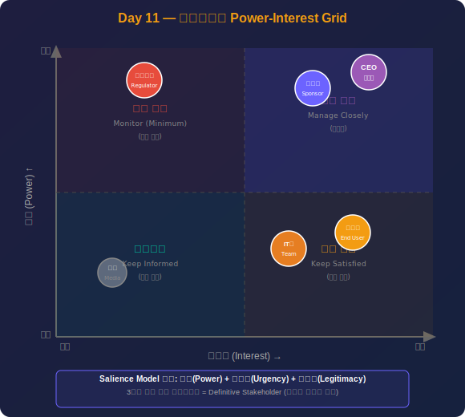

# Day 11: 이해관계자 관리 - 상세 강의안

---

## 🔁 지난 시간 복습 (5분)

> **Day 10 핵심 요점**
> 1. **계약 유형 3가지**: FFP(확정 고정가격, 공급사 리스크↑) / CPFF(원가+수수료, 구매자 리스크↑) / T&M(시간+재료비, 중간)
> 2. **계약 유형 선택 기준**: 요구사항이 명확할수록 FFP, 불명확할수록 T&M
> 3. **Make or Buy 분석**: 직접 만들 때 vs 외부에서 살 때 비용·역량·시간·리스크 비교
> 4. **RFP 프로세스**: 공고 → 제안서 접수 → 평가 → 협상 → 계약 체결

**오늘과의 연결:**  
"조달은 결국 외부 이해관계자(공급사)와의 관계 관리입니다. 오늘은 공급사를 포함한 모든 **이해관계자** — 스폰서, 고객, 경영진, 팀원, 규제기관 — 을 어떻게 파악하고 관리하는지 배웁니다. 이것이 PM 파트의 마지막 강의입니다."

> 💡 **강사 안내:** "FFP와 T&M 중 어떤 계약이 구매자에게 유리한가요? 왜인가요?"를 질문하며 복습

---

## ✅ 오늘 배우고 나면 할 수 있어요

- [ ] 권력-관심도 매트릭스 4분면별 전략(긴밀 관리·만족 유지·정보 제공·모니터링)을 설명할 수 있다
- [ ] 이해관계자 참여 수준 5단계(인식→저항→중립→지지→주도)를 설명할 수 있다
- [ ] 이해관계자 등록부의 핵심 정보 항목을 나열할 수 있다
- [ ] 저항하는 이해관계자를 설득하는 전략을 3가지 이상 말할 수 있다
- [ ] 프로젝트 초기에 이해관계자를 분석해야 하는 이유를 설명할 수 있다

> 수업 후 이 체크리스트를 다시 보며 스스로 확인해보세요.

---

## 1교시: 이해관계자 관리 개요 (1.5시간) <!-- 슬라이드 #1~#2 -->
 <!-- 슬라이드 #1~#2 -->
### 이론 (50분)

#### 1. 이해관계자(Stakeholder)의 정의

**PMBOK® 정의:**  
"프로젝트에 영향을 주거나, 프로젝트로부터 영향을 받거나, 영향을 받는다고 인식하는 개인, 그룹, 조직"

#### 2. 이해관계자의 범위와 유형

**내부 이해관계자 (Internal Stakeholders)**
- **스폰서(Sponsor):** 프로젝트 자금 제공, 최종 의사결정권자
  - 역할: 프로젝트 헌장 승인, 주요 변경 승인, 정치적 지원
  - 중요도: 최상위 의사결정자, 프로젝트 성패 좌우
  - 예: CEO, 사업부장, 투자 위원회
  
- **프로젝트 관리자(PM):** 프로젝트 총괄 책임
  - 역할: 계획 수립, 팀 관리, 진척 모니터링, 이슈 해결
  - 중요도: 프로젝트 성공의 핵심 인물
  
- **프로젝트 팀:** 실제 작업 수행
  - 역할: 설계, 개발, 테스트, 문서화  
  - 구성: 핵심 팀원, 확장 팀원, 계약 인력
  
- **PMO (Project Management Office):** 프로젝트 관리 표준 및 지원
  - 역할: 방법론 제공, PM 코칭, 포트폴리오 관리
  - 중요도: 조직 차원의 프로젝트 성공률 향상
  
- **경영진:** 전략적 방향 제시
  - 역할: 우선순위 결정, 자원 배분, 포트폴리오 승인
  - 예: C-Level 임원, 이사회
  
- **기능 관리자(Functional Manager):** 부서별 자원 제공
  - 역할: 팀원 배정, 기술적 지침, 성과 평가
  - 갈등: PM과 자원 경쟁 (매트릭스 조직에서 빈번)
  
- **운영/유지보수 팀:** 프로젝트 인수 및 운영
  - 역할: 인수 기준 협의, 인계 준비
  - 중요도: 프로젝트 산출물의 장기 성공 담당

**외부 이해관계자 (External Stakeholders)**
- **고객(Customer):** 프로젝트 비용 지불
  - B2B: 발주 기업의 담당자
  - B2C: 최종 소비자 대표
  
- **최종 사용자(End User):** 실제 산출물 사용
  - 역할: 요구사항 제공, UAT 수행
  - 중요도: 사용성과 만족도의 최종 판단자
  - 주의: 고객 ≠ 사용자인 경우 많음
  
- **공급업체(Supplier/Vendor):** 제품/서비스 제공
  - 역할: 하드웨어, 소프트웨어, 용역 공급
  - 관리: 계약, SLA, 품질 관리
  
- **규제 기관(Regulatory Body):** 법규 준수 요구
  - 예: 금융감독원, 개인정보보호위원회, 식약처
  - 영향: 준수하지 않으면 프로젝트 중단 가능
  
- **경쟁사(Competitors):** 간접적 이해관계자
  - 영향: 시장 선점, 기술 동향
  
- **지역사회(Community):** 프로젝트 영향 받는 공동체
  - 예: 건설 프로젝트 인근 주민, 환경단체

#### 3. 이해관계자 관리의 중요성

**통계와 연구 결과:**
- PMI 연구: 프로젝트 실패의 **70%는 이해관계자 관리 실패**
- Standish Group: 성공 프로젝트의 공통점 1위 = "경영진 지원과 사용자 참여"
- 이해관계자 관리에 1달러 투자 시 6달러 절감 효과

**이해관계자 관리 성공의 효과:**
1. **요구사항 명확화:** 사용자 니즈 정확히 파악 → 재작업 감소
2. **지원 확보:** 스폰서의 적극적 지원 → 자원과 권한 획득
3. **저항 최소화:** 조기 참여 유도 → 변화 저항 감소
4. **리스크 경감:** 잠재적 반대자 사전 식별 → 대응 전략 수립
5. **커뮤니케이션 효율:** 맞춤형 소통 → 오해와 갈등 감소

**이해관계자 관리 실패의 결과:**
- 프로젝트 취소 또는 중단
- 산출물 사용률 저조
- 비즈니스 가치 미실현
- 조직 내 신뢰 손실
- PM 경력에 부정적 영향

#### 4. 이해관계자 관리의 4개 프로세스

**13.1 이해관계자 식별 (Identify Stakeholders)**
- **프로세스 그룹:** 착수
- **목적:** 프로젝트 이해관계자를 조기에 식별하고 분석
- **주요 입력물:** 프로젝트 헌장, 사업 문서, 조직도
- **도구/기법:** 
  - 전문가 판단
  - 데이터 수집 (브레인스토밍, 인터뷰)
  - 데이터 분석 (이해관계자 분석, 문서 분석)
  - 데이터 표현 (이해관계자 매핑/표현)
- **주요 출력물:** **이해관계자 등록부 (Stakeholder Register)**
- **핵심:** 가능한 조기에 식별, 프로젝트 전 기간 지속 업데이트

**13.2 이해관계자 참여 계획 수립 (Plan Stakeholder Engagement)**
- **프로세스 그룹:** 기획
- **목적:** 이해관계자 참여를 위한 전략과 계획 수립
- **주요 입력물:** 프로젝트 헌장, PMPP, 이해관계자 등록부
- **도구/기법:**
  - 전문가 판단
  - 데이터 수집 (벤치마킹)
  - 데이터 분석 (가정/제약 분석, 근본 원인 분석)
  - 의사결정 (우선순위 설정 매트릭스)
  - 데이터 표현 (권력-관심도 매트릭스, 현저성 모델)
  - 회의
- **주요 출력물:** **이해관계자 참여 계획서 (Stakeholder Engagement Plan)**
- **핵심:** 각 이해관계자에 맞춤형 참여 전략 수립

**13.3 이해관계자 참여 관리 (Manage Stakeholder Engagement)**
- **프로세스 그룹:** 실행
- **목적:** 이해관계자와 소통하고 참여를 촉진
- **주요 입력물:** PMPP, 의사소통 계획서, 변경 로그, 이슈 로그
- **도구/기법:**
  - 전문가 판단
  - 의사소통 기술 (피드백, 프레젠테이션)
  - 대인관계 기술 (능동적 경청, 문화 인식, 리더십, 네트워킹, 정치적 인식)
  - 근본 원인 분석
  - 회의
- **주요 출력물:** 변경 요청, 프로젝트 문서 업데이트
- **핵심:** 적극적 참여 유도, 저항 최소화, 기대 관리

**13.4 이해관계자 참여 감시 (Monitor Stakeholder Engagement)**
- **프로세스 그룹:** 감시 및 통제
- **목적:** 이해관계자 관계를 감시하고 전략 조정
- **주요 입력물:** PMPP, 이슈 로그, 작업 성과 데이터, 프로젝트 문서
- **도구/기법:**
  - 데이터 분석 (대안 분석, 근본 원인 분석, 이해관계자 분석)
  - 의사결정
  - 데이터 표현
  - 의사소통 기술
  - 대인관계 기술
  - 회의
- **주요 출력물:** 작업 성과 정보, 변경 요청, 프로젝트 문서 업데이트
- **핵심:** 참여도 변화 추적, 전략 실효성 평가

#### 5. 이해관계자 관리 계획서 (Stakeholder Engagement Plan)

**필수 구성 요소:**

1. **이해관계자 현황 파악**
   - 식별된 이해관계자 목록
   - 각자의 역할과 책임
   - 권력과 영향력 수준
   
2. **참여 수준 정의**
   - 현재 참여 수준
   - 희망하는 참여 수준
   - 수준 간 갭(Gap) 분석
   
3. **의사소통 전략**
   - 이해관계자별 선호 채널
   - 정보 제공 빈도와 형식
   - 에스컬레이션 경로
   
4. **참여 촉진 방법**
   - 회의 및 워크숍 계획
   - 정기 보고 방식
   - 이슈 해결 프로세스
   
5. **리스크 및 대응 전략**
   - 잠재적 저항 예측
   - 저항 완화 전략
   - 비상 계획

#### 6. 이해관계자 등록부 (Stakeholder Register)

**필수 항목:**

1. **식별 정보**
   - 이름, 직위, 조직/부서
   - 연락처 (이메일, 전화번호)
   - 위치 (본사, 지사, 외부)
   
2. **분류 정보**
   - 내부 vs 외부
   - 역할 (스폰서, 고객, 팀원 등)
   - 권력 수준 (높음/중간/낮음)
   - 관심도 수준 (높음/중간/낮음)
   - 영향력 수준 (높음/중간/낮음)
   
3. **참여 정보**
   - 현재 참여 태도 (지지/중립/저항)
   - 주요 관심사와 기대사항
   - 요구사항 및 니즈
   
4. **의사소통 정보**
   - 선호하는 의사소통 방식
   - 보고 빈도 (일간/주간/월간)
   - 주요 전달 정보 유형

**작성 시 주의사항:**
- 민감 정보 포함 시 접근 권한 통제 필요
- 프로젝트 진행에 따라 지속 업데이트
- 신규 이해관계자 발견 시 즉시 추가
- 이해관계자 상태 변화(이직, 승진) 반영

### 예시 (25분)

#### 예시 1: 이해관계자 식별의 중요성 - ERP 구축 프로젝트 실패 사례

**프로젝트 배경:**
- **프로젝트:** 중견 제조기업의 차세대 ERP 시스템 구축
- **예산:** 30억원
- **기간:** 18개월
- **목표:** 노후화된 ERP를 최신 시스템으로 전환

**초기 이해관계자 식별 (착수 단계):**
PM은 다음 이해관계자만 식별:
- 스폰서: CFO (재무 담당 임원)
- 프로젝트 팀: PM 1명, 분석가 3명, 개발자 8명
- 주요 사용자: 재무팀장, 구매팀장, 생산팀장
- 벤더: ERP 패키지 공급업체

**누락된 중요 이해관계자:**
- **IT 보안팀:** 프로젝트 시작 6개월 후 발견
- **노동조합:** 프로젝트 시작 3개월 후 발견  
- **창고 현장 작업자:** 실제 최종 사용자이나 초기 미식별
- **법무팀:** 개인정보 관련 규제 이슈 미고려

**문제 발생 시나리오:**

**3개월차 - 노동조합 문제:**
- 상황: 새 시스템이 작업 모니터링 강화한다는 소문 확산
- 노조 반응: "직원 감시 시스템"이라 반발, 도입 저지 움직임
- 결과: 프로젝트 2개월 중단, 노조와 협상
- 영향: 일정 지연, 팀 사기 저하
- 교훈: 노조를 조기에 식별하고 투명하게 소통했어야 함

**6개월차 - 보안팀 이슈:**
- 상황: 시스템 통합 테스트 중 보안팀이 보안 정책 위반 지적
- 보안팀: "외부 접근 통제 미흡, 암호화 기준 미달"
- 결과: 보안 요구사항 추가 개발 필요
- 영향: 추가 비용 5억원, 일정 3개월 연장
- 교훈: 착수 단계에 보안팀을 식별하고 요구사항 수렴 필요

**10개월차 - 현장 작업자 저항:**
- 상황: UAT 시작했으나 창고 작업자들이 신규 시스템 사용 거부
- 작업자: "터치스크린이 작업 속도 느리게 함, 기존 바코드 스캐너가 더 빠름"
- 결과: UI 재설계 필요, 교육 프로그램 추가 개발
- 영향: 추가 비용 2억원, 일정 2개월 연장
- 교훈: 실제 최종 사용자를 조기에 참여시켜 프로토타입 검증 필요

**12개월차 - 법무/컴플라이언스 이슈:**
- 상황: 개인정보 저장 방식이 개인정보보호법 위반 소지
- 법무팀: "데이터 저장 위치, 보관 기간, 동의 절차 미흡"
- 결과: 아키텍처 일부 재설계 필요
- 영향: 추가 비용 1억원, 일정 1개월 연장
- 교훈: 컴플라이언스 전문가를 착수 단계부터 참여시켜야 함

**최종 결과:**
- 기간: 18개월 계획 → 26개월 완료 (+44% 지연)
- 예산: 30억원 → 38억원 (+27% 초과)
- 사용자 만족도: 5점 만점에 2.8점 (낮음)
- 원인 분석: 이해관계자 식별 미흡이 가장 큰 원인
- CFO 평가: "PM의 이해관계자 관리 실패"

**교훈:**
1. **착수 단계에 충분한 시간을 투자하여 모든 이해관계자 식별**
2. **조직도만 보지 말고 실제 영향 받는 사람 파악 (현장 인터뷰)**
3. **기능 부서별 대표자뿐 아니라 실무자급 사용자도 포함**
4. **법무, 보안, 컴플라이언스 등 지원 부서 절대 누락 금지**
5. **프로젝트 진행 중에도 지속적으로 신규 이해관계자 식별**

#### 예시 2: 성공적인 이해관계자 관리 - 공공기관 디지털 전환 프로젝트

**프로젝트 배경:**
- **프로젝트:** 정부 기관의 민원 처리 시스템 클라우드 전환
- **예산:** 50억원
- **기간:** 24개월
- **목표:** 레거시 시스템을 클라우드 기반 시스템으로 전환, 국민 편의 향상

**단계 1: 체계적 이해관계자 식별 (1개월 소요)**

PM은 다음 방법으로 이해관계자 식별:

**방법 1: 조직도 분석**
- 기관장, 각 부서장, 팀장급 식별
- 결과: 35명 식별

**방법 2: 프로세스 맵 분석**
- 민원 처리 프로세스에 관여하는 모든 역할 파악
- 결과: 접수팀(10명), 심사팀(15명), 승인팀(5명) 식별

**방법 3: 현장 인터뷰**
- 각 부서 방문하여 실무자 인터뷰
- "이 시스템이 바뀌면 누가 영향을 받습니까?" 질문
- 결과: 아르바이트 민원 상담원(20명), 외부 협력 기관(3개) 식별

**방법 4: 외부 이해관계자 식별**
- 규제 기관: 행정안전부, 개인정보보호위원회
- 시민단체: 정보공개청구 활동 단체 2개
- 언론: IT 전문 기자 3명 (공공 프로젝트 관심 높음)
- 일반 국민: 민원인 대표 5명 (시민 참여단 구성)

**최종 식별 결과: 총 93명/조직의 이해관계자 식별**

**단계 2: 이해관계자 등록부 작성**

PM은 93명 모두에 대해 상세 정보 기록:

**주요 이해관계자 예시:**

| 이름 | 직위 | 조직 | 권력 | 관심도 | 태도 | 주요 관심사 | 의사소통 방식 |
|------|------|------|------|--------|------|-------------|---------------|
| 김기관 | 기관장 | 본부 | 높음 | 중간 | 지지 | 프로젝트 성공 여부, 언론 보도 | 월간 대면 보고 |
| 이팀장 | 접수팀장 | 민원부 | 중간 | 높음 | 중립→저항 우려 | 업무 변화, 직원 적응 | 주간 회의 |
| 박국장 | 정보화 담당 | IT부 | 높음 | 높음 | 강력 지지 | 기술 안정성, 보안 | 수시 협의 |
| 최실무 | 민원 상담원 | 콜센터 | 낮음 | 높음 | 저항 | 사용 편의성, 교육 | 월간 워크숍 |
| 정기자 | 기자 | 일간지 | 중간 | 높음 | 중립 | 프로젝트 진행 상황, 이슈 | 분기별 보도자료 |

**단계 3: 맞춤형 참여 전략 수립**

**전략 1: 기관장 (높은 권력, 중간 관심) - 만족 유지**
- 월 1회 30분 대면 보고
- 주요 성과와 이슈만 요약 (1페이지)
- 긍정적 뉴스 우선 공유, 문제는 해결 방안과 함께 보고
- 외부 벤치마킹 사례 정기 공유 (유사 기관 성공 사례)

**전략 2: 접수팀장 (중간 권력, 높은 관심) - 조기 참여 유도**
- 설계 단계부터 워킹그룹 참여 요청
- 프로토타입 최우선 검토 및 피드백 수렴
- 우려 사항 정기 청취 및 대응 방안 공유
- 팀원들의 변화 관리 지원 (교육, 매뉴얼)

**전략 3: 정보화 담당 국장 (높은 권력, 높은 관심) - 긴밀 관리**
- 주 2회 기술 회의 (1시간)
- 아키텍처, 보안, 성능 관련 의사결정 공동 참여
- 기술 리스크는 즉시 공유 및 협의
- 기술 자문 역할 부여 (전문성 인정)

**전략 4: 민원 상담원 (낮음 권력, 높은 관심) - 적극 정보 제공**
- 월 1회 2시간 워크숍 개최
- 신규 시스템 체험 기회 제공 (사전 파일럿)
- 불편 사항 즉시 수렴 및 개선
- 사용자 대표 5명을 "챔피언"으로 지정하여 의견 수렴 창구 역할

**전략 5: 언론 (중간 권력, 높은 관심) - 투명한 소통**
- 분기별 보도자료 배포
- 주요 마일스톤 달성 시 기자 간담회
- 문제 발생 시 숨기지 않고 대응 방안과 함께 공개
- 긍정적 스토리 발굴 (국민 편의 향상 사례)

**단계 4: 지속적 참여 관리 및 감시**

**6개월차 평가:**
- 접수팀장 태도 변화: 중립 → 지지로 전환
  - 이유: 조기 참여로 본인 의견이 반영됨을 확인
- 민원 상담원 만족도: 5점 만점에 4.2점
  - 이유: 정기 워크숍으로 불안감 해소

**12개월차 이슈 발생:**
- 상황: 언론에서 "민원 시스템 개편 지연" 오보 게재
- 대응: 즉시 정정 보도자료 배포 + 기자 개별 연락
- 결과: 익일 정정 보도, 실제 일정은 계획 대비 정상

**18개월차 신규 이해관계자 발견:**
- 상황: 타 부처에서 벤치마킹 요청
- 대응: 이해관계자 등록부에 추가, 월간 진행 상황 공유
- 결과: 타 부처의 지지 확보, 정부 내 평판 상승

**24개월차 프로젝트 종료:**
- 기간: 24개월 계획 대로 완료 (지연 없음)
- 예산: 50억원 계획 대비 49.2억원 (1.6% 절감)
- 사용자 만족도: 5점 만점에 4.6점 (높음)
- 언론 평가: "모범적인 공공 디지털 전환 사례"

**성공 요인 분석:**
1. **초기 1개월을 투자하여 93명 이해관계자 체계적 식별**
2. **권력-관심도에 따른 맞춤형 전략 수립 및 실행**
3. **현장 사용자(민원 상담원)의 조기 참여와 지속적 소통**
4. **투명한 정보 공개로 언론과 신뢰 관계 구축**
5. **이해관계자 참여도를 매월 평가하고 전략 조정**

#### 예시 3: 4개 프로세스의 실제 적용 - 스타트업의 신제품 출시

**프로젝트:** 헬스케어 스타트업의 건강관리 모바일 앱 출시
**기간:** 6개월 | **예산:** 3억원

**프로세스 1: 이해관계자 식별 (착수 단계, 1주)**

PM이 식별한 이해관계자:
- 내부: CEO, CTO, 디자이너 2명, 개발자 4명, 마케터 1명
- 외부: 투자자 3명, 베타 테스터 50명, 제휴 병원 2곳, 앱스토어 담당자
- 규제: 식약처 의료기기 담당관
- 총 65명/조직

**프로세스 2: 참여 계획 수립 (기획 단계, 1주)**

**주요 전략:**
- CEO (높은 권력, 높은 관심): 주 1회 30분 보고, 주요 의사결정 참여
- 투자자 (높은 권력, 중간 관심): 월 1회 이메일 보고, 분기별 대면 미팅
- 제휴 병원 (중간 권력, 높은 관심): 파일럿 프로그램 운영, 피드백 수렴
- 베타 테스터 (낮은 권력, 높은 관심): 온라인 커뮤니티 운영, 주간 설문
- 식약처 (높은 권력, 낮은 관심): 규제 요구사항 사전 검토, 인증 타임라인 협의

**프로세스 3: 참여 관리 (실행 단계, 4개월)**

**2개월차 이벤트:**
- 베타 테스터 100명 모집, 2주간 테스트
- 피드백: "운동 기록이 불편", "UI가 복잡"
- 대응: UI 2주 만에 개선, 재테스트 → 만족도 상승

**3개월차 이벤트:**
- 제휴 병원에서 파일럿 운영
- 의사 피드백: "환자 데이터 연동 필요"
- 대응: 병원 시스템 연동 기능 추가 개발 (범위 변경)
- 투자자 보고: "병원 연동으로 경쟁력 강화" 긍정 평가

**4개월차 이벤트:**
- 식약처 사전 검토 요청
- 피드백: "의료기기 인증 필요 없음" (일반 건강관리 앱으로 분류)
- 결과: 인증 절차 생략 → 출시 일정 1개월 단축

**프로세스 4: 참여 감시 (감시/통제 단계, 전 기간)**

**월간 참여도 평가:**

| 이해관계자 | 1개월 | 2개월 | 3개월 | 4개월 | 5개월 |
|-----------|-------|-------|-------|-------|-------|
| CEO | 지지 | 지지 | 지지 | 지지 | 주도 |
| 투자자 | 중립 | 지지 | 지지 | 지지 | 지지 |
| 제휴 병원 | 중립 | 지지 | 주도 | 주도 | 주도 |
| 베타 테스터 | 중립 | 저항 | 지지 | 지지 | 지지 |
| 식약처 | 불인지 | 중립 | 지지 | 지지 | 중립 |

**참여도 변화 분석:**
- 베타 테스터: 2개월차 저항(UI 불편) → 3개월차 지지(개선 확인)
  - 조치: UI 신속 개선이 효과적
- 제휴 병원: 3개월차부터 주도로 전환
  - 조치: 병원을 적극적 홍보 파트너로 활용

**최종 결과:**
- 일정: 6개월 계획 → 5개월 완료 (1개월 단축, 규제 이슈 조기 해결)
- 예산: 3억원 예산 → 2.8억원 집행 (7% 절감)
- 출시 후 1개월 다운로드: 5만회 (목표 3만회 초과 달성)
- 투자자 만족도: 5점 만점에 4.8점 → 시리즈 A 투자 유치 성공

**성공 요인:**
- 베타 테스터 피드백 신속 반영으로 제품-시장 적합성 확보
- 규제 기관과의 조기 협의로 인증 절차 최적화
- 제휴 병원을 옹호자(Champion)로 전환하여 마케팅 효과

### 실습 (20분)

**시나리오:**
귀하는 대기업의 "스마트 사내 업무 포털 시스템 구축 프로젝트"의 PM으로 임명되었습니다.

**프로젝트 개요:**
- **목표:** 기존 노후 인트라넷을 최신 클라우드 기반 포털로 전환
- **주요 기능:** 
  - 전자결재, 근태관리, 급여조회, 사내 게시판
  - 모바일 접근 지원, AI 챗봇 추가
- **예산:** 8억원
- **기간:** 12개월
- **회사 규모:** 직원 1,000명, 본사 1개, 공장 2개, 해외 지사 3개

**과제 1: 이해관계자 식별 (30분)**

다음 카테고리별로 이해관계자를 식별하고 최소 20명/조직 이상 나열하세요:

1. **경영진 및 스폰서 (최소 3명)**
   - 누가 프로젝트를 승인하고 예산을 제공하는가?
   - 예: CEO, CFO, CIO, 사업부장 등
   
2. **프로젝트 팀 (최소 5명)**
   - 누가 실제 작업을 수행하는가?
   - 예: PM, 분석가, 개발자, QA, 디자이너 등
   
3. **내부 사용자 부서 (최소 5개 부서/팀)**
   - 누가 이 시스템을 실제로 사용하는가?
   - 예: 인사팀, 재무팀, 영업팀, 생산팀, 구매팀 등
   - 각 부서의 대표자와 실무자 구분
   
4. **지원 부서 (최소 3개)**
   - 누가 기술지원/보안/규정 검토를 담당하는가?
   - 예: IT운영팀, 보안팀, 법무팀, 감사팀 등
   
5. **외부 이해관계자 (최소 3개)**
   - 누가 외부에서 제품/서비스를 제공하거나 영향을 받는가?
   - 예: 클라우드 공급업체, SI 업체, 노동조합 등

**산출물:** 이해관계자 목록 표 (이름/직위, 조직, 역할)

**과제 2: 이해관계자 등록부 작성 (30분)**

과제 1에서 식별한 20명 중 상위 10명에 대해 상세 등록부를 작성하세요.

**양식:**

| 이름/직위 | 조직 | 내부/외부 | 권력(상/중/하) | 관심도(상/중/하) | 현재 태도 | 주요 관심사 | 기대사항 | 의사소통 방식 |
|----------|------|----------|---------------|----------------|---------|-----------|---------|--------------|
| 예: 김임원 / CIO | IT본부 | 내부 | 상 | 상 | 지지 | 프로젝트 성공, IT 혁신 | 일정 준수, 보안 | 주간 대면 회의 |
| | | | | | | | | |

**주의사항:**
- 권력: 의사결정 능력, 자원 통제력
- 관심도: 프로젝트에 대한 관심과 참여 의지
- 현재 태도: 지지, 중립, 저항, 불인지 중 선택
- 주요 관심사: 그 사람이 가장 신경 쓰는 것 (예: 비용, 일정, 사용 편의성)

**과제 3: 4개 프로세스 매핑 (20분)**

이해관계자 관리 4개 프로세스가 프로젝트 생애주기 동안 언제, 어떻게 수행되는지 타임라인을 작성하세요.

**양식:**

| 프로세스 | 프로세스 그룹 | 수행 시점 | 주요 활동 | 산출물 | 담당자 |
|---------|-------------|---------|---------|-------|-------|
| 13.1 이해관계자 식별 | 착수 | 프로젝트 시작 1주차 | 조직도 분석, 인터뷰, 브레인스토밍 | 이해관계자 등록부 | PM |
| 13.2 참여 계획 수립 | | | | | |
| 13.3 참여 관리 | | | | | |
| 13.4 참여 감시 | | | | | |

**참고:**
- 일부 프로세스는 전 기간 동안 반복 수행됨
- 구체적인 주차(week)와 반복 주기 명시

### 퀴즈 (15분)

**문제 1:**
이해관계자의 정의를 PMBOK 기준으로 서술하고, 내부 이해관계자 5가지, 외부 이해관계자 5가지를 예시로 드시오.

**모범답안:**
이해관계자는 "프로젝트에 영향을 주거나, 프로젝트로부터 영향을 받거나, 영향을 받는다고 인식하는 개인, 그룹, 조직"입니다.

내부 이해관계자:
1. 스폰서 - 프로젝트 자금 제공자, 최종 의사결정권자
2. 프로젝트 관리자(PM) - 프로젝트 총괄 책임자
3. 프로젝트 팀원 - 실제 작업 수행자
4. 기능 관리자 - 부서별 자원 제공자
5. 경영진 - 전략적 방향 제시자

외부 이해관계자:
1. 고객 - 프로젝트 비용 지불자
2. 최종 사용자 - 산출물의 실제 사용자
3. 공급업체/벤더 - 제품·서비스 공급자
4. 규제 기관 - 법규 준수 요구 기관
5. 지역사회 - 프로젝트로 영향 받는 공동체

핵심은 이해관계자가 프로젝트에 미치는 영향과 프로젝트로부터 받는 영향이 양방향이라는 점입니다.

**문제 2:**
이해관계자 관리가 중요한 이유를 3가지 이상 설명하고, 이해관계자 관리 실패 시 발생 가능한 결과를 2가지 쓰시오.

**모범답안:**
이해관계자 관리가 중요한 이유:
1. **요구사항 명확화:** 이해관계자의 니즈를 정확히 파악하여 적합한 산출물 생산, 재작업 감소
2. **지원 확보:** 주요 이해관계자(스폰서, 경영진)의 지지로 필요한 자원과 권한 획득
3. **저항 최소화:** 조기 참여 유도로 변화 저항 감소, 조직 문화 장벽 극복
4. **리스크 관리:** 잠재적 반대자 사전 식별 및 대응 전략 수립으로 리스크 완화

이해관계자 관리 실패 시 결과:
1. **프로젝트 중단/취소:** 주요 이해관계자의 지지 상실로 예산 중단, 프로젝트 취소
2. **산출물 사용률 저조:** 사용자 참여 부족으로 실제 니즈와 맞지 않는 결과물 생산, 사용 거부

추가 가능한 답: 일정 지연, 비용 초과, 팀 사기 저하, 조직 신뢰 손실, PM 평판 하락 등

**문제 3:**
이해관계자 관리의 4개 프로세스를 순서대로 나열하고, 각 프로세스가 속한 프로세스 그룹과 핵심 출력물을 쓰시오.

**모범답안:**

1. **13.1 이해관계자 식별 (Identify Stakeholders)**
   - 프로세스 그룹: 착수
   - 핵심 출력물: 이해관계자 등록부 (Stakeholder Register)
   - 목적: 프로젝트 이해관계자를 조기에 식별하고 분석

2. **13.2 이해관계자 참여 계획 수립 (Plan Stakeholder Engagement)**
   - 프로세스 그룹: 기획
   - 핵심 출력물: 이해관계자 참여 계획서 (Stakeholder Engagement Plan)
   - 목적: 이해관계자 참여를 위한 맞춤형 전략과 계획 수립

3. **13.3 이해관계자 참여 관리 (Manage Stakeholder Engagement)**
   - 프로세스 그룹: 실행
   - 핵심 출력물: 변경 요청, 프로젝트 문서 업데이트
   - 목적: 이해관계자와 적극적으로 소통하고 참여 촉진

4. **13.4 이해관계자 참여 감시 (Monitor Stakeholder Engagement)**
   - 프로세스 그룹: 감시 및 통제
   - 핵심 출력물: 작업 성과 정보, 변경 요청
   - 목적: 이해관계자 관계 감시 및 전략 조정

핵심 포인트: 착수-기획-실행-감시/통제 순서이며, 4번 프로세스는 프로젝트 전 기간 지속 반복됩니다.

**문제 4:**
이해관계자 등록부에 반드시 포함되어야 할 정보 항목 7가지를 쓰시오.

**모범답안:**
1. **식별 정보:** 이름, 직위, 조직/부서
2. **연락처:** 이메일, 전화번호
3. **내부/외부 분류**
4. **역할:** 스폰서, 팀원, 사용자 등
5. **권력 수준:** 높음/중간/낮음
6. **관심도 수준:** 높음/중간/낮음
7. **현재 참여 태도:** 지지/중립/저항/불인지
8. **주요 관심사 및 기대사항**
9. **의사소통 선호 방식:** 회의, 이메일, 보고서 등

(7가지 이상 쓰면 정답이며, 8-9번은 추가 점수)

핵심: 이해관계자 등록부는 단순 명단이 아니라, 권력, 관심도, 태도, 기대사항 등을 포함한 종합 관리 문서입니다.

---

## 2교시: 이해관계자 식별 및 분석 (1.5시간) <!-- 슬라이드 #3~#4 -->

### 이론 (50분)

#### 1. 이해관계자 분석 기법

**이해관계자 분석(Stakeholder Analysis)의 목적:**
- 이해관계자의 관심사, 기대사항, 영향력 파악
- 프로젝트에 대한 잠재적 영향 평가
- 효과적 참여 전략 수립을 위한 기초 자료

**분석 3단계:**
1. **식별(Identify):** 누가 이해관계자인가?
2. **분류(Classify):** 권력, 관심도, 영향력은 어떠한가?
3. **전략 수립(Strategize):** 어떻게 참여시킬 것인가?

#### 2. 권력-관심도 매트릭스 (Power-Interest Grid)

**정의:**
이해관계자를 권력(의사결정 영향력)과 관심도(프로젝트 관심 수준)의 2가지 차원으로 분류하는 도구

**📊 권력-관심도 매트릭스 (4분면 시각화):**

```
  권력
  (Power)
    ↑
    │
高  │  ② Keep Satisfied     │  ① Manage Closely
    │   만족 유지             │   긴밀 관리
    │                        │
    │  예) CEO, 이사회,       │  예) 스폰서, CIO,
    │     규제 기관            │     핵심 고객, 부서장
    │                        │
    │  전략: 핵심만 요약 보고  │  전략: 주간 대면 회의,
    │       큰 그림만 전달    │       상세 보고, 의사결정 참여
    ├────────────────────────┼──────────────────────────
    │  ④ Monitor              │  ③ Keep Informed
    │   모니터링 (최소 노력)    │   정보 제공
低  │                        │
    │  예) 언론,              │  예) 실무 사용자,
    │     관심 없는 부서       │     프로젝트 팀원, 공급업체
    │                        │
    │  전략: 정기 공지문 발송, │  전략: 진행 상황 뉴스레터,
    │       과도한 접촉 금지   │       의견 수렴, FAQ 제공
    └────────────────────────┴──────────────────────────▶ 관심도
                   低                          高              (Interest)

  핵심 기억법: 귀에 (귀밀) → 권力 高, 관심 低 = 만족유지(Keep Satisfied)
              관심이 모두 높으면 → ①번(Manage Closely)이 최우선 관리 대상
```

<div align="center">



*▲ Power-Interest Grid — 4개 사분면별 관리 전략 (Manage Closely / Keep Satisfied / Keep Informed / Monitor)*

</div>

**4개 사분면과 관리 전략:**

**사분면 1: 높은 권력 + 높은 관심 → 긴밀 관리 (Manage Closely)**
- **특징:**
  - 프로젝트 성패에 결정적 영향
  - 적극적으로 의사결정에 참여하고자 함
  - 프로젝트에 강한 지지 또는 강한 반대 가능
  
- **이해관계자 예시:**
  - 스폰서, CIO, 주요 고객, 핵심 사용자 부서장
  
- **관리 전략:**
  - **정기적 대면 회의** (주간 또는 격주)
  - 주요 의사결정에 직접 참여 요청
  - 이슈 발생 시 즉시 보고 및 협의
  - 상세한 진척 보고서 제공
  - 기대사항 지속적 관리
  - 프로젝트 방향 결정 시 의견 적극 수렴
  
- **소통 빈도:** 높음 (주 1~2회)
- **소통 깊이:** 매우 상세

**사분면 2: 높은 권력 + 낮은 관심 → 만족 유지 (Keep Satisfied)**
- **특징:**
  - 강력한 권한을 가지나 일상적 관심은 낮음
  - 불만족 시 프로젝트 중단 가능
  - 세부사항보다 큰 그림에 관심
  
- **이해관계자 예시:**
  - CEO, 경영진, 이사회, 규제 기관
  
- **관리 전략:**
  - **요약된 정기 보고** (월간 또는 분기별)
  - 핵심 성과 지표(KPI)만 간결하게 전달
  - 주요 이슈나 위험 발생 시 사전 알림
  - 승인이 필요한 사항만 에스컬레이션
  - 성공 사례와 마일스톤 달성 강조
  - 불필요한 세부사항으로 시간 낭비 금지
  
- **소통 빈도:** 중간 (월 1회)
- **소통 깊이:** 요약, 하이라이트

**사분면 3: 낮은 권력 + 높은 관심 → 정보 제공 (Keep Informed)**
- **특징:**
  - 프로젝트에 높은 관심과 열정
  - 직접적 의사결정 권한은 제한적
  - 실무 수준에서 협력 필요
  - 옹호자(Champion) 또는 반대자가 될 가능성
  
- **이해관계자 예시:**
  - 실무 사용자, 일선 팀원, 전문가 자문단
  
- **관리 전략:**
  - **정기적 정보 공유** (주간 이메일, 뉴스레터)
  - 워크숍, 타운홀 미팅 초대
  - 피드백 채널 제공 (설문, 제안함)
  - 프로젝트 진행 상황 투명하게 공개
  - 우려 사항 경청하고 대응
  - 옹호자로 전환 시 적극 활용
  
- **소통 빈도:** 높음 (주간)
- **소통 깊이:** 적정, 실무 중심

**사분면 4: 낮은 권력 + 낮은 관심 → 모니터링 (Monitor)**
- **특징:**
  - 최소한의 관심과 영향력
  - 프로젝트에 간접적 연관
  - 과도한 관리는 비효율
  
- **이해관계자 예시:**
  - 간접 연관 부서, 일반 직원, 외부 관찰자
  
- **관리 전략:**
  - **최소한의 정보 제공** (분기별 또는 필요시)
  - 전체 공지 수준의 소통
  - 일반 이메일 수신자 목록 포함
  - 상태 변화 모니터링 (관심도/권력 증가 시)
  - 필요 이상의 자원 투입 지양
  
- **소통 빈도:** 낮음 (분기 1회)
- **소통 깊이:** 최소한, 일반 정보

**매트릭스 활용 시 주의사항:**
- 이해관계자는 정적이지 않음: 프로젝트 진행에 따라 사분면 이동 가능
- 예: 초기 "모니터링" → 문제 발생 시 "긴밀 관리"로 이동
- 월별로 재평가하여 전략 조정 필요
- 민감한 정보이므로 접근 권한 통제

#### 3. 권력-영향력 매트릭스 (Power-Influence Grid)

**권력 vs 영향력 차이:**
- **권력(Power):** 공식적 직위나 권한에 기반한 의사결정 능력
  - 예: CEO는 높은 권력 (예산 승인권)
- **영향력(Influence):** 비공식적 네트워크나 전문성으로 타인에게 영향
  - 예: 사내 오피니언 리더, 기술 전문가

**4개 사분면:**
- **높은 권력 + 높은 영향력:** 최우선 관리 대상 (Key Player)
- **높은 권력 + 낮은 영향력:** 공식 승인 필요 (Formal Authority)
- **낮은 권력 + 높은 영향력:** 비공식 협력 필요 (Influencer)
- **낮은 권력 + 낮은 영향력:** 일반적 소통 (General Audience)

**활용 시점:**
조직 정치가 복잡하거나, 비공식적 영향력이 중요한 프로젝트

#### 4. 현저성 모델 (Salience Model)

<div align="center">


*▲ 현저성 모델 — 권력·긴급성·적법성 3차원으로 이해관계자 우선순위 결정*

</div>

**정의:**
이해관계자를 **권력(Power), 긴급성(Urgency), 적법성(Legitimacy)** 3가지 차원으로 분류

**3가지 속성:**

1. **권력(Power):** 의사결정 영향력
   - 예: 예산 승인권, 인사권, 거부권
   
2. **긴급성(Urgency):** 즉각적 대응 필요성
   - 시간 민감도: "지금 당장" vs "나중에도 괜찮음"
   - 중요도: "중대한 영향" vs "경미한 영향"
   
3. **적법성(Legitimacy):** 관여할 정당한 권리
   - 법적 권리: 계약, 소유권
   - 도덕적 권리: 직접 영향 받는 당사자

**7가지 이해관계자 유형:**

1. **핵심 이해관계자 (Definitive - 3가지 모두 보유)**
   - 권력 O, 긴급성 O, 적법성 O
   - 최우선 관리 대상
   - 예: 스폰서, 주요 고객

2. **기대형 (Expectant - 2가지 보유)**
   - 위험형(Dangerous): 권력 O, 긴급성 O, 적법성 X
     - 예: 강력한 반대 세력, 노조
   - 의존형(Dependent): 긴급성 O, 적법성 O, 권력 X
     - 예: 최종 사용자, 약자
   - 지배형(Dominant): 권력 O, 적법성 O, 긴급성 X
     - 예: 경영진, 규제 기관

3. **잠재형 (Latent - 1가지만 보유)**
   - 휴면형(Dormant): 권력만 O
     - 예: 현재 무관심한 임원
   - 위급형(Demanding): 긴급성만 O
     - 예: 불만을 제기하나 권한 없는 자
   - 재량형(Discretionary): 적법성만 O
     - 예: 간접 연관 부서

4. **비이해관계자 (Non-stakeholder - 0가지)**
   - 프로젝트와 무관

**활용 방법:**
- 각 이해관계자를 3가지 차원으로 평가 (예: 권력=높음, 긴급성=낮음, 적법성=높음)
- 유형별로 차별화된 전략 수립
- 특히 "위험형(Dangerous)"은 권력과 긴급성은 있으나 적법성이 없어 주의 필요

#### 5. 영향력-영향 매트릭스 (Influence-Impact Grid)

**2가지 차원:**
- **영향력(Influence):** 프로젝트 방향에 영향을 줄 수 있는 능력
- **영향(Impact):** 프로젝트로부터 받는 영향의 정도

**4개 사분면:**
- **높은 영향력 + 높은 영향:** 가장 중요한 이해관계자 (Co-create)
- **높은 영향력 + 낮은 영향:** 조언자, 후원자 (Consult)
- **낮은 영향력 + 높은 영향:** 수혜자, 피해자 (Inform)
- **낮은 영향력 + 낮은 영향:** 일반 관찰자 (Monitor)

#### 6. 이해관계자 큐브 (Stakeholder Cube)

**3차원 분석:**
- X축: 권력
- Y축: 관심도
- Z축: 태도(지지/중립/반대)

프로젝트 진행에 따라 이해관계자가 큐브 내에서 이동하는 모습을 시각화

#### 7. 이해관계자 분석 실전 프로세스

**Step 1: 이해관계자 식별 (Who?)**
- 브레인스토밍, 조직도 분석, 프로세스 맵 분석
- 최소 15명 이상 식별 권장

**Step 2: 정보 수집 (What?)**
- 각 이해관계자의 관심사, 기대사항, 우려사항 파악
- 인터뷰, 설문, 워크숍 활용

**Step 3: 분류 및 우선순위 (How important?)**
- 권력-관심도 매트릭스 배치
- 현저성 모델 적용
- 상위 10명 핵심 이해관계자 선정

**Step 4: 전략 수립 (How to engage?)**
- 사분면별 차별화 전략
- 의사소통 계획 수립
- 리스크 완화 방안

**Step 5: 실행 및 모니터링 (Execute & Monitor)**
- 전략 실행
- 월간 재평가 및 조정

### 예시 (25분)

#### 예시 1: 권력-관심도 매트릭스 적용 - 병원 EMR 시스템 구축

**프로젝트 배경:**
- **프로젝트:** 종합병원의 전자의무기록(EMR) 시스템 구축
- **예산:** 100억원
- **기간:** 18개월
- **영향 범위:** 의료진 500명, 행정직 200명, 환자 연 50만명

**이해관계자 식별 및 분류:**

**사분면 1: 높은 권력 + 높은 관심 → 긴밀 관리**

1. **병원장 (권력: 최상, 관심: 최상)**
   - 관심사: 프로젝트 성공, 병원 평판, 의료 질 향상
   - 전략: 주 1회 30분 대면 보고, 주요 의사결정 직접 참여
   - 소통: 간결한 1페이지 요약 + 핵심 이슈 논의
   - 실제 적용: 매주 월요일 오전 임원 회의에서 10분 슬롯 확보

2. **진료정보위원회 위원장 (권력: 높음, 관심: 최상)**
   - 관심사: 의료진 업무 편의성, 진료 효율성
   - 전략: 주 1회 기술 회의, 설계 단계부터 참여
   - 소통: 상세 기술 문서 공유, 프로토타입 데모
   - 실제 적용: 매주 수요일 오후 2시간 워킹그룹 운영

3. **CIO (권력: 최상, 관심: 최상)**
   - 관심사: 시스템 안정성, 보안, IT 인프라
   - 전략: 주 2회 협의, 기술 의사결정 공동 수행
   - 소통: 아키텍처 문서, 리스크 보고서
   - 실제 적용: 월/목 오전 정기 회의 + 수시 협의

**관리 실행:**
- 주간 회의 3회 (각 1~2시간)
- 주요 변경 사항은 24시간 내 공유
- 분기별 전략 회의 (반나절)
- 결과: 3명의 강력한 지지로 프로젝트 순조롭게 진행

**사분면 2: 높은 권력 + 낮은 관심 → 만족 유지**

4. **이사회 (권력: 최상, 관심: 낮음)**
   - 관심사: 투자 대비 효과(ROI), 재무 건전성
   - 전략: 분기별 서면 보고 (1페이지)
   - 소통: 주요 마일스톤 달성, 예산 집행 현황, ROI 예측
   - 실제 적용: 분기 이사회 안건 중 5분 보고
   - 주의: 세부 기술 이야기 금지, 재무 지표 중심

5. **보건복지부 (권력: 높음, 관심: 낮음)**
   - 관심사: 법규 준수, 개인정보 보호
   - 전략: 반기별 진행 보고, 규제 이슈 사전 협의
   - 소통: 공식 보고서, 이메일
   - 실제 적용: 개인정보영향평가 사전 협의로 승인 신속 획득

**관리 실행:**
- 분기별 간결한 보고 (PPT 5장 이내)
- 좋은 소식 위주 (마일스톤 달성, 비용 절감)
- 문제는 "해결 방안과 함께" 보고
- 결과: 이사회의 지속적 승인, 규제 이슈 없이 진행

**사분면 3: 낮은 권력 + 높은 관심 → 정보 제공**

6. **의사 그룹 50명 (권력: 개별적으로 낮음, 관심: 최상)**
   - 관심사: 진료 편의성, 처방 속도, 화면 UI
   - 전략: 월 1회 2시간 타운홀 미팅, 대표 5명 워킹그룹 참여
   - 소통: 뉴스레터, 프로토타입 체험, 설문조사
   - 실제 적용: 
     - 월 1회 점심시간 타운홀 (샌드위치 제공으로 참석률 향상)
     - 대표 5명은 "의사 챔피언"으로 지정, 동료 의견 수렴 창구
     - UI 프로토타입을 2주마다 공유, 피드백 48시간 내 검토

7. **간호사 그룹 150명 (권력: 낮음, 관심: 최상)**
   - 관심사: 업무 간소화, 교육, 모바일 접근성
   - 전략: 병동별 순회 설명회, 간호사 대표 워킹그룹
   - 소통: 시연 비디오, FAQ 문서, 온라인 Q&A
   - 실제 적용:
     - 병동별 30분 간담회 순회 (총 10개 병동)
     - 간호 업무에 특화된 교육 자료 개발
     - 파일럿 병동 2곳 선정, 6주 사전 테스트

**관리 실행:**
- 주간 뉴스레터 발송 (프로젝트 진행 상황, FAQ)
- 월간 타운홀 미팅 (참석률 60% 이상 유지)
- 피드백 수렴 후 2주 내 대응 공유
- 결과: 사용자 만족도 사전 조사 4.3/5.0, "우리 의견이 반영된다" 긍정 평가

**사분면 4: 낮은 권력 + 낮은 관심 → 모니터링**

8. **외래 환자 (권력: 거의 없음, 관심: 낮음)**
   - 관심사: 대기 시간, 수납 편의성 (간접 영향)
   - 전략: 최소 정보 제공, 전광판 안내문
   - 소통: 병원 홈페이지 공지, 전단지
   - 실제 적용: "더 나은 서비스를 위해 시스템 개선 중입니다" 안내문

9. **협력 업체 (권력: 낮음, 관심: 낮음)**
   - 관심사: 납품 프로세스 변화 (미미)
   - 전략: 필요 시에만 개별 통지
   - 소통: 이메일, 공문
   - 실제 적용: 전자 발주 시스템 변경 시 1주 전 교육 자료 송부

**관리 실행:**
- 분기별 일반 공지 (전체 이메일, 홈페이지)
- 과도한 자원 투입 지양
- 상태 변화 모니터링 (불만 제기 시 사분면 3으로 이동)
- 결과: 최소 비용으로 갈등 없이 관리

**프로젝트 중간 이해관계자 이동 사례:**

**6개월차 이벤트:**
- **간호사 그룹** 일부가 "시스템이 오히려 업무를 늘린다"며 강한 반발
- **변화:** 사분면 3 (정보 제공) → 사분면 1 (긴밀 관리)로 일시 이동
- **대응:**
  1. 긴급 간담회 개최 (3일 내)
  2. 우려 사항 청취: "클릭 수 증가", "화면 전환 느림"
  3. 즉시 UI 개선 작업 착수
  4. 2주 후 개선안 시연 → 피드백 반영 확인
  5. 월간 간담회를 격주로 변경 (당분간)
- **결과:** 1개월 후 만족도 회복, 다시 사분면 3으로 안정화

**12개월차 이벤트:**
- **이사회**에서 EMR 관련 의료 사고 뉴스 접함
- **변화:** 사분면 2 (만족 유지) → 사분면 1 (긴밀 관리)로 일시 이동
- **대응:**
  1. 즉시 안전성 보고서 작성 (48시간 내)
  2. 우리 EMR의 안전 장치 설명 (이중 검증, 알림 시스템)
  3. 타 병원 유사 사례 벤치마킹 결과 공유
  4. 특별 이사회 보고 (30분)
- **결과:** 이사회 우려 해소, 1개월 후 사분면 2로 복귀

**최종 프로젝트 결과:**
- 기간: 18개월 계획 대비 17개월 완료
- 예산: 100억 계획 대비 98억 집행
- 사용자 만족도: 의사 4.1/5.0, 간호사 4.4/5.0
- 가동률: 출시 1개월 내 95% 사용률 (목표 90%)
- 성공 요인: 사분면별 차별화 전략과 유연한 대응

#### 예시 2: 현저성 모델 적용 - 공항 확장 건설 프로젝트

**프로젝트 배경:**
- **프로젝트:** 국제공항 제3터미널 건설
- **예산:** 5조원
- **기간:** 5년
- **영향 범위:** 국민 전체, 인근 주민 10만명, 항공사 20개

**현저성 모델로 이해관계자 분류:**

**1. 핵심 이해관계자 (Definitive - 권력 O, 긴급성 O, 적법성 O)**

**국토교통부 장관**
- 권력: 최상 (사업 승인권, 예산 배분권)
- 긴급성: 높음 (정부 핵심 국책 사업, 임기 내 성과 필요)
- 적법성: 최상 (법적 감독 기관)
- **관리 전략:**
  - 월 1회 장관 직접 보고
  - 주요 이슈 24시간 내 보고
  - 국회 보고 자료 공동 작성
- **실제 활동:**
  - 주요 마일스톤마다 기자회견 동행
  - 중대 변경 사항 사전 승인
  - 정치적 지원 요청 (예산 증액 시)

**공항공사 사장**
- 권력: 최상 (발주처 대표)
- 긴급성: 최상 (CEO 임기 내 완공 목표)
- 적법성: 최상 (계약 당사자)
- **관리 전략:**
  - 주 1회 임원 회의 참석
  - 일간 요약 보고 (이메일)
  - 분기별 현장 시찰 동행
- **실제 활동:**
  - 주요 하도급 선정 시 공동 결정
  - 설계 변경 승인
  - 대외 협상 시 지원 요청

**2. 기대형 이해관계자 (Expectant - 2가지 속성)**

**A. 위험형 (Dangerous - 권력 O, 긴급성 O, 적법성 X)**

**지역 환경단체 연합**
- 권력: 중상 (여론 동원, 소송 제기 능력)
- 긴급성: 최상 ("지금 당장 공사 중단" 요구)
- 적법성: 없음 (법적 거부권 없으나 환경 보호 명분)
- **위험 요인:**
  - 공사 중단 피켓 시위
  - 환경영향평가 무효 소송 제기
  - 언론 플레이로 부정적 여론 조성
- **관리 전략:**
  - 조기 협의 (프로젝트 착수 전)
  - 환경 보호 방안 설명 (소음 저감, 생태 복원)
  - 정기 대화 채널 운영 (분기별 간담회)
  - 환경 모니터링 결과 투명 공개
- **실제 활동:**
  - 환경단체 대표 2명을 자문위원으로 위촉
  - 소음 측정 데이터 실시간 웹사이트 공개
  - 철새 이동 시기 공사 중단 (양보)
  - 결과: 소송 취하, 조건부 협력 확보

**B. 의존형 (Dependent - 긴급성 O, 적법성 O, 권력 X)**

**인근 주민 (소음 피해 지역)**
- 권력: 낮음 (개별적으로 의사결정 영향력 미미)
- 긴급성: 최상 ("당장 소음 피해" 호소)
- 적법성: 최상 (직접 피해 당사자, 보상 청구권)
- **관리 전략:**
  - 주민 대표 협의체 구성 (50명)
  - 월 1회 타운홀 미팅
  - 소음 보상 및 지원 프로그램 운영
  - 고충 처리 핫라인 24시간 운영
- **실제 활동:**
  - 방음벽 추가 설치 (당초 계획 외)
  - 주간에만 소음 작업, 야간 금지
  - 주민 자녀 장학금 지원 (연 5억원)
  - 결과: 주민 동의율 85%, 민원 70% 감소

**C. 지배형 (Dominant - 권력 O, 적법성 O, 긴급성 X)**

**국회 국토교통위원회**
- 권력: 최상 (예산 심의, 국정 감사)
- 긴급성: 낮음 (장기 프로젝트, 현재 큰 문제 없으면 무관심)
- 적법성: 최상 (법적 감독 권한)
- **관리 전략:**
  - 반기별 서면 보고
  - 국정 감사 대응 자료 사전 준비
  - 국회의원 현장 방문 시 VIP 대응
- **실제 활동:**
  - 연 1회 국회 보고 (PPT 20장)
  - 국정 감사 시 모범 사례 강조
  - 결과: 예산 증액 없이 원안 통과

**3. 잠재형 이해관계자 (Latent - 1가지 속성)**

**A. 휴면형 (Dormant - 권력만 O)**

**항공사 연합**
- 권력: 중상 (제3터미널 입주 거부 가능)
- 긴급성: 없음 (아직 완공 3년 전, 당장 관심 없음)
- 적법성: 중간 (주요 고객이나 법적 권리는 제한적)
- **관리 전략:**
  - 분기별 뉴스레터 발송
  - 설계 단계 의견 수렴 (선택 사항)
  - 완공 1년 전부터 긴밀 관리로 전환 계획
- **실제 활동:**
  - 연 1회 간담회
  - 게이트 배치 사전 협의
  - 결과: 특별한 갈등 없음, 2년 후 적극 참여 예정

**B. 위급형 (Demanding - 긴급성만 O)**

**일부 택시 기사 단체 (제3터미널로 손님 분산 우려)**
- 권력: 거의 없음
- 긴급성: 높음 (생계 위협 주장)
- 적법성: 없음 (직접 이해관계 미약)
- **관리 전략:**
  - 공식 협의는 최소화
  - 민원 접수 시 표준 답변 제공
  - 과도한 자원 투입 지양
- **실제 활동:**
  - 택시 승강장 위치 안내 (1회)
  - 추가 요구는 정중히 거절
  - 결과: 언론 플레이 시도했으나 여론 호응 없음, 자연 소멸

**C. 재량형 (Discretionary - 적법성만 O)**

**항공 전문가 학회**
- 권력: 없음
- 긴급성: 없음
- 적법성: 중간 (전문 지식 제공 가능)
- **관리 전략:**
  - 필요 시 자문 요청
  - 세미나 초청 (연 1회)
  - 최소 비용 투입
- **실제 활동:**
  - 설계 검토 자문 (1회, 무료)
  - 결과: 특별한 기여 없음

**현저성 모델 활용 효과:**
- **핵심 2명** (장관, 사장)에게 PM 시간의 40% 투입
- **위험형** (환경단체)에게 20% 투입으로 대형 갈등 예방
- **의존형** (주민)에게 15% 투입으로 사회적 책임 이행
- **잠재형**은 5% 미만 투입으로 효율 극대화
- 결과: 5년 프로젝트를 큰 갈등 없이 진행 중

#### 예시 3: 이해관계자 분류의 함정 - 잘못된 판단으로 인한 실패

**프로젝트:** 대기업의 사내 메신저 시스템 전환
**예산:** 5억원 | **기간:** 6개월

**PM의 초기 이해관계자 분류 (잘못된 판단):**

**CIO (높은 권력, 높은 관심) → 긴밀 관리** ✓ 올바름
- 주 1회 보고, 주요 의사결정 참여

**IT팀장 (중간 권력, 높은 관심) → 긴밀 관리** ✓ 올바름
- 일일 협의, 기술 검토

**일반 직원 1,000명 (낮은 권력, 낮은 관심) → 모니터링** ✗ **잘못된 판단!**
- PM 판단: "메신저는 단순 도구, 직원들은 큰 관심 없을 것"
- 실제 전략: 월 1회 이메일 공지만 발송

**실제 상황:**

**3개월차 재앙:**
- 신규 메신저 파일럿 테스트 실시
- **직원들의 격렬한 반응:**
  - "기존 메신저(Slack)가 더 편함!"
  - "왜 바꾸는지 설명도 없었다"
  - "UI가 불편하고 이모티콘도 없다"
  - "업무 효율 떨어진다"
- SNS와 사내 게시판에 불만 폭주
- 노조에서 "직원 의견 무시" 이슈 제기

**직원들의 실제 분류:**
- 권력: 낮음 (개별적으로는)
- 관심도: **매우 높음!** (하루 종일 사용하는 핵심 도구)
- 실제 사분면: **낮은 권력 + 높은 관심 = 정보 제공 (Keep Informed)**
- PM의 실수: **낮은 관심으로 오판** → 모니터링으로 잘못 분류

**긴급 대응:**

1. **즉시 사과 및 소통 강화**
   - 전사 타운홀 미팅 개최 (500명 참석)
   - "여러분의 의견을 듣지 못했습니다" 솔직한 사과
   
2. **전략 전면 수정**
   - 직원 대표 30명으로 "사용자 자문단" 구성
   - 주간 피드백 세션 운영
   - 요구사항 100개 수렴 → 우선순위 투표
   
3. **설계 변경**
   - 이모티콘 라이브러리 추가 (3주 작업)
   - Slack 유사 UI로 재설계 (4주 작업)
   - 기존 메신저 데이터 마이그레이션 기능 추가
   
4. **단계적 전환**
   - 강제 전환 취소
   - 6개월 병행 사용 기간 제공
   - 부서별 자율 전환 (압박 없음)

**최종 결과:**
- 기간: 6개월 → 9개월 (+50% 지연)
- 예산: 5억 → 7억 (+40% 초과)
- 사용률: 6개월 후 60% (목표 95% 미달)
- PM 평가: "이해관계자 관리 실패"로 인사 고과 하락

**교훈:**
1. **"낮은 권력 ≠ 낮은 관심"** - 일상적 사용 도구는 관심도가 매우 높음
2. **최종 사용자 절대 경시 금지** - 사용자 반발은 프로젝트 실패 초래
3. **초기 가정을 검증** - "관심 없을 것"이라는 추측은 위험, 설문이나 인터뷰로 확인
4. **조기 참여 유도** - 설계 단계부터 사용자 의견 수렴 필수
5. **소통은 과잉이 부족보다 낫다** - 월 1회는 너무 적음, 최소 주 1회 뉴스레터

### 실습 (20분)

**시나리오 (1교시와 동일 프로젝트 계속):**
스마트 사내 업무 포털 시스템 구축 프로젝트 (예산 8억, 기간 12개월, 직원 1,000명)

**과제 1: 권력-관심도 매트릭스 작성 (40분)**

1교시 실습에서 식별한 20명의 이해관계자 중 상위 12명을 선택하여 권력-관심도 매트릭스에 배치하세요.

**작성 양식:**

```
        높은 관심
          │
  ─────────┼─────────
          │
  Keep     │  Manage
  Informed │  Closely
  ─────────┼─────────  높은 권력
  낮은     │  높은
  권력     │  권력
  ─────────┼─────────
  Monitor  │  Keep
          │  Satisfied
  ─────────┼─────────
          │
        낮은 관심
```

**각 사분면에 이해관계자 배치:**
- 사분면 1 (긴밀 관리): 최소 3명
- 사분면 2 (만족 유지): 최소 2명
- 사분면 3 (정보 제공): 최소 4명
- 사분면 4 (모니터링): 최소 3명

**각 이해관계자에 대해 다음 정보 작성:**

| 이름/직위 | 권력(상/중/하) | 관심도(상/중/하) | 사분면 | 관리 전략 (50자 이내) |
|---------|-------------|---------------|------|-------------------|
| 예: 김CIO | 상 | 상 | 1 | 주 1회 대면 회의, 주요 의사결정 참여 |

**과제 2: 현저성 모델 적용 (30분)**

1교시에서 식별한 이해관계자 중 5명을 선택하여 현저성 모델로 분석하세요.

**분석 양식:**

| 이해관계자 | 권력(O/X) | 긴급성(O/X) | 적법성(O/X) | 유형 | 우선순위 | 관리 전략 |
|----------|---------|-----------|-----------|-----|---------|---------|
| 예: CFO | O | X | O | 지배형 | 중상 | 분기별 재무 보고 |
| | | | | | | |

**현저성 모델 유형 복습:**
- 핵심 (Definitive): 권력 O, 긴급성 O, 적법성 O - 최우선
- 위험형 (Dangerous): 권력 O, 긴급성 O, 적법성 X - 주의
- 의존형 (Dependent): 권력 X, 긴급성 O, 적법성 O - 보호
- 지배형 (Dominant): 권력 O, 긴급성 X, 적법성 O - 만족
- 휴면형 (Dormant): 권력 O only - 모니터
- 위급형 (Demanding): 긴급성 O only - 최소 대응
- 재량형 (Discretionary): 적법성 O only - 선택적

**과제 3: 관리 전략 상세 계획 수립 (30분)**

권력-관심도 매트릭스의 4개 사분면 중 각 1명씩, 총 4명을 선택하여 구체적 관리 전략을 수립하세요.

**전략 양식 (각 이해관계자마다):**

**이해관계자:** [이름/직위]
**사분면:** [1/2/3/4]

1. **의사소통 계획:**
   - 빈도: (예: 주 1회, 월 1회)
   - 방법: (예: 대면 회의, 이메일, 보고서)
   - 내용 깊이: (예: 상세, 요약, 최소)
   
2. **참여 방식:**
   - 의사결정 참여: (예: 주요 의사결정 참여, 승인만, 통보)
   - 워크숍/회의: (예: 정기 참석, 선택 참석, 불참)
   
3. **리스크 관리:**
   - 잠재적 문제: (예: 반대 가능성, 무관심 우려)
   - 완화 방안: (구체적 행동)
   
4. **성공 지표:**
   - 어떻게 참여도를 측정할 것인가?
   - (예: 회의 참석률, 피드백 제공 횟수, 만족도 점수)

**예시:**

**이해관계자:** 인사팀장
**사분면:** 3 (낮은 권력 + 높은 관심)

1. **의사소통 계획:**
   - 빈도: 주 1회 이메일 + 월 1회 대면
   - 방법: 주간 뉴스레터, 월간 워크숍
   - 내용: 실무 중심 (근태관리 모듈 설계, 화면 UI)
   
2. **참여 방식:**
   - 의사결정: 근태 모듈 설계 검토 및 승인 요청
   - 워크숍: 월간 사용자 워크숍 필수 참석
   - 프로토타입 테스트 우선 참여
   
3. **리스크 관리:**
   - 잠재적 문제: "기존 시스템이 더 편함" 저항 가능
   - 완화 방안: 
     - 조기 데모로 편의성 체감
     - 불편 사항 2주 내 개선 약속
     - 인사팀을 "챔피언"으로 지정, 타 부서 전도사 역할
   
4. **성공 지표:**
   - 월간 워크숍 참석률 80% 이상
   - 피드백 건수 월 5개 이상 (적극 참여 지표)
   - 분기별 만족도 조사 4.0/5.0 이상

### 퀴즈 (15분)

**문제 1:**
권력-관심도 매트릭스의 4개 사분면과 각 사분면에 대한 관리 전략을 쓰시오.

**모범답안:**

1. **높은 권력 + 높은 관심 → 긴밀 관리 (Manage Closely)**
   - 전략: 정기적 대면 회의, 주요 의사결정 직접 참여, 상세 보고, 즉각적 이슈 공유
   - 이유: 프로젝트 성패를 좌우하므로 최우선 관리

2. **높은 권력 + 낮은 관심 → 만족 유지 (Keep Satisfied)**
   - 전략: 요약된 정기 보고, 주요 마일스톤만 공유, 승인 필요 시에만 에스컬레이션
   - 이유: 불만족 시 프로젝트 중단 가능하나, 세부사항에는 무관심

3. **낮은 권력 + 높은 관심 → 정보 제공 (Keep Informed)**
   - 전략: 정기 뉴스레터, 워크숍 초대, 피드백 채널 제공, 투명한 진행 상황 공유
   - 이유: 실무 협력 필요하고, 옹호자(Champion)로 전환 가능

4. **낮은 권력 + 낮은 관심 → 모니터링 (Monitor)**
   - 전략: 최소한의 일반 정보 제공, 분기별 또는 필요시 통보, 자원 투입 최소화
   - 이유: 과도한 관리는 비효율, 상태 변화 모니터링만

핵심: 이해관계자는 고정되지 않으며, 프로젝트 진행에 따라 사분면 이동 가능하므로 지속적 재평가 필요.

**문제 2:**
현저성 모델(Salience Model)의 3가지 속성을 쓰고, "위험형(Dangerous)" 이해관계자의 특징과 관리 방법을 설명하시오.

**모범답안:**

**3가지 속성:**
1. **권력(Power):** 의사결정에 영향을 줄 수 있는 능력
2. **긴급성(Urgency):** 즉각적 대응이 필요한 정도
3. **적법성(Legitimacy):** 프로젝트에 관여할 정당한 권리

**위험형(Dangerous) 이해관계자:**
- **특징:** 권력 O, 긴급성 O, 적법성 X
- **설명:** 강력한 힘과 즉각적 요구는 있으나, 법적/도덕적 정당성이 부족한 이해관계자입니다.
- **예시:** 
  - 환경 프로젝트를 반대하는 지역 이익 단체 (환경 보호 명분은 있으나 법적 거부권 없음)
  - 노조 (강력한 영향력과 즉각적 요구, 하지만 경영 의사결정 권한은 제한적)
  - 경쟁사의 방해 시도

**관리 방법:**
1. **조기 협의:** 프로젝트 착수 전부터 대화 시작, 우려 사항 청취
2. **투명한 소통:** 정기적 정보 공유로 의심과 오해 해소
3. **양보 가능한 부분 제공:** 핵심은 지키되, 부차적 사항은 타협
4. **제3자 중재 활용:** 필요 시 중립적 기관(정부, NGO) 개입 요청
5. **법적 절차 준수:** 적법성은 우리 편이므로, 절차적 정당성 철저히 확보
6. **리스크 대응 계획:** 최악의 경우(소송, 시위) 시나리오 준비

주의: "위험형"을 무시하면 프로젝트 중단이나 대형 갈등으로 비화 가능. 적극적 관리 필수.

**문제 3:**
이해관계자 분류 시 흔히 저지르는 실수 3가지와 각각의 올바른 접근 방법을 쓰시오.

**모범답안:**

**실수 1: 최종 사용자의 관심도를 과소평가**
- 잘못된 가정: "직원들은 시스템에 큰 관심 없을 것"
- 실제: 일상적으로 사용하는 도구는 매우 높은 관심도
- 올바른 접근:
  - 사용 빈도가 높은 시스템은 항상 "높은 관심" 분류
  - 조기 설문이나 인터뷰로 실제 관심도 검증
  - "낮은 권력 + 높은 관심" 사분면으로 적극 정보 제공

**실수 2: 권력과 영향력을 혼동**
- 잘못된 가정: "직급이 낮으니 영향력도 없을 것"
- 실제: 비공식적 영향력 (사내 오피니언 리더, 기술 전문가)이 클 수 있음
- 올바른 접근:
  - 조직도상 직급뿐 아니라 실제 영향력 평가
  - "누구 말을 경영진이 듣는가?" 파악
  - 필요 시 권력-영향력 매트릭스 별도 활용

**실수 3: 이해관계자를 정적으로 분류**
- 잘못된 가정: "한 번 분류하면 끝"
- 실제: 프로젝트 진행에 따라 권력, 관심도, 태도 변화
- 올바른 접근:
  - 월간 또는 분기별 이해관계자 재평가
  - 주요 이벤트(이슈 발생, 조직 개편) 후 즉시 재평가
  - 사분면 이동 시 관리 전략 신속 조정

추가 실수:
- 내부 이해관계자만 집중, 외부 이해관계자(규제, 언론) 간과
- 부정적 이해관계자(반대자) 식별 회피 - 오히려 조기 식별이 리스크 관리에 중요
- 이해관계자 분석을 PM 혼자 수행 - 팀원, 스폰서와 함께 검토하여 사각지대 제거

**문제 4:**
다음 시나리오를 읽고, 해당 이해관계자를 권력-관심도 매트릭스의 어느 사분면에 배치할지 결정하고, 구체적 관리 전략 2가지를 제시하시오.

**시나리오:**
은행의 모바일 뱅킹 앱 리뉴얼 프로젝트. "보안팀장"은 정보 보안 총괄 책임자로, 앱의 보안 승인 없이는 출시 불가능합니다. 그러나 현재 다른 프로젝트로 매우 바쁜 상태이며, 모바일 앱 프로젝트에는 "필요하면 검토해주지" 정도의 태도입니다.

**모범답안:**

**사분면 배치: 사분면 2 (높은 권력 + 낮은 관심) → 만족 유지 (Keep Satisfied)**

**판단 근거:**
- **권력: 높음** - 보안 승인 없이는 출시 불가, 사실상 거부권 보유
- **관심도: 낮음** - 다른 업무로 바쁨, 적극적 참여 의사 부족
- **위험:** 불만족 시 승인 지연 또는 거부로 프로젝트 실패 가능

**관리 전략:**

**전략 1: 요약된 효율적 소통**
- 월 1회 30분 대면 회의 (바쁜 일정 고려, 짧고 간결하게)
- 보안 관련 핵심 사항만 집중 보고 (1페이지 요약)
- 세부 기술 사항은 보안팀 실무자와 협의, 팀장은 최종 승인만
- 목표: 팀장의 시간을 아껴주면서도 필요한 정보는 전달

**전략 2: 조기 승인 확보**
- 프로젝트 초기에 보안 요구사항 전체 확인
- 보안 체크리스트 작성하여 팀장 사전 승인 획득
- 개발 중 체크리스트 준수 증명 (월간 보안 리뷰 보고서)
- 최종 승인 시점에 "이미 합의된 기준 충족"임을 입증
- 목표: 막판 승인 거부 리스크 제거

**추가 전략 (선택):**
- 보안 이슈 발생 시 24시간 내 즉시 보고 (신뢰 구축)
- 보안팀장의 전문성을 인정하고 존중하는 태도
- 불필요한 회의 초대 금지 (바쁜 팀장 배려)

핵심: "높은 권력 + 낮은 관심" 이해관계자는 효율적이고 요약된 소통으로 불만족을 방지하는 것이 핵심. 과도한 소통은 오히려 역효과.

---

<div align="center">


*▲ 이해관계자 분석 → 참여 전략 수립 흐름*

</div>

## 3교시: 이해관계자 참여 계획 수립 (1.5시간) <!-- 슬라이드 #5~#6 -->

### 이론 (50분)

#### 1. 이해관계자 참여 계획 수립 (13.2) 상세

**프로세스 목적:**
이해관계자 분석 결과를 바탕으로, 각 이해관계자의 **현재 참여 수준**과 **목표 참여 수준** 간의 갭을 파악하고, 갭을 줄이기 위한 맞춤형 전략과 계획을 수립합니다.

**언제 수행하는가?**
- 착수 단계: 이해관계자 식별(13.1) 직후
- 기획 단계: 상세 계획 수립 시 검토·보완
- 프로젝트 전 기간: 이해관계자 상황 변화 시 업데이트

**주요 입력물:**
1. **프로젝트 헌장(Project Charter):** 이해관계자 목록 초안 포함
2. **프로젝트 관리 계획서(PMPP):** 자원, 의사소통, 리스크 계획과 연계
3. **이해관계자 등록부:** 1교시에서 작성한 상세 정보
4. **프로젝트 문서:** 가정 로그, 변경 로그, 이슈 로그
5. **조직 프로세스 자산 및 기업 환경 요인**

**주요 도구/기법:**
1. **전문가 판단:** PM, 스폰서, 시니어 PM의 경험 활용
2. **데이터 수집:** 벤치마킹(유사 프로젝트의 참여 전략 참고)
3. **데이터 분석:** 가정/제약 분석, 근본 원인 분석
4. **의사결정:** 우선순위 설정 매트릭스
5. **데이터 표현:** 이해관계자 참여도 평가 매트릭스 (핵심 도구!)
6. **회의:** 킥오프 미팅, 팀 브레인스토밍

**주요 출력물:**
- **이해관계자 참여 계획서(Stakeholder Engagement Plan):** 핵심 산출물

#### 2. 이해관계자 참여도 평가 매트릭스 (Stakeholder Engagement Assessment Matrix)

**목적:** 각 이해관계자의 현재(C) 참여 수준과 원하는(D) 참여 수준을 비교하여 갭을 시각화

**5가지 참여 수준:**

| 수준 | 명칭 | 설명 | 특징 |
|------|------|------|------|
| 1 | **불인지 (Unaware)** | 프로젝트 존재 자체를 모름 | 접촉 없음, 알림 필요 |
| 2 | **저항 (Resistant)** | 변화에 반대, 소극적 방해 | 우려 경청, 설득 필요 |
| 3 | **중립 (Neutral)** | 관심도 낮음, 특별한 지지/반대 없음 | 정보 제공, 관심 유도 |
| 4 | **지지 (Supportive)** | 변화에 찬성, 협조적 | 긍정 유지, 참여 확대 |
| 5 | **주도 (Leading)** | 적극적 옹호, 변화 주도 | 챔피언으로 활용 |

**매트릭스 작성 방법:**
- 각 이해관계자별 행 작성
- 5개 참여 수준 열에서 현재(C)와 목표(D) 표시
- C와 D의 갭이 넓을수록 집중 관리 필요

**📊 이해관계자 참여도 평가 매트릭스 작성 예시:**

```
이해관계자    | 불인지 | 저항  | 중립  | 지지  | 주도
━━━━━━━━━━━━━━━━━━━━━━━━━━━━━━━━━━━━━━━━━━━━━━━━━━
스폰서        |        |       |       | C     | D
IT팀장        |        |       |       | CD    |
인사팀장      |        |       | C     | D     |
일반직원(300명)|        | C     | D     |       |
노조대표      |        | C     |       | D     |
외부 감리인   |        |       | CD    |       |

C = 현재 참여 수준, D = 목표 참여 수준
```

**분석 인사이트:**
- **스폰서:** 이미 지지, "주도"로 끌어올려 챔피언으로 활용
- **인사팀장:** 중립 → 지지로 전환 필요, 실무 참여 기회 제공
- **일반직원:** 저항 → 중립으로만 이동시키면 성공 (전원 지지는 비현실적)
- **노조대표:** 저항 → 지지는 큰 갭, 단계적 접근 필요

#### 3. 이해관계자 참여 계획서 (Stakeholder Engagement Plan) 작성법

**필수 구성 요소:**

**섹션 1: 이해관계자 현황 요약**
```
우선순위 이해관계자 목록 (상위 10명)
- 각자의 역할, 권력, 관심도, 현재 태도
- 참여도 평가 매트릭스 요약
```

**섹션 2: 의사소통 전략**
```
이해관계자별 맞춤형 소통 계획:
- 빈도: (예) 스폰서 주간, 일반직원 월간
- 채널: 대면 회의, 이메일, 뉴스레터, 타운홀
- 내용 깊이: 상세 vs 요약
- 언어/톤: 기술적 vs 비기술적, 공식 vs 비공식
```

**섹션 3: 참여 전략 및 활동**
```
각 이해관계자/그룹별:
- 현재(C) → 목표(D) 수준 이동 방법
- 구체적 활동 및 일정
- 담당자 지정 (PM vs 팀원 vs 스폰서)
- 필요 자원 (시간, 예산)
```

**섹션 4: 리스크 및 대응**
```
이해관계자 관리 리스크:
- 주요 저항 이해관계자 (누가, 왜 저항?)
- 저항 완화 방안
- 비상 계획 (저항이 심화될 경우)
```

**섹션 5: 성공 지표 (KPI)**
```
참여 관리 성공 측정 방법:
- 참여도 매트릭스 재평가 주기 (월간 권장)
- 만족도 조사 계획
- 회의 참석률 목표
- 피드백 수집 목표
```

#### 4. 효과적인 참여 계획 수립 원칙

**원칙 1: 개인화 (Customization)**
- 이해관계자마다 다른 전략 수립
- "모두에게 동일한 이메일"은 비효율
- 권력-관심도 사분면별 차별화

**원칙 2: 현실성 (Realism)**
- 모든 이해관계자를 "주도"로 만들 수 없음
- 현실적인 목표 수준 설정
- PM 및 팀의 시간 한계 고려

**원칙 3: 유연성 (Flexibility)**
- 고정된 계획이 아닌 살아있는 문서
- 월간 또는 분기별 업데이트 필수
- 이해관계자 상황 변화 즉시 반영

**원칙 4: 비밀성 (Confidentiality)**
- 이해관계자 등록부와 참여 계획서는 민감 정보
- "저항"으로 표시된 이해관계자에게 문서 공개 금지
- 접근 권한 통제 (PM, 스폰서만)

**원칙 5: 통합성 (Integration)**
- 의사소통 계획서와 긴밀히 연계
- 리스크 평가와 연계 (이해관계자 저항 = 리스크)
- 변경 관리 계획과 연계

### 예시 (25분)

#### 예시 1: 이해관계자 참여 계획서 작성 - 은행 디지털 전환 프로젝트

**프로젝트 배경:**
- **프로젝트:** 시중은행 레거시 코어뱅킹 시스템 전환
- **예산:** 200억원
- **기간:** 36개월
- **영향:** 직원 5,000명, 고객 300만명

**이해관계자 참여도 평가 매트릭스:**

| 이해관계자 | 불인지 | 저항 | 중립 | 지지 | 주도 | 갭 |
|-----------|-------|------|------|------|------|----|
| 행장(CEO) | | | | C→D | | 없음 |
| CIO | | | | C | D | 1단계↑ |
| IT팀 300명 | | C | | D | | 2단계↑ |
| 영업팀 2000명 | | | C | D | | 1단계↑ |
| 노조 위원장 | | C | | D | | 2단계↑ |
| 감독원 | | | CD | | | 없음 |
| 핵심 고객 VIP | C | | | D | | 3단계↑ |

**주요 갭 분석:**

**IT팀 300명 (저항 → 지지, 갭 2단계):**
- **저항 이유:** "기존 시스템 전문가인데, 새 시스템 전환 후 역할 감소 걱정"
- **전환 전략:**
  1. 조기 정보 공개: 전환 후에도 역할이 강화됨 설명
  2. 핵심 IT팀원 10명을 "전환 핵심팀"으로 지정 (역할과 보상 강조)
  3. 신기술 교육 기회 제공 (Java → MSA 전환 역량 훈련)
  4. 파일럿 프로젝트에 IT팀이 주체적으로 참여하게 함
- **목표:** 3개월 내 중립으로, 6개월 내 지지로 전환
- **담당자:** CIO (직접 소통), IT팀장 (일상 소통)

**노조 위원장 (저항 → 지지, 갭 2단계):**
- **저항 이유:** "디지털화로 영업직원 감원 우려, 직원 데이터 모니터링 강화 우려"
- **전환 전략:**
  1. 협약서 작성: "코어뱅킹 전환으로 인한 인원 감축 없음" 공식 보장
  2. 노조 대표를 프로젝트 자문위원으로 포함 (감시 권한 부여)
  3. 분기별 노조 간담회 + 진행 상황 투명 공개
  4. "직원 편의 향상" 관점 강조 (야간 수동 작업 자동화 등)
- **목표:** 3개월 내 中立, 12개월 내 지지 전환
- **담당자:** 행장, 인사팀장 (위계 존중)

**핵심 고객 VIP (불인지 → 지지, 갭 3단계):**
- **현황:** VIP 고객들은 시스템 전환 자체를 아직 모름
- **전환 전략:**
  1. 전환 6개월 전부터 개인 PB를 통해 개별 안내
  2. VIP 대상 사전 체험 프로그램 (신규 앱/서비스 미리 이용)
  3. 전환 중 불편 최소화 약속 (VIP 전담 핫라인 운영)
  4. 전환 완료 후 혜택 강조 (빠른 처리, 새 기능)
- **목표:** 6개월 내 인지, 12개월 내 중립, 24개월 내 지지
- **담당자:** PB팀장, 고객서비스팀

**이해관계자 참여 계획서 의사소통 섹션:**

| 이해관계자 | 빈도 | 채널 | 내용 | 담당자 |
|-----------|------|------|------|--------|
| 행장 | 주 1회 30분 | 대면 보고 | 핵심 KPI, 이슈 요약 | PM |
| CIO | 주 3회 | 기술 회의 | 아키텍처, 진도, 리스크 | PM + 기술 PM |
| IT팀 | 월 2회 2시간 | 타운홀 + 뉴스레터 | 역할 변화, 교육 계획 | CIO + PM |
| 영업팀 | 월 1회 | 부서장 회의 | 업무 변화, 교육 일정 | 프로젝트팀 |
| 노조 위원장 | 분기 1회 + 이슈 시 | 공식 간담회 | 현황, 고충 처리 | 행장 + PM |
| VIP 고객 | 전환 6개월 전부터 | PB 개별 연락 | 전환 안내, 혜택 | PB팀장 |

**결과 (실제 적용 사례 기반):**
- 6개월 차: IT팀 저항 → 중립 전환 완료
- 12개월 차: 노조와 협약서 체결, 저항 수위 완화
- 18개월 차: CIO "주도"로 상향 → 내부 챔피언 역할
- 36개월 차: 전환 완료, 직원 만족도 4.0/5.0, 언론 긍정 평가

#### 예시 2: 잘못된 참여 계획 — 공공 IT 프로젝트의 교훈

**프로젝트:** 시청 민원 시스템 통합 (예산 30억, 기간 18개월)

**PM의 참여 계획 오류:**

**오류 1: 목표 수준 비현실적 설정**
- PM의 계획: "모든 이해관계자를 18개월 내 '주도'로 전환"
- 실제: 360명 직원의 대부분은 "중립"만 되어도 충분
- 결과: 과도한 소통 비용 낭비, 팀 번아웃

**오류 2: 갱신 없는 정적 계획**
- PM의 실수: 착수 시 작성 후 12개월 동안 업데이트 없음
- 실제: 6개월 차에 핵심 이해관계자 인사이동 발생
  - 프로젝트 지지자였던 기획실장이 타 부서로 이동
  - 후임 기획실장은 프로젝트에 무관심
- 결과: 예산 추가 승인이 갑작스럽게 지연됨

**오류 3: 문서 보안 미흡**
- PM의 실수: 이해관계자 참여 계획서를 공용 파일 서버에 저장
- 실제: "저항"으로 분류된 노조 대표가 문서 발견
  - "우리를 저항 세력으로 낙인찍었다"며 공개 항의
  - 신뢰 관계 완전 손상, 협의 6개월 중단
- 결과: 프로젝트 4개월 지연, 예산 15% 초과

**교훈:**
1. **현실적 목표:** 전원 "지지"가 아닌 "갈등 없는 추진"을 목표로
2. **살아있는 문서:** 최소 월 1회 매트릭스 재검토
3. **보안 철저:** 이해관계자 분석 문서는 반드시 접근 통제

#### 예시 3: 참여 계획 수립의 핵심 도구 활용 — 제조업 스마트팩토리

**프로젝트:** 자동차 부품 제조사의 스마트팩토리 구축
**규모:** 공장 직원 1,200명, 예산 100억, 기간 24개월

**의사소통 계획과 연계된 참여 전략:**

**식별된 핵심 리스크:**
- 현장 작업자(생산직 900명): "자동화로 일자리 감소" 극심한 저항 예상
- 품질팀: 새 QC 시스템에 대한 신뢰 부재
- 고령 직원(40대 이상 다수): 디지털 도구 사용 어려움 우려

**맞춤형 전략:**

**생산직 900명 (저항 우려):**
- 참여 계획: "불인지/저항 → 중립"만 달성해도 성공
- 의사소통: 현장 조장 30명을 "스마트팩토리 기사단"으로 임명
  - 조장들이 동료에게 1차 안내 (동료 효과)
  - 월 1회 15분 조회 시간에 진행 상황 안내
  - "내 일자리 지키기" 교육 (새 기술 습득 지원)
- 갭 어시스먼트: 6개월마다 익명 설문

**품질팀 50명 (중립 → 지지):**
- 참여 계획: QC 시스템 설계 단계부터 참여
  - 설계 검토 워킹그룹에 품질팀 주임 3명 포함
  - 신규 시스템의 오류 검출률 데이터 선공개
  - 파일럿 라인(1개 라인)에서 3개월 병행 사용 경험

**40대 이상 고령 직원 (중립 → 지지/주도 불필요):**
- 참여 계획: "사용 가능한 수준"의 편의성 확보
  - UI 설계 시 고령 직원 5명 참여 (접근성 테스트)
  - 교육 프로그램: 기술 수준별 3단계 분반 교육
  - 현장에서 바로 사용할 수 있는 1페이지 빠른 참조 가이드

**결과:**
- 24개월 완료, 예산 2% 절감
- 현장 작업자 만족도: 3.8/5.0 (초기 예측 2.5 대비 크게 상회)
- "디지털 도구 사용 가능" 비율: 사전 40% → 사후 87%

### 실습 (20분)

**시나리오 (1, 2교시와 동일 프로젝트 계속):**
스마트 사내 업무 포털 시스템 구축 프로젝트 (예산 8억, 기간 12개월, 직원 1,000명)

**과제: 이해관계자 참여 계획서 핵심 섹션 작성 (80분)**

앞서 2교시에서 작성한 권력-관심도 매트릭스와 등록부를 활용하여 참여 계획서를 작성하세요.

**섹션 1: 참여도 평가 매트릭스 작성 (20분)**

주요 이해관계자 12명에 대해 현재(C) 및 목표(D) 참여 수준을 매트릭스에 표시하세요.

| 이해관계자 | 불인지 | 저항 | 중립 | 지지 | 주도 | 목표 달성 기한 |
|-----------|-------|------|------|------|------|---------------|
| CIO | | | | C | D | 1개월 |
| (예: 인사팀장) | | | C | D | | 3개월 |
| ... | | | | | | |

**섹션 2: 3명 핵심 이해관계자 전략 수립 (30분)**

갭이 가장 큰 이해관계자 3명을 선정하여 각각:
1. 현재 태도의 **원인 분석** (왜 저항/중립인가?)
2. **전환 전략** (무엇을 할 것인가? 3가지 이상)
3. **책임자** (누가 소통을 담당할 것인가?)
4. **타임라인** (언제까지 어느 수준으로 전환할 것인가?)

**섹션 3: 의사소통 요약표 작성 (30분)**

전체 이해관계자에 대한 의사소통 계획표:

| 이해관계자/그룹 | 현재→목표 수준 | 빈도 | 채널 | 주요 메시지 | 담당자 |
|--------------|--------------|------|------|-----------|--------|
| CIO | 지지→주도 | 주 1회 | 대면 회의 | 프로젝트 성과 + 의사결정 참여 | PM |
| 인사팀 (20명) | 중립→지지 | 월 2회 | 워크숍+뉴스레터 | 근태 모듈 혜택, 피드백 반영 | PM + 인사팀장 |
| ... | | | | | |

### 퀴즈 (15분)

**문제 1:**
이해관계자 참여도 평가 매트릭스에서 사용하는 5가지 참여 수준을 순서대로 쓰고, 각 수준의 특징을 간략히 설명하시오.

**모범답안:**
1. **불인지(Unaware):** 프로젝트 존재 자체를 모름, 먼저 알려야 함
2. **저항(Resistant):** 변화에 반대, 우려 파악 및 설득 필요
3. **중립(Neutral):** 관심 낮음, 소극적 수용, 관심 유도 필요
4. **지지(Supportive):** 변화 찬성, 협조적, 긍정적 관계 유지
5. **주도(Leading):** 적극적 옹호, 챔피언 역할 수행

핵심: C(현재)와 D(목표) 표기로 갭을 시각화하며, 갭이 클수록 집중 관리 필요. 모든 이해관계자를 "주도"로 만드는 것은 비현실적이며, 프로젝트 성공에 필요한 최소 수준을 목표로 설정해야 합니다.

**문제 2:**
이해관계자 참여 계획서(Stakeholder Engagement Plan)에 반드시 포함해야 할 핵심 항목 5가지를 쓰고 각각을 설명하시오.

**모범답안:**
1. **이해관계자 현황:** 식별된 이해관계자 목록, 역할, 권력, 관심도, 현재 태도 요약
2. **참여도 평가 매트릭스:** 현재(C) vs 목표(D) 수준, 갭 분석, 목표 달성 기한
3. **의사소통 전략:** 이해관계자별 빈도, 채널, 내용 깊이, 담당자
4. **리스크 및 대응:** 주요 저항 이해관계자 식별, 완화 방안, 비상 계획
5. **성공 지표(KPI):** 참여도 측정 방법, 재평가 주기, 만족도 조사 계획

**문제 3:**
이해관계자 참여 계획서 작성 시 반드시 지켜야 할 보안/윤리 원칙 2가지와 그 이유를 설명하시오.

**모범답안:**
1. **문서 접근 통제:** 참여 계획서에는 이해관계자의 태도(저항 여부), 관심사, 약점 등 민감 정보가 포함됩니다. 만약 "저항"으로 분류된 이해관계자가 문서를 열람하면 신뢰 관계가 완전히 손상될 수 있습니다. PM과 스폰서만 접근 가능하도록 권한을 설정해야 합니다.

2. **정보 활용 윤리:** 이해관계자 분석 정보는 프로젝트 성공을 위한 도구이지, 개인을 조종하거나 약점을 악용하기 위한 것이 아닙니다. 수집한 정보는 프로젝트 목적 내에서만 활용하고, 이해관계자의 이익도 고려한 상호 이익(Win-Win) 관점을 유지해야 합니다.

**문제 4:**
프로젝트 12개월 차에 핵심 이해관계자(CIO)가 이직했습니다. 이 상황에서 PM이 즉시 취해야 할 조치 3가지를 쓰시오.

**모범답안:**
1. **이해관계자 등록부 즉시 업데이트:** CIO 이직 기록, 후임 CIO 정보 추가
2. **참여도 매트릭스 재평가:** 후임 CIO의 현재 수준을 "불인지"로 설정하고 목표와 갭 재분석
3. **후임자 온보딩 계획 수립:** 후임 CIO에게 프로젝트 현황, 의사결정 내역, 기대사항을 신속히 공유하는 1:1 브리핑 세션 즉시 계획 및 실행

추가 조치: 전임 CIO의 지식 이전 요청(이직 전), 스폰서에게 상황 보고, 후임자의 입장과 관심사 파악을 위한 인터뷰 진행

---

## 4교시: 이해관계자 참여 관리 (1.5시간) <!-- 이론 강의 중심 -->

### 이론 (50분)

#### 1. 이해관계자 참여 관리 (13.3) 개요

**프로세스 정의:**
이해관계자와 실제로 소통하고 협력하여, 이해관계자의 기대를 충족시키고 이슈를 해결하며 프로젝트에 대한 적극적 참여를 유도하는 **실행(Executing)** 프로세스.

**핵심 포인트:**
- 13.2가 "계획"이라면, 13.3은 "실행"
- 수립된 참여 전략을 실제 행동으로 옮기는 단계
- 이해관계자와의 관계를 지속적으로 구축하고 유지

**주요 입력물:**
1. **프로젝트 관리 계획서:** 의사소통 계획서, 참여 계획서, 자원 계획서
2. **프로젝트 문서:** 변경 로그, 이슈 로그, 교훈 등록부
3. **기업 환경 요인(EEF):** 조직 문화, 의사소통 인프라, 정치적 분위기
4. **조직 프로세스 자산(OPA):** 유사 프로젝트의 의사소통 기록, 템플릿

**주요 도구/기법:**

| 도구/기법 | 설명 | 실제 사용 예 |
|---------|------|------------|
| **전문가 판단** | PM, 스폰서의 경험 활용 | 까다로운 이해관계자 대응 조언 |
| **의사소통 기술** | 피드백, 프레젠테이션, 능동적 경청 | 주간 회의, 보고서 발표 |
| **대인관계 기술** | 문화 인식, 리더십, 네트워킹 | 갈등 조정, 관계 수립 |
| **근본 원인 분석** | 저항/이슈의 원인 파악 | 왜 반대하는지 분석 |
| **회의** | 킥오프, 정기 회의, 워크숍 | 이해관계자 참여 촉진 |

**주요 출력물:**
- **변경 요청:** 이해관계자 요구 반영 시 공식 변경 절차
- **프로젝트 문서 업데이트:** 이슈 로그, 교훈 등록부, 이해관계자 등록부

#### 2. 효과적인 의사소통 기술

**능동적 경청 (Active Listening):**

PM은 단순히 듣는 것이 아니라, 이해관계자가 말하는 것과 그 이면의 의도를 모두 파악해야 합니다.

**능동적 경청 4단계:**
1. **집중(Focus):** 방해 요소 제거, 눈 맞춤
2. **확인(Clarify):** "말씀하신 것이 ~라는 의미인가요?"로 재확인
3. **반영(Reflect):** "당연히 걱정되실 것 같습니다" — 감정 인정
4. **요약(Summarize):** "정리하면, ~에 대한 우려인 것 같은데, 제가 맞게 이해했나요?"

**주요 의사소통 장벽과 극복 방법:**

| 장벽 | 예시 | 극복 방법 |
|------|------|---------|
| **정보 과부하** | 100페이지 보고서 → 아무도 읽지 않음 | 이해관계자별 1~2페이지 요약 |
| **언어/전문용어** | "API 연동으로 MSA 아키텍처 구현" | 비기술 이해관계자에게 평이한 언어 사용 |
| **문화적 차이** | 해외 이해관계자의 의사결정 방식 | 문화별 의사소통 방식 사전 이해 |
| **직급 차이** | 임원 앞에서 솔직한 이슈 보고 어려움 | 심리적 안전감 조성, 사실 중심 보고 |
| **필터링** | 중간 관리자가 나쁜 소식 차단 | 다이렉트 소통 채널 확보 |

**피드백 주기:**
- 이해관계자에게 정보나 요청 사항을 전달한 후, 반드시 피드백 확인
- "이해하셨나요?"가 아닌 "이 계획에서 우려되는 사항이 있으신가요?"
- 침묵 = 동의가 아님 (특히 동아시아 문화권에서 주의)

#### 3. 저항 관리 (Managing Resistance)

**이해관계자가 저항하는 주요 이유:**
1. **변화에 대한 두려움:** 현재 상황이 편안함 ("왜 굳이 바꾸나?")
2. **이익 손실 우려:** 지위, 권한, 업무 지식의 감소 우려
3. **신뢰 부재:** PM 또는 조직에 대한 신뢰 없음 ("어차피 실패할 것")
4. **정보 부족:** "무엇이 어떻게 바뀌는지 모른다"
5. **참여 배제:** "나는 의사결정 과정에서 무시당했다"
6. **역량 걱정:** "새 시스템을 내가 사용할 수 있을까?"

**저항 관리 6가지 전략 (Kotter & Schlesinger):**

| 전략 | 사용 시점 | 방법 | 주의 사항 |
|------|---------|------|---------|
| **교육 및 소통** | 정보 부족, 오해 시 | 설명회, FAQ, 뉴스레터 | 시간 소요 |
| **참여 및 관여** | 참여 배제 시 | 설계 참여, 의사결정 포함 | 시간·비용 소요 |
| **지원 및 섬김** | 역량·심리적 어려움 시 | 교육, 코칭, 상담 | 가장 비용 많이 들 수 있음 |
| **협상** | 명확한 이해관계 시 | 양보, 인센티브, 타협 | 다른 저항자에게 선례 될 수 있음 |
| **조직적 지원** | 심각한 거부 시 | 스폰서 개입, 경영 지시 | 신뢰 관계 손상 위험 |
| **강제** | 긴급 또는 마지막 수단 | 공식 지시, 규정 적용 | 반발, 수동적 복종 위험 |

**PM의 핵심 원칙:**
- 저항을 "문제"가 아닌 **"신호"**로 읽기
- 저항 뒤에 숨은 합리적 우려 파악
- 무시 또는 억압 대신 대화로 해결
- 해결 불가한 저항은 스폰서와 협력하여 에스컬레이션

#### 3-A. OCM(조직 변화 관리)과 ADKAR 모델

> 📌 **PMP 8판 / ECO 2023 핵심 개념.** ERP, 디지털 전환, 신규 시스템 도입 등 대규모 변화를 수반하는 프로젝트에서 PM이 반드시 알아야 할 프레임워크입니다.

**OCM(Organizational Change Management, 조직 변화 관리)이란?**

단순한 도구/시스템 배포를 넘어, **사람들이 변화를 수용하도록 체계적으로 지원**하는 관리 방법론.

```
❌ 잘못된 가정: "좋은 시스템을 만들면 사람들은 알아서 쓴다"
✅ 올바른 인식: "기술 변화의 성공 여부는 사람의 수용도에 달려있다"
```

**ADKAR 모델 (Prosci사 개발)**

PMI ECO 2023과 PMBOK 7판에서 변화 관리의 대표 프레임워크로 언급되는 모델:

| 단계 | 영문 | 의미 | PM의 해당 활동 |
|------|------|------|--------------|
| **A** | **A**wareness | 변화의 **필요성 인식** | 왜 바꿔야 하는지 소통, 현 상태 문제점 공유 |
| **D** | **D**esire | 변화에 **참여하고 싶다는 동기** | 개인적 이익 연결, 리더 지지 확보 |
| **K** | **K**nowledge | 변화를 **어떻게 해야 하는지 앎** | 교육, 가이드, 매뉴얼 제공 |
| **A** | **A**bility | 실제로 **변화를 실행할 수 있는 역량** | 실습, 코칭, Q&A 지원, 파일럿 운영 |
| **R** | **R**einforcement | 변화를 **지속 유지하는 강화** | 성공 사례 공유, 인센티브, 모니터링 |

**ADKAR 모델 적용 예시 — ERP 도입 프로젝트:**

```
단계별 활동 예:

A (인식):
  - 현재 엑셀로 수작업 처리 시 오류율 12%, 월 40시간 낭비 데이터 공유
  - 경영진 메시지: "이대로 가다가는 경쟁에서 뒤처진다"

D (동기):
  - 영업팀: "ERP 도입 시 자동 보고서 생성 → 보고서 작성 시간 0"
  - 인센티브: "파워유저 인증 취득 시 수당 제공"

K (지식):
  - 역할별 맞춤 교육 (영업 3일, 재무 4일, 물류 2일)
  - 온라인 자가학습 모듈, 빠른 참조 카드

A (역량):
  - 파일럿 운영 4주: 한 영업소에서 먼저 실제 데이터로 실습
  - 슈퍼유저(Super User) 지정 — 부서별 1명이 전문가로 동료 지원

R (강화):
  - 도입 3개월 후 성공 지표 공유 (오류율 2%로 감소, 시간 절감 35시간)
  - 우수 활용 직원 포상, 미사용 케이스 재코칭
```

**ADKAR 활용 가이드 for PM:**

1. **진단 도구로 활용:** 저항 이해관계자가 ADKAR 어느 단계에 멈춰 있는지 파악
   - "왜 이걸 해야 하는지 모르겠다" → A 단계 막힘
   - "알겠는데 하기 싫다" → D 단계 막힘
   - "하고 싶은데 아직 어떻게 하는지 모른다" → K 단계 막힘
   - "배웠는데 실제로 못 하겠다" → A(역량) 단계 막힘

2. **이해관계자별 맞춤 전략:** 직급·부서별로 막힌 단계가 다름
   - 임원: 주로 A/D → 전략적 필요성·가시적 성과 강조
   - 실무자: 주로 K/A → 구체적 교육·핸즈온 지원
   - 중간관리자: 주로 D/R → 권한 유지 보장·성공 사례 공유

3. **변화 관리 계획서 작성:** PM은 대규모 시스템 도입 프로젝트 시 **변화 관리 계획(Change Management Plan)**을 PMP와 별도로 작성 권장

> 💡 **PM 핵심 인사이트:** "이 ERP 도입은 IT 프로젝트가 아니라 사람 변화 프로젝트입니다." 기술 완성도 100%여도 사용자 수용도가 50%면 프로젝트는 실패입니다.

**변화 관리 vs 프로젝트 관리 역할 분담:**

| 관점 | 프로젝트 관리 | 변화 관리 |
|------|------------|---------|
| 초점 | 산출물(시스템, 기능) | 사람(수용도, 행동 변화) |
| 도구 | WBS, 간트차트, EVM | ADKAR, 이해관계자 영향 평가 |
| 성공 기준 | 납기·예산·품질 | 채택률, 능숙도, 저항 최소화 |

#### 4. 이슈 관리 (Issue Management)

**이슈(Issue)와 리스크(Risk) 차이:**
- **리스크:** 미래에 발생할 수 있는 불확실한 사건 → 예방 가능
- **이슈:** 이미 발생한 문제 → 해결 필요

**이슈 로그 (Issue Log):**

이해관계자 관리 중 발생하는 이슈를 체계적으로 기록:

| 항목 | 설명 |
|------|------|
| 이슈 번호 | 고유 식별자 (예: ISS-001) |
| 발생일 | 이슈 식별 일자 |
| 발생자/출처 | 누가 제기했나? (이해관계자명) |
| 이슈 설명 | 무엇이 문제인가? |
| 심각도 | 높음/중간/낮음 |
| 해결 기한 | 언제까지 해결해야 하나? |
| 담당자 | 누가 해결할 것인가? |
| 현재 상태 | 진행 중 / 해결 완료 / 에스컬레이션 |

**이슈 해결 4단계:**
1. **식별:** 이슈 인식 및 이슈 로그 등록
2. **분석:** 원인 파악, 영향 범위 평가
3. **해결:** 대응 방안 수립 및 실행
4. **종료:** 해결 확인, 교훈 기록

#### 5. 기대 관리 (Expectation Management)

**기대 관리의 중요성:**
- 이해관계자의 기대가 현실보다 높으면 → 실망과 불만
- 기대가 낮으면 → 목표 달성 의욕 부족
- "기대를 설정하는 것"도 PM의 핵심 역할

**기대 관리 3단계:**

**1단계: 기대 파악**
- 킥오프 미팅에서 "이 프로젝트가 끝난 후 어떤 모습이 되길 원하시나요?" 질문
- 서면으로 기록하여 이후 기준선으로 활용

**2단계: 기대 정렬**
- 현실적으로 달성 가능한 수준으로 기대 조정
- "원하시는 것은 가능합니다. 하지만 12개월 안에 모두는 어렵고 우선순위 3가지는 가능합니다"
- MoSCoW 기법 활용: Must/Should/Could/Won't

**3단계: 기대 추적**
- 주요 마일스톤마다 기대와 실제 결과 비교
- 갭 발생 시 즉시 소통 (나쁜 소식은 빨리 전달)

### 예시 (25분)

#### 예시 1: 저항 관리의 전환점 — 병원 간호사 파업 위기

**배경:**
- 병원 EMR 전환 프로젝트 8개월 차
- 간호사 300명 중 150명이 신규 시스템에 강하게 저항
- 대표 간호사: "시스템 사용 강제화 시 집단 행동 불사"

**PM의 초기 반응 (오류):**
- "일정이 촉박하니 강제 적용할 수밖에 없다"
- 저항 이유를 제대로 청취하지 않음
- 이슈를 경영진에게 즉시 에스컬레이션 → 위에서 "사용 지시" 내려옴
- 결과: 갈등 더욱 심화, 간호사 30명 집단 병가

**전환점 — 능동적 경청:**
- 새로운 스폰서 개입: "간호사들이 왜 싫어하는지 직접 들어보자"
- PM이 병동 순회, 간호사 개별 인터뷰 (총 20명, 각 30분)

**인터뷰에서 발견한 진짜 이유:**
1. 한 화면에서 모든 정보 보이던 기존 시스템과 달리, 새 시스템은 탭 3번 이동 필요
2. 야간 조 간호사들은 처방 확인 시간이 기존 10초 → 40초로 증가
3. 환자 낙상 위기 상황에서 화면 뜨는 속도가 느림 (안전 위협 우려)

**대응:**
1. 개발팀과 즉시 UX 개선 회의 (48시간 내)
2. 간호사 대표 5명을 UI 개선 팀에 참여시킴
3. 2주 내 "간호 전용 대시보드" 개발 (탭 이동 없이 한 화면 처리)
4. 응급 상황 시 자동 우선순위 화면 전환 기능 추가

**3주 후:**
- 간호사 만족도: 40% → 78%로 상승
- 집단 행동 철회, 대표 간호사 → "지지자"로 전환
- 교훈: 저항의 원인을 파악하면 해결책이 보인다

#### 예시 2: 이슈 로그 실전 활용 — 정부 통합 포털 구축

**프로젝트 배경:** 3개 부처 통합 민원 포털 구축 (18개월)

**이슈 로그 실제 관리 사례:**

| ISS번호 | 발생일 | 이해관계자 | 이슈 내용 | 심각도 | 해결기한 | 담당자 | 상태 |
|--------|-------|---------|--------|------|--------|-------|------|
| ISS-001 | 2월 3일 | A부처 팀장 | "우리 부처 업무 프로세스가 완전히 무시됐다" | 높음 | 2월 10일 | PM | ✅ 완료 |
| ISS-005 | 3월 15일 | B부처 IT팀 | 새 시스템의 기존 DB 연동 불가 주장 | 높음 | 3월 22일 | 기술 PM | 진행 중 |
| ISS-012 | 4월 2일 | 노동조합 | 야간 근무 강화 우려 (시스템 가동 중) | 중간 | 4월 30일 | 인사팀장+PM | 진행 중 |

**ISS-001 해결 과정:**
- 원인: A부처 팀장이 요구사항 워크숍에 참석 못했고, 해당 부처 업무가 설계에 반영 안 됨
- 해결: 긴급 설계 검토 회의 (3일 내 실시), A부처 업무 프로세스 3개 추가 반영
- 결과: 팀장 만족, 이슈 종료. 교훈: 핵심 이해관계자는 반드시 요구사항 수집에 참여시켜야 함

**ISS-005 해결 과정:**
- 원인: B부처 DB가 10년 된 레거시, 표준 API 지원 안 함
- 해결: 미들웨어 레이어 추가 개발, 범위 변경 요청(CCB 승인)
- 결과: 3주 연장, 예산 2천만원 추가. 이해관계자 수용

**이슈 로그 관리 효과:**
- 18개월 동안 총 47개 이슈 등록, 45개 해결
- 미해결 2개 → 프로젝트 종료 후 후속 과제로 전환
- 월간 이해관계자 회의에서 이슈 로그 공개 → 투명성 확보

#### 예시 3: 기대 관리의 모범 — 스타트업 CRM 시스템 도입

**배경:** 영업팀 50명의 CRM 시스템 신규 도입 (6개월 프로젝트)

**킥오프 시 기대 파악 결과:**

| 이해관계자 | 기대한 것 | 현실적 달성 가능 여부 |
|---------|---------|------------------|
| 영업이사 | "실시간 영업 현황 대시보드, AI 매출 예측" | 대시보드: 가능 / AI예측: 6개월 내 불가 |
| 영업팀장 | "모바일에서 고객 정보 즉시 조회" | 가능 |
| 영업 직원 | "기존 Excel 데이터 자동 이전" | 70%는 가능, 30%는 수동 작업 필요 |
| IT팀장 | "보안 인증 완비, 사내 서버만 사용" | 클라우드 사용 조건부 수용 가능 |

**기대 정렬 과정:**

**영업이사와 협의:**
PM: "AI 매출 예측은 충분한 데이터 축적이 선행되어야 합니다. 6개월 프로젝트에서는 데이터 수집 기반을 갖추고, 6개월 후 AI 기능 추가를 2단계로 계획하는 것을 제안합니다."
영업이사: "2단계 계획을 문서화해서 예산 확보에 활용하면 좋겠습니다."
결과: 기대 조정 + 향후 예산 확보 자료로 활용 → 윈-윈

**Excel 데이터 이전 문제:**
PM: "전체 데이터의 70%는 자동 이전되고, 30%는 수동 작업이 필요합니다. 영업팀에 데이터 검증 작업이 발생할 것을 사전에 알려야 합니다."
영업팀장: "그럼 데이터 정리 기간과 인원 지원을 미리 계획하겠습니다."
결과: 갑작스러운 작업 요청 없이 계획적 처리 가능

**결과:**
- 6개월 완료, 직원 만족도 4.2/5.0
- 영업이사: "기대를 미리 조정해줘서 실망 없었다"
- 교훈: 할 수 있는 것과 할 수 없는 것을 솔직히 말하는 것이 신뢰 구축

### 실습 (20분)

**시나리오 (동일 프로젝트 계속):**

**과제 1: 저항 이해관계자 분석 및 대응 (40분)**

3교시 실습에서 참여 계획을 수립한 이해관계자 중, "저항(Resistant)" 또는 "중립(Neutral)에서 지지로 갭이 큰" 이해관계자 2명을 선정하여 다음을 작성하세요.

**각 이해관계자에 대해:**

1. **저항 원인 가설 3가지:** (추론 가능한 이유)
   - 예: ① 업무 변화에 대한 두려움 ② 과거 IT 프로젝트 실패 경험 ③ 참여 배제 느낌

2. **저항 원인 확인 방법:** (어떻게 실제 이유를 파악할 것인가?)
   - 예: 1:1 인터뷰, 익명 설문, 팀장을 통한 비공식 청취

3. **대응 전략 선택 및 이유:**
   - Kotter & Schlesinger 6가지 전략 중 1~2가지 선택
   - 선택 이유 설명

4. **구체적 행동 계획 (Action Plan):**
   - 누가, 무엇을, 언제까지, 어떻게?
   - 성공 기준: 어떤 상태가 되면 저항이 해소되었다고 볼 것인가?

**과제 2: 이슈 로그 작성 (20분)**

프로젝트 3개월 차에 다음 이슈가 발생했습니다. 이슈 로그를 작성하고 해결 방안을 제안하세요.

**발생한 이슈:**
- **이슈 A:** 재무팀장이 "급여 데이터가 포털에 노출되면 보안 문제가 된다"며 급여 조회 모듈 전면 반대
- **이슈 B:** 공장 현장 직원 30명이 "우리는 PC가 없어서 포털 사용 불가하다"고 주장
- **이슈 C:** IT 운영팀이 "유지보수 계획도 없이 구축만 하면 나중에 우리가 다 떠안는다"고 불만 제기

**양식:**

| ISS번호 | 이슈 내용 요약 | 심각도 | 원인 분석 | 해결 방안 | 해결 기한 | 담당자 |
|--------|-------------|------|---------|---------|---------|-------|
| ISS-001 | 재무팀장 급여 모듈 반대 | | | | | |
| ISS-002 | 공장 직원 PC 미보유 | | | | | |
| ISS-003 | IT 운영팀 유지보수 불만 | | | | | |

### 퀴즈 (15분)

**문제 1:**
이해관계자 참여 관리(13.3)에서 사용하는 "능동적 경청"의 4단계를 순서대로 설명하시오.

**모범답안:**
1. **집중(Focus):** 방해 요소를 제거하고 이해관계자에게 온전히 집중. 눈 맞춤, 메모 준비
2. **확인(Clarify):** "말씀하신 것이 ~라는 의미인가요?" 질문으로 내용 재확인 및 오해 방지
3. **반영(Reflect):** "그렇게 느끼시는 것이 당연합니다" 등 감정을 인정하고 공감 표현
4. **요약(Summarize):** 대화 내용을 정리하고 확인. "정리하면, ~에 대한 우려로 이해했는데 맞나요?"

핵심: 능동적 경청은 단순히 듣는 것이 아니라 이해관계자가 "내 말이 제대로 전달되었다"고 느끼게 하는 과정입니다.

**문제 2:**
이해관계자가 프로젝트에 저항하는 주요 이유 4가지를 쓰고, 각각에 대한 PM의 적절한 대응 전략을 제시하시오.

**모범답안:**
1. **변화에 대한 두려움** → 변화 후 긍정적 미래 모습을 구체적으로 시각화하여 제시 (성공 사례 공유)
2. **이익 손실 우려** → 변화 후에도 역할과 전문성이 유지 또는 강화됨을 설명, 필요 시 서면 확약
3. **정보 부족** → 정기적이고 명확한 소통 강화, FAQ 작성 및 배포
4. **참여 배제 느낌** → 설계 또는 테스트 단계에 해당 이해관계자를 참여시켜 의사결정에 기여하게 함

추가 이유: 역량 걱정(교육·지원), 신뢰 부재(일관된 약속 이행으로 신뢰 구축)

**문제 3:**
이슈 로그(Issue Log)에 포함되어야 하는 항목 6가지를 쓰고 이슈 로그를 관리하는 이유를 설명하시오.

**모범답안:**
**이슈 로그 필수 항목:**
1. 이슈 번호 (고유 식별자)
2. 발생일 및 발생자/출처
3. 이슈 설명 (구체적으로)
4. 심각도 (높음/중간/낮음)
5. 해결 기한
6. 담당자 및 현재 상태 (진행 중/완료/에스컬레이션)

**이슈 로그 관리 이유:**
- 이슈가 방치되지 않도록 추적 책임 명확화
- 이해관계자에게 투명하게 공개하여 신뢰 구축
- 유사 이슈 재발 방지를 위한 교훈 축적
- 프로젝트 종료 시 감사 및 평가 근거 자료

**문제 4:**
"기대 관리"의 중요성을 설명하고, PM이 이해관계자의 비현실적 기대를 다룰 때 사용할 수 있는 구체적인 방법 2가지를 쓰시오.

**모범답안:**
**기대 관리의 중요성:**
이해관계자의 기대가 프로젝트 실제 성과와 다를 때 불만족과 갈등이 발생합니다. 기대를 조기에 파악하고 현실적으로 조정하는 것이 프로젝트 완료 후 이해관계자 만족도의 핵심 요소입니다.

**방법 1: MoSCoW 우선순위화**
이해관계자의 모든 기대를 Must(반드시)/Should(되면 좋음)/Could(가능하다면)/Won't(이번에는 불가) 4가지로 분류합니다. 이해관계자와 함께 작성하면 기대가 자연스럽게 정렬됩니다.

**방법 2: 단계적 목표 설정 (Phase Planning)**
현재 프로젝트에서 달성 가능한 것과 후속 단계(Phase 2)에서 다룰 것을 명확히 구분합니다. "지금은 안 된다"가 아닌 "나중에 반드시 한다"는 로드맵을 제시하면 거부감을 줄일 수 있습니다.

---

## 5교시: 이해관계자 참여 감시 (1.5시간) <!-- 이론 강의 중심 -->

### 이론 (50분)

#### 1. 이해관계자 참여 감시 (13.4) 개요

**프로세스 정의:**
프로젝트 이해관계자 관계를 지속적으로 감시하고, 이해관계자 참여 전략과 계획의 실효성을 평가하여 필요 시 전략을 조정하는 **감시 및 통제(Monitoring & Controlling)** 프로세스.

**왜 감시가 필요한가?**
- 이해관계자의 태도와 관심은 시간이 지나면서 변화
- 당초 "지지"였던 이해관계자가 "저항"으로 변할 수 있음
- 신규 이해관계자가 등장하거나 기존 이해관계자가 이탈
- 외부 환경 변화(조직 개편, 인사이동, 정치적 상황)가 참여도에 영향

**13.3 참여 관리 vs 13.4 참여 감시:**

| 구분 | 13.3 참여 관리 | 13.4 참여 감시 |
|------|--------------|--------------|
| 프로세스 그룹 | 실행 | 감시 및 통제 |
| 주요 활동 | 소통, 관계 구축, 이슈 해결 | 현황 평가, 전략 재검토, 조정 |
| 빈도 | 지속적 (일상) | 주기적 (월간/분기) |
| 산출물 | 변경 요청, 문서 업데이트 | 작업 성과 정보, 전략 조정 |

**주요 입력물:**
1. **프로젝트 관리 계획서:** 참여 계획서, 의사소통 계획서
2. **프로젝트 문서:** 이슈 로그, 교훈 등록부, 이해관계자 등록부
3. **작업 성과 데이터:** 의사소통 횟수, 회의 참석률, 피드백 수 등
4. **기업 환경 요인:** 조직 문화 변화, 조직 개편 정보

**주요 도구/기법:**

1. **데이터 분석:**
   - 대안 분석: 현재 소통 전략 효과 평가 후 더 나은 대안 탐색
   - 근본 원인 분석: 참여도가 떨어진 이유 파악
   - 이해관계자 분석: 이해관계자 태도 변화 재분석

2. **의사결정:** 우선순위 재조정 (상황 변화 시)

3. **데이터 표현:** 참여도 매트릭스 업데이트

4. **의사소통 기술:** 피드백 수집, 이해관계자 인터뷰

5. **대인관계 기술:** 관찰, 직관, 정치적 인식

6. **회의:** 참여 검토 회의 (월간 또는 분기별)

**주요 출력물:**
- **작업 성과 정보:** 이해관계자 참여도 평가 결과
- **변경 요청:** 전략 변경 또는 자원 재배분 필요 시
- **프로젝트 문서 업데이트:** 이해관계자 등록부, 참여 계획서, 이슈 로그

#### 2. 이해관계자 참여도 측정 방법

**정량적 측정 지표:**

| KPI | 측정 방법 | 목표 기준 예시 |
|-----|---------|-------------|
| 주요 이해관계자 회의 참석률 | 참석자 수 / 초청자 수 × 100 | 80% 이상 |
| 피드백 응답 시간 | 요청 후 응답까지 평균 시간 | 48시간 이내 |
| 이슈 해결율 | 해결된 이슈 수 / 전체 이슈 수 × 100 | 90% 이상 |
| 만족도 점수 | 분기별 설문 5점 척도 | 3.5/5.0 이상 |
| 변경 요청 제기 수 | 이해관계자가 제기한 변경 요청 수 | 감소 추세 |

**정성적 측정 방법:**
- 1:1 인터뷰: "이 프로젝트에 어떤 기여를 하고 계신다고 느끼시나요?"
- 비공식 소통 채널: 복도 대화, 점심 미팅 등에서 분위기 파악
- 타인을 통한 관찰: 팀원들이 현장에서 느끼는 이해관계자 분위기
- 회의 행동 관찰: 발언 빈도, 바디 랭귀지, 질문의 성격

#### 3. 이해관계자 태도 변화 패턴 및 대응

**일반적인 태도 변화 트리거:**

| 트리거 | 태도 변화 방향 | PM 대응 |
|-------|-------------|--------|
| 프로젝트 일정 지연 | 지지 → 중립/저항 | 즉시 원인 설명 + 만회 계획 제시 |
| 예산 초과 발생 | 지지 → 중립/저항 | 투명한 보고 + 원가 절감 계획 제시 |
| 인사이동/조직 개편 | 지지 → 불인지 (새 담당자) | 신규 담당자 온보딩 즉시 실시 |
| 유사 프로젝트 실패 뉴스 | 저항 심화 | 우리 프로젝트의 차별점 설명 |
| 성공적 마일스톤 달성 | 중립 → 지지 | 성공 스토리 적극 공유 |
| 본인 의견 반영됨 확인 | 저항/중립 → 지지 | 반영 결과 즉시 통보 |
| 권한 상실 우려 | 중립 → 저항 | 역할 보장 및 강화 방안 설명 |

**이해관계자 재평가 주기:**
- **일반 이해관계자:** 분기별 (3개월마다)
- **핵심 이해관계자(높은 권력+높은 관심):** 월간
- **위기 상황 발생 시:** 즉시 (이벤트 기반 재평가)

#### 4. 이해관계자 관리의 정치적 인식 (Political Awareness)

**프로젝트 정치의 현실:**
- 모든 조직에는 공식 조직도 외에 비공식적 권력 관계가 존재
- PM이 이를 무시하면 예상치 못한 저항에 부딪힘

**정치적 환경 파악 방법:**

1. **비공식 영향력자 식별:** 직급은 낮지만 의사결정에 영향을 미치는 인물
   - "누구의 말이라면 임원이 움직이는가?"
   - "조직에서 가장 신뢰받는 사람은 누구인가?"

2. **과거 프로젝트 학습:** 유사 프로젝트에서 누가 문제를 일으켰는지 파악

3. **연합 관계 파악:** 서로 긴밀한 관계의 이해관계자 그룹 (한 명을 잡으면 그룹 전체가 따라옴)

4. **갈등 지점 사전 파악:** 부서 간 기존 갈등이 프로젝트에 투영되는 경우

**PM의 윤리적 정치 활동:**
- 정치를 "조작"이 아닌 "내비게이션"으로 이해
- 이해관계자의 이익을 존중하면서 프로젝트 목표 달성
- 악의적 조작 금지 — 장기적으로 신뢰와 평판 손상

#### 5. 이해관계자 관리 성숙도 모델

**PM의 이해관계자 관리 역량 5단계:**

| 단계 | 수준 | 특징 |
|------|------|------|
| 1 | **반응형 (Reactive)** | 문제 발생 후에야 대응 |
| 2 | **계획형 (Planned)** | 기본 이해관계자 식별 및 의사소통 계획 |
| 3 | **통합형 (Integrated)** | 참여 계획서와 리스크/의사소통 계획 연계 |
| 4 | **예측형 (Predictive)** | 태도 변화를 예측하고 선제적 대응 |
| 5 | **최적화형 (Optimizing)** | 이해관계자를 챔피언으로 전환, 조직 역량 향상 |

**40대 PM의 현실적 목표:** 단계 3~4 달성 — 경험 기반으로 단계 2에서 단계 4로 점프 가능

### 예시 (25분)

#### 예시 1: 참여 감시 KPI를 통한 조기 신호 감지 — 물류 시스템 구축

**프로젝트 배경:**
- 대형 유통기업 물류 창고 자동화 시스템 구축 (18개월)
- 창고 운영팀(200명)이 핵심 이해관계자

**월간 참여도 감시 데이터:**

| 월차 | 타운홀 참석률 | 피드백 응답률 | 만족도 | 이슈 제기 수 | 신호 |
|-----|------------|------------|------|------------|------|
| 1개월 | 85% | 90% | 4.2 | 2건 | 🟢 정상 |
| 3개월 | 72% | 75% | 3.9 | 5건 | 🟡 주의 |
| 5개월 | 45% | 40% | 2.8 | 15건 | 🔴 위험 |
| 6개월 (대응 후) | 80% | 82% | 3.7 | 4건 | 🟢 회복 |

**3개월 차 조기 개입:**
- 이상 신호: 참석률·응답률 하락, 이슈 5건 급증
- PM의 행동: 즉시 창고팀장과 비공식 점심 미팅
- 발견: "현장 직원들이 자동화 후 야간 감시 업무 증가 우려"
- 대응: 자동화 후 업무 변화 설명회 추가, 야간 인력 배치 계획 공개

**5개월 차 위기 상황:**
- 3개월 차 대응이 표면적 처방에 그침
- 근본 원인: 일부 팀장이 "어차피 곧 구조조정" 소문 유포
- PM의 행동: 스폰서(물류 본부장) 직접 개입 요청
- 물류 본부장: 전체 창고 순회 방문, "자동화 후 업무 전환 교육 및 고용 보장" 공식 약속
- 결과: 6개월 차부터 빠른 회복

**교훈:**
- 월간 KPI 추적이 3개월 차에 조기 개입 가능하게 함
- 단, 표면적 처방이 아닌 근본 원인 해결 필요
- 이해관계자 관리는 PM 혼자의 과제가 아닌 스폰서와 협업

#### 예시 2: 조직 개편으로 인한 이해관계자 전면 리셋 — 공공기관 ERP

**배경:**
- 공공기관 ERP 도입 프로젝트 (24개월) 12개월 차
- 갑작스러운 기관 조직 개편 발표

**개편 전 핵심 이해관계자 현황:**
- 기획예산처장: 지지 (프로젝트 챔피언)
- IT팀장: 지지 (기술 전문가, 강한 협력 관계)
- 행정팀장: 중립 (참여 계획대로 진행 중)

**개편 후 변화:**
- 기획예산처장: **타 부처 전출** → 후임자 불인지
- IT팀장: **유임, 직책은 같음** → 데이터 유지됨
- 행정팀장: **처장 업무 일부 흡수, 업무 과중** → 저항으로 변화 위험

**PM의 즉각 대응 (이해관계자 등록부 비상 업데이트):**

1. **후임 기획예산처장 온보딩:**
   - 부임 1주 내 30분 브리핑
   - "현재까지 경과, 주요 의사결정 내역, 앞으로 남은 일정" 자료 준비
   - 전임 처장의 지지 근거(ROI, 성과 지표) 강조
   - 목표: 2개월 내 "지지"로 끌어올리기

2. **행정팀장 부담 경감:**
   - 당분간 행정팀 참여 요구사항 최소화
   - 주간 회의 대신 월간 이메일 보고로 전환
   - 업무 안정화 후 (2~3개월 후) 다시 적극 참여 유도 계획

3. **이해관계자 등록부 전면 업데이트:**
   - 조직 개편 반영, 새 직위와 이름
   - 참여도 매트릭스 전면 재평가
   - 참여 계획서 개정 (v3.0)

**결과:**
- 후임 처장 온보딩 성공, 2개월 내 지지 전환
- 행정팀장 부담 배려로 신뢰 증가
- 남은 12개월을 큰 차질 없이 완료

#### 예시 3: 참여 감시의 함정 — 긍정 신호만 보는 PM의 오류

**배경:** 소규모 스타트업의 ERP 도입 (6개월, 예산 2억)

**PM의 감시 방식:**
- 매월 경영진(CEO, CFO) 보고 회의
- 경영진: 항상 긍정적 피드백 ("잘 되고 있군요")
- PM: "모든 이해관계자가 만족 중"이라는 잘못된 인식

**실제 상황 (감시 대상에서 누락된 이해관계자):**
- **재무팀 실무자 2명:** 기존 Excel 업무가 ERP로 전환되면 본인들의 전문성이 사라질 것 우려 → 강한 저항, 데이터 이전을 묵묵히 방해
- **영업팀 7명:** CRM 모듈의 UI가 불편하지만 경영진 앞에서 말 못하고 있었음

**발각 시점:** 5개월 차 통합 테스트에서 재무 데이터 오류 폭발
- 재무팀 실무자들이 데이터 이전을 임의로 일부 생략했음이 밝혀짐
- 영업팀은 "쓸 수 없는 시스템"이라며 사용 거부 선언

**원인 분석:**
- PM이 경영진 만족에만 집중, 실무 사용자 참여 감시 완전 누락
- 실무자들은 경영진 앞에서 불만을 표현하지 못하는 조직 문화
- "상위 이해관계자 만족 = 전체 만족"이라는 잘못된 등치

**교훈:**
1. **계층별 참여 감시:** 경영진과 실무자를 분리하여 각각 감시
2. **익명 채널 제공:** 경영진 눈치 보지 않고 의견 낼 수 있는 익명 설문/채널
3. **행동 관찰 우선:** 말보다 행동(참석률, 협조도, 오류 발생 패턴)으로 감시
4. **조직 문화 고려:** 한국 조직에서 상하 관계상 솔직한 피드백이 어려운 문화 특성 인식

### 실습 (20분)

**과제 1: 참여도 KPI 설계 (30분)**

귀하의 스마트 사내 업무 포털 시스템 프로젝트에서 이해관계자 참여 감시를 위한 KPI를 설계하세요.

**요구 사항:**
1. **정량적 KPI 3가지:** 측정 방법과 목표 수치 포함
2. **정성적 측정 방법 2가지:** 어떻게 측정할 것인지 구체적 방법 기술
3. **월간 참여도 감시 보고서 템플릿:** 어떤 내용을 매달 측정·보고할 것인지 양식 작성

**템플릿 양식 예시:**

```
[월간 이해관계자 참여도 보고서 - (년도)(월)]

1. 전체 참여 현황 요약
   - 전월 대비 양호/우려/위험 이해관계자 수

2. 주요 이해관계자별 참여 수준 (현재 C vs 목표 D)
   | 이해관계자 | 지난달 수준 | 이번 달 수준 | 변화 | 원인 |
   |---------|----------|----------|------|------|

3. KPI 측정 결과
   | KPI | 목표 | 실적 | 평가 |
   |-----|------|------|------|

4. 이슈 및 조치 사항

5. 다음 달 중점 관리 이해관계자
```

**과제 2: 이해관계자 상황 변화 대응 (30분)**

다음 상황이 발생했을 때 PM으로서 어떻게 대응할 것인지 쓰세요.

**상황 A:** 프로젝트 7개월 차에 가장 강력한 지지자였던 CIO가 타 회사로 이직했습니다. 후임 CIO는 IT 인프라 우선주의자로, 포털 시스템보다 서버 업그레이드가 더 중요하다고 생각합니다.

**상황 B:** 매달 90% 출석률을 보이던 인사팀장이 최근 2개월 연속 회의에 빠지고, 요청한 피드백에 응답이 없습니다.

**각 상황에 대해:**
1. 상황 분석: 어떤 태도 변화가 발생했는가? (C→D 이동 방향)
2. 원인 가설: 왜 이런 변화가 생겼을까?
3. 즉각 대응 (1주일 내): 가장 먼저 할 행동
4. 중기 대응 (1개월 内): 참여도 회복을 위한 계획

### 퀴즈 (15분)

**문제 1:**
이해관계자 참여 감시(13.4)가 필요한 이유를 3가지 쓰고, 감시 주기는 어떻게 설정해야 하는지 설명하시오.

**모범답안:**
**필요한 이유:**
1. **태도 변화 조기 감지:** 프로젝트 진행 중 이해관계자의 지지/반대가 변화할 수 있음. 조기 감지 없이는 대응 기회를 놓침
2. **전략 실효성 평가:** 수립한 참여 전략이 실제로 효과를 내고 있는지 지속 확인
3. **신규/변경 이해관계자 파악:** 인사이동, 조직 개편 등으로 이해관계자가 바뀌면 즉시 업데이트 필요

**감시 주기:**
- 핵심 이해관계자(높은 권력·관심): **월간**
- 일반 이해관계자: **분기별**
- 주요 이벤트(이슈 발생, 마일스톤 달성, 조직 변화) 발생 시: **즉시** (이벤트 기반 재평가)

**문제 2:**
이해관계자 참여도를 측정하기 위한 정량적 KPI 3가지와 각각의 측정 방법을 쓰시오.

**모범답안:**
1. **회의 참석률:** 이해관계자 실제 참석 수 / 초청 수 × 100. 목표: 핵심 이해관계자 80% 이상
2. **피드백 응답 시간:** 피드백 요청 후 응답까지 평균 일수. 목표: 48시간 이내
3. **이슈 해결율:** 월간 해결 이슈 수 / 전체 등록 이슈 수 × 100. 목표: 90% 이상

추가 가능: 만족도 점수(분기별 설문), 변경 요청 감소 추세, 피드백 제안 건수

**문제 3:**
"경영진을 보고 기반으로만 이해관계자 참여 감시를 하면 위험하다"고 주장하는 PM의 논거를 3가지 제시하시오.

**모범답안:**
1. **조직 문화적 한계:** 특히 위계적 조직에서 실무자들은 경영진 앞에서 불만을 표현하지 못함. 경영진 회의에서는 "잘 되고 있다"는 답이 나와도 현장은 다를 수 있음
2. **경영진의 간접 인식:** 경영진은 직접 시스템을 사용하지 않으므로, 실제 사용자(실무자)의 어려움을 모름. "CEO가 좋다 하면 직원도 잘 쓰겠지"라는 착각 금물
3. **저항의 비가시화:** 실무자들의 저항은 종종 수동적 불복종(데이터 입력 지연, 오류 방치)으로 나타나며, 경영진 보고에서 드러나지 않음. 행동 관찰을 통해서만 감지 가능

**문제 4:**
프로젝트 중간에 핵심 지지자가 갑자기 "저항"으로 태도를 바꾸었습니다. PM으로서 즉각 취해야 할 행동 3가지를 순서대로 쓰시오.

**모범답안:**
1. **즉각 1:1 만남 주선:** 이메일이나 공식 채널이 아닌 비공식적 만남 (점심, 커피)을 통해 신뢰 관계 기반으로 변화 이유 파악
2. **능동적 경청:** 방어적 태도 없이 상대방의 우려와 불만을 충분히 경청하고 인정. "그렇게 느끼신 것은 이해됩니다"
3. **원인에 맞는 대응 계획 수립:** 단순 달래기가 아닌, 파악된 실제 원인에 대한 구체적 해결 방안을 제시하고 이행 약속

추가 행동: 스폰서에게 상황 보고(심각한 경우), 이해관계자 등록부 즉시 업데이트, 참여 계획서 개정

---

## 6교시: 종합 실습 및 마무리 (1시간) <!-- 슬라이드 #5~#8 -->

### 종합 실습 (40분)

#### 실습 개요

**실습 제목:** "이해관계자 관리 종합 — 모의 프로젝트 관리 계획 발표"

**목표:** Day 11 전체 내용을 통합하여, 실제 PM이 착수 단계에서 수행하는 이해관계자 관리 계획의 핵심을 실습

**진행 방식:**
- 그룹 발표 (4~5인 1팀, 총 10~15분 발표 + 피드백)
- 또는 개인 작성 후 상호 검토

---

#### 종합 실습 시나리오

**프로젝트명:** "스마트 사내 업무 포털 시스템 구축"  
(Day 11 내내 사용한 동일 프로젝트의 최종 종합)

**지금까지 수행한 작업:**
- 1교시 실습: 이해관계자 20명 이상 식별, 이해관계자 등록부 작성
- 2교시 실습: 권력-관심도 매트릭스, 현저성 모델 적용
- 3교시 실습: 참여도 평가 매트릭스, 의사소통 계획 수립
- 4교시 실습: 저항 이해관계자 대응 전략, 이슈 로그 작성
- 5교시 실습: 참여도 KPI 설계, 상황 변화 대응

---

#### 종합 발표 과제

**발표 산출물 (1팀당, 20분 작성 + 10분 발표):**

**섹션 1: 이해관계자 TOP 5 (5분)**

5명의 핵심 이해관계자를 선정하고 다음을 한 장에 요약:
1. 이름/직위
2. 권력-관심도 사분면
3. 현재→목표 참여 수준
4. 핵심 관심사 1개

**섹션 2: 가장 어려운 이해관계자 1명 집중 전략 (10분)**

5명 중 관리가 가장 어려울 것으로 예상되는 1명을 선정하여:
1. 왜 어려운가 (저항 이유 분석)
2. 전환 전략 (최소 3가지 구체적 활동)
3. 성공 기준 (어떤 상태가 되면 성공?)
4. 시간표 (3개월, 6개월, 12개월 목표 수준)

**섹션 3: 의사소통 계획 요약 (5분)**

전체 이해관계자에 대한 의사소통 계획 핵심 요약표:

| 그룹 | 빈도 | 채널 | 핵심 메시지 1개 |
|-----|------|------|--------------|
| 경영진 | | | |
| 주요 사용자 부서장 | | | |
| 현장 실무자 | | | |
| IT/보안팀 | | | |

**섹션 4: PM의 성찰 (30초)**

"이 프로젝트의 이해관계자 관리에서 PM으로서 가장 중요하게 생각하는 것 한 가지"를 자유롭게 발언

---

#### 발표 평가 기준

| 평가 항목 | 배점 | 평가 기준 |
|---------|------|---------|
| 이해관계자 선정의 적절성 | 20점 | TOP 5가 실제로 중요한 이해관계자인가? |
| 분석의 깊이 | 30점 | 권력, 관심도, 태도, 갭이 논리적으로 분석되었는가? |
| 전략의 실현 가능성 | 30점 | 전략이 현실적이고 구체적인가? |
| 의사소통 계획 완결성 | 10점 | 주요 채널과 메시지가 대상에 적합한가? |
| 발표의 명확성 | 10점 | 핵심을 간결하게 전달했는가? |

---

### 마무리: PM의 이해관계자 관리 역량 (20분)

#### Day 11 핵심 내용 요약

**이해관계자 관리의 4개 프로세스 원-페이지 요약:**

```
13.1 이해관계자 식별 (착수)
  → 누가 이해관계자인가? 조직도, 인터뷰, 현장 관찰로 파악
  → 산출물: 이해관계자 등록부

13.2 참여 계획 수립 (기획)
  → 현재(C)와 목표(D) 참여 수준 갭 분석
  → 이해관계자별 맞춤형 의사소통·참여 전략 수립
  → 도구: 참여도 평가 매트릭스, 권력-관심도 매트릭스
  → 산출물: 이해관계자 참여 계획서

13.3 참여 관리 (실행)
  → 수립된 계획 실행: 소통, 관계 구축, 저항 관리, 기대 조정
  → 이슈 로그 기반 이슈 해결
  → 핵심 기술: 능동적 경청, 피드백, 갈등 해결

13.4 참여 감시 (감시·통제)
  → 월간 KPI 측정 및 태도 변화 모니터링
  → 트리거 이벤트 시 즉각 재평가
  → 전략 조정 및 계획서 업데이트
```

#### 40대 직장인 PM의 실전 인사이트

**"PM 경력 10년이 넘어도 이해관계자 관리가 가장 어렵다"**

**이유:**
- 기술(일정, 원가, 범위)은 배우면 할 수 있지만, 사람 관리는 매번 다름
- 조직 정치, 개인 감정, 문화적 맥락 — 교과서만으로는 부족
- 끊임없이 실수하고 배우는 영역

**40대라서 가능한 강점:**
1. **경험 기반 직관:** 비슷한 이해관계자 유형을 이전에 봤음. "이런 유형은 이렇게 다뤄야 한다"는 패턴 학습
2. **조직 이해도:** 20년 직장생활로 조직 정치와 권력 구조를 직관적으로 이해
3. **관계 자산:** 이미 구축한 네트워크 — 비공식적 채널 활용 가능
4. **감정 조절:** 나이와 경험으로 어느 정도 감정적 성숙도 확보 (갈등 상황에서 냉정함 유지)

**40대 PM이 특히 주의할 점:**
- "나는 오래되어서 다 안다"는 과신 금물 — 세대별 이해관계자(20대 팀원, Z세대)는 다르게 접근
- 경험에서 오는 고집 — "이전에 이렇게 했으니 이번에도"는 위험
- 정치적 중립 유지 — 경력이 쌓이면 특정 파벌과 엮이기 쉬움

#### 전체 강의 마무리 — 11일간 PM 여정의 완성

오늘 Day 11 이해관계자 관리까지 마치면서, PM 교육의 핵심 지식 영역 11개를 모두 학습했습니다.

**우리가 함께 배운 것:**

| Day | 주제 | 핵심 교훈 |
|-----|------|---------|
| 1 | PM 개요 | PM은 모든 것을 연결하는 통합자 |
| 2 | 통합 관리 | 변경 통제가 프로젝트를 지킨다 |
| 3 | 범위 관리 | WBS가 없으면 모든 것이 흔들린다 |
| 4 | 일정 관리 | CPM과 버퍼로 현실적 일정을 만든다 |
| 5 | 원가 관리 | EVM으로 프로젝트 건강을 수치로 본다 |
| 6 | 품질 관리 | 품질은 검사가 아닌 프로세스로 만든다 |
| 7 | 자원 관리 | 팀원을 관리하는 것이 아닌 이끄는 것 |
| 8 | 의사소통 | 프로젝트 성패의 90%는 소통에 있다 |
| 9 | 리스크 관리 | 예측 가능한 불확실성을 미리 관리한다 |
| 10 | 조달 관리 | 계약 유형 선택이 리스크 분담을 결정한다 |
| 11 | 이해관계자 | 사람이 프로젝트의 시작이고 끝이다 |

**PM으로서 나아가는 길:**

> "좋은 PM은 일정과 예산을 관리하는 사람이 아닙니다.  
> 사람들이 함께 목표를 이루도록 이끄는 사람입니다.  
> 오늘 배운 것들이 여러분의 현장에서 진짜로 살아나길 바랍니다."

**향후 성장을 위한 권장 사항:**
1. **PMP 자격증 도전:** 오늘 배운 내용이 바로 PMP 시험 범위입니다
2. **현장 적용:** 현재 담당하는 프로젝트에 이해관계자 등록부 작성 시작
3. **커뮤니티:** PMI 한국챕터, 사내 PM 동아리 등 지속 학습
4. **교훈 기록:** 프로젝트 마다 이해관계자 관리 교훈 3가지 기록하는 습관

---

**Day 11 학습 체크리스트 최종 확인:**
- [ ] 이해관계자를 조직도 외에 다양한 방법으로 식별할 수 있다
- [ ] 권력-관심도 매트릭스로 이해관계자를 분류하고 전략을 수립할 수 있다
- [ ] 현저성 모델로 위험형·의존형 이해관계자를 구분할 수 있다
- [ ] 참여도 평가 매트릭스로 C(현재)→D(목표) 갭을 분석할 수 있다
- [ ] 이해관계자 참여 계획서의 핵심 구성 요소를 설명할 수 있다
- [ ] 저항하는 이해관계자의 원인을 파악하고 적절한 전략으로 대응할 수 있다
- [ ] 이슈 로그를 작성하고 이슈를 체계적으로 해결할 수 있다
- [ ] 월간 KPI를 통해 이해관계자 참여도를 감시할 수 있다
- [ ] 조직 개편·인사이동 시 이해관계자 계획을 즉각 업데이트할 수 있다
- [ ] 4개 프로세스(13.1~13.4)를 프로젝트 단계별로 설명할 수 있다
