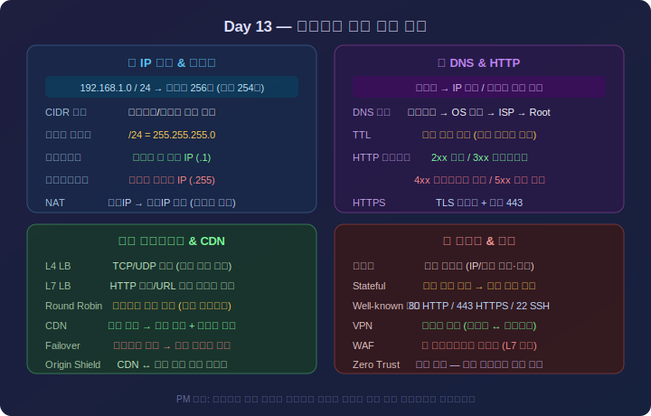
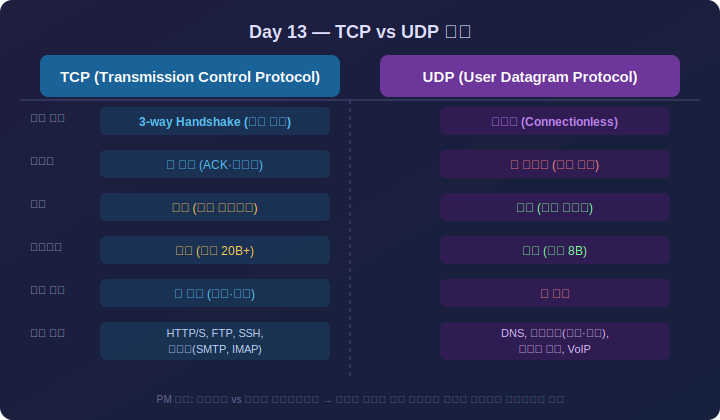
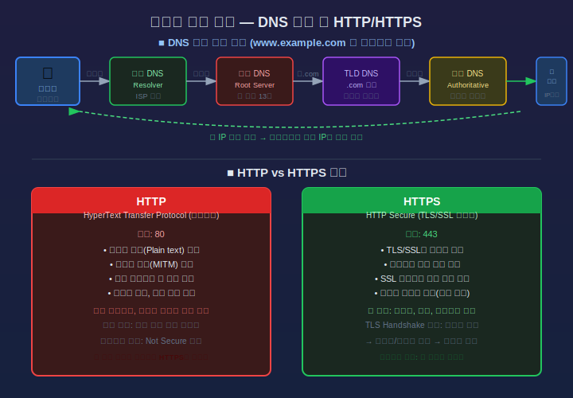
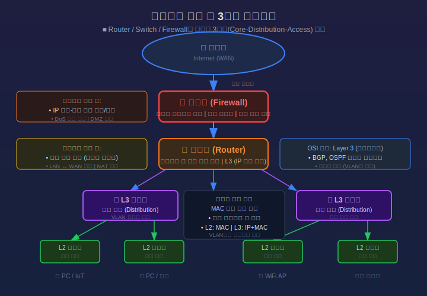
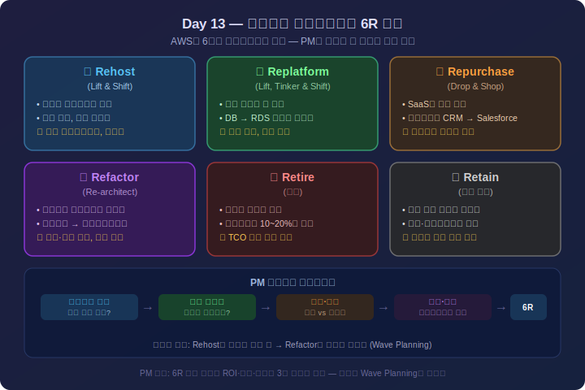
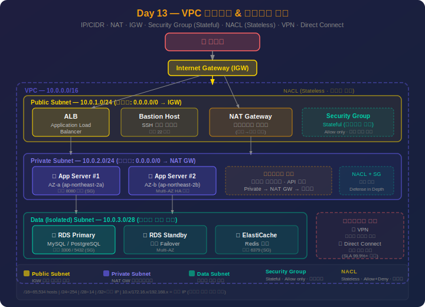

# Day 13: 네트워크 기초 & 클라우드 VPC — 상세 강의안

> 📖 **강의 시작 전 필독:** PM 약어 사전에서 **IP, VPC, DNS, CIDR, NAT, IGW, SG, NACL, AZ, CDN** 항목을 미리 확인하세요.  
> 👉 [PM 약어 & 용어 사전](pm-glossary.md)

---

## 🔁 지난 시간 복습 (5분)

> **Day 12 핵심 요점**
> 1. **SDLC 모델**: 폭포수·나선형·애자일은 요구사항 명확도와 변경 빈도에 따라 선택
> 2. **CI/CD 파이프라인**: 코드 커밋 → 자동 빌드·테스트 → 배포. PM은 배포 주기와 롤백 계획을 일정에 반영
> 3. **기술 부채(Technical Debt)**: 빠른 출시를 위해 미룬 설계 개선. 시간이 지날수록 이자가 붙어 비용↑
> 4. **레거시 시스템 마이그레이션**: 빅뱅(Big Bang) vs 점진적(Strangler Fig) — 리스크와 기간의 트레이드오프

**오늘과의 연결:**  
"소프트웨어가 아무리 잘 만들어져도 네트워크 없이는 사용자에게 전달되지 않습니다. 오늘은 **인프라 팀과 대화할 수 있는 수준의 네트워크 지식**과, 클라우드 프로젝트에서 PM이 반드시 이해해야 할 **VPC 구조**를 배웁니다."

> 💡 **강사 안내:** "여러분 회사 서비스가 클라우드(AWS/Azure/GCP)를 쓰는 분?" 손들기로 분위기 파악 후 진행

---

## ✅ 오늘 배우고 나면 할 수 있어요

- [ ] IP 주소와 CIDR 표기법을 읽고 서브넷의 호스트 범위를 계산할 수 있다
- [ ] DNS TTL이 배포 일정에 미치는 영향을 설명하고 일정 계획에 반영할 수 있다
- [ ] 라우터·스위치·방화벽·로드밸런서의 역할을 구분하고 네트워크 다이어그램을 해석할 수 있다
- [ ] 온프레미스와 클라우드 네트워크의 차이를 비교하고 마이그레이션 고려사항을 나열할 수 있다
- [ ] VPC의 퍼블릭·프라이빗·데이터 3계층 아키텍처를 설계하고 각 구성 요소의 역할을 설명할 수 있다
- [ ] Security Group과 NACL의 차이를 설명하고 기본 보안 규칙을 직접 정의할 수 있다

> 수업 후 이 체크리스트를 다시 보며 스스로 확인해보세요.

---

## 1교시: 네트워크 기초 개념 (1.5시간) <!-- 슬라이드 #1~#8 -->

<div align="center">



*▲ IP 주소 · DNS · HTTP · 로드밸런서 · 방화벽 — PM이 알아야 할 네트워크 기초 4가지 영역*

</div>

### 이론 (55분)

#### 1. 네트워크(Network)란?

**정의:**  
컴퓨터, 서버, 스마트폰 등 장치(노드)들이 데이터를 주고받을 수 있도록 연결한 체계.

**PM이 네트워크를 알아야 하는 이유:**

```
프로젝트 상황별 네트워크 지식 필요 장면:
────────────────────────────────────────
1. 신규 서비스 오픈 전날
   → 방화벽 포트 오픈 요청 (개발팀 → 인프라팀)
   → 누가, 어떤 포트를, 언제까지? 모르면 PM이 중재 불가

2. 클라우드 마이그레이션 프로젝트
   → VPC 설계 리뷰, 서브넷 배치 결정이 비용에 직결
   → PM이 아키텍처 문서를 읽어야 검토 가능

3. 서비스 장애 발생
   → "DNS 전파 중입니다" "NAT Gateway 이슈입니다"
   → 의미를 알아야 영향도 판단, 경영진 보고 가능

4. 글로벌 서비스 설계
   → 리전 선택, CDN 적용, 레이턴시 요구사항
   → PM의 인프라 비용 추정 필요
```

---

#### 2. IP 주소(IP Address)

**IP 주소란?**  
인터넷/네트워크에서 각 장치를 식별하는 고유 주소. 집으로 치면 "도로명 주소".

**IPv4 구조:**

```
192  .  168  .   1  .  10
─────────────────────────
 8비트   8비트  8비트  8비트  = 32비트 총
 (0~255)(0~255)(0~255)(0~255)

사람이 읽기 좋게 4개 숫자를 점(.)으로 구분
컴퓨터는 이진수로 처리:
192 = 1100 0000
168 = 1010 1000
  1 = 0000 0001
 10 = 0000 1010
```

**사설 IP(Private IP) vs 공인 IP(Public IP):**

| 구분 | 범위 | 용도 |
|------|------|------|
| 사설 IP (클래스 A) | 10.0.0.0 ~ 10.255.255.255 | 대형 사내망, 클라우드 VPC |
| 사설 IP (클래스 B) | 172.16.0.0 ~ 172.31.255.255 | 중형 사내망 |
| 사설 IP (클래스 C) | 192.168.0.0 ~ 192.168.255.255 | 소규모 사내망, 가정용 공유기 |
| 공인 IP | 위 범위 외 | 인터넷에서 직접 접근 가능 |

> ⚠️ **핵심**: 사설 IP는 인터넷에서 직접 접근 불가. 외부 접근을 위해 NAT 또는 공인 IP 필요.

**실무 예시:**

```
여러분 노트북의 IP:
→ ipconfig / ifconfig 실행 시 192.168.x.x 또는 10.x.x.x
→ 이것은 사설 IP (회사 공유기/스위치가 할당)

실제 인터넷 공인 IP 확인:
→ 브라우저에서 "my ip" 검색 → 공인 IP 표시
→ 사설 IP ≠ 공인 IP

클라우드 서버(EC2):
→ 프라이빗 IP: 10.0.1.15 (VPC 내부)
→ 퍼블릭 IP: 52.78.xxx.xxx (인터넷에서 접근)
```

---

#### 3. 서브넷(Subnet)과 CIDR

**서브넷이란?**  
큰 네트워크를 작은 단위로 나눈 것. 용도별·보안 등급별로 네트워크를 분리할 때 사용.

**CIDR(Classless Inter-Domain Routing) 표기법:**

```
10.0.0.0/24
────────── ──
  네트워크  서브넷 마스크 (앞에서 24비트가 네트워크 부분)

/24 → 서브넷 마스크: 255.255.255.0
      호스트 비트: 32 - 24 = 8비트
      가능한 주소: 2^8 = 256개
      실제 사용 가능: 256 - 2 = 254개 (네트워크 주소 1개, 브로드캐스트 1개 제외)
```

**CIDR 범위별 호스트 수:**

| CIDR | 서브넷 마스크 | 주소 수 | 사용 가능 호스트 |
|------|------------|--------|----------------|
| /8   | 255.0.0.0  | 16,777,216 | 16,777,214 |
| /16  | 255.255.0.0 | 65,536 | 65,534 |
| /24  | 255.255.255.0 | 256 | 254 |
| /28  | 255.255.255.240 | 16 | 14 |

> 💡 **PM 체감 공식**: /24는 사무실 한 층(방 254개), /16은 빌딩 전체(방 65,534개), /8은 도시 전체

**서브넷 분할 예시 — 프로젝트 네트워크 설계:**

```
전체 VPC: 10.0.0.0/16 (65,534 호스트)
│
├─ 10.0.1.0/24 → 웹·API 서버 (퍼블릭, 254개)
├─ 10.0.2.0/24 → 앱 서버 (프라이빗, 254개)
├─ 10.0.3.0/24 → DB 서버 (데이터 티어, 254개)
└─ 10.0.100.0/24 → 관리·모니터링 (254개)

→ 서브넷을 분리하면 각 구간에 독립적인 보안 정책 적용 가능
```

---

#### 4. 포트(Port)와 프로토콜

**포트란?**  
IP 주소가 "건물 주소"라면 포트는 "몇 호"입니다.  
하나의 서버(IP)가 여러 서비스를 동시에 운영할 수 있도록 구분.

**PM이 알아야 할 주요 포트:**

| 포트 | 프로토콜/서비스 | 의미 |
|------|--------------|------|
| 80   | HTTP | 일반 웹 트래픽 |
| 443  | HTTPS | 암호화 웹 트래픽 (현재 표준) |
| 22   | SSH | 서버 원격 접속 (관리용) |
| 3306 | MySQL | 가장 많이 쓰이는 RDBMS |
| 5432 | PostgreSQL | 오픈소스 RDBMS |
| 6379 | Redis | 인메모리 캐시 |
| 8080/8443 | 개발/스테이징 웹 | 테스트 서버에서 자주 사용 |
| 27017 | MongoDB | NoSQL DB |

**실무 장면:**

```
배포 당일 오전 9시, PM 대화:

인프라팀장: "방화벽 정책 언제까지 신청하셨어요?"
PM (이전): "방화벽이 뭔가요?"

PM (오늘 수업 후): "어제 포트 443, 8080 인바운드 허용
  신청했고, DB 서버는 3306을 앱 서버 IP에서만 허용으로
  요청했습니다. 확인 부탁드립니다."
```

**TCP vs UDP:**

<div align="center">



*▲ TCP vs UDP — 실시간성(UDP) vs 신뢰성(TCP) 트레이드오프, 서비스 특성에 맞는 프로토콜 선택*

</div>

| 구분 | TCP | UDP |
|------|-----|-----|
| 연결 방식 | 연결 후 통신 (3-way Handshake) | 연결 없이 바로 전송 |
| 신뢰성 | 높음 (패킷 손실 시 재전송) | 낮음 (손실 시 재전송 없음) |
| 속도 | 상대적으로 느림 | 빠름 |
| 순서 보장 | O | X |
| 대표 사용 | 웹(HTTP/S), DB, 파일 전송 | 영상 스트리밍, 게임, VoIP, DNS |

---

### 실습 (25분)

#### 실습 1: 서브넷 계산

**그룹별 과제**: 다음 요구사항에 맞게 VPC 서브넷을 설계하세요.

```
요구사항:
- VPC 전체 대역: 10.10.0.0/16
- 서비스 구성:
  1. 웹 서버 (인터넷 직접 노출): 최소 50개 서버 수용
  2. API 서버 (내부 통신만): 최소 100개 서버 수용
  3. 데이터베이스: 최소 10개 서버 수용
  4. 관리 서버: 최소 5개 서버 수용
  
→ 각 서브넷의 CIDR을 결정하고 이유를 설명하세요.
→ 퍼블릭/프라이빗 구분도 함께 표시하세요.
```

**참고 답안 예시:**

```
10.10.1.0/25 → 웹 서버 퍼블릭 (126 호스트)
10.10.2.0/24 → API 서버 프라이빗 (254 호스트)
10.10.3.0/28 → DB 프라이빗 (14 호스트)
10.10.4.0/28 → 관리 프라이빗 (14 호스트)
```

---

### 퀴즈 (5분)

1. 10.0.0.0/24 서브넷에서 실제 사용 가능한 호스트 IP 수는?
2. 회사 서버가 192.168.1.100 IP를 가지고 있다면 이 서버는 인터넷에서 직접 접근 가능한가? 이유는?
3. 웹 서버가 HTTPS(443)만 허용하고 HTTP(80)를 차단했을 때 브라우저에서 http://로 접속하면 어떻게 되나? (힌트: 301 리다이렉트)

---

## 2교시: 인터넷 통신 원리 (1.5시간) <!-- 슬라이드 #9~#17 -->

<div align="center">



*▲ DNS 질의 해결 5단계 흐름 + HTTP vs HTTPS 암호화 비교*

</div>

### 이론 (55분)

#### 1. DNS(Domain Name System)

**"인터넷의 전화번호부"**

사람은 도메인 이름(www.example.com)을 쓰지만 컴퓨터는 IP(52.78.1.1)로 통신합니다.  
DNS는 이 둘을 연결해주는 시스템입니다.

**DNS 조회 흐름:**

```
사용자가 브라우저에 "www.company.com" 입력
               ↓
  1. 브라우저 캐시 확인 (있으면 즉시 사용)
               ↓
  2. OS 캐시 및 hosts 파일 확인
               ↓
  3. 로컬 DNS 서버(ISP/회사)에 질의
               ↓
  4. 루트 DNS 서버 → .com TLD 서버 → company.com 권한 서버
               ↓
  5. 최종 IP 반환: 52.78.1.1
               ↓
  6. 브라우저가 52.78.1.1:443으로 HTTPS 연결
```

**DNS 레코드 유형:**

| 레코드 | 역할 | 예시 |
|--------|------|------|
| **A** | 도메인 → IPv4 주소 | www.company.com → 52.78.1.1 |
| **CNAME** | 도메인 → 다른 도메인 (별칭) | api.company.com → api.elb.amazonaws.com |
| **MX** | 메일 서버 지정 | company.com → mail.company.com |
| **TXT** | 텍스트 정보 (SPF, 도메인 소유 인증) | "v=spf1 include:google.com" |
| **AAAA** | 도메인 → IPv6 주소 | — |

**TTL(Time To Live) — PM이 반드시 알아야 할 개념:**

```
TTL = DNS 조회 결과를 캐시에 보관하는 시간 (초 단위)

TTL = 3600 (1시간)인 경우:
  → 한 번 조회되면 1시간 동안 캐시에서 제공
  → IP를 변경해도 전 세계 DNS 서버가 최대 1시간 동안 구 IP를 반환

TTL = 86400 (24시간)인 경우:
  → IP 변경 후 최대 24시간 동안 일부 사용자는 구 서버로 접속

실무 시나리오:
  서비스 오픈 전날 IP 변경 계획 → TTL이 24시간이면
  최소 24시간 전부터 TTL을 300(5분)으로 낮춰야 안전!
```

> 💡 **PM 인사이트**  
> 도메인 이전·IP 변경·CDN 전환 작업의 일정 계획 시 **반드시 현재 TTL을 확인**하세요.  
> TTL이 높으면 전환 완료까지 예상보다 훨씬 긴 시간이 필요합니다.  
> 실제 사고: "새벽 2시에 IP 변경했는데 다음 날 오전 9시까지 일부 사용자가 구 서버로 접속됨"

---

#### 2. HTTP vs HTTPS

**HTTP(HyperText Transfer Protocol):**  
웹 브라우저와 서버 간 데이터 교환 프로토콜. 모든 데이터가 평문(암호화 없음)으로 전송.

**HTTP 요청·응답 구조:**

```
[요청 (Request)]
GET /api/orders/123 HTTP/1.1
Host: api.company.com
Authorization: Bearer eyJhbGci...
Content-Type: application/json

[응답 (Response)]
HTTP/1.1 200 OK
Content-Type: application/json

{"id": 123, "status": "배송중", "total": 58000}
```

**HTTP 상태 코드 — PM 활용 가이드:**

| 코드 | 의미 | PM 상황 |
|------|------|---------|
| 200 | 성공 | 정상 |
| 201 | 생성 성공 | 주문·회원가입 완료 |
| 301 | 영구 이동 | URL 구조 변경, SEO 영향 |
| 302 | 임시 이동 | 점검 페이지 전환 |
| 400 | 잘못된 요청 | 클라이언트 버그 |
| 401 | 인증 필요 | 로그인 세션 만료 |
| 403 | 권한 없음 | 접근 제어 설정 오류 |
| 404 | 없음 | URL 오류, API 미구현 |
| 500 | 서버 내부 오류 | 긴급 대응, 로그 확인 |
| 503 | 서비스 불가 | 서버 과부하 또는 점검 중 |

**HTTPS:**  
HTTP + TLS(Transport Layer Security) 암호화.  
포트 443 사용. 2024년 기준 전체 웹 트래픽의 95% 이상이 HTTPS.

```
HTTPS 연결 수립 (TLS Handshake):
1. 클라이언트 → 서버: "안녕, HTTPS 쓸게. 내가 지원하는 암호화 방식은..."
2. 서버 → 클라이언트: "OK, SSL 인증서 받아. 이 방식으로 하자."
3. 클라이언트: 인증서 검증 (CA가 서명했는지, 도메인 일치, 만료 여부)
4. 세션 키 교환 → 이후 모든 데이터 암호화

PM 관리 포인트:
→ SSL 인증서 만료일 알림 설정 (만료 30일 전 갱신)
→ 인증서 갱신 누락 시 "안전하지 않음" 경고 → 사용자 이탈
```

---

#### 3. 로드밸런서(Load Balancer)

**역할**: 들어오는 트래픽을 여러 서버로 분산시켜 부하 분산 + 고가용성 확보

```
사용자 요청:
       ↓
  [Load Balancer]
 /       |       \
서버1  서버2  서버3   ← 각 서버가 1/3씩 처리
                    ← 서버1 장애 → 자동으로 서버2·3에만 전달

로드밸런서가 없으면:
  → 서버 1대에 모든 트래픽 → 과부하로 장애
  → 해당 서버 장애 시 서비스 전체 중단
```

**로드밸런서 종류:**

| 종류 | 동작 레이어 | 특징 |
|------|-----------|------|
| L4 (NLB) | 전송 계층 (IP·포트) | 초고속, TCP/UDP 단순 분산 |
| L7 (ALB) | 응용 계층 (HTTP) | URL·헤더 기반 라우팅, 가장 일반적 |

```
ALB URL 기반 라우팅 예시:
/api/orders/* → 주문 서버 그룹
/api/users/*  → 사용자 서버 그룹
/admin/*      → 관리자 서버 (IP 허용 목록 적용)
```

---

#### 4. CDN(Content Delivery Network)

**역할**: 전 세계 엣지 서버에 정적 콘텐츠(이미지·JS·CSS·동영상)를 캐싱. 사용자 근처에서 제공.

```
CDN 없을 때:
사용자(부산) → 서울 서버까지 왕복 → 이미지 로딩 지연

CDN 있을 때:
사용자(부산) → 부산 CDN 엣지 → 캐시된 이미지 즉시 제공
              (서울 서버로 요청 불필요)

해외 사용자:
사용자(미국) → 미국 CDN 엣지 → 빠른 응답
              (한국 서버까지 태평양 왕복 없음)
```

**PM 관점 CDN 고려사항:**
- 콘텐츠 변경 후 캐시 무효화(Invalidation/Purge) 작업 배포 절차에 포함
- CDN 비용은 전송량 기반 — 고트래픽 이벤트 전 비용 시뮬레이션
- HTTPS 인증서 CDN 단에서 처리 (원본 서버 부하 감소)

---

### 실습 (20분)

#### 실습 2: HTTP 상태 코드 장애 분석

**시나리오**: 오늘 오전 10시, CS팀에서 "고객들이 결제가 안 된다"는 문의가 급증하고 있습니다.  
다음 모니터링 화면을 보고 원인을 추론하고 대응 방향을 정하세요:

```
서비스 모니터링 대시보드 (10:00~10:15):
────────────────────────────────────────
200 OK:         85%  ████████████████████
401 Unauthorized: 2%  ████
500 Internal Error: 8%  ██████████████████ ← 급증!
503 Service Unavail: 5%  █████████████

결제 API 응답 시간:
  평균: 3,240ms (평소: 320ms) ← 10배!

인프라 알림:
  [10:03] DB 서버 CPU: 94% 경보
  [10:07] 결제 서버 #2: 장애로 LB에서 제외됨
```

**그룹 토론:**
1. 주요 원인은 무엇인가?
2. 즉시 취해야 할 조치는?
3. PM으로서 경영진에게 보내는 긴급 보고 메시지 (3문장 이내):

---

### 퀴즈 (5분)

1. DNS TTL을 현재 86400(24시간)에서 300(5분)으로 낮추고 새 IP로 전환하려면 최소 몇 시간 전에 TTL을 낮춰야 하는가?
2. 브라우저에서 HTTP(80) 접속 시 HTTPS(443)로 자동 전환되는 데 사용하는 HTTP 상태 코드는?
3. 로드밸런서가 제공하는 두 가지 핵심 이점은?

---

## 3교시: 네트워크 장비와 아키텍처 (1시간) <!-- 슬라이드 #18~#24 -->

<div align="center">



*▲ Router/Switch/Firewall 3계층 네트워크 아키텍처 + 장비별 역할 구조*

</div>

### 이론 (40분)

#### 1. 주요 네트워크 장비

**라우터(Router):**

```
역할: 서로 다른 네트워크(서브넷) 간 경로를 결정하고 패킷 전달
+────────+   +────────+    +─────────+
│ 인터넷  │──▶│ 라우터  │───▶│ 내부망  │
+────────+   +────────+    +─────────+
              ↑
         어떤 경로로 전달할지
         라우팅 테이블로 결정
```

**스위치(Switch):**

```
역할: 동일 네트워크 내 장치들을 연결
              ┌──────┐
  서버A ──────┤      ├────── 서버B
  서버C ──────┤Switch├────── 서버D
  서버E ──────┤      ├────── 서버F
              └──────┘
→ MAC 주소 기반으로 특정 포트에만 데이터 전달 (허브와 다름)
```

**방화벽(Firewall):**

```
역할: 허용(Allow)/차단(Deny) 정책으로 트래픽 필터링
+─────────+
│ 인터넷   │
+─────────+
     │
+─────────────────────+
│ Firewall 정책:      │
│  Allow: 80, 443     │  ← 웹 트래픽 허용
│  Allow: 22 from IT  │  ← IT팀만 SSH 허용
│  Deny: 3306 from *  │  ← 외부 DB 접근 차단
+─────────────────────+
     │
+─────────+
│ 서버망   │
+─────────+
```

> 💡 **PM 인사이트**  
> 방화벽 정책 변경은 **변경 관리 프로세스(CCB)** 대상입니다.  
> "개발팀이 테스트 서버 포트 좀 열어달라"고 했을 때 보안 검토 없이 진행하다 사고 날 수 있습니다.  
> 포트 오픈 요청서에는 **소스 IP, 목적지 IP, 포트 번호, 사용 기간, 신청 이유**가 포함돼야 합니다.

**로드밸런서(Load Balancer):**  
(2교시에서 상세 설명, 여기서는 아키텍처 배치 관점)

```
외부 접점 역할:
인터넷 → LB(공인 IP) → 내부 서버(사설 IP)
→ 내부 서버는 공인 IP 없이 운영 가능 (보안 향상)
```

---

#### 2. 온프레미스 네트워크 아키텍처

**전형적인 3계층 기업 네트워크:**

```
              [인터넷]
                  │
            [방화벽 외부]
                  │
             ┌────┴────┐
             │   DMZ    │  ← 비무장지대(Demilitarized Zone)
             │ 웹서버   │     외부 접근 가능 + 내부망 보호
             │ 메일서버 │
             └────┬────┘
            [방화벽 내부]
                  │
         ┌────────┴────────┐
         │    내부망(LAN)   │
         │  APP 서버       │
         │  DB 서버        │
         │  파일 서버       │
         └─────────────────┘
```

**VLAN(Virtual LAN):**

```
물리적으로 같은 스위치에 연결되어 있어도
논리적으로 다른 네트워크로 분리

스위치 포트 1~10 → VLAN 10 (영업팀 네트워크)
스위치 포트 11~20 → VLAN 20 (개발팀 네트워크)
스위치 포트 21~30 → VLAN 30 (서버 네트워크)

→ VLAN 간 통신은 라우터(또는 L3 스위치) 필요
→ 보안: 개발팀이 실수로 운영 DB에 접근 불가 구조 가능
```

**사이트 간 VPN(Site-to-Site VPN):**

```
본사(서울) ←──암호화 터널──→ 지사(부산)
    │                             │
  사내 서버                    지사 PC들
  (10.1.0.0/16)              (10.2.0.0/16)

인터넷을 통하지만 암호화로 사설망처럼 사용
→ 전용선 대비 저렴, 기밀 데이터 안전 전송
```

---

#### 3. 온프레미스 한계

```
온프레미스 서버실 운영의 현실:

문제 1. 용량 예측 실패
  → 트래픽 2배 폭증 → 서버 추가 주문 → 8주 납기
  → 그 사이 서비스 다운

문제 2. 초기 대규모 투자(CapEx)
  → 서버 구매: 1억원
  → 남는 용량은 낭비 (서버 사용률 평균 15%)

문제 3. 재해 복구
  → 데이터센터 화재 → 백업 센터도 같은 건물?
  → DR(Disaster Recovery) 구축 비용 수억원

문제 4. 글로벌 출시
  → 미국에 서버 두려면 현지 데이터센터 계약, 운영인력 필요
```

---

### 실습 (15분)

#### 실습 3: 네트워크 다이어그램 해석

**다음 네트워크 구성도를 보고 질문에 답하세요:**

```
        [인터넷]
            │
       [방화벽]
        Allow: 80, 443
        Deny: 3306, 5432
            │
       [Load Balancer]
      10.0.0.0/24 (퍼블릭)
       /         \
  [웹서버A]    [웹서버B]
  10.0.1.10    10.0.1.11
       \         /
        [내부망]
     10.0.2.0/24 (프라이빗)
          |
      [DB 서버]
      10.0.3.5
      포트 3306
```

**질문:**
1. 외부 사용자가 http://service.com 에 접속할 때 트래픽 경로를 순서대로 설명하시오.
2. 만약 DB 서버(10.0.3.5)에 직접 인터넷에서 접근하려 하면 어떻게 되는가?
3. 웹서버B가 장애가 났을 때 서비스는 계속되는가? 이유는?

---

### 퀴즈 (5분)

1. DMZ에 배치하는 서버의 특징은?
2. VLAN을 사용하는 이유를 보안 관점에서 설명하시오.
3. Site-to-Site VPN의 장점과 전용 회선(전용선) 대비 단점은?

---

## 4교시: 온프레미스 vs 클라우드 네트워크 (1.5시간) <!-- 슬라이드 #25~#33 -->

### 이론 (55분)

#### 1. 클라우드 네트워크로의 전환

**소프트웨어 정의 네트워크(SDN: Software-Defined Network):**

```
온프레미스:         클라우드:
  물리 케이블         → 소프트웨어 가상 연결
  물리 스위치/라우터  → 클릭 몇 번으로 설정
  방화벽 어플라이언스 → 보안 그룹(Security Group) 설정
  VLAN 설정 (수일 소요) → 서브넷 생성 (수분 소요)
  용량 증설 (수주 소요) → Auto Scaling (수분 소요)
```

**클라우드 핵심 인프라 개념:**

```
리전(Region): 지리적 위치의 데이터센터 클러스터
  예: ap-northeast-2 (서울), us-east-1 (미국 동부)
  → 리전 선택 기준: 사용자 위치, 데이터 주권(컴플라이언스), 비용, 서비스 가용성

가용 영역(AZ: Availability Zone): 리전 내 독립적 데이터센터
  서울 리전(ap-northeast-2)의 AZ들:
  ap-northeast-2a ─┐
  ap-northeast-2b  ├─ 서로 다른 건물, 다른 전원, 다른 네트워크
  ap-northeast-2c ─┘

→ 1개 AZ 장애 시 다른 AZ에서 서비스 지속 = Multi-AZ 고가용성
```

---

#### 2. 주요 클라우드 사업자 비교

| 구분 | AWS | Azure | GCP |
|------|-----|-------|-----|
| **시장점유율** | 1위 (~31%) | 2위 (~22%) | 3위 (~12%) |
| **강점** | 가장 다양한 서비스, 성숙한 생태계 | MS 제품(Active Directory, Office 365) 통합 | 빅데이터, ML, Kubernetes 원조 |
| **한국 리전** | 서울(2016~) | 한국(2020~) | 서울(2020~) |
| **국내 레퍼런스** | 카카오, 넷마블, 쿠팡 | LG, SK, 금융권 | 스타트업, 데이터 분석 |
| **VPC 명칭** | VPC | Virtual Network(VNet) | VPC |

> 💡 **PM 인사이트**  
> 클라우드 사업자 선택은 기술 결정이기 전에 **비즈니스 결정**입니다.  
> 고려 요소: 기존 라이선스 연계(Microsoft EA → Azure 유리), 규제 요건(금융/의료 컴플라이언스), 기술 인력 수급, 장기 계약 조건(Reserved Instance 할인).

---

#### 3. 마이그레이션 전략 6R

<div align="center">



*▲ 6R 전략 — Rehost / Replatform / Repurchase / Refactor / Retire / Retain, PM 의사결정 프레임워크*

</div>

```
온프레미스 → 클라우드 마이그레이션 6가지 전략:

1. Rehost (Lift & Shift)
   → 서버를 그대로 클라우드로 옮김
   → 빠르지만 클라우드 최적화 없음
   → 적합: 당장 데이터센터 퇴출 일정 있을 때

2. Replatform (Lift, Tinker & Shift)
   → 약간의 최적화 후 이전 (예: MySQL → RDS로 교체)
   → 운영 부담 감소, 과도기적 방법

3. Repurchase
   → 온프레미스 소프트웨어를 SaaS로 교체
   → 예: 사내 메일 서버 → Google Workspace
   → 운영 인력 불필요, 하지만 커스터마이징 제한

4. Refactor / Re-architect
   → 클라우드 네이티브로 완전 재설계
   → 마이크로서비스, 컨테이너(Kubernetes), 서버리스
   → 가장 오래 걸리고 비싸지만 효과 극대화

5. Retire
   → 더 이상 필요 없는 시스템 폐기
   → 기회: 마이그레이션 중 불필요 레거시 정리

6. Retain
   → 클라우드로 안 보내고 유지 (규제, 의존성 이슈)
   → 예: 특수 하드웨어 필요, 보안 인증 미확보
```

**PM 관점 마이그레이션 계획:**

```
Phase 1 (1~3개월): 현황 분석 + 전략 결정
  → 현재 인프라 인벤토리 작성 (서버 수, OS, 의존성)
  → 각 시스템별 6R 전략 결정
  → TCO(Total Cost of Ownership) 비교 분석

Phase 2 (3~9개월): 파일럿 + 이전
  → 비핵심 시스템부터 이전 (Rehost 우선)
  → 네트워크 연결(VPN 또는 Direct Connect) 구축
  → 데이터 마이그레이션 계획 및 실행

Phase 3 (6~12개월): 최적화 + 전환 완료
  → 클라우드 비용 최적화 (예약 인스턴스, 스케일링)
  → 모니터링·알림 체계 재구성
  → 온프레미스 철수 일정 관리
```

---

#### 4. 클라우드 마이그레이션 리스크

| 리스크 | 발생 가능성 | 대응 전략 |
|--------|-----------|----------|
| 네트워크 레이턴시 증가 | 중 | Direct Connect 검토, 레이턴시 요건 사전 측정 |
| 데이터 전송 비용 과다 | 중 | 데이터 규모 사전 산정, CDN/캐싱 최적화 |
| 보안·인증 방식 변경 | 높음 | IAM 설계 선행, 기존 AD 연동 계획 |
| 레거시 호환 불가 | 중 | PoC(개념 검증) 선行, Retain 전략 포함 |
| 인력 기술 역량 부족 | 높음 | 클라우드 교육/자격증 지원, 컨설팅 투입 |
| 예산 초과 (클라우드 비용 과다) | 높음 | FinOps 체계 수립, Cost Anomaly Alert 설정 |

---

### 실습 (20분)

#### 실습 4: 마이그레이션 전략 판단

**다음 시스템에 6R 전략을 부여하고 이유를 설명하세요:**

| 시스템 | 특성 | 6R 전략 추천 |
|--------|------|-------------|
| 20년 된 코볼(COBOL) 급여 시스템 | 수정 불가, 특수 메인프레임 | ? |
| 사내 메일 서버 (Exchange) | 유지보수 인력 부족, 기능 불만 | ? |
| 전자상거래 웹 앱 (Java/Spring) | 트래픽 변동 큼, 레거시 구조 | ? |
| 마케팅용 파일 공유 서버 (NAS) | 퇴직자 파일 보관, 접근 드묾 | ? |
| HR 인사관리 시스템 (SAP) | 커스터마이징 많음 | ? |

---

### 퀴즈 (5분)

1. 리전(Region)과 가용 영역(AZ)의 차이를 설명하시오.
2. Lift & Shift(Rehost)의 장점과 한계는?
3. 클라우드 마이그레이션 프로젝트에서 PM이 반드시 관리해야 하는 리스크를 3가지 나열하시오.

---

## 5교시: VPC 핵심 개념 (1.5시간) <!-- 슬라이드 #34~#43 -->

<div align="center">



*▲ VPC 3계층 아키텍처 — Public · Private · Data Subnet, IGW / NAT GW / Direct Connect 연결 구조*

</div>

### 이론 (60분)

#### 1. VPC(Virtual Private Cloud)란?

**클라우드 내 나만의 가상 데이터센터**

```
클라우드 전체 (AWS)
┌─────────────────────────────────────────────┐
│                 리전 (서울)                   │
│  ┌────────────────────────────────────────┐  │
│  │     내 VPC (10.0.0.0/16)              │  │
│  │                                        │  │
│  │  ┌─────────────┐  ┌─────────────────┐  │  │
│  │  │ 퍼블릭 서브넷 │  │ 프라이빗 서브넷 │  │  │
│  │  │ 10.0.1.0/24 │  │ 10.0.2.0/24    │  │  │
│  │  │ [웹서버]     │  │ [앱서버]        │  │  │
│  │  └─────────────┘  └─────────────────┘  │  │
│  │                                        │  │
│  │  ┌──────────────────────────────────┐  │  │
│  │  │     데이터 서브넷 10.0.3.0/24    │  │  │
│  │  │           [DB 서버]               │  │  │
│  │  └──────────────────────────────────┘  │  │
│  └────────────────────────────────────────┘  │
│                                               │
└─────────────────────────────────────────────┘
```

**VPC의 핵심 속성:**
- 내가 CIDR 범위를 결정 (예: 10.0.0.0/16)
- 다른 VPC, 다른 계정과 완전히 격리
- 필요한 경우에만 명시적으로 연결 (기본 차단)

---

#### 2. 퍼블릭 서브넷 vs 프라이빗 서브넷

**퍼블릭 서브넷(Public Subnet):**

```
특징:
- 인터넷 게이트웨이(IGW)로의 라우팅 경로 존재
- EC2에 공인 IP 또는 Elastic IP 할당 가능
- 인터넷에서 직접 접근 가능

배치 대상:
- 로드밸런서(ALB)         → 사용자 트래픽 직접 수신
- Bastion Host (점프 서버) → SSH 관리 접점 (인바운드 22 허용)
- NAT Gateway              → 프라이빗 서브넷의 아웃바운드 통로
```

**프라이빗 서브넷(Private Subnet):**

```
특징:
- IGW로의 직접 라우팅 없음 (인터넷에서 직접 접근 불가)
- 아웃바운드(인터넷으로 나가기): NAT Gateway 경유
- 인바운드(인터넷에서 들어오기): 원칙적으로 불가

배치 대상:
- 앱 서버(Application Server) → ALB가 전달하는 내부 트래픽만 수신
- 백엔드 API 서버
- DB 서버 (가장 격리)
```

**데이터 서브넷(Data Subnet):**

```
특징:
- 프라이빗 서브넷 중에서도 가장 제한적
- 앱 서버 서브넷에서만 접근 허용
- NAT Gateway도 연결하지 않는 경우 많음 (완전 격리)

배치 대상:
- RDS (MySQL, PostgreSQL)
- ElastiCache (Redis)
- Elasticsearch / OpenSearch
```

---

#### 3. 게이트웨이와 라우팅 테이블

**인터넷 게이트웨이(IGW: Internet Gateway):**

```
역할: VPC ↔ 인터넷 양방향 통신 허용
위치: VPC에 1개 연결 (또는 연결 해제로 인터넷 차단)

퍼블릭 서브넷 라우팅 테이블:
Destination        Target
10.0.0.0/16  →  local          ← VPC 내부 통신
0.0.0.0/0    →  igw-xxxxxxxx  ← 나머지 모든 트래픽 = 인터넷
```

**NAT 게이트웨이(NAT Gateway):**

```
역할: 프라이빗 서브넷 → 인터넷 아웃바운드 (단방향)
위치: 퍼블릭 서브넷에 배치 (공인 IP 필요)
용도: 프라이빗 서버의 OS 업데이트, 외부 API 호출

프라이빗 서브넷 라우팅 테이블:
Destination        Target
10.0.0.0/16  →  local              ← VPC 내부 통신
0.0.0.0/0    →  nat-xxxxxxxx       ← 인터넷 아웃바운드 → NAT GW

비용 주의:
→ NAT Gateway = 시간당 요금 + 처리 데이터 요금
→ 대용량 아웃바운드 트래픽 시 비용 급증 가능
→ VPC Endpoint로 S3·DynamoDB는 NAT 없이 접근 가능 (비용 절감)
```

---

#### 4. VPC 표준 3계층 아키텍처 (Multi-AZ)

```
서울 리전 (ap-northeast-2)
┌──────────────────────────────────────────────────────┐
│                    VPC (10.0.0.0/16)                  │
│                                                        │
│         AZ-a                      AZ-b                │
│  ┌─────────────────┐       ┌─────────────────────┐   │
│  │ 퍼블릭 서브넷a  │       │ 퍼블릭 서브넷b      │   │
│  │ 10.0.1.0/24     │       │ 10.0.4.0/24         │   │
│  │ [ALB 노드]      │       │ [ALB 노드]          │   │
│  │ [NAT GW-a]      │       │ [NAT GW-b]          │   │
│  └────────┬────────┘       └──────────┬──────────┘   │
│           │                           │               │
│  ┌────────┴────────┐       ┌──────────┴──────────┐   │
│  │ 앱 서브넷a      │       │ 앱 서브넷b          │   │
│  │ 10.0.2.0/24     │       │ 10.0.5.0/24         │   │
│  │ [앱서버 1,2]    │       │ [앱서버 3,4]        │   │
│  └────────┬────────┘       └──────────┬──────────┘   │
│           │                           │               │
│  ┌────────┴────────┐       ┌──────────┴──────────┐   │
│  │ DB 서브넷a      │       │ DB 서브넷b          │   │
│  │ 10.0.3.0/24     │       │ 10.0.6.0/24         │   │
│  │ [RDS Primary]   │  ↔   │ [RDS Standby]       │   │
│  └─────────────────┘       └─────────────────────┘   │
│                                                        │
│           ▲                                            │
│           │ Internet Gateway (IGW)                     │
│           ▲                                            │
└───────────┼────────────────────────────────────────────┘
            │
        [인터넷]
        사용자 접속 → ALB DNS → ALB 노드(AZ-a 또는 b) → 앱서버 → DB
```

**Multi-AZ 고가용성 원리:**

```
AZ-a 전체 장애 시:
→ ALB가 AZ-b 앱서버로만 라우팅
→ RDS Standby → Primary로 자동 승격 (약 1~2분 Failover)
→ NAT GW-a 장애 → 앱서버b → NAT GW-b 사용

→ 서비스 중단 없이 자동 복구 (단, Failover 시 DB 연결 끊김 짧게 발생)
```

---

#### 5. VPC 연결 옵션

**VPC Peering:**

```
VPC-A (프로젝트A) ←──피어링──→ VPC-B (공유 서비스)
   10.0.0.0/16                   172.16.0.0/16

→ 두 VPC가 같은 리전 또는 다른 리전에 있어도 가능
→ 1:1 연결, 전이적 라우팅 불가 (A↔B, B↔C → A↔C 불가)
→ CIDR 범위가 겹치면 피어링 불가
```

**Transit Gateway:**

```
여러 VPC + 온프레미스를 중앙 허브로 연결
                  [Transit Gateway]
                  /    |    |    \
              VPC-A  VPC-B VPC-C  온프레미스(VPN)
→ Hub & Spoke 구조
→ VPC가 많아질수록 피어링보다 관리 편리
→ 비용: 연결당 + 처리 데이터당
```

---

### 실습 (20분)

#### 실습 5: VPC 구성 요소 배치

**시나리오**: 전자상거래 플랫폼의 AWS VPC를 설계하세요.

```
요구사항:
- 웹/앱 서버: 인터넷 접근 필요
- DB 서버: 인터넷 완전 차단, 앱 서버만 접근 허용
- 앱 서버: 외부 결제 API(인터넷) 호출 필요
- 장애 복구: 1개 데이터센터 장애에도 서비스 지속
- 리전: 서울 (AZ 2개 이상 활용)

설계 항목:
1. VPC CIDR: ___________
2. 퍼블릭 서브넷 2개 (AZ별) CIDR: ___________
3. 앱 서브넷 2개 CIDR: ___________
4. DB 서브넷 2개 CIDR: ___________
5. 퍼블릭 서브넷 라우팅 테이블에 필요한 항목: ___________
6. 앱 서브넷 라우팅 테이블에 필요한 항목: ___________
```

---

### 퀴즈 (5분)

1. 프라이빗 서브넷의 EC2 인스턴스가 인터넷에서 yum update를 받으려면 어떤 구성이 필요한가? (구성 요소 이름으로 답)
2. Multi-AZ 구성에서 AZ-a가 완전 장애났을 때 애플리케이션이 계속 동작하려면 최소한 어떤 구성이 되어 있어야 하는가?
3. VPC Peering과 Transit Gateway 중 VPC가 10개 이상일 때 적합한 것은? 이유는?

---

## 6교시: VPC 보안 & 실습 (1시간) <!-- 슬라이드 #44~#52 -->

### 이론 (35분)

#### 1. Security Group(보안 그룹)

**"인스턴스 단위 Stateful 방화벽"**

```
Security Group은 EC2 인스턴스(또는 RDS, ELB 등)에 연결
→ 허용 규칙만 작성 (차단은 기본값, 별도 Deny 규칙 없음)
→ Stateful: 인바운드 허용 시 응답(아웃바운드) 자동 허용

[웹서버 Security Group 예시]
인바운드(Inbound):
  HTTP    80   0.0.0.0/0  ← 모든 IP에서 80 허용
  HTTPS  443   0.0.0.0/0  ← 모든 IP에서 443 허용
  SSH     22   10.0.1.5/32 ← Bastion Host IP에서만 22 허용

아웃바운드(Outbound):
  All    All   0.0.0.0/0  ← 기본값: 모든 아웃바운드 허용
```

**Security Group 계층 연결 (가장 강력한 패턴):**

```
[ALB Security Group]    인바운드: 80, 443 from 0.0.0.0/0
         ↓
[앱서버 Security Group]  인바운드: 8080 from ALB-SG (IP 아닌 SG ID로 지정)
         ↓
[DB Security Group]      인바운드: 3306 from 앱서버-SG

→ DB는 앱서버 SG가 붙은 인스턴스에서만 접근 가능
→ 앱서버가 아무리 늘어나도 SG 규칙 변경 불필요
→ IP가 바뀌어도 SG 참조이므로 자동 반영
```

---

#### 2. Network ACL(NACL)

**"서브넷 단위 Stateless 방화벽"**

```
NACL은 서브넷 경계에서 동작
→ 서브넷을 드나드는 모든 트래픽에 적용
→ Stateless: 인바운드 허용해도 아웃바운드 별도 규칙 필요
→ 번호 기반 순서 (낮은 번호 먼저 평가)
→ 허용(Allow)과 차단(Deny) 규칙 모두 작성 가능

[프라이빗 서브넷 NACL 예시]
인바운드:
  100  TCP  8080  10.0.1.0/24  ALLOW  ← 퍼블릭 서브넷에서 앱 포트 허용
  110  TCP  8443  10.0.1.0/24  ALLOW
  *    ALL  ALL   0.0.0.0/0    DENY   ← 나머지 모든 차단

아웃바운드:
  100  TCP  1024-65535  10.0.1.0/24  ALLOW  ← 임시 포트 응답 허용
  110  TCP  443         0.0.0.0/0    ALLOW  ← HTTPS 외부 API 호출
  *    ALL  ALL         0.0.0.0/0    DENY
```

---

#### 3. Security Group vs NACL 비교

| 구분 | Security Group | NACL |
|------|---------------|------|
| **적용 단위** | 인스턴스(ENI) | 서브넷 |
| **상태 특성** | Stateful (응답 자동 허용) | Stateless (요청·응답 모두 정의) |
| **규칙 종류** | 허용(Allow)만 | 허용·차단(Allow·Deny) 모두 |
| **규칙 순서** | 모든 규칙 평가 후 적용 | 번호 순서대로 첫 일치 적용 |
| **기본값** | 모든 인바운드 차단, 아웃바운드 허용 | 모든 허용 (기본 NACL) |
| **주요 용도** | 서버별 세밀한 접근 제어 | 서브넷 구간 차단 (IP 블랙리스트 등) |

**언제 NACL을 사용하나:**

```
1. 특정 IP/대역 완전 차단 (DDoS 대응)
   → NACL: 100.200.x.x/16 모두 DENY
   → Security Group으로는 Deny 설정 불가

2. 서브넷 레벨 추가 방어선 (Defense in Depth)
   → Security Group으로 인스턴스 보호
   → NACL로 서브넷 경계 추가 방어

3. Compliance 요구
   → 특정 서브넷은 외부 트래픽 원천 차단 증명 필요
```

---

#### 4. 온프레미스 ↔ VPC 연결

**AWS Site-to-Site VPN:**

```
온프레미스 ────[인터넷]──── [AWS VPN Gateway]
  (IPSec 암호화 터널)                │
                               [내부 VPC 라우팅]

장점: 즉시 설정, 저렴 (시간당 약 $0.05)
단점: 인터넷 종속 (대역폭 불안정), 최대 1.25Gbps
적합: 소규모 연결, PoC, 비상 연결
```

**AWS Direct Connect:**

```
온프레미스 ────[전용 회선]──── [AWS Direct Connect 위치]
  (KT/SK/LG 등 통신사 제공)              │
                                    [AWS VPC]

장점: 안정적 대역폭(10Gbps, 100Gbps), 낮은 레이턴시, 데이터 전송 비용 절감
단점: 도입 시간(수주~수개월), 높은 회선 비용
적합: 대용량 데이터 전송, 미션 크리티컬 시스템, 금융/의료 등 규제 환경
```

**Bastion Host (점프 서버):**

```
역할: 외부에서 프라이빗 서브넷 서버에 SSH 접근하는 유일한 관문

인터넷 → [Bastion Host:22] → (내부) → [App Server:22]

Bastion Host Security Group:
  인바운드: 22 TCP from IP화이트리스트 (내 사무실 IP)
  → 전체 인터넷(0.0.0.0/0)에 22 열면 절대 안 됨!

현대적 대안:
  AWS Systems Manager Session Manager: 포트 22 없이 브라우저로 접속
  → Bastion Host 불필요, 접근 기록 자동 로깅
```

---

<div align="center">


*▲ VPC 구성 요소 — Subnet / SG / NACL / IGW / NAT GW 상호 관계 정리*

</div>

### 🔨 실습 (20분) — VPC 아키텍처 다이어그램 설계

**팀별 과제 (4~5인)**

**가상 서비스**: 공공기관 업무 포털 (민원 신청 + 내부 행정 처리)

**요구사항:**
1. 외부 국민 접근: HTTPS(443)만 허용
2. 내부 직원 행정 시스템: 공공망 인터넷에서 접근 불가, VPN 연결만 가능
3. 개인정보 DB: 행정 앱 서버에서만 접근, 인터넷 완전 차단
4. 재해 복구: 서울 리전 Multi-AZ 구성
5. 온프레미스 청사 네트워크와 보안 연결 필요 (대용량 문서 처리)

**설계 항목:**
1. VPC CIDR + 서브넷 구성표 (이름, CIDR, 퍼블릭/프라이빗, AZ)
2. Security Group 규칙 정의 (최소 외부 ALB·앱서버·DB 3개)
3. 온프레미스 연결 방식 선택 및 이유 (VPN or Direct Connect)
4. 다이어그램 그리기 (백지에 박스와 화살표로)

**발표**: 팀당 4분 설명 + 1분 Q&A

---

### 최종 퀴즈 (5분)

1. Security Group에서 CIDR 대신 다른 Security Group ID를 소스로 지정하면 어떤 이점이 있는가?
2. NACL이 Stateless이기 때문에 발생할 수 있는 설정 실수 사례를 설명하시오.
3. 금융기관이 AWS VPN 대신 Direct Connect를 사용해야 하는 이유를 2가지 이상 제시하시오.

---

## 📊 핵심 개념 총정리

<div align="center">


*▲ Day 13 핵심 — VPC 3계층 구조와 보안 제어(SG + NACL) 총정리*

</div>

### 네트워크 기초 한눈에 보기

```
인터넷
  │
[CDN 엣지] ← 정적 자원 캐싱 (이미지, JS, CSS)
  │
[DNS] ← 도메인 → IP, TTL 전파 지연 주의
  │
[Internet Gateway (IGW)]
  │
[로드밸런서 (ALB)] ← 공인 IP, 트래픽 분산
  │               (퍼블릭 서브넷)
[앱 서버 1, 2]    ← 사설 IP만 (프라이빗 서브넷)
  │
[DB 서버]         ← 더 격리된 데이터 서브넷
  │
[NAT GW] ← 앱서버의 인터넷 아웃바운드 (단방향)
```

### VPC 구성 요소 요약

| 요소 | 역할 | 위치 |
|------|------|------|
| VPC | 전체 네트워크 공간 정의 | 리전 |
| 서브넷 | IP 범위 + 라우팅 단위 | AZ |
| IGW | VPC ↔ 인터넷 양방향 | VPC에 1개 |
| NAT GW | Private → 인터넷 단방향 | 퍼블릭 서브넷 |
| 라우팅 테이블 | 서브넷 트래픽 경로 정의 | 서브넷별 |
| Security Group | 인스턴스 단위 Stateful 방화벽 | ENI |
| NACL | 서브넷 단위 Stateless 방화벽 | 서브넷 |
| Bastion Host | SSH 관리 접점 | 퍼블릭 서브넷 |
| VPN / Direct Connect | 온프레미스 ↔ VPC 연결 | 엣지 |

---

## ✅ 최종 점검 체크리스트 (Day 13)

- [ ] CIDR 표기법으로 서브넷의 호스트 수를 계산할 수 있다
- [ ] DNS TTL이 배포 일정에 미치는 영향을 설명할 수 있다
- [ ] HTTP 상태 코드(200/301/404/500/503)를 보고 장애 원인을 추론할 수 있다
- [ ] 네트워크 다이어그램에서 라우터/스위치/방화벽/LB의 위치와 역할을 읽을 수 있다
- [ ] 온프레미스 → 클라우드 마이그레이션 6R 전략을 적용 상황별로 선택할 수 있다
- [ ] VPC의 퍼블릭·프라이빗·데이터 3계층 구조를 직접 설계할 수 있다
- [ ] IGW와 NAT Gateway의 차이와 용도를 설명할 수 있다
- [ ] Security Group과 NACL을 계층적 보안 관점에서 함께 적용할 수 있다
- [ ] Site-to-Site VPN과 Direct Connect의 적합 상황을 구분할 수 있다

---

## 📖 참고 자료

- [AWS VPC 공식 문서](https://docs.aws.amazon.com/vpc/latest/userguide/)
- [CIDR 계산기 (온라인)](https://www.ipaddressguide.com/cidr)
- [AWS 아키텍처 다이어그램 아이콘](https://aws.amazon.com/architecture/icons/)
- 도서: "클라우드 인프라와 API 중심 아키텍처" — Irakli Nadareishvili 외
- 도서: "AWS 공인 솔루션즈 아키텍트 스터디 가이드" (한국어판)
- AWS 무료 교육: [AWS Skill Builder](https://skillbuilder.aws/) — "AWS Cloud Practitioner Essentials"
